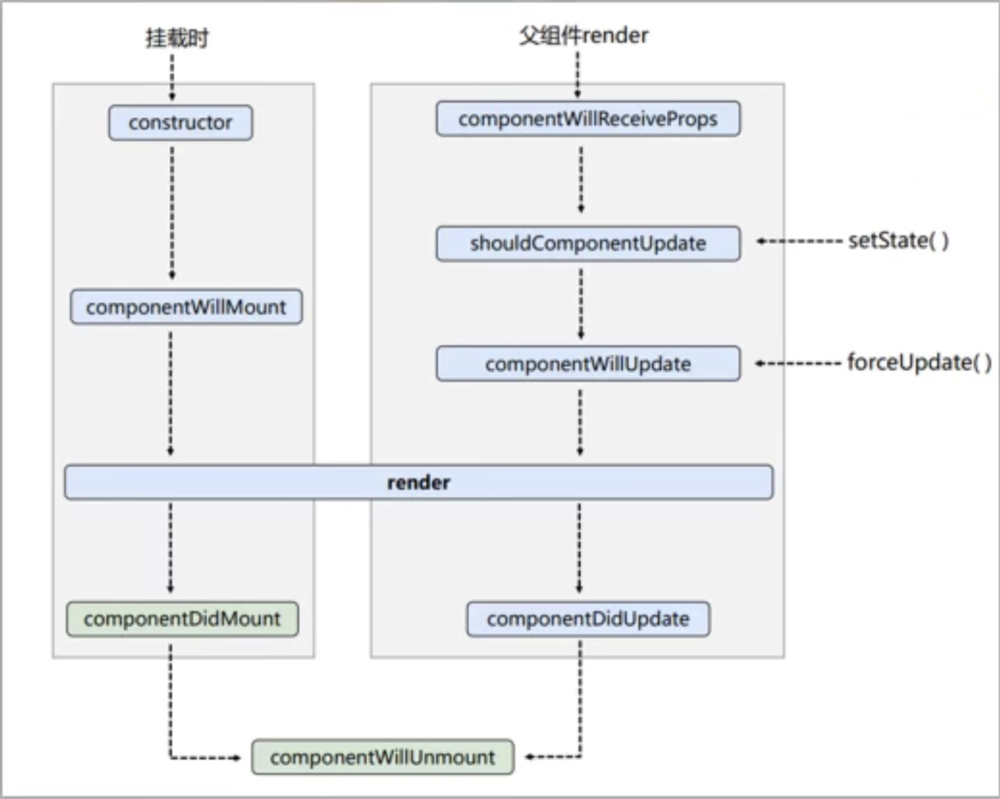
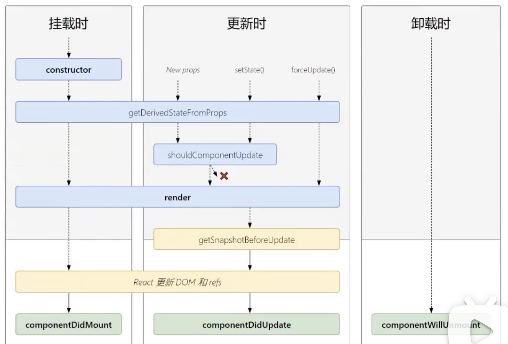

# React

## 1. react 简介

react 的优点：

1. 采用组件化模式、declarative api 声明编码,提高开发效率及组件复用率。
2. 在 React Native 中可以使用 React 语法进行移动端开发。
3. 使用 virtual DOM & 优秀的 Diffing 算法, 尽量滅少与 real DOM 的交互

## 2. hello word example

## 3. 虚拟 dom 的两种创建方式

1. 使用 **jsx** 创建 virtual dom

```html
<body>
<!--准备好一个“容器”-->
<div id=test></div>

<!--引入 react.核心库-->
<script type=text/javascript src=./js/react. development.js></script>
<!--引入 react-dom, 用于支持 react操作dom-->
<script type=text/javascript src=..js/react-dom development]s></script>
<!--引入 babel1,用于将jsx转为js-->
<script type=text/javascript src=./js/babel.minjs></script>

<script type="text/babel">
/*此处一定要写 babel*/
//1.创建虚拟DOM
const VDOM =   (/*此处一定不要写引号,因为不是字符串*/
<h1 id=" title">
    <span>He1lo, React</span>
</h1>
)
//2.渲染虚拟DM到页面
Reactdom. render(VDOM, document.getelementbyid('test'))
</script>
</body>
```

2. 使用 js 创建 virtual dom (不用这种写法，都用 jsx)

```html
<body>
<!--准备好一个“容器”-->
<div id=test></div>

<!--引入 react.核心库-->
<script type=text/javascript src=./js/react. development.js></script>
<!--引入 react-dom, 用于支持 react操作dom-->
<script type=text/javascript src=..js/react-dom development]s></script>

<script type=text/javascript>
//1.创建虚拟DoM
const VDOM = React.createElement('h1',{id: 'title'}, React.createElement('sapn', {}, 'Hello, React '))
//2.渲染虚拟DoM到页面
Reactdom.render(VDOM, document.getElementById('test'))
</script>
</body>
```

**jsx is just a syntax suger of js**

## 4. virtual dom vs real dom

1. virtual dom 本质是 Object 类型的对象(一般对象, not arr object / function obj)
2. virtual dom is light, real dom is heavy. 因为 virtual dom 是 React 内部在用, 无需 real dom 上那么多的属性
3. virtual dom 最终会被 React 转化为 real dom 呈现在页面上

## 5. jsx - javascript xml

jsx 语法规则:

1. 定义虚拟 DOM 时, 不要写引号。
2. 标签中混入 JS **表达式**时要用{}, 表达式要有输出
3. 样式的类名指定不要用 class, 要用 className。
4. 内联样式, 要用 style={{key: vallue}}的形式去写。
5. 只有一个根标签
6. 标签必须闭合
7. 标签首字母
   (1). 若小写字母开头,则将改标签转为 htm1 中同名元素,若 htm1 中无该标签对应的同名元素,则报错
   (2). 若大写字母开头, react!就去渲染对应的组件,若组件没有定义,则报错

## 6. jsx 案例

一定注意区分: js 语句(代码) vs js 表达式

1. 表达式:一个表达式会产生一个值,可以放在任何一个需要值的地方
   (1). a
   (2). a+b
   (3). demo(1)
   (4). **arr.map((item, index)=>{})**
   (5). function test (){}

2. 语句(代码):
   (1). if()(}
   (2). for()(}
   (3). switch(){case: xxxx}

## 7. 组件与模块

## 9. 函数式组件

```html
<body>
<!--准备好一个“容器”-->
<div id=test></div>

<!--引入 react.核心库-->
<script type=text/javascript src=./js/react. development.js></script>
<!--引入 react-dom, 用于支持 react操作dom-->
<script type=text/javascript src=..js/react-dom development]s></script>
<!--引入 babel1,用于将jsx转为js-->
<script type=text/javascript src=./js/babel.minjs></script>

<script type="text/babel">
/*此处一定要写 babel*/
//1.创建函数式组件
function MyComponent(){
    console.log(this)  //undefine -->> babel 'use strict'禁止this指向window
    return<h2>是用函数定义的组件(适用于【简单组件】的定义)</h2>
}

//2.渲染组件到页面
ReactDOM.render(<MyComponent/>, document.getelementbyid('test'))

/*
执行了 ReactDOM.render(<MyComponent/>)......之后,发生了什么?
1. React解析组件标签,找到了MyComponent组件
2. 发现组件是使用函数定义的, 随后调用该函数, 将返回的虚拟DOM转为真实DOM, 随后呈现在页面中。
*/
</script>
</body>
```

## 10. 复习 class 类的相关知识

1. 类中的构造器不是必须写的, 要对实例进行一些初始化的操作, 如添加指定属性时才写。
2. 如果 A 类继承了 B 类, 且 A 类中写了构造器, 那么 A 类构造器中的 **super()** 是必须要调用的。
3. 类中所定义的方法, 都是放在了类的原型对象上, 供实例去使用

```html
<body>
	<script type="text/javascript">
		class Person {
			//构造器方法
			constructor(name, age) {
				//构造器中的this是 ---- 类的实例对象
				this.name = name
				this.age = age
			}

			//一般方法
			speak() {
				// speak方法放在了哪里? ---- 类的原型对象上,供实例使用
				// 通过Person实例调用speak时，speak中的this就是Person实例
				console.log(`我叫${this.name}, 我年龄是${this.agey}`)
			}
		}

		const p1 = new Person('jerry', 18)
		const p2 = new Person('tom', 19)

		console.log(p1)
		console.log(p1)

		class Student extends Person {
			constructor(name, age, grade) {
				super(name, age)
				this.grade = grade
			}
			speak() {
				console.log(
					`我叫${this.name}, 我年龄是${this.agey}, 我的年纪是${this.grade}`
				)
			}
		}
		const s1 = new Student('小张', 15, 'grade 10')
	</script>
</body>
```

## 11. 类式组件

<script type="text/babel">
    //1.创建类式组件
    class MyComponent extends React.Component{
        render(){
            // render是放在哪里的? ---- MyComponent的原型对象上 prototype,供实例使用 
            // render中的this是谁? ---- MyComponent的实例对象， MyComponent组件实例对象。
            console.log(this)
            return <h2>我是用类定义的组件(适用于【复杂组件】的定义)</h2>
        }
    }

    //2.渲染组件到页面
    ReactDOM.render(<MyComponent/>, document.getElementById('test'))
    /*
    执行了 ReactDOM.render(<MyComponent/>....之后, 发生了什么?
    1. React解析组件标签,找到了 MyComponent组件
    2. 发现组件是使用类定义的, 随后new出来该类的实例, 并通过该实例调用到原型上的 render() 方法。
    3. 将 render() return 的虚拟DOM转为真实DOM,随后呈现在页面中 
    */
</script>

## 12-19. state

- Stateful Component - component with state
- Simple Componentnt - component without state

### 1. 标准 state

```html
<script type="text/babel">
	class Weather extends React.Component {
	    constructor(props){
	        super(props)
	        this.state = {ishot: true}
	           this.changeWeather = this.changeWeather.bind(this)
	    }

	    // render调用几次? --- 1+n次1是初始化的那次n是状态更新的次数
	    render(){
	        const {isHot} = this.state
	        return <h1 onClick={this.changeWeather}>今天天气很{this.state.ishot? '炎热':'涼爽'}</h1>
	    }
	    changeWeather(){
	       //changeWeather? ---- Weather的原型对象上,供实例使用
	       //由于 changeWeather是作为onClick的回调, 所以不是通过实例调用的,是直接调用
	       //类中的方法默认开启了局部的严格模式,所以 changeWeather中的this为 undefined

	       console.log(this)

	       //获取原来的主isHot值
	       const isHot =this.state.isHot
	       //严重注意:状态必须通过 setState()进行更新
	       this.setState({isHot: !isHot)})

	       //严重注意:状态(state)不可直接更改,下面这行就是直接更改!!!
	       //this.state.isHot=!isHot //这是错误的写法
	   }
	}

	   ReactDOM.render(<Weather/>, document.getElementById('test'))
</script>
```

### 2. 简写 state

```html
<script type="text/babel">
	class Weather extends React.Component {
	    //初始化状态
	    state = {ishot: true, wind:'微风'}

	    render(){
	        const {isHot} = this.state
	        return <h1 onClick={this.changeWeather}>今天天气很{this.state.ishot? '炎热':'涼爽'}</h1>
	    }

	    //自定义方法一要用斌值语句的形式+箭头函数
	    changeWeather = ()=>{
	       const isHot =this.state.isHot
	       this.setState({isHot: !isHot)})
	   }
	}

	   ReactDOM.render(<Weather/>, document.getElementById('test'))
</script>
```

### 3. 总结

### 3.1 理解

1. state 是组件对象最重要的属性,值是对象(可以包含多个 key-value 的组合)
2. 组件被称为”状态机", 通过更新组件的 state 来更新对应的页面显示(重新渲染组件)

### 3.2 强烈注意

1. 组件中 render 方法中的 this 为组件实例对象
2. 组件自定义的方法中 this 为 undefine, 如何解决?
   - 强制绑定 this: 通过函数对象的 bind()
   - 箭头函数()=>{}
3. state 不能直接修改或更新

## 20-26. props

### 1. spread operator

```html
<script type="text/javascript">
	let arr1 = [1, 3, 5, 7, 9]
	let arr2 = [2, 4, 6, 8, 10]
	console.log(...arr1) //展开一个数组
	let arr3 = [...arr1, ...ar2] //连接数组

	//在函数中使用
	function sum(...numbers) {
		return numbers.reduce((preValue, currentValue) => {
			return preValue + currentValue
		})
	}
	console.log(sum(1, 2, 3, 4))

	//在对象中使用
	let person = { name: 'tom', age: 18 }
	let person2 = { ...person } //带花括号是复制一个对象
	let person3 = { ...person, name: 'jerry', address: 'beijing' } //复制对象的同时修改/添加属性
	console.log(...person) //报错,展开运算符不能展开对象
</script>
```

### 2. props

1. props 标准写法

```html
<!--引入prop- types,用于对组件标签属性进行限制-->
<script type=text/javascript src=../js/prop-types.js ></script>

<script type="text/babel">
	//创建组件
    class Person extends React.Component {
        renders(){
            const {name, age, sex} = this.props
            return (
                <ul>
                    <li>姓名: {name}</li>
                    <li>性別: {sex}</li>
                    <li>年龄: {age+1}</li>
                </u1>
            )
        }
    }
    //限制props types
    Person.propTypes = {
        name: PropTypes.string.isRequired,
        sex: PropTypes.string,
        age: PropTypes.number,
        speak: PropTypes.func
    }
    //set default value of props
    Person.defaultProps = {
        sex: 'unknown',
        age: 18
    }
    //渲染组件到页面
    ReactDOM.render(<Person name="jerry" age={19} sex="female" speak={speak}/>, document.getElementById('test1'))
    ReactDOM.render(<Person name="tom" age={18} sex="male"/>, document.getElementById('test2'))

    const p = {name: "amber", age:18, sex: 'female'}
    ReactDOM.render(<Person {...p}/>, document.getElementById('test3'))

    function speak(){

    }
</script>
```

2. props 简写

```html
<!--引入prop- types,用于对组件标签属性进行限制-->
<script type=text/javascript src=../js/prop-types.js ></script>

<script type="text/babel">
	//创建类式组件
    class Person extends React.Component {
        static propTypes = {
            name: PropTypes.string.isRequired,
            sex: PropTypes.string,
            age: PropTypes.number,
            speak: PropTypes.func
        }

        static defaultProps = {
            sex: 'unknown',
            age: 18
        }

        renders(){
            const {name, age, sex} = this.props
            return (
                <ul>
                    <li>姓名: {name}</li>
                    <li>性別: {sex}</li>
                    <li>年龄: {age+1}</li>
                </u1>
            )
        }
    }

    //创建函数式组件
    // function Person(props){
    //     const {name, age, sex} = props
    //     return (
    //         <ul>
    //             <li>姓名: {name}</li>
    //             <li>性別: {sex}</li>
    //             <li>年龄: {age+1}</li>
    //         </u1>
    //     )
    // }
    // Person.propTypes = {

    // }
    // Person.defaultProps = {

    // }

    //渲染组件到页面
    ReactDOM.render(<Person name="jerry" age={19} sex="female" speak={speak}/>, document.getElementById('test1'))
    ReactDOM.render(<Person name="tom" age={18} sex="male"/>, document.getElementById('test2'))

    const p = {name: "amber", age:18, sex: 'female'}
    ReactDOM.render(<Person {...p}/>, document.getElementById('test3'))

    function speak(){

    }
</script>
```

### 3. props 总结

1. 每个组件对象都会有 props(properties 的简写)属性
2. 组件标签的所有属性都保存在 props 中
3. 通过标签属性从组件外向组件内传递变化的数据
4. 注意: 组件内部不要修改 props 数据, **props is read only**

## 27-31. refs

1.  string refs （不建议使用）

```html
<script>
	class Demo extends React.Component {
		//展示左侧输入框的数据
		showData = () => {
			const { input1 } = this.refs
			alert(input1.value)
		}
		//展示右侧输入框的数据
		showData2 = () => {
			const { input2 } = this.refs
			alert(input2.value)
		}
		render() {
			return (
				<div>
					<input ref="input1" type="text" placeholder="点击按钮提示数据" />
					&nbsp;
					<button onClick={this.showData}>点我提示左侧的数据</button>&nbsp;
					<input
						ref="input2"
						onBlur={this.showData2}
						type="text"
						placeholder="失去焦点提示数据"
					/>
				</div>
			)
		}
	}

	//渲染组件到页面
	ReactDOM.render(<Demo a="1" b="2" />, document.getElementById('test'))
</script>
```

### 2. callback 回调 refs

**什么是 callback function：**  
**你到一个商店买东西，刚好你要的东西没有货，于是你在店员那里留下了你的电话，过了几天店里有货了，店员就打了你的电话，然后你接到电话后就到店里去取了货。在这个例子里，你的电话号码就叫回调函数，你把电话留给店员就叫登记回调函数，店里后来有货了叫做触发了回调关联的事件，店员给你打电话叫做调用回调函数，你到店里去取货叫做响应回调事件。**

```html
<script type="text/babel">
	class Demo extends React.Component {
		//展示左侧输入框的数据
		showData = () => {
			const { input1 } = this.alert(input1.value)
		}
		//展示右侧输入框的数据
		showData2 = () => {
			const { input2 } = this
			alert(input2.value)
		}

		changeWeather() {
			const { isHot } = this.state
			this.setState({ isHot: !isHot })
		}
		saveInput = (c) => {
			this.input3 = c
			console.log('@', c)
		}
		render() {
			return (
				<div>
					<input ref={input1} type="text" placeholder="点击按钮提示数据" />
					&nbsp;
					<button onClick={this.showData}>点我提示左侧的数据</button>&nbsp;
					<input
						onBlur={this.showData2}
						ref={input2}
						type="text"
						placeholder="点击按钮提示数据"
					/>
				</div>
			)
		}
	}

	//渲染组件到页面
	ReactDOM.render(<Demo a="1" b="2" />, document.getElementById('test'))
</script>
```

**Caveats with callback refs 关于回调 refs 的说明:**
If the ref callback is defined as an inline function(内联函数), it will get called twice during updates, first with null and then again with the DOM element. This is because a new instance of the function is created with each render, so React needs to clear the old ref and set up the new one. You can avoid this by defining the ref callback as a bound method on the class, but note that it shouldn’t matter in most cases.

### 3. React.createRef()

```html
<script type="text/babel">
	class Demo extends React.Component {
		//React.createRef()调用后可以返回一个容器,该容器可以存储被ref所标识的节点
		//这个是专人专用的
		myRef = React.createRef()
		myRef2 = React.createRef()

		showData = () => {
			aler(this.myRef.current.value)
		}
		showData2 = () => {
			aler(this.myRef2.current.value)
		}

		render() {
			return (
				<div>
					<input ref={this.myRef} type="text" placeholder="点击按钮提示数据" />
					&nbsp;
					<button onClick={this.showData}>点我提示左侧的数据</button>&nbsp;
					<input
						onBlur={this.showData2}
						ref={this.myRef2}
						type="text"
						placeholder="点击按钮提示数据"
					/>
				</div>
			)
		}
	}

	//渲染组件到页面
	ReactDOM.render(<Demo a="1" b="2" />, document.getElementById('test'))
</script>
```

## 32-34. react 中的事件处理

1. 通过 onXxx 属性指定事件处理函数(注意大小写)
   - React 使用的是自定义(合成)事件, 而不是使用的原生 DOM 事件 ---->>>> 为了更好的兼容性
   - React 中的事件是通过事件委托方式处理的(委托给组件最外层的元素) ---->>>> 为了高效
2. 通过 event.target 得到发生事件的 DOM 元素对象 ---->>>> 不要过度的使用 ref

3. 非受控组件

```html
<script type="text/babel">
	class Login extends React.Component {
		handleSubmit = (event) => {
			event.preventDefault() //阻止表单提交

			const { username, password } = this
			alert(`username : ${username.value}, password: ${password.value}`)
		}
		render() {
			return (
				<form onSubmit={this.handleSubmit}>
					username:
					<input
						ref={(c) => {
							this.username = c
						}}
						type="text"
						name="username"
					/>
					password:
					<input
						ref={(c) => {
							this.password = c
						}}
						type="password"
						name="password"
					/>
					<button>login</button>
				</form>
			)
		}
	}

	//渲染组件到页面
	ReactDOM.render(<Demo a="1" b="2" />, document.getElementById('test'))
</script>
```

4. 受控组件: 类似 vue 的双向数据绑定 v-model，优势在于可以减少使用 refs

```html
<script type="text/babel">
	class Login extends React.Component {
		state = { useranme: '', password: '' }
		saveUsername = (event) => {
			this.setState({ username: event.target.value })
		}
		savePassword = (event) => {
			this.setState({ password: event.target.value })
		}
		handleSubmit = (event) => {
			event.preventDefault() //阻止表单提交

			const { username, password } = this.state
			alert(`username : ${username}, password: ${password}`)
		}
		render() {
			return (
				<form onSubmit={this.handleSubmit}>
					username:
					<input onChange={this.saveUsername} type="text" name="username" />
					password:
					<input onChange={this.savePassword} type="password" name="password" />
					<button>login</button>
				</form>
			)
		}
	}

	//渲染组件到页面
	ReactDOM.render(<Demo a="1" b="2" />, document.getElementById('test'))
</script>
```

## 35. higher-order function currying 高阶函数的函数柯里化

```html
<!--受控组件的同一个需求-->

<script type="text/babel">
	class Login extends React.Component {
		state = { useranme: '', password: '' }
		//把返回值变成一个函数
		saveFormData = (dataType) => {
			return (event) => {
				//obj.[a] js读obj的属性的语法
				this.setState({ [dataType]: event.target.value })
			}
		}
		handleSubmit = (event) => {
			event.preventDefault() //阻止表单提交

			const { username, password } = this.state
			alert(`username : ${username}, password: ${password}`)
		}
		render() {
			return (
				<form onSubmit={this.handleSubmit}>
					username:
					<input
						onChange={this.saveFormData('username')}
						type="text"
						name="username"
					/>
					password:
					<input
						onChange={this.saveFormData('password')}
						type="password"
						name="password"
					/>
					<button>login</button>
				</form>
			)
		}
	}

	//渲染组件到页面
	ReactDOM.render(<Demo a="1" b="2" />, document.getElementById('test'))
</script>
```

### 35.1 高阶函数:

In Javascript, functions can be assigned to variables in the same way that strings or arrays can. They can be passed into other functions as parameters or returned from them as well. A “higher-order function” is a function that accepts functions as parameters and/or returns a function.

如果一个函数符合下面 2 个规范中的任何一个,那该函数就是高阶函数

1. 若 A 函数,接收的参数是一个函数,那么 A 就可以称之为高阶函数。
2. 若 A 函数,调用的返回值依然是一个函数,那么 A 就可以称之为高阶函数。**e.g. Promise(), setTimeout(), arr.map, etc.**

### 35.2 函数的柯里化: 通过函数调用继续返回函数的方式,实现多次接收参数最后统一处理的函数编码形式。

currying: In mathematics and computer science, **currying is the technique of converting a function that takes multiple arguments into a sequence of functions that each takes a single argument.**

```js
// function sum(a, b, c) {
// 	return a + b + c
// }

function sum(a) {
	return (b) => {
		return (c) => {
			return a + b + c
		}
	}
}

const result = sum(1)(2)(3)
console.log(result)
```

### 35.3 不用 currying 的写法

```html
<script type="text/babel">
	class Login extends React.Component {
		state = { useranme: '', password: '' }
		//把返回值变成一个函数
		saveFormData = (dataType, event) => {
			this.setState({ [dataType]: event.target.value })
		}
		handleSubmit = (event) => {
			event.preventDefault() //阻止表单提交

			const { username, password } = this.state
			alert(`username : ${username}, password: ${password}`)
		}
		render() {
			return (
				<form onSubmit={this.handleSubmit}>
					username:
					<input
						onChange={(event) => {
							this.saveFormData('username', event)
						}}
						type="text"
						name="username"
					/>
					password:
					<input
						onChange={(event) => {
							this.saveFormData('password', event)
						}}
						type="password"
						name="password"
					/>
					<button>login</button>
				</form>
			)
		}
	}

	//渲染组件到页面
	ReactDOM.render(<Demo a="1" b="2" />, document.getElementById('test'))
</script>
```

## 36-42. Lifecycle 生命周期(旧)



### 1. componentDidMount() 组件挂载完毕时执行

```html
<script type="text/babel">
	class Life extends React.Component {
		state = { opacity: 1 }
		death = () => {
			//清空计时器
			clearInterval(this.timer)
			//卸载组件
			ReactDOM.unmountCompomnentAtNode(document.getElementById('test'))
		}
		componentDidMount() {
			this.timer = setInterval(() => {
				let { opacity } = this.state
				opacity -= 0.1
				if (opacity <= 0) opacity = 1

				this.setState({ opacity: opacity })
			}, 200)
		}
		render() {
			return (
				<div>
					<h2 style={{ opacity: this.state.opacity }}>
						react is too hard to learn
					</h2>
					<button onClick={this.death}>不活了</button>
				</div>
			)
		}
	}

	ReactDOM.render(<Life />, document.getElementById('test'))
</script>
```

### 2. componentWillUnmount() 组件即将卸载时执行

```html
<script type="text/babel">
	class Life extends React.Component {
		state = { opacity: 1 }
		death = () => {
			//卸载组件
			ReactDOM.unmountCompomnentAtNode(document.getElementById('test'))
		}
		componentDidMount() {
			this.timer = setInterval(() => {
				let { opacity } = this.state
				opacity -= 0.1
				if (opacity <= 0) opacity = 1

				this.setState({ opacity: opacity })
			}, 200)
		}
		componentWillUnmount() {
			//清空计时器
			clearInterval(this.timer)
		}
		render() {
			return (
				<div>
					<h2 style={{ opacity: this.state.opacity }}>
						react is too hard to learn
					</h2>
					<button onClick={this.death}>不活了</button>
				</div>
			)
		}
	}

	ReactDOM.render(<Life />, document.getElementById('test'))
</script>
```

### 3. mount 流程

```html
<script type="text/babel">
	class Count extends React.Component {
		constructor(props) {
			console.log('count --- constructor')
			super(props)
			state = { count: 0 }
		}

		add = () => {
			const { count } = this.state
			this.setState({ count: count + 1 })
		}
		componentWillMount() {
			console.log('count --- componentWillMount')
		}
		componentDidMount() {
			console.log('count --- componentDidMount')
		}
		render() {
			console.log('count --- render')
			const { count } = this.state
			return (
				<div>
					<h2>当前求和为</h2>
					<button conClick={this.add}>点我+1</button>
				</div>
			)
		}
	}

	ReactDOM.render(<Count />, document.getElementById('test'))
</script>
```

### 4. update 流程

1. setState()更新
2. forceUpdate()更新

```html
<script type="text/babel">
	class Count extends React.Component {
		constructor(props) {
			console.log('count --- constructor')
			super(props)
			state = { count: 0 }
		}

		add = () => {
			const { count } = this.state
			this.setState({ count: count + 1 })
		}
		death = () => {
			ReactDOM.unmountComponentAtNode(document.getElementById('test'))
		}
		force = () => {
			this.forceUpdate()
		}
		componentWillMount() {
			console.log('count --- componentWillMount')
		}
		componentDidMount() {
			console.log('count --- componentDidMount')
		}
		componentWillUnmount() {
			console.log('count --- componentWillUnmount')
		}
		//不call shouldComponentUpdate() react自己调用，default return true
		shouldComponentUpdate() {
			console.log('count --- shouldComponentUpdate')
			return true
		}
		//forceUpdate不调用shouldComponentUpdate()，直接更新
		forceUpdate() {
			console.log('count --- forceUpdate')
		}
		componentWillUpdate() {
			console.log('count --- componentWillUpdate')
		}
		componentDidUpdate() {
			console.log('count --- componentDidUpdate')
		}
		render() {
			console.log('count --- render')
			const { count } = this.state
			return (
				<div>
					<h2>当前求和为</h2>
					<button conClick={this.add}>点我+1</button>
					<button conClick={this.death}>卸载组件</button>
					<button conClick={this.force}>不更改任何数据，强制更新</button>
				</div>
			)
		}
	}

	ReactDOM.render(<Count />, document.getElementById('test'))
</script>
```

3. parent component 更新

```html
<script type="text/babel">
	class A extends React.Component {
		//parent component
		state = { carName: '奔驰' }
		changeCar = () => {
			this.setState({ carName: '奥拓' })
		}
		render() {
			return (
				<div>
					<div>我是A组件</div>
					<button onChange={this.changeCar}></button>
					<B carName={this.state.carName} />
				</div>
			)
		}
	}

	class B extends React.Component {
		//child component

		//组件将要接受新的props钩子
		componentWillReceiveProps(props) {
			//第一次传的不算，只有更新的props才会调用这个钩子
			console.log('B --- componentWillReceiveProps', props)
		}
		shouldComponentUpdate() {
			console.log('B --- shouldComponentUpdate')
			return true
		}
		componentWillUpdate() {
			console.log('B --- componentWillUpdate')
		}
		componentDidUpdate() {
			console.log('B --- componentDidUpdate')
		}
		render() {
			console.log('B --- render')
			return <div>我是B组件，接收到的车是{this.props.carName}</div>
		}
	}
</script>
```

### 5. 总结

1. 初始化阶段: 由 ReactDOM.render()触发 ---- 初次渲染
   1. constructor()
   2. componentWillMount()
   3. render()
   4. componentDidMount() **=====> 常用**
      一般在这个钩子中做一些初始化的事, 例如: **开启定时器、发送网络请求、订阅消息**
2. 更新阶段: 由组件内部 this.setState()或 父组件 render 触发
   1. shouldComponentUpdate()
   2. componentWillUpdate()
   3. render() **=====> 必须使用的一个**
   4. componentDidUpdate()
3. 卸载组件: 由 ReactDOM.unmountComponentAtNode()触发
   1. componentWillUnmount() **====> 常用**
      一般在这个钩子中做一些收尾的事, 例如: **关闭定时器、取消订阅消息**

## 43-47 Lifecycle 生命周期(新)



### 1. 新生命周期对比旧生命周期的区别：

1. 即将删减 componentWillMount(), componentWillReceiveProps(), componentWillUpdate() 三个 functions，现在是 UNSAFE_functionName()
2. 增添了 getDerivedStateFromProps(), getSnapshotBeforeUpdate() 两个 function

```html
<script type="text/babel">
	class Count extends React.Component {
		constructor(props) {
			console.log('count --- constructor')
			super(props)
			state = { count: 0 }
		}

		add = () => {
			const { count } = this.state
			this.setState({ count: count + 1 })
		}
		death = () => {
			ReactDOM.unmountComponentAtNode(document.getElementById('test'))
		}
		force = () => {
			this.forceUpdate()
		}
		//state的值在任何时候都取决于props时可以用这个func
		static getDerivedStateFromProps(props, state) {
			console.log('getDerivedStateFromProps', props)
			return null
			//return props
		}
		//Any value returned by getSnapshotBeforeUpdate() method will be passed as a parameter to componentDidUpdate().
		//想return的value都能return
		getSnapshotBeforeUpdate(prevProps, prevState) {
			console.log('getSnapshotBeforeUpdate')
			return null
		}
		componentDidMount() {
			console.log('count --- componentDidMount')
		}
		//不call shouldComponentUpdate() react自己调用，default return true
		shouldComponentUpdate() {
			console.log('count --- shouldComponentUpdate')
			return true
		}
		//forceUpdate不调用shouldComponentUpdate()，直接更新
		forceUpdate() {
			console.log('count --- forceUpdate')
		}
		componentDidUpdate(preProps, preState) {
			console.log('count --- componentDidUpdate')
		}
		render() {
			console.log('count --- render')
			const { count } = this.state
			return (
				<div>
					<h2>当前求和为</h2>
					<button conClick={this.add}>点我+1</button>
					<button conClick={this.death}>卸载组件</button>
					<button conClick={this.force}>不更改任何数据，强制更新</button>
				</div>
			)
		}
	}

	ReactDOM.render(<Count count={199} />, document.getElementById('test'))
</script>
```

### 2. getSnapshotBeforeUpdate() 应用实例

应用的实例效果是：一个 scoll bar 可以不断的增加新闻，然后拖动 scoll bar 的时候停止增加新闻

```html
<html>
	<head>
		<meta charset="utf-8" />
		<title>Document</title>
		<style>
			.list {
				width: 200px;
				height: 150px;
				background-color: skyblue;
				overflow: auto;
			}
			.news {
				height: 30px;
			}
		</style>
	</head>
	<body>
		<div class="test">

		</div>
        <script type="text/babel">
            class NewList extends React.Component{
                state = {newsArr: []}
                componentDidMount(){
                    setInterval(()=>{
                        //获取原状态
                        const {newsArr} = this.state
                        //模拟一条新闻
                        const news = 'news' + (newsArr.length + 1)
                        //更新状态
                        this.setState({newsArr : [news, ...newsArr]})
                    }, 1000)
                }
                getSnapshotBeforeUpdate(){
                    return this.refs.list.scrollHeight
                }
                componentDidUpdate(preProps, preState, heights){
                    //持续的往上窜
                    this.refs.list.scollTop += this.refs.list.scrollHeight - height
                }
                render(){
                    return (
                        <div className="list" ref="list">
                            {
                                this.state.newsArr.map((news, index)=>{
                                    return <div className="news" key={index}>{news}</div>
                                })
                            }
                        </div>
                    )
                }
            }

            ReactDOM.render(<NewList/>, document.getElementById('test'))
        </scirpt>
	</body>
</html>
```

### 3. 总结

1. 初始化阶段: 由 ReactDOM.render()触发 ---- 初次渲染
   1. constructor()
   2. getDerivedStateFromProps()
   3. render()
   4. componentDidMount() **=====> 常用**
      一般在这个钩子中做一些初始化的事, 例如: **开启定时器、发送网络请求、订阅消息**
2. 更新阶段: 由组件内部 this.setState()或 父组件 render 触发
   1. getDerivedStateFromProps()
   2. ShouldComponentUpdate()
   3. render()
   4. getSnapshotBeforeUpdate()
   5. componentDidUpdate()
3. 卸载组件: 由 ReactDOM.unmountComponentAtNode()触发
   1. componentWillUnmount() **====> 常用**
      一般在这个钩子中做一些收尾的事, 例如: **关闭定时器、取消订阅消息**

## 48. The diffing algorithm

### 经典面试题

1. react/vue 中的 key 有什么作用？（key 的内部原理是什么）
2. 为什么遍历列表的时，key 最好不要用 index

### 答案和原理

1. 虚拟 DOM 中 key 的作用:
   1). 简单的说: key 是虚拟 DOM 对象的标识, 在更新显示时 key 起着极其重要的作用

   2). 详细的说: 当状态中的数据发生变化时, react 会根据【新数据】生成【新的虚拟 DOM】。随后 React 进行【新虚拟 DOM】与【旧虚拟 DOM】的 diffing 比较,比较规则如下:
   a. 旧虚拟 DOM 中找到了与新虚拟 DOM 相同的 key:
   (1). 若虚拟 DOM 中内容没变。直接使用之前的真实 DOM
   (2). 若虚拟 DOM 中内容变了, 则生成新的真实 DOM, 随后替换掉页面中之前的真实 DOM
   b. 旧虚拟 DOM 中未找到与新虚拟 DOM 相同的 key
   根据数据创建新的真实 DOM,随后渲染到到页面

2. 用 index 作为 key 可能会引发的问题:

   1. 若对数据进行: 逆序添加、逆序删除等破坏顺序操作
      会产生没有必要的真实 D0M 更新==>界面效果没问题,但效率低
   2. 如果结构中还包含<input/>输入类的 DOM:
      会产生错误 DOM 更新==>界面有问题
   3. 注意!: 如果不存在对数据的逆序添加、逆序別除等破坏顺序操作, 仅用于渲染列表用于展示,使用 index 作为 key 是没有问题的。

3. 开发中如何选择 key?:
   1. 最好使用每条数据的唯一标识作为 key。比如 id、手机号、身份证号、学号等唯一值
   2. 如果确定只是简单的展示数据,用 index 也是可以的

## 49. react scaffolding 脚手架

### 1. introduction of react scaffolding

1. scaffolding: 用来帮助程序员快速创建一个基于 xxx 库的模板项目

Scaffolding is a meta-programming method of building database-backed software applications. It is a technique supported by some model-view-controller frameworks, in which the programmer may write a specification that describes how the application database may be used.

    1. 包含了所有需要的配置(语法检査、jsx 编译、 devServer...)
    2. 下载好了所有相关的依赖
    3. 可以直接运行个简单效果

2. react 提供了一个用于创建 react 项目的脚手架库: create-react-app
3. 项目的整体技术架构为: react + webpack + es6 + eslint
4. 使用脚手架开发的项目的特点: 模块化 + 组件化 + 工程化

### 2. create a scaffolding application

1. ```npm i -g create-react-app``` 全局安装create-react-app
2. 切换到想创项目的目录：```create-react-app hello-react```
3. 进入项目文件夹：```cd hello-react```
4. 启动项目：```npm start```

