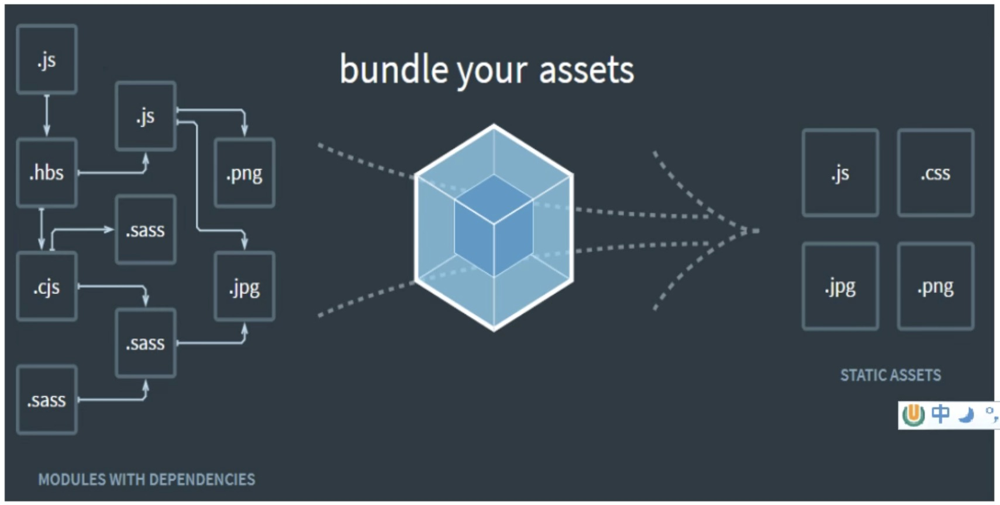

# WebPack

## 1. WebPack 是什么

Webpack 是一种前端资源构建工具, 一个静态模块打包器( module bundler)。 在 Webpack 看来, 前端的所有资源文件(js/json/css/img/less/...)都会作为模块处理。它将根据模块的依赖关系进行静态分析, 打包生成对应的静态资源( bundle)

## 1.2 Webpack 五个核心概念

### 1.2.1 Entry

Entry 入口指示 Webpack 以哪个文件为入口起点开始打包,分析构建内部依赖图。

### 1.2.2 Output

Output 输出指示 Webpack 打包后的资源 bundles 输出到哪里去,以及如何命名

### 1.2 3 Loader

Loader 让 Webpack 能够去处理那些非 Javascript 文件 (webpack 自身只理解 Java Script)

### 1.2.4 Plugins

Plugins 可以用于执行范围更广的任务。插件的范围包括,从打包优化和压缩,直到重新定义环境中的变量等。

### 1.2.5 Mode

Mode 指示 Webpack 使用相应模式的配置。
| 选项 | 描述 | 特点 |
| --- | --- | ---|
| development | 会将 process.env.NODE_ENV 的值设为 development。启用 NamedChunkPlugin 和 NamedModulesPlugin | 能让代码本地调试运行的环境 |
| production | 会将 process.env.NODE_ENV 的值设为 production。启用 FlagDependencyUsagePlugin，FlagIncludedChunksPlugin。ModuleConcatenationPlugin, NoEmitOnErrorsPlugin, OccurrenceOrderPlugin, SideEffectsFlagPlugin & UglifyJsPlugin | 能让代码优化上线 |
