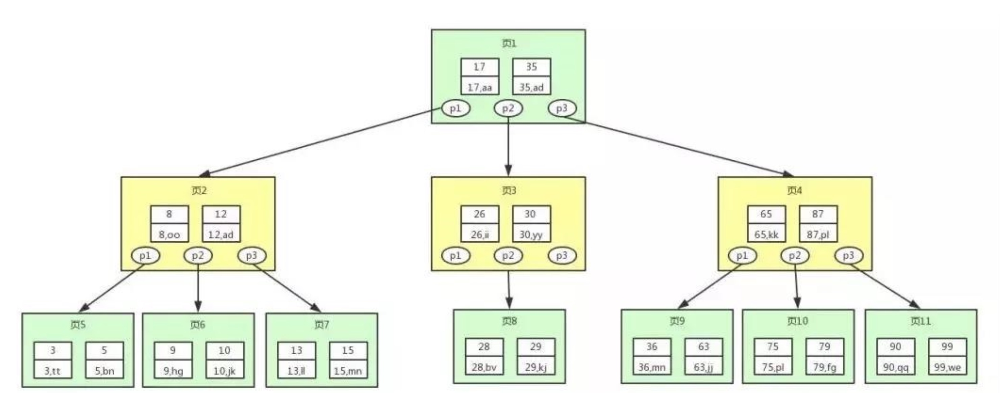
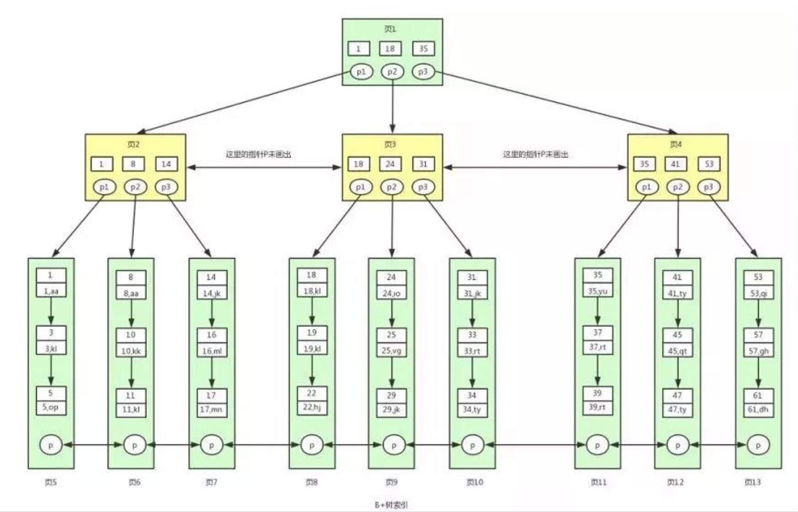

# 数据结构

## 1. Binary Tree 二叉树

### 1.1 Binary Tree

#### 1. 特点

- 二叉树是每个节点最多有两个子节点的树。
- 二叉树的叶子节点有 0 个字节点，二叉树的根节点或者内部节点有一个或者两个字节点。

### 1.2 Binary Search Tree(BST) 二叉搜索树

#### 1. 特点

- **若它的左子树不空，左子树所有节点的关键字(key) < 根节点的关键字(key)**
- **若它的右子树不空，根节点的关键字(key) < 右子树所有节点的关键字(key)**
- 任意节点的左、右子树也分别为二叉查找树
- 没有键值相等的节点（no duplicate nodes）

#### 2. 优点

- 在 array 的 binary search 中，虽然查找的速度很快 O(logn), 但是 insert/delete 增添/删除的速度很慢，从而产生了二叉树搜索树这种数据结构

#### 3. 缺点

- 二叉查找树会容易失去”平衡“，极端情况下，二叉查找树会退化成线性的链表，导致插入和查找的复杂度下降到 O(n)

### 1.3 Balanced Binary Search Tree 平衡二叉树 （又称为 AVL 树）

#### 1. 特点

- 它是一棵空树或它的左右两个子树的高度差的绝对值不超过 1，并且左右两个子树都是一棵平衡二叉树。

#### 2. 优点

- 这个方案很好的解决了二叉查找树退化成链表的问题，把插入，查找，删除的时间复杂度最好情况和最坏情况都维持在 O(logN)。

#### 3. 缺点

- 频繁旋转会使插入和删除牺牲掉 O(logN)左右的时间，不过相对二叉查找树来说，时间上稳定了很多。

### 1.4 R-B Tree 红黑树 (也是 BBST)

#### 1. 特点

(1) 它一种特殊的二叉查找树。红黑树的每个节点上都有存储位表示节点的颜色，可以是红(Red)或黑(Black)。  
(2) 根节点是黑色。  
(3) 每个叶子节点是黑色。 [注意：这里叶子节点，是指为空(NIL 或 NULL)的叶子节点！]  
(4) 如果一个节点是红色的，则它的子节点必须是黑色的。  
(5) 从一个节点到该节点的子孙节点的所有路径上包含相同数目的黑节点。  
(6) 确保没有一条路径会比其他路径长出俩倍。因而，红黑树是相对是接近平衡的二叉树。

- **定义**：从某个节点 x 出发（不包括该节点）到达一个叶节点的任意一条路径上，黑色节点的个数称为该节点的黑高度，记为 bh(x)
- 红黑树的黑高度定义为 **bh(root)**.
- **证明**： 根到任一个叶子的最短可能的路径上全是黑节点， 而最长路径根据性质 3 最坏的情况就是红黑节点交替，而又根据性质 4 最长和最短路径上的黑节点数目相同，则最长路径的长度应小于或等于最短路径的 2 倍

#### 2. 优点

红黑树不追求"完全平衡"，即不像 AVL 那样要求节点的 |balFact| <= 1 (左右两个子树的高度差的绝对值不超过 1)。但红黑树又是相对平衡的，因为某个节点到叶子节点的任意路径的黑高必须相同，所以它既可以解决非平衡二叉树退化成链表的问题，又减少了保持树平衡的维护开销

1.  插入节点导致树失衡: AVL 和 RB-Tree 都是最多两次树旋转来实现复衡 rebalance, O(1)
2.  删除节点导致失衡:  
    (1) AVL 需要维护从被删除节点到根节点 root 这条路径上所有节点的平衡，O(logN)  
    (2) RB-Tree 最多只需要旋转 3 次实现复衡, O(1)

#### 3. 缺点

AVL 树结构上更加平衡，因此搜索/查找效率更高

#### 4. 总结

红黑树因为去除了严格的平衡条件（红黑树平衡的标准是最长路径长度不超过最短的二倍），并且在它的旋转保持平衡次数较少。用于搜索时，如果插入删除次数多的情况下我们就用红黑树来取代 AVL。

## 2. b 树

b 树是一种多路复用树，在二叉树的基础上，增加每个节点的子节点数，以此来减少树的高度。
查询索引最消耗资源的是磁盘 io，最差的情况磁盘 io 的次数为树的高度，所以让树变得更“矮胖”可以提高查询效率

### 2.1 b-树

#### 1. 特点

1. 根结点至少有 2 个子节点，最多 m 个，[2, M]；
2. 除根结点以外的非叶子结点至少有 m/2 个子节点，最多 m 个，[M/2, M]；
3. 如果一个节点有 k 个子节点，则该节点关键字 key 的个数 = k-1；
4. 一个节点最少有 m/2-1 个关键字，最多 m-1 个
5. 每个节点的关键字按照递增的顺序排列
6. 所有叶子结点位于同一层；

#### 2. 优点

1. B 树相对于 B+树的优点是，如果经常访问的数据离根节点很近，而 B 树的非叶子节点本身存有关键字其数据的地址，所以这种数据检索的时候会要比 B+树快。

### 2.2 b+树

#### 1. 特点

1. 相比 b-树直接把数据存在每个节点的关键字里，b+树把数据全部存在叶子节点，非叶子节点的关键字储存的都是数据的键值
2. B+ 树索引的所有数据均存储在叶子节点，而且叶子节点的关键字从小到大有序排列，左边结尾数据都会保存右边节点开始数据的指针，即形成了一个有序链表。
3. 非叶子节点的子节点数=关键字数

#### 2. 优点

1. 由于 b+树非叶子节点不储存数据，只储存键值，使得非叶子节点可以储存更多的键值，树会变得更矮更胖，磁盘 io 的次数更少，查询效率更高
2. B+树查询速度更稳定：B+所有数据都存在叶子节点上，所以每次查找的次数都相同，查询速度要比 B 树更稳定;
3. B+树天然具备排序功能：B+树所有的叶子节点数据构成了一个有序链表，在查询大小区间的数据时候更方便，数据紧密性很高，缓存的命中率也会比 B 树高。
4. B+树全节点遍历更快：B+树遍历整棵树只需要遍历所有的叶子节点即可，，而不需要像 B 树一样需要对每一层进行遍历，这有利于数据库做全表扫描

## 参考

1. [红黑树 vs AVL 优缺点](https://www.jianshu.com/p/37436ed14cc6)
2. [b 树 & b+树面试题](https://blog.csdn.net/weixin_30908707/article/details/97396050?utm_medium=distribute.pc_relevant_t0.none-task-blog-2%7Edefault%7EBlogCommendFromMachineLearnPai2%7Edefault-1.control&depth_1-utm_source=distribute.pc_relevant_t0.none-task-blog-2%7Edefault%7EBlogCommendFromMachineLearnPai2%7Edefault-1.control)
3. [关于 B 树 B+树 B\*树以及红黑树的理解](https://blog.csdn.net/herr_kun/article/details/80550652)
