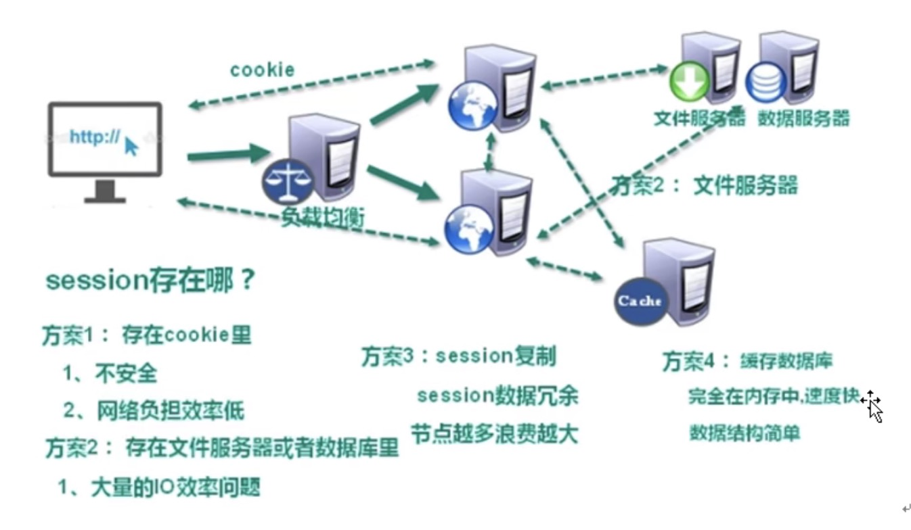
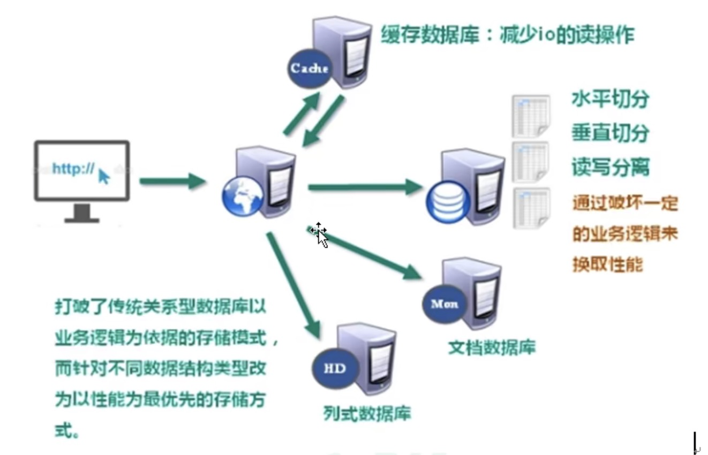

# NoSQL 概述

## 1.1 技术发展

技术的分类
1、解決功能性的可题:Java、Jsp、 RDBMS、 Tomcat、HTML、 Linux、JDBC、SWN
2、解決扩展性的미题: Struts、 Spring、 Springmvc、 Hibernate、 Mybatis
3、解决性能的可题: NOSQL、Java 线程、 Hadoop、 Nginx、MQ、 Elasticsearch

NoSQL 是为了解决性能问题的数据库，其中 Redis 是一种典型的 NoSQL 数据库

## 1.1.1 web 1.0

## 1.1.2 web 2.0

随着 Web2.0 的时代的到来,用户访问量大幅度提升,同时产生了大量的用户数据。加上后来的智能移动设备的普及,所有的互联网平台都面临了巨大的性能挑战。单体的服务器已经不能满足大量的 web 访问。出现了：

- cpu 及内存压力
- io 压力

### 1.1.3 解决 cpu 及内存压力

NoSQL 直接通过内存进行读取，缓解 cpu 压力，提高效率

### 1.1.4 解决 io 压力

## 1.2 NoSQL 数据库

NoSQL( NoSQL= Not Only SQL), 意即“不仅仅是 SQL”,泛指非关系型的数据库
NoSQL 不依赖业务逻辑方式存储, 而以简单的 key-value 模式存储。因此大大的増加了数据库的扩展能力。

- 不遵循 SQL 标准。
- 不支持 ACID

  > ACID，是指数据库管理系统（DBMS）在寫入或更新資料的過程中，為保證事务（transaction）是正確可靠的，所必須具備的四个特性：原子性（atomicity，或稱不可分割性）、一致性（consistency）、隔离性（isolation，又称独立性）、持久性（durability）。
  > 在数据库系统中，一个事务是指：由一系列数据库操作组成的一个完整的逻辑过程。例如银行转帐，从原账户扣除金额，以及向目标账户添加金额，这两个数据库操作的总和，构成一个完整的逻辑过程，不可拆分。这个过程被称为一个事务，具有 ACID 特性。

- 远超于 SQL 的性能。

### 1.2.2 NoSQL 适用场景

- 对数据高并发的读写
- 海量数据的读写, 高性能读写非常灵活的。
- 对数据高可扩展性的, 数据之间没有关系的。

### 1.2.3 NoSQL 不适用场景

- 需要事务支持
- 基于 sql 的结构化查询存储,处理复杂的关系需要即席查询
- **(用不着 sql 的和用了 sql 也不行的情况,请考虑用 NoSql)**

### 1.2.4. Memcache

- 很早出现的 NoSq1 数据库
- 数据都在内存中,一般不持久化（不能存在硬盘/文件中，关机了就没了）
- 支持简单的 key-value 模式,支持类型单一般是作为缓存数据库辅助持久化的数据库（辅助 mysql）

### 1.2.5 Redis

- 几乎覆盖了 Memcached 的绝大部分功能
- 数据都在内存中,支持持久化,主要用作备份恢复
- 除了支持简单的 key-value 模式,还支持多种数据结构 的存储,比如 list、set、hash、zset 等。
- 一般是作为缓存数据库辅助持久化的数据库

### 1.2.6 MongoDB

- 高性能、开源、模式自由( schema free)的**文档型数据库**
- 数据都在内存中,如果内存不足,把不常用的数据保存到硬盘
- 虽然是 key-value 模式,但是对 value(尤其是 json)提供了丰富的查询功能 支持二进制数据及共型对象心
- 可以根据数据的特点替代 RDBMS,成为独立的数据库。或者配合 RDBMS,存储特定的数据。

## 1.3 行式储存数据库（大数据时代）

### 1.3.1 行式数据库

### 1.3.2 列式数据库

- OLAP 分析型处理 快
- OLTP 事务型处理 慢

#### 1.3.2.1 Hbase 分布式文件系统

## 1.4 图关系数据库

他不是存图形，放的是关系，比如：朋友圈社交网络，广告推荐, 社会关系, 公共交通网络, 地图及网络拓谱

## 2. 总结

| 分类                 | 举例    | 典型应用场景                                                                       | 数据模型                                         | 优点                                                                       | 缺点                                                                               |
| -------------------- | ------- | ---------------------------------------------------------------------------------- | ------------------------------------------------ | -------------------------------------------------------------------------- | ---------------------------------------------------------------------------------- |
| 键值（key-value）    | Redis   | 内容缓存，主要用于处理大量数据的高访问负载，也用于一些日志系统等等。               | Key 指向 vaue 的键值对，通常用 hash table 来实现 | 查找速度快                                                                 | 数据无结构化，通常只被当作字符串或者二进制数据                                     |
| 列存储数据库         | HBase   | 分布式的文件系统                                                                   | 以列簇式存储，将同一列数据存在一起               | 查找速度快，可扩展性强，更容易进行分布式扩展                               | 功能相对局限                                                                       |
| 文档型数据库         | MongoDb | Web 应用（与 Key-Value 类似，vaue 是结构化的，不同的是数据库能够了解 vaue 的内容） | Key-Value 对应的键值对，value 为结构化数据       | 数据结构要求不严格，表结构可变，不需要像关系型数据库一样需要预先定义表结构 | 查询性能不高，而且缺乏统一的查询语法                                               |
| 图形（Graph 数据库） |         | 社交网络，推荐系统等。专注于构建关系图谱                                           | 图结构                                           | 利用图结构相关算法。比如最短路径寻址，N 度关系查找等                       | 很多时候需要对整个图做计算才能得出需要的信息，而且这种结构不太好做分布式的集群方式 |

## 3. NoSQL vs 关系型数据库的区别

1. 关系型数据库

- 储存方式：定义一个表来储存数据，数据之间是有关系的
- 支持 join 操作来实现多表的查询
- 具备数据的完整性
- 使用事务来保证数据的一致性

2. 非关系型数据库

- 储存方式：key-value 键值对/列式储存/文档型数据库/图形数据库
- 读写效率比 sql 高
- 不支持 join 操作
- 数据不具备完整性，可以保存没有指定格式的数据

参考：https://blog.csdn.net/qq_36411874/article/details/82013020
