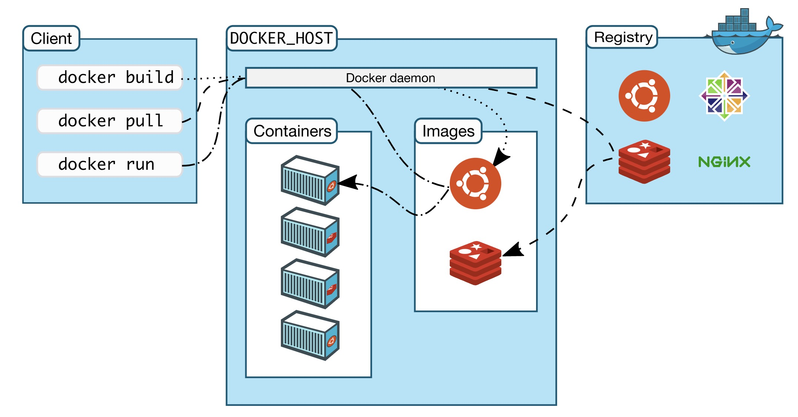

# docker

## 面试常见问题

参考： https://www.edureka.co/blog/interview-questions/docker-interview-questions/

## 1. what is docker?

- **Docker is a containerization platform which packages your application and all its dependencies together in the form of containers so as to ensure that your application works seamlessly(无缝的) in any environment.**
- Docker enables you to separate your applications from your infrastructure so you can deliver software quickly.

Docker 是一个容器化平台，它以容器的形式将您的应用程序及其所有依赖项打包在一起，以确保您的应用程序在任何环境中无缝运行。

## 2. what is docker containner?

**Docker containers include the application and all of its dependencies. A container is a runnable instance of an image.** A container is relatively well isolated from other containers and its host machine. A container is defined by its image as well as any configuration options you provide to it when you create or start it. When a container is removed, any changes to its state that are not stored in persistent storage disappear.

Docker 容器包括应用程序及其所有依赖项，作为操作系统的独立进程运行

## 3. what is docker image? 什么是 docker 镜像？

**An Docker image is a read-only template with instructions for creating a Docker container. 是运行一个程序所需要的所有的文件，相当于一个静态的程序，需要被分配给一个容器才能运行** When a user runs a Docker image, an instance of a container is created. These docker images can be deployed to any Docker environment. To build your own image, you create a Dockerfile with a simple syntax for defining the steps needed to create the image and run it. Each instruction in a Dockerfile creates a layer in the image. When you change the Dockerfile and rebuild the image, only those layers which have changed are rebuilt. This is part of what makes images so lightweight, small, and fast, when compared to other virtualization technologies.

Docker 镜像是 Docker 容器的源代码，Docker 镜像用于创建容器。使用 build 命令创建镜像, 并且在使用 run 启动时它们将生成容器。镜像存储在 Docker registry (docker 注册表)中, Docker Hub 因为它们可能变得非常大, 镜像被设计为由其他镜像层组成, 允许在通过网络传输镜像时发送最少量的数据。

## 4. what do you know about dockerfile / dockerfile 最常见的 command 是什么

参考：

- dockerfile 文档：https://docs.docker.com/develop/develop-images/dockerfile_best-practices/
- dockerfile command 详解： https://www.cnblogs.com/panwenbin-logs/p/8007348.html

1.  A Dockerfile must begin with a **FROM** instruction. 指定基础镜像，必须为第一个命令

        The FROM instruction specifies the Parent Image from which you are building.
        ```shell
        格式：
        FROM <image>
        　　 FROM <image>:<tag>
        　　 FROM <image>@<digest>
        示例：
        　　 FROM mysql:5.6
        注：
        　　 tag 或 digest 是可选的，如果不使用这两个值时，会使用 latest 版本的基础镜像
        ```

2.  **LABEL**：用于为镜像添加元数据

    参考：https://blog.csdn.net/solinger/article/details/96175607

    Imagine this.
    You’re working on a new project, an exciting one that’s Container native. You’re almost done, and now at the stage where you want to build the Docker Image that ships your little project out to the public. You build on top of Alpine Linux, and pack your tool in to a nifty 80Mb Image that you tag latest and push to the public Docker Hub.

    Quickly enough, people start basing their work on your tool. Cool right? Then you fix some minor issues that are no ground-breaking, but are good to have ones. Then build the Images, push to public Docker Hub as latest.

    But this time, your changes have broken the way the tool used to be, and now the existing output, documentation, and tutorials don’t work the way they used to. You can’t release a new version, because the changes aren’t important enough.

    You can mention the commit ID at which latest is on your Docker Hub page, but that’s going to become cumbersome soon, more so than releasing patch versions every time you do a minor fix. And the resulting Docker Image doesn’t contain that information for tools to work on it. Only if there was a way to include the commit ID as a metadata in to the Docker Image itself.
    Or picture a scenario, where you want to specify the licensing information of the Image in the Image itself, rather than documentation or blog posts that reside outside the Image, so any tool can inspect the Image, and figure out the suitability of it for their requirements.
    Or any other scenario, which requires embedding metadata into the Docker Image for both human and machine readability.

    This is where Docker LABEL concept comes into play. Docker Labels allow you to specify metadata for Docker objects such as Images, Containers, Volumes etc, that will be packaged in to their specific formats. We are interested in how we can leverage Labels for Docker Images.
    Docker Labels to the rescue!

    Specifying a Label for a Docker Image is simple. You just specify it as another Dockerfile instruction.

    让我们试想以下：

    你先在正在做一个新的基于容器的项目。你几乎要完成了，现在你想要编译你的 docker image 并将其公开发布。 底层操作系统是 linux， 然后你的工具打包入其中，最后获得了一个 80Mb 的包，你打上 latest 的 tag 并将其推到公共的 Docker Hub。

    很快，人们开始基于你的工具开始他们的工作。很酷吧。然后你解决了一些小问题，然后重新编译你的包，再次打上 latest 的 tag 并推到公共的 Docker Hub。

    但是这次，工具本身的工作方式发生了改变，现在的输出，文档和手册的工作方式都和以前不同。但是你又不能发布一个新的版本，因为这些改变不够重要。

    你可以在你的 Docker Hub 界面提到 latest 的 commit ID，但是很快就会变的特别麻烦，每个小不定都发布补丁版本更是如此。另外，这个 image 本身并不包含 tool 的任何信息。

    解决以上问题的一个方法是我们可以将 commit ID 作为 metadata 包含到 Docker Image 本身。

    试想这个场景，你想把包的内部包含证书信息，而不是存在于包的外部的文档或者博客的位置，所有可以检查这个包的工具，都可以根据它们的需求去确定其是否合适。

    或者另外一个场景，当我们需要 Docker image 中内置无论人和机器都可读的 metadata。

    这就是 Docker 的 LABEL 扮演的角色。Docker 的 Labels 允许你为 Docker 对象指定 metadata，例如 Images, containers, volumes 等。

    LABEL 指令会添加元数据到镜像。LABEL 是以键值对形式出现的。**为了在 LABEL 的值里面可以包含空格，你可以在命令行解析中使用引号和反斜杠**。一些使用方法如下：

        ```shell
        LABEL "com.example.vendor"="ACME Incorporated"
        LABEL com.example.label-with-value="foo"
        LABEL version="1.0"
        LABEL description="This text illustrates \
        that label-values can span multiple lines."
        ```

    一个镜像可以有多个 labels。你可以组合多个 labels 在一个 LABEL 里来指定多重 labels。在 Docker 1.10 之前，这种做法可以降低最终镜像的大小，但现在不是这样。你仍然可以选择一个指令指定多个 labels，使用以下的 2 种方法中其中一种：

        ```LABEL multi.label1="value1" multi.label2="value2" other="value3"```

        ```shell
        LABEL multi.label1="value1" \
        multi.label2="value2" \
        other="value3"
        ```

    如果要查看镜像的 labels，可以使用**docker inspect**命令。

        ```json
        "Labels": {
        "com.example.vendor": "ACME Incorporated"
        "com.example.label-with-value": "foo",
        "version": "1.0",
        "description": "This text illustrates that label-values can span multiple lines.",
        "multi.label1": "value1",
        "multi.label2": "value2",
        "other": "value3"
        },
        ```

3.  **RUN** : 构建镜像时执行的命令

    ```shell
    RUN apt-get update && apt-get install -y \
        aufs-tools \
        automake \
        build-essential \
        curl \
        dpkg-sig \
        libcap-dev \
        libsqlite3-dev \
        mercurial \
        reprepro \
        ruby1.9.1 \
        ruby1.9.1-dev \
        s3cmd=1.1.* \
    && rm -rf /var/lib/apt/lists/*
    ```

    Probably the most common use-case for RUN is an application of **apt-get**. Because it installs packages. **Notice: Always combine RUN apt-get update with apt-get install in the same RUN statement.**

    原因：

    - RUN 指令创建的中间镜像会被缓存，并会在下次构建中使用。如果不想使用这些缓存镜像，可以在构建时指定--no-cache 参数，如：docker build --no-cache
    - **cache dusting: combine RUN apt-get update with apt-get install / specifying a package version 指定安装的版本**

4.  **CMD** : 构建容器后调用，也就是在容器启动时才进行调用。

    ```
    格式：
        CMD ["executable","param1","param2"] (执行可执行文件，优先)
        CMD ["param1","param2"] (设置了 ENTRYPOINT，则直接调用 ENTRYPOINT 添加参数)
        CMD command param1 param2 (执行 shell 内部命令)
    示例：
        CMD echo "This is a test." | wc -
        CMD ["/usr/bin/wc","--help"]
    注：
    　　 CMD 不同于 RUN，CMD 用于指定在容器启动时所要执行的命令，而 RUN 用于指定镜像构建时所要执行的命令。
    ```

5.  **ADD / COPY** : 将本地文件添加到容器中

    - ADD: has some features like local-only tar extraction and remote URL support. tar 类型文件会自动解压(网络压缩资源不会被解压)，可以访问网络资源，类似 wget
    - COPY: only supports the basic copying of local files into the container. **ADD & COPY is functionally similar but COPY is preferred**

    ```shell
    COPY requirements.txt /tmp/
    RUN pip install --requirement /tmp/requirements.txt
    COPY . /tmp/
    ```

    不要用 ADD 下载和解压，因为 image size matters, you should use curl or wget instead. **That way you can delete the files you no longer need after they’ve been extracted and you don’t have to add another layer in your image**. you should avoid doing things like:

    ```
    ADD https://example.com/big.tar.xz /usr/src/things/
    RUN tar -xJf /usr/src/things/big.tar.xz -C /usr/src/things
    RUN make -C /usr/src/things all
    ```

    And instead, do something like:

    ```
    RUN mkdir -p /usr/src/things \
        && curl -SL https://example.com/big.tar.xz \
        | tar -xJC /usr/src/things \
        && make -C /usr/src/things all
    ```

6.  EXPOSE : 指定于外界交互的端口

7.  ENV : 设置环境变量

8.  ENTRYPOINT : 配置容器，使其可执行化。配合 CMD 可省去"application"，只使用参数。

## 5. docker container vs hypervisor docker 容器和虚拟机的区别？

1. container
   It shares the kernel with other containers, running as isolated processes in user space on the infrastructure and host operating system.

2. hypervisor/virtual machine monitor 虚拟机
   It divides the host system and allocates the resources to each divided virtual environment.
   It consist of operating system and takes up recourses such as user space, cpu and memory.

## 6. docker architecture

Docker uses a client-server architecture. The Docker client talks to the Docker daemon(在 docker host 宿主机中)


## 7. docker 常用命令

1. 拉取指定镜像: `$ docker pull <image_name>`
2. push 镜像到远程仓库: `$ docker push <username/image name>`
3. 删除镜像 from local system: `$ docker rmi <image-id>`
4. create a docker container from an image: docker run = pull + create + start `$ docker run -it -d <image_name>`
5. list all running container: `$ docker ps`
6. stop a running container: `$ docker stop <container_id>`
7. kill a container: `docker kill <container_id>`
8. delete a container: `$ docker rm <container id>`
9. access a running container (假设有 3 个正在跑的 container，只想 access 其中一个): `$ docker exec -it <container id> bash`
10. edit and update a container and store it in local system: `$ docker commit <conatainer id> <username/imagename>` -->> 接着 push 可以更新到远程仓库
