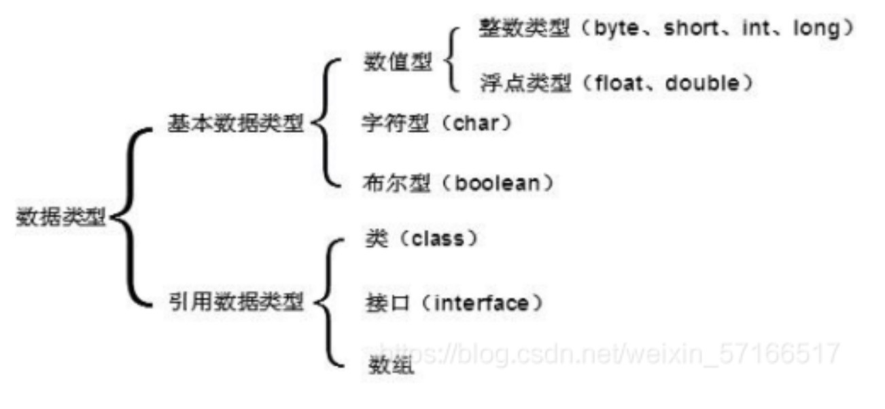

# java_fundamental.md

## [primitive type](primitive_type.md)

## [Java 语言的特点](java_特点.md)

## java classes

### 1. what is constructor

A constructor in Java is a special method that is used to initialize objects. The constructor is called when an object of a class is created. It can be used to set initial values for object attributes.

### 2. what is modifier 修饰符

The `public` keyword is an access modifier - **meaning that it is used to set the access level for classes, attributes, methods and constructors.**

#### 1. access modifier: controls the access level

1. For classes

- public: The class is accessible by any other class
- default: The class is only accessible by classes in the same package. This is used when you don't specify a modifier.

2. For attributes, methods and constructors

- public: The code is accessible for all classes
- private: The code is only accessible within the declared class
- protected: The code is accessible in the same package and subclasses.
- default: The code is only accessible in the same package. This is used when you don't specify a modifier.

#### 2. Non-Access Modifiers - do not control access level, but provides other functionality

1. For classes

- final: The class cannot be inherited by other classes
- abstract: The class cannot be used to create objects (To access an abstract class, it must be inherited from another class.

2. For attributes, methods and constructors

- final: Attributes and methods cannot be overridden/modified
- static: Attributes and methods belongs to the class, rather than an object
- abstract: Can only be used in an abstract class, and can only be used on methods. The method does not have a body. The body is provided by the subclass (inherited from).
- synchronized: Methods can only be accessed by one thread at a time
- volatile: The value of an attribute is not cached thread-locally, and is always read from the "main memory"

### 3. How java achieve encapsulation

Encapsulation, is to make sure that "sensitive" data is hidden from users.

1. declare class variables/attributes as `private`
2. provide `public` get and set methods to access and update the value of a private variable

### 4. About Java Packages/API

A package in Java is used to group related classes. Think of it as a folder in a file directory. We use packages to avoid name conflicts, and to write a better maintainable code. Packages are divided into two categories:

1. Built-in Packages (packages from the Java API)
2. User-defined Packages (create your own packages)

see : https://docs.oracle.com/javase/8/docs/api/

1. how to import package?
   `import java.util.*;`
2. how to create your own package?

   ```
   package mypack;
   class MyPackageClass {
    public static void main(String[] args) {
        System.out.println("This is my package!");
    }
   }
   ```

### 5. Java Inheritance

In Java, it is possible to inherit attributes and methods from one class to another. We group the "inheritance concept" into two categories:

1. subclass (child) - the class that inherits from another class
2. superclass (parent) - the class being inherited from

To inherit from a class, use the `extends` keyword.

### 6. Java Polymophysim

Polymorphism means "many forms", and it occurs when we have many classes that are related to each other by inheritance.

Like we specified in the previous chapter; Inheritance lets us inherit attributes and methods from another class. Polymorphism uses those methods to perform different tasks. This allows us to perform a single action in different ways.

### 7. enum

An enum is a special "class" that represents a group of constants (unchangeable variables, like final variables).

To create an enum, use the `enum` keyword (instead of class or interface), and separate the constants with a comma. Note that they should be in uppercase letters:

```java
enum Level {
    LOW,
    MEDIUM,
    HIGH
}
```

You can access enum constants with the dot syntax:

`Level myVar = Level.MEDIUM;`

### 8. User Input - Scanner

The Scanner class is used to get user input, and it is found in the java.util package.

```java
import java.util.Scanner;  // Import the Scanner class

class Main {
  public static void main(String[] args) {
    Scanner myObj = new Scanner(System.in);  // Create a Scanner object
    System.out.println("Enter username");

    String userName = myObj.nextLine();  // Read user input
    System.out.println("Username is: " + userName);  // Output user input
  }
}
```

Availble method in Scanner class:

| Method        | Description                         |
| ------------- | ----------------------------------- |
| nextLine()    | Reads a String value from the user  |
| nextBoolean() | Reads a boolean value from the user |
| nextByte()    | Reads a byte value from the user    |
| nextDouble()  | Reads a double value from the user  |
| nextFloat()   | Reads a float value from the user   |
| nextInt()     | Reads a int value from the user     |
| nextLong()    | Reads a long value from the user    |
| nextShort()   | Reads a short value from the user   |

### 9. iterator

An Iterator is an object that can be used to loop through **collections, like ArrayList and HashSet**. It is called an "iterator" because "iterating" is the technical term for looping.

To use an Iterator, you must import it from the `java.util` package.

```java
import java.util.ArrayList;
import java.util.Iterator;

public class Main {
  public static void main(String[] args) {
    ArrayList<Integer> numbers = new ArrayList<Integer>();
    numbers.add(12);
    numbers.add(8);
    numbers.add(2);
    numbers.add(23);
    Iterator<Integer> it = numbers.iterator();
    while(it.hasNext()) {
      Integer i = it.next();
      if(i < 10) {
        it.remove();
      }
    }
    System.out.println(numbers);
  }
}
```

### 10. primitive data type 基础数据类型



1. reference data type
2. primitive data type
   - [java primitive data type](./primitive_type.md)

### 11. wrapper class

Wrapper classes provide a way to use primitive data types (int, boolean, etc..) **as objects**.

| Primitive Data Type | Wrapper Class |
| ------------------- | ------------- |
| byte                | Byte          |
| short               | Short         |
| int                 | Integer       |
| long                | Long          |
| float               | Float         |
| double              | Double        |
| boolean             | Boolean       |
| char                | Character     |
