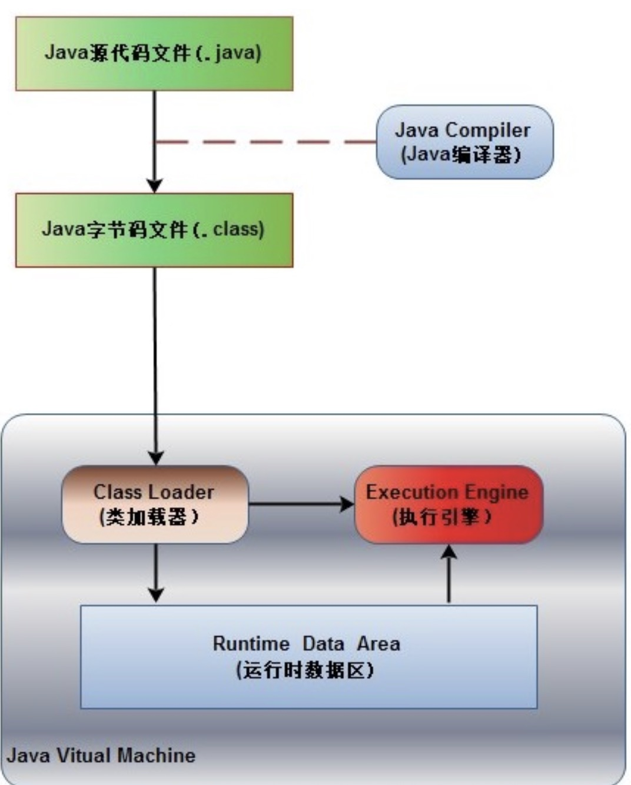

# java 程序的执行过程: 编写->编译->运行

1. 编写：在 java 开发环境中编写.java 源文件
2. 编译：java compiler(javac) 编译.java file to .class file (btyecode - 字节码文件)
3. JVM 通过类加载器(class loader)加载 xxx.class 到内存，并对数据进行校验、解析和初始化，最终形成可以被虚拟机直接使用的 Java 类型。
4. JVM 执行引擎(execute engine)找到 main()这个入口方法，执行其中的字节码指令

参考：  
https://blog.csdn.net/qq_40645822/article/details/90441668
