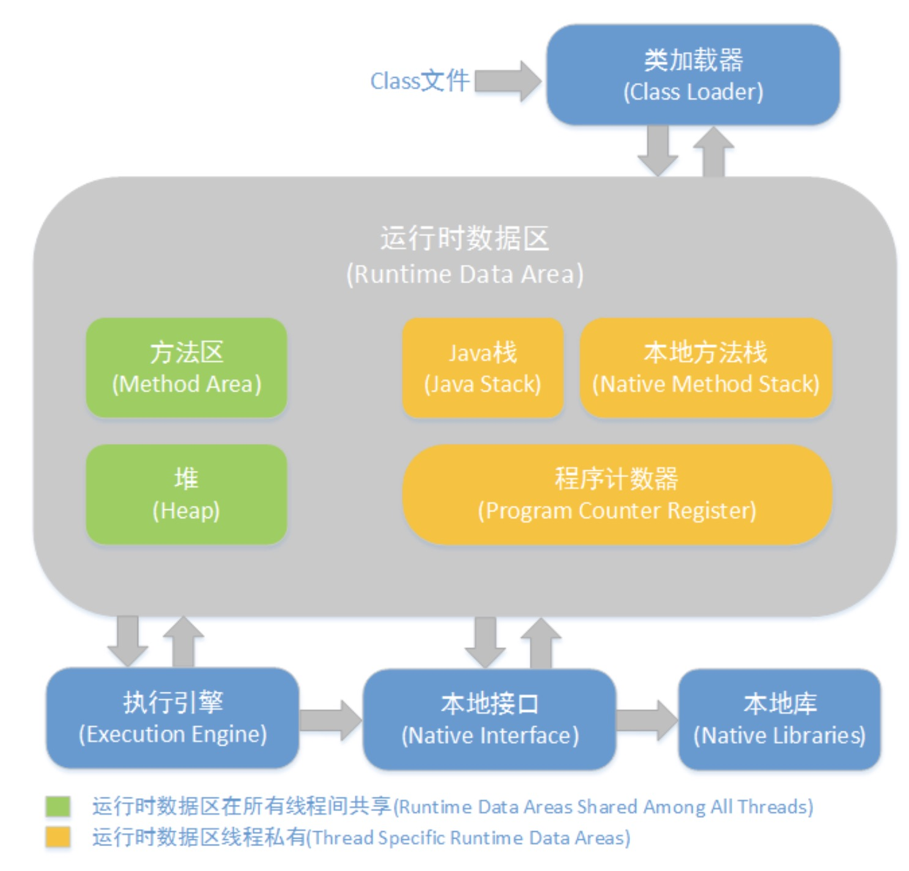

### 1. 什么是 jvm

是 java 虚拟机，用来解析和运行 java 程序。Java 语言在不同平台上运行时不需要重新编译。Java 语言使用 Java 虚拟机屏蔽了与具体平台相关的信息，使得 Java 语言编译程序只需生成在 Java 虚拟机上运行的目标代码（字节码），就可以在多种平台上不加修改地运行

The internal architecture of JVM contains classloader, memory area, execution engine etc.

### 2. jvm 的结构：

1. **- class loader:**
   每一个 Java 虚拟机都由一个类加载器子系统（class loader subsystem），负责加载程序中的类型（类和接口），并赋予唯一的名字。每一个 Java 虚拟机都有一个执行引擎（execution engine）负责执行被加载类中包含的指令。JVM 的两种类装载器包括：启动类装载器和用户自定义类装载器，启动类装载器是 JVM 实现的一部分，用户自定义类装载器则是 Java 程序的一部分，必须是 ClassLoader 类的子类。

1）Bootstrap ClassLoader

负责加载$JAVA_HOME 中 jre/lib/rt.jar 里所有的 class，由 C++实现，不是 ClassLoader 子类

2）Extension ClassLoader

负责加载 java 平台中扩展功能的一些 jar 包，包括$JAVA_HOME 中 jre/lib/\*.jar 或-Djava.ext.dirs 指定目录下的 jar 包

3）App ClassLoader

负责记载 classpath 中指定的 jar 包及目录中 class

4）Custom ClassLoader

属于应用程序根据自身需要自定义的 ClassLoader，如 tomcat、jboss 都会根据 j2ee 规范自行实现 ClassLoader 加载过程中会先检查类是否被已加载，检查顺序是自底向上，从 Custom ClassLoader 到 BootStrap ClassLoader 逐层检查，只要某个 classloader 已加载就视为已加载此类，保证此类只所有 ClassLoader 加载一次。而加载的顺序是自顶向下，也就是由上层来逐层尝试加载此类。

2. **- runtime data area**

- Java 堆（Heap）
  　　是 Java 虚拟机所管理的内存中最大的一块，在虚拟机启动时创建。线程共享，此内存区域的唯一目的就是存放对象实例。
  包含了 Young Generation + old gen
- 方法区（Method Area）
  　　线程共享，它用于存储已被虚拟机加载的类信息、常量、静态变量、即时编译器编译后的代码等数据。

- 程序计数器（Program Counter Register）
  　　线程私有，是一块较小的内存空间，它的作用可以看做是当前线程所执行的字节码的行号指示器。

- JVM 栈（JVM Stacks）
  　　线程私有，生命周期与线程相同。
  虚拟机栈描述的是 Java 方法执行的内存模型：每个方法被执行的时候都会同时创建一个栈帧（Stack Frame）用于存储局部变量表、操作栈、动态链接、方法出口等信息。每一个方法被调用直至执行完成的过程，就对应着一个栈帧在虚拟机栈中从入栈到出栈的过程。

- 本地方法栈（Native Method Stacks）
  　　线程私有，与虚拟机栈所发挥的作用是非常相似的，其区别不过是虚拟机栈为虚拟机执行 Java 方法（也就是字节码）服务，而本地方法栈则是为虚拟机使用到的 Native 方法服务。
  _PS: Native Method 就是一个 java 调用非 java 代码的接口_

### 3. JVM 的对象分配规则

- Young Generation（新生代）：  
  分为：Eden 区和 Survivor 区，Survivor 区有分为大小相等的 From Space 和 To Space。
- Old Generation（老年代）：  
  Tenured 区，当 Tenured 区空间不够时， JVM 会在 Tenured 区进行 major collection。
- Minor GC：  
  新生代 GC，指发生在新生代的垃圾收集动作，因为 java 对象大多都具备朝生夕死的特性，所以 Minor GC 非常频繁，一般回收速度也比较快。
- Major GC：  
  发生老年代的 GC，对整个堆进行 GC。出现 Major GC，经常会伴随至少一次 Minor GC（非绝对）。MajorGC 的速度一般比 minor GC 慢 10 倍以上。
- Full GC：  
  整个虚拟机，包括永久区、新生区和老年区的回收。

1. 对象优先分配在 Eden 区，如果 Eden 区没有足够的空间时，虚拟机执行一次 Minor GC**垃圾回收**

2. 大对象和长期存活的对象进入老年代

   - 大对象直接进入老年代（大对象是指需要大量连续内存空间的对象）。这样做的目的是避免在 Eden 区和两个 Survivor 区之间发生大量的内存拷贝（新生代采用复制算法收集内存）。
   - 长期存活的对象进入老年代。（即经历过多次垃圾回收仍存在的对象）虚拟机为每个对象定义了一个年龄计数器，如果对象经过了 1 次 Minor GC（年轻代收集）那么对象会进入 Survivor 区，之后每经过一次 Minor GC 那么对象的年龄加 1，直到达到阀值对象进入老年区。

3. Survivor 中年龄一致的对象所占内存大小，大于幸存者区空间一半时，则大于等于此年龄的对象全部进入老年代 ->> 动态判断对象的年龄

4. 每次进行 Minor GC 时，JVM 会计算 Survivor 区移至老年区的对象的平均大小，如果这个值大于老年区的剩余值大小则进行一次 Full GC ->> 空间分配担保

### 4. jvm 垃圾回收

1. 原理：
   1）C++由构造函数 allocate object in heap(堆) and has a pointer in stack(栈) point to it. 当程序结束的时候跑析构函数(destructor)把 heap memory 释放&stack pt point to null.

   2） Java 没有析构函数而是由 garbage collector 来实现垃圾回收. GC 会 scan heap 然后释放没有 pointer 指向和没有被 reference(引用)的 object.

   3） JVM 控制 GC, 当 JVM 发现 memory is low 的时候会 run garbage collector.

   4） 强引用(strong ref): 永远不会被 GC  
   软引用(soft ref): 内存溢出的时候回收  
   弱引用(weak ref): 第二次垃圾回收的时候回收  
   虚引用(phantom ref): 每次垃圾回收的时候回收, 无法通过引用取到对象值

2. 算法：
   1） 标记-清除算法(mark-sweep): 扫两次，一次标记，一次清除  
   缺点是会产生碎片化的内存导致需要 allocate 一个很大的对象时可能找不到足够大的一块内存只能再次垃圾回收。

   2） 复制算法(copying): 把一块内存分成相同大的两块, 每次内存空间用完了就垃圾回收把还存活的重新整理复制到另外一边。不会导致内存碎片化，实现简单  
   缺点是内存变成了原来的一半，而且如果对象的存活率很高的话要复制的东西很多

   3） 标记-整理算法(mark-compact):
   标记可回收，然后全部整理到内存的一边，清除剩下的位置，实现比复制算法要难一点(pointer 位置的整理

   4） 分区算法：
   把内存分成 n 个小的独立空间，独立进行垃圾回收而不是每次都垃圾回收整个内存

   _评价垃圾回收算法的好坏_：吞吐量(throughput) & 停顿时间(pause times)
   吞吐量越大，停顿时间越小的算法越优
