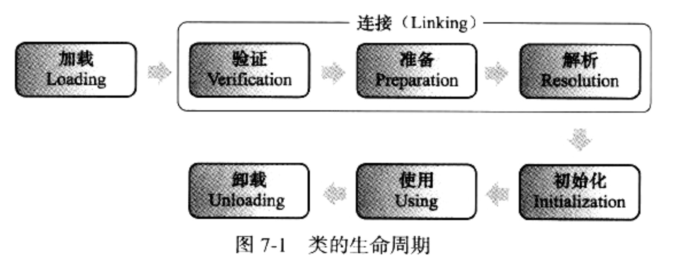
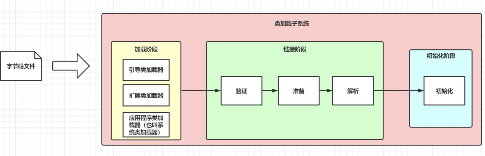
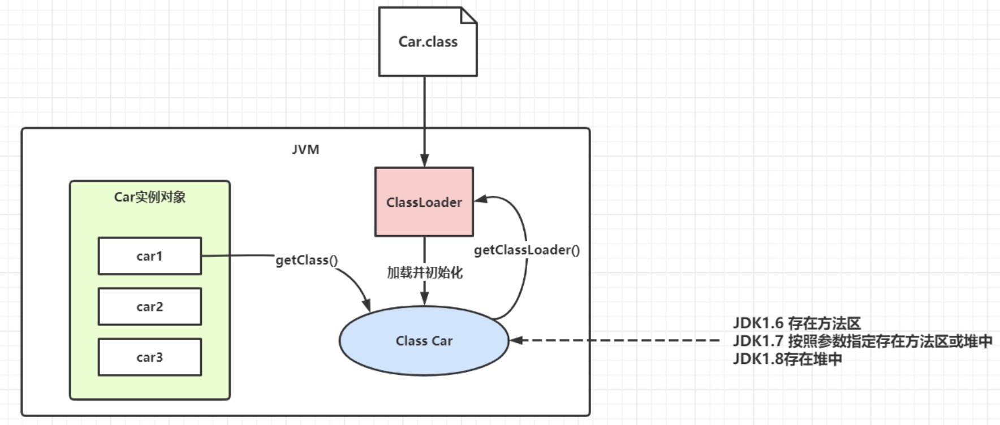
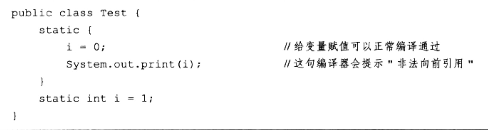
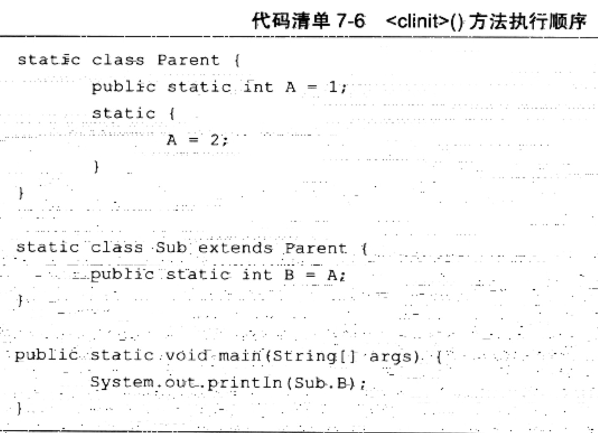
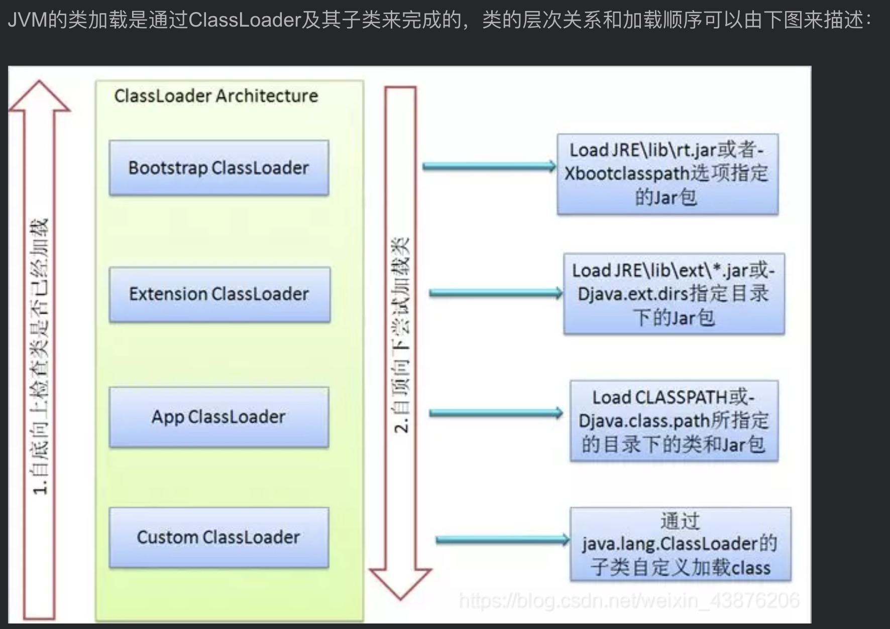

# jvm class loader + 类加载的过程/机制

## 类加载的过程/机制

> note1: .class file/字节码 是一串二进制的字节流  
> note2: .class file/字节码 可以代表的 java 语言中的 class/interface

### 1. 什么是类加载

- 虚拟机把描述类的数据从 .class file 加载到内存，并对数据进行校验、转换、解析、和初始化最终形成可以被虚拟机直接使用的 java 类型，这就是虚拟机的类加载机制，这个过程通过类加载器子系统完成。

- 一个类加载过程包括了加载、验证、准备、解析、初始化、使用和卸载七个阶段。

- Java 语言运行期类加载的特性：**动态加载、动态连接**
  - 和那些在编译时需要进行连接工作的语言不同，在 java 语言里，类的**加载、连接、初始化**过程都是在**程序运行的期间**完成的
  - 决定了 java 可以动态扩展的语言特性

### 2. 类的加载过程详解

一个类的生命周期包括了加载、验证、准备、解析、初始化、使用和卸载七个阶段。其中类加载的过程包括了加载、验证、准备、解析、初始化五个阶段。
**除了初始化，其他的阶段开始的顺序都是固定的**

> 开始的顺序是固定的，不代表进行/完成的顺序是固定的，这些阶段都是交叉混合进行的，通常在一个阶段执行的过程中调用/激活另一个阶段

#### 类的生命周期

#### 类的加载过程

### 2.1 加载阶段(loading)

    在加载阶段虚拟机需要完成一下三件事情：

    - 1）通过一个类的 全限定名 ( Fully qualified name ) 获取定义此类的**二进制字节流**
    - 2）将这个字节流所代表的静态存储结构转化为方法区的运行时数据结构
    - 3）在 JVM 内存中生成一个代表这个类的 java.lang.Class **对象** ，作为方法区这个类的各种数据的访问入口

    **补充 1: 加载.class 文件的方式 (通过一个类的全限定名获取定义此类的二进制字节流的方式：**

    - 从本地系统中直接加载
    - 通过网络获取，典型场景：Web Applet
    - 从 zip 压缩包中读取，成为日后 jar、war 格式的基础
    - 运行时计算生成，使用最多的是：动态代理技术
    - 由其他文件生成，典型场景：JSP 应用
    - 从专有数据库中提取.class 文件，比较少见
    - 从加密文件中获取，典型的防 Class 文件被反编译的保护措施

    **补充 2: 内存中实例化的 java.lang.Class 对象并不一定存放于 java 堆（heap）中，hotspot 的是放在方法区中**
    

### 2.2 验证 (verification)

验证是连接(linking)阶段的第一步, 目的在于确保.class 文件的字节流中包含信息符合当前虚拟机要求，保证被加载类的正确性，不会危害虚拟机自身安全。

_JAVA 本身是相对安全的语言(相对 c/c++), 如果使用纯粹的 java 代码，无法做到诸如：访问数组边界以外的数据、将一个对象转型为它并未实现的类型、跳转到不存在的代码行之类事情，因为编译器将拒绝编译(编译报错)_  
但是在前文中提到，Class 文件并不一定要求是 Java 源码编译而来的。虚拟机如果不检查输入的字节码流,对其完全信任的话,很可能会因为载入了有害的字节码流而导致系统崩溃。

验证阶段大致需要下面四个阶段来验证，**文件格式验证，元数据验证，字节码验证，符号引用验证。**

1. **文件格式验证：** 验证字节流是否符合 Class 文件格式的规范,并且能被当前版本的虚拟机处理.

   - 是否以魔数 0xCAFEBABE 开头(字节码头四个字节,用来表示一个可以接受的字节码文件).
   - 版本号是否在当前虚拟机处理范围内
   - etc.

   主要目的是保证输入的字节流能正确的解析并存储于方法区之内,格式上符合描述一个 java 类型信息的要求. 只有通过了这个阶段的验证，字节流才会进去方法去进行储存。后面三个阶段都是基于方法区的储存结构进行的，不会再直接操作字节流。

2. **元数据验证：** 对字节码描述的信息进行语义分析，以保证其描述的信息符合 Java 语言规范的要求。

   - 这个类是否有父类 (除了 java.lang.Object 其他类都应该有父类)
   - 这个类的父类是不是继承了不允许被继承的类 (被 final 修饰的类)
   - 如果这个类不是抽象类，是否实现了其父类/接口中要求实现的所有方法
   - 类中的字段、方法是否与父类产生矛盾 (如：覆盖了父类的 final 字段、方法重载不符合规则)
   - etc.

   主要目的是对类的元数据信息进行语义校验，保证不存在不符合 java 语言规范的元数据信息.

3. **字节码验证：**对类的方法体进行分析，保证被校验的类的方法在运行时不会做出危害虚拟机安全的事

4. **符号引用验证：**该校验是发生在虚拟机将符号引用转化为直接引用的时候，这个转化动作将在解析阶段中发生，目的是确保解析动作能正常执行。
   - 符号引用中的全限定名是否能找到对应的类，是否具备访问权限 etc.

### 2.3 准备 (preparation)

- 为类变量（static 变量）分配内存并且设置该类变量的默认初始值，即 0、null、fasle。
  进行赋值声明的变量，在初始化阶段才被正确赋值。这里不包含用 final 修饰的 static，因为 final 在编译的时候就会分配了，调用时不会触发类的加载；
- 这里不会为实例变量（非 static 变量）分配初始化，类变量会分配在方法区中，而实例变量是会随着对象实例化一起分配到 Java 堆中

### 2.4 解析 (resolution)

将常量池内的符号引用转换为直接引用的过程。事实上，解析操作往往会伴随着 JVM 在执行完初始化之后再执行。

1. 符号引用（symbolic reference）  
   以*一组符号*来描述所引用的目标，符号可以是任何形式的字面量，只要使用时能够无歧义的定位到目标即可。符号引用与虚拟机的内存布局无关，引用的目标并不一定加载到内存中。在 Java 中，一个 java 类将会编译成一个 class 文件。在编译时，java 类并不知道所引用的类的实际地址，因此只能使用符号引用来代替。

2. 直接引用（direct reference）
   就是*直接指向目标的指针、相对偏移量或一个间接定位到目标的句柄*（句柄就是个数字，一般和当前系统下的整数的位数一样，比如 32bit 系统下就是 4 个字节。这个数字是一个对象的唯一标识，和对象一一对应）。

- 解析动作主要针对 **类、接口、字段、类方法、接口方法、方法类型、方法句柄、调用点限定符** 7 类符号进行。
- 对应常量池中的
  - CONSTANT_Class_info
  - CONSTANT_Interface_info
  - CONSTANT_Fieldref_info
  - CONSTANT_Methodref_info
  - CONSTANT_InterfaceMethodref_info
  - CONSTANT_MethodType_info
  - CONSTANT_MethodHandle_info
  - CONSTANT_InvokeDynamic_info
    7 种常量类型

### 2.5 初始化

初始化阶段,才真正开始执行类中定义的 java 程序代码。

初始化阶段是执行 类构造器 \*<clinit>\*()方法的过程。此方法不需定义，是 Javac 编译器自动收集类中的所有类变量的赋值动作和静态代码块中的语句合并而来。

类构造器\*<clinit>\*()方法规则：

1. 类构造器\*<clinit>\*()方法是有编译器自动收集类中的**所有类变量的赋值**动作和 **static 语句块**中的语句合并产生的。编译器**收集的顺序是由语句在源文件中出现的顺序**所决定的。静态语句块中只能访问到定义在静态语句块**之前**的变量，定义在其之后的变量，在静态语句块中**可以赋值，但是不能访问**。如：
   

   1、能够前向赋值，是因为在准备阶段，就已经对 i 这个变量分配空间和赋 0 的操作了

   2、前向引用报错，至于为什么不能调用后面的变量，这其实是一个 JVM 语法规定，对于静态变量，你可以在它的声明前面赋值，但是不允许你在它的声明前面访问。

2. 类构造器\*<clinit>\*()方法与类的构造器<init>()方法不同，JVM 会保证子类的<c1init>()执行前，父类的\*<clinit>\*()已经执行完毕，即父类<c1init>()先执行。因此，在虚拟机中第一个被执行的\*<clinit>\*()方法的类肯定是 java.lang.Object

3. 由于父类的\*<clinit>\*()方法先执行，也就意味着父类中定义的静态语句块要优于子类的变量赋值。所以在代码清单 7-6 中字段 B 的值将会是 2 不是 1
   

4. 类构造器\*<clinit>\*()方法对于类或者接口来说并不是必需的，如果一个类中没有静态语句块，编译器就不会为这个类生成 \*<clinit>\*()方法。

5. **Interface 接口**不能使用静态语句块，但也可以定义 static 变量+给变量赋值，生成的\*<clinit>\*()方法不需要先执行 Parent Interface 父接口中的\*<clinit>\*()方法，只有当父接口中定义的变量使用时，父接口才会初始化。同理，**接口的实现类**在初始化的时候也一样不会执行接口中的\*<clinit>\*()方法。

6. 虚拟机会保证一个类的\*<clinit>\*()方法在多线程环境中被正确的加锁/同步，如果多线程同时去初始化一个类，只会有一个线程去初始化，其他线程都阻塞。

### 2.6 初始化时机

虽然对于加载时机，java 虚拟机规范中并没有进行强制约束。这点可以交给虚拟机的具体实现来自由把握。但是对于初始化阶段，虚拟机规范则严格规定了有且只有五种情况必须立即对类进行"初始化"(加载,验证,准备自然需要在初始化之前开始)。

## 类加载器的结构

- 每一个 Java 虚拟机都有一个类加载器子系统（class loader subsystem），负责加载程序中的类型（类和接口），并赋予唯一的名字。每一个 Java 虚拟机都有一个执行引擎（execution engine）负责执行被加载类中包含的指令。
- JVM 的两种类装载器包括：启动类装载器和用户自定义类装载器，启动类装载器是 JVM 实现的一部分，用户自定义类装载器则是 Java 程序的一部分，必须是 ClassLoader 类的子类。

1. Bootstrap ClassLoader

负责加载$JAVA_HOME 中 jre/lib/rt.jar 里所有的 class，由 C++实现，不是 ClassLoader 子类

2. Extension ClassLoader

负责加载 java 平台中扩展功能的一些 jar 包，包括$JAVA_HOME 中 jre/lib/\*.jar 或-Djava.ext.dirs 指定目录下的 jar 包

3. App ClassLoader

负责记载 classpath 中指定的 jar 包及目录中 class

4. Custom ClassLoader

属于应用程序根据自身需要自定义的 ClassLoader，如 tomcat、jboss 都会根据 j2ee 规范自行实现 ClassLoader 加载过程中会先检查类是否被已加载，检查顺序是自底向上，从 Custom ClassLoader 到 BootStrap ClassLoader 逐层检查，只要某个 classloader 已加载就视为已加载此类，保证此类只所有 ClassLoader 加载一次。而加载的顺序是自顶向下，也就是由上层来逐层尝试加载此类。

## 参考

- 《深入理解 java 虚拟机》 第七章-虚拟机类加载机制
- oracle 文档： https://docs.oracle.com/javase/specs/jvms/se7/html/jvms-5.html
