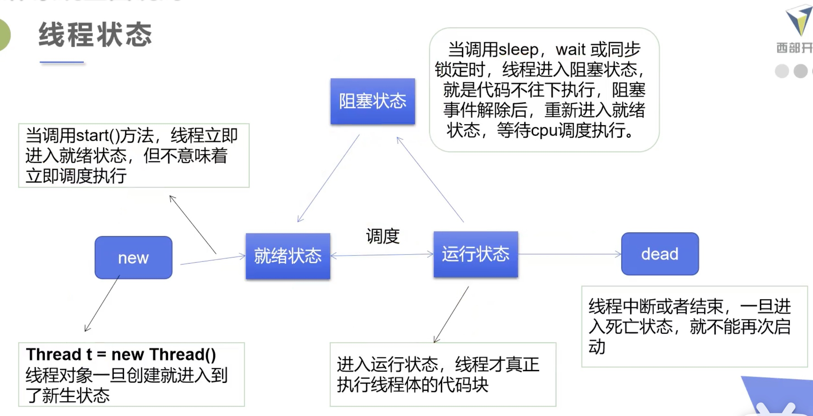

# 多线程

参考官方文档： https://docs.oracle.com/javase/7/docs/api/java/lang/Thread.html

1. 线程是程序中执行的线程。Java 虚拟机允许应用程序同时执行多个执行线程。
2. 每个线程都有优先权。具有较高优先级的线程优先于优先级较低的线程执行。每个线程可能也可能不会被标记为守护程序。当在某个线程中运行的代码创建一个新的 thread 对象时,新线程的优先级最初设置=创建线程的优先级,并且，当且仅当创建线程是守护进程时 新线程才是守护线程。
3. 当 Java 虚拟机启动时,通常有一个非守护进程线程(通常调用某些指定类的名为 main() 的方法)。Java 虚拟机将继续执行线程,直到发生以 下任一情况:
4. 己经调用了 Runtime 类的 exit 方法,并且安全管理器已经允许进行退出操作。
5. 所有不是守护进程线程的线程都已经死亡,无论是从调用返回到 run 方法还是抛出超出 run 方法的 run。
6. jdk 创建一个新的执行线程有两种方法。
   - 继承 thread 类
   - 实现 runnable 接口
   - 实现 Callable 接口

## 1. 继承 thread 类

1. 自定义线程类继承 Thread 类
2. 重写 run()方法,编写线程执行体 (异常不能 throw)
3. 创建线程对象,调用 start()方法启动线程

```java
package com.ming.mutiThread;

/**
 * @Author: MingChen
 * @Date: 2021/8/9
 *
 * 继承Thread类实现多线程 测试1
 */
public class ThreadTest1 extends Thread{
    @Override
    public void run(){
        //run方法线程体，线程要做的事情在重写的run方法里实现
        for (int i = 0; i < 20; i++) {
            System.out.println("我在写代码--" + i);
        }
    }

    public static void main(String[] args) {
        //main线程

        //创建一个线程对象
        ThreadTest1 thread1 = new ThreadTest1();
        //调用它的start方法，开启线程
        //thread1.run();         //只有主线程一条执行路径
        thread1.start();       //主线程和子线程并行

        for (int i = 0; i < 20; i++) {
            System.out.println("我在写多线程--" + i);
        }
    }
}
```

```java
package com.ming.mutiThread;


import org.apache.commons.io.*;

import java.io.File;
import java.io.IOException;
import java.net.URL;

/**
 * @Author: MingChen
 * @Date: 2021/8/17
 *
 * 继承Thread类实现多线程 测试2：下载网图
 */
public class ThreadTest2 extends Thread{
    private String url;
    private String name;

    public ThreadTest2(String url, String name){
        this.url = url;
        this.name = name;
    }

    @Override
    public void run() {
        WebDownloader webDownloader = new WebDownloader();
        webDownloader.downloader(url, name);
        System.out.println("下载了文件名为：" + name);
    }

    public static void main(String[] args) {
        ThreadTest2 t1 = new ThreadTest2("https://www.kuangstudy.com/zl/help", "1.jpg");
        ThreadTest2 t2 = new ThreadTest2("https://www.kuangstudy.com/zl/ssm", "2.jpg");
        ThreadTest2 t3 = new ThreadTest2("https://www.kuangstudy.com/bbs/1351463043300708353", "3.jpg");

        t1.start();
        t2.start();
        t3.start();
    }
}
```

这两个例子里的线程都是并行的，可以通过输出每次 print message 都交叉以及顺序会发生变化来证明

## 2. 实现 Runnable 接口

1. 自定义实现 Runnable 接口
2. 重写 run()方法,编写线程执行体
3. 创建 runnable 接口的实现对象
4. 创建 thread 类线程对象，把 runnable 接口的实现对象当作参数，调用 start()方法启动线程

**Runnable 接口没有 start 方法，需要借助 Thread 类才可以将线程送入就绪队列，利用 Thread 类可以对线程进行命名，如 Thread（a，“myName”）**

```java
package com.ming.mutiThread;

/**
 * @Author: MingChen
 * @Date: 2021/8/17
 *
 * 实现runnable接口，测试1+2
 */
public class ThreadTest3 implements Runnable{
    private String url;
    private String name;

    public ThreadTest3(String url, String name){
        this.url = url;
        this.name = name;
    }

    @Override
    public void run() {
//        for (int i = 0; i < 20; i++) {
//            System.out.println("我在写代码--" + i);
//        }

        WebDownloader webDownloader = new WebDownloader();
        webDownloader.downloader(url, name);
        System.out.println("下载图片"+name);
    }

    public static void main(String[] args) {

        /*
        //main线程

        //创建一个线程对象
        ThreadTest3 threadTest3 = new ThreadTest3();

//        Thread thread = new Thread(threadTest3);
//        thread.start();
        new Thread(threadTest3).start();

        for (int i = 0; i < 20; i++) {
            System.out.println("我在写多线程--" + i);
        }

         */

        ThreadTest2 t1 = new ThreadTest2("https://www.kuangstudy.com/zl/help", "1.jpg");
        ThreadTest2 t2 = new ThreadTest2("https://www.kuangstudy.com/zl/ssm", "2.jpg");
        ThreadTest2 t3 = new ThreadTest2("https://www.kuangstudy.com/bbs/1351463043300708353", "3.jpg");

        new Thread(t1).start();
        new Thread(t2).start();
        new Thread(t3).start();
    }
}
```

注意，直接调用 run 方法只是简单执行 run 内的操作（还是在主线程的单核运行），而 start 方法是将子线程和主线程分开推进。

- 执行线程必须调用 start(),加入到调度器中
- 不ー定立即执行,系统安排调度分配执行
- 直接调用 run()不是开启多线程,是普通方法调用

## 3. 继承 thread 类 VS 实现 Runnable 接口

1. 继承 Thread 类

- 子类继承 Thread 类具备多线程能力
- 启动线程:子类对象.start()
- 不建议使用:避免 OOP 单继承局限性

2. 实现 Runnable 接口

- 实现接口 Runnablel 具有多线程能力
- 启动线程:传入目标对象 + Thread 对象.start()
- 推荐使用:避免单继承局限性,灵活方便,方便同一个对象被多个线程使用

```java
//一份资源
Startthread4 station new Startthread4();
//多个代理
new Thread( station,"小明").start();
new Thread( station,"老师").start();
new Thread( station,"小红").start();
```

## 4. 线程的并发问题

龟兔赛跑
抢火车票

## 5. 实现 callable 接口

1. 实现 Callable 接口,需要返回值类型
2. 重写 call()方法,需要抛出异常
3. 创建目标对象
4. 创建执行服务: Executorservice ser= Executors.newfixedThreadpodl(3)
5. 提交执行: Future<Boolean> result1=ser.submit(t1)
6. 获取结果: boolean r1= result1.get()
7. 关闭服务:ser.shutdownNow();

```java
package com.ming.mutiThread;

import java.util.concurrent.*;

/**
 * @Author: MingChen
 * @Date: 2021/8/20
 *
 * 实现callable接口，下载网图测试
 */

public class ThreadTest5 implements Callable<Boolean> { //1. 实现 Callable 接口,需要返回值类型
    private String url;
    private String name;

    private ThreadTest5(String url, String name){
        this.url = url;
        this.name = name;
    }

    @Override
    public Boolean call() throws Exception {    //2. 重写 call()方法,需要抛出异常
        WebDownloader webDownloader = new WebDownloader();
        webDownloader.downloader(url, name);
        System.out.println("下载图片"+name);
        return true;
    }

    public static void main(String[] args) throws ExecutionException, InterruptedException {
        //3. 创建目标对象
        ThreadTest5 t1 = new ThreadTest5("https://www.kuangstudy.com/zl/help", "1.jpg");
        ThreadTest5 t2 = new ThreadTest5("https://www.kuangstudy.com/zl/ssm", "2.jpg");
        ThreadTest5 t3 = new ThreadTest5("https://www.kuangstudy.com/bbs/1351463043300708353", "3.jpg");

        //4. 创建执行服务, 创建一个有size=3的线程池
        ExecutorService ser = Executors.newFixedThreadPool(3);

        //5. 提交执行
        Future<Boolean> res1 = ser.submit(t1);
        Future<Boolean> res2 = ser.submit(t2);
        Future<Boolean> res3 = ser.submit(t3);

        //6. 获取结果 -> main function要 throws ExecutionException, InterruptedException
        boolean r1 = res1.get();
        boolean r2 = res2.get();
        boolean r3 = res3.get();

        //7. 关闭服务
        ser.shutdownNow();
    }
}
```

## 6. lambda 表达式

### 6.1 lambda 表达式的几种类型

- (params)-> expression[表达式]
- (params)-> statement[语句]
- (params)-> { statements }

```java
//例子
aー> System.out.println("i am a lambda example-->"+a);
new Thread( ()-> System.out.println("多线程学习-->") ). start()
```

为什么要使用 lambda 表达式：

- 避兔匿名内部类定义过多
- 简洁代码
- 去掉了ー堆没有意义的代码,只留下核心的逻辑。

### 6.2 Functional Interface(函数式接口) vs lambda

理解 Functional Interface(函数式接口)是学习 Java8 lambda 表达式的关键所在。

函数式接口的定义：

- 任何接口,如果只包含唯ー一个抽象方法,那么它就是ー个函数式接口。
- 对于函数式接口,我们可以通过 lambda 表达式来创建该接口的对象。

### 6.3 代码实现 lambda()例子

```java
//1. 定义一个函数式接口：只有一个抽象函数的接口
interface ILike {
    void lambda();
}

//2. 实现类
class Like implements ILike{
    @Override
    public void lambda(){
        System.out.println("i like lambda1");
    }
}

public class TestLambda1 {

    //3. 静态内部类
    static class Like2 implements ILike{
        @Override
        public void lambda(){
            System.out.println("i like lambda2");
        }
    }

    public static void main(String[] args) {
        ILike like = new Like();
        like.lambda();

        like = new Like2();
        like.lambda();

        //4. 局部内部类
        class Like3 implements ILike{
            @Override
            public void lambda(){
                System.out.println("i like lambda3");
            }
        }
        like = new Like3();
        like.lambda();

        //5. 匿名内部类：没有类的名称，必须借助接口/父类
        like = new ILike(){
            @Override
            public void lambda(){
                System.out.println("i like lambda4");
            }
        };
        like.lambda();

        //6. 用lambda简化
        like = ()->{
            System.out.println("i like lambda5");
        };
        like.lambda();
    }

}
```

### 6.4 带参数的 lambda()

```java
public class LambdaTest {
    public static void main(String[] args) {
        LLike like = (a,c)->a+c;
        System.out.println(like.compute(100,200));
    }

}

interface LLike{
    int compute(int a, int c);
}
```

## 7. 线程状态



- thread.getState()
- Thread.State.NEW
- Thread.State.RUNNABLE
- Thread.State.BLOCKED
- Thread.State.WAITING  
  正在等待另一个线程执行特定动作的线程处于此状态
- Thread.State.TIMED_WAITING
  正在等待另一个线程执行动作达到指定等待时间的线程处于此状态。
- Thread.State.TERMINATED

## 8. 常用线程方法

1. 线程优先级

   - setPriority(int newpriority): **优先级的设定建议在 start（）调用前**
   - getPriority()
   - 线程的优先级用数字表示,范围从 **1~10**
   - 不一定优先级高的线程就先跑，主要看 cpu 心情，优先级低只是意味着获得调度的概率低

   ```java
   // The minimum priority that a thread can have
   public final static int MIN_PRIORITY=1
    // The default priority that is assigned to a thread
    public final static int NORM_PRIORITY =5
    // The max imum priority that a thread can have
    public final static int MAX_PRIORITY=10
   ```

2. sleep(long millis)): 线程休眠

   - 使线程停止运行一段时间，将处于阻塞状态(保持锁)
   - 如果调用了 sleep 方法之后，没有其他等待执行的线程，这个时候当前线程不会马上恢复执行！
   - sleep()存在异常 Interruptedexception
   - sleep 时间达到后线程进入就绪状态
   - sleep 可以模拟**网络延时,倒计时**等
   - 每一个对象都有一个锁, sleep 不会释放锁;

3. join(): 插队

   - 阻塞指定其他线程等到 thread.join()的那个线程完成以后再继续执行。

4. yield(): 礼让

   - 让当前正在执行的线程暂停, 但不阻塞该线程
   - 将线程从运行状态转为就绪状态
   - 让 cpu 重新调度, 礼让不ー定成功，看 CPU 心情

5. interrupt(): 中断线程,别用这个方式

6. boolean isAlive(): 测试线程是否处于活动状态

7. 停止线程

   - 不推荐使用 JDK 提供的 stop()/destroy()方法。（已废弃）
   - 推荐线程自己停止下来
   - 建议使用一个标志位进行终止变量：当 flag= false, 则终止线程运行。

   ```java
   public class Teststop implements Runnable t
   //1.线程中定义线程体使用的标识
   private boolean flag=true;

   @Override
   public void run(){
        //2.线程体使用该识 while (flag)t
        while(flag){
            System.out.printin("run... Thread")
        }
   }

   //3.对外提供方法改变标识
   public void stop(){
        this.flag = false;
   }
   ```

## 9. 守护线程 daemon

守护线程：是为用户线程服务的；jvm 停止不用等待守护线程执行完毕，而 jvm 默认等待用户线程执行完毕才会停止

用法：实例.setDaemon(true)

- 线程分为**用户线程和守护线程**；
- 虚拟机必须确保用户线程执行完毕；
- 虚拟机不用等待守护线程执行完毕，如后台记录操作日志、监控内存使用等。

## 10. 线程同步

- 现实生活中.我们会遇到”同一个资源,多个人都想使用”的问题,比如,食堂排队打饭,每个人都想吃饭,最天然的解决办法就是排队，一个个来.
- 处理多线程问题时,多个线程访问同一个对象,并且某些线程还想修改这个对象 这时候我们就需要线程同步.
- **线程同步其实就是一种等待机制,多个需要同时访问此对象的线程进入这个对象的等待池形成队列,等待前面线程使用完毕,下一个线程再使用**
