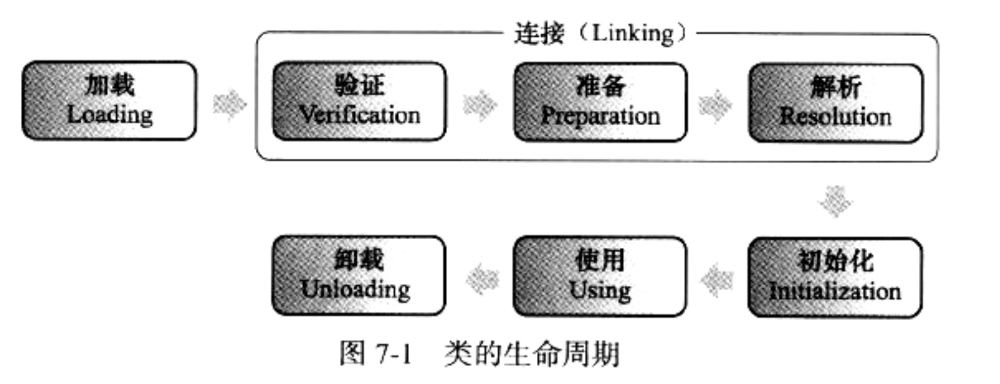
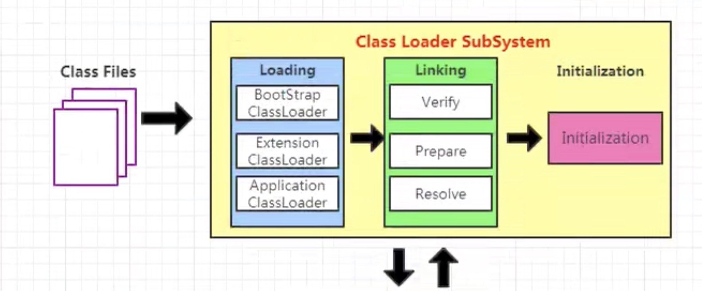
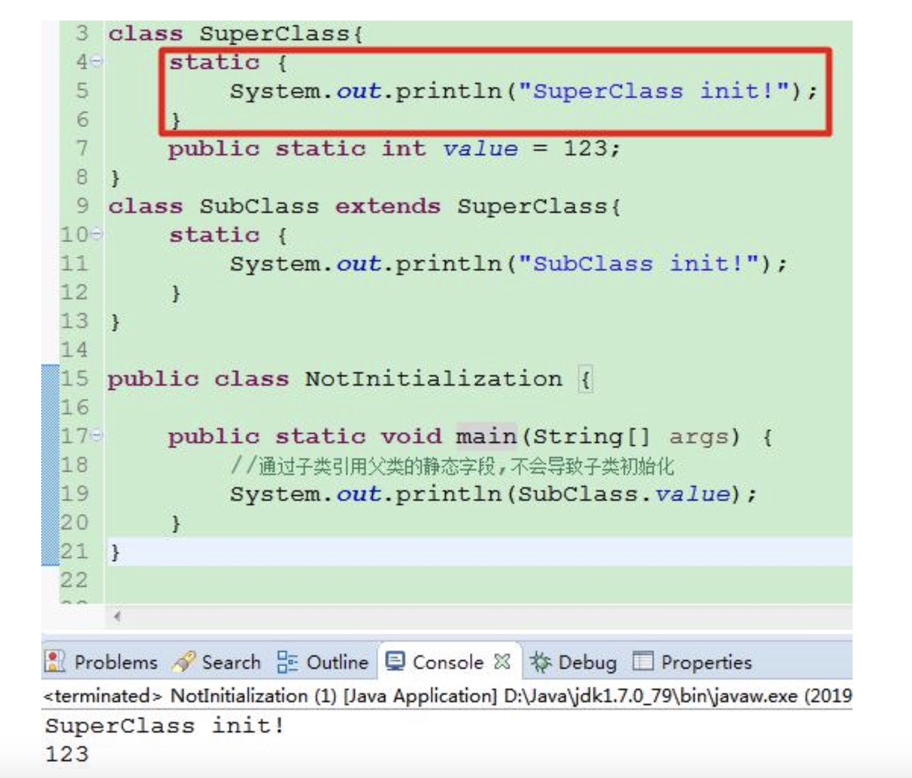
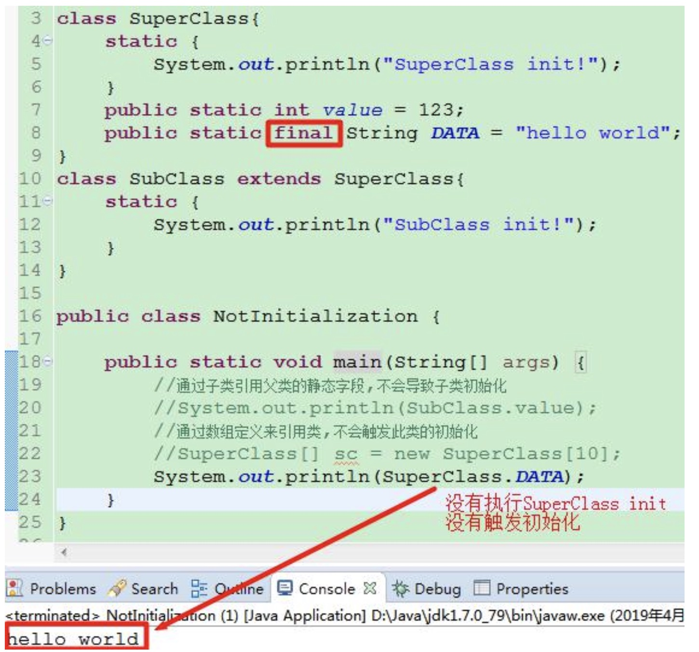
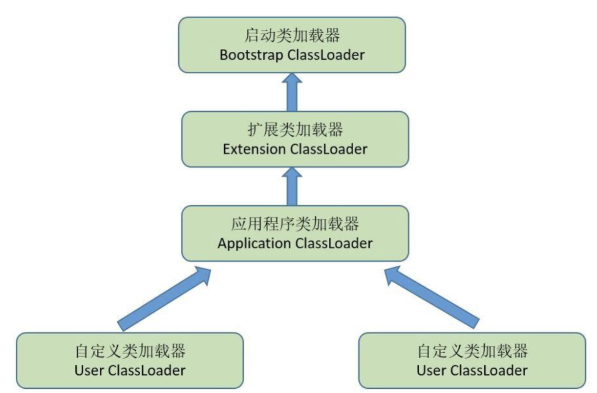
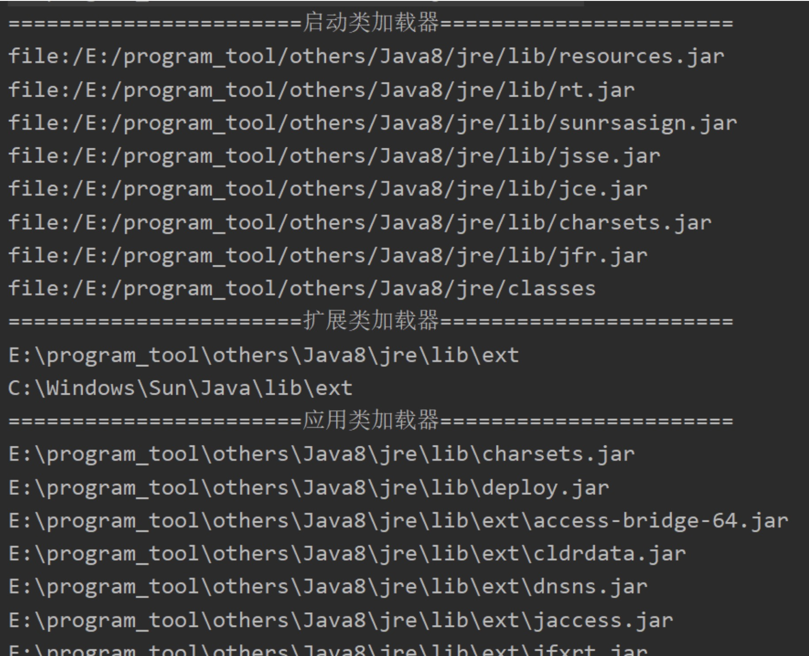

# 类加载子系统(classloader subsystem) + 类加载的过程/机制 + jvm class loader 类加载器

## 类加载的过程/机制

> note1: .class file/字节码 是一串二进制的字节流  
> note2: .class file/字节码 可以代表的 java 语言中的 class/interface

### 1. 什么是类加载

- 虚拟机把描述类的数据从 .class file 加载到内存，并对数据进行校验、转换、解析、和初始化最终形成可以被虚拟机直接使用的 java 类型，这就是虚拟机的类加载机制，这个过程通过类加载器子系统完成。

- 一个类加载过程包括了加载、验证、准备、解析、初始化、使用和卸载七个阶段。

- Java 语言运行期类加载的特性：**动态加载、动态连接**
  - 和那些在编译时需要进行连接工作的语言不同，在 java 语言里，类的**加载、连接、初始化**过程都是在**程序运行的期间**完成的
  - 决定了 java 可以动态扩展的语言特性

### 2. 类的加载过程详解

一个类的生命周期包括了加载、验证、准备、解析、初始化、使用和卸载七个阶段。其中类加载的过程包括了加载、验证、准备、解析、初始化五个阶段。
**除了初始化，其他的阶段开始的顺序都是固定的**

> 开始的顺序是固定的，不代表进行/完成的顺序是固定的，这些阶段都是交叉混合进行的，通常在一个阶段执行的过程中调用/激活另一个阶段

#### 类的生命周期



#### 类的加载过程




### 2.1 加载阶段(loading)

    在加载阶段虚拟机需要完成一下三件事情：

    - 1）通过一个类的 全限定名 ( Fully qualified name ) 获取定义此类的**二进制字节流**
    - 2）将这个字节流所代表的静态存储结构转化为方法区的运行时数据结构
    - 3）在 JVM 内存中生成一个代表这个类的 java.lang.Class **对象** ，作为方法区这个类的各种数据的访问入口

    **补充 1: 加载.class 文件的方式 (通过一个类的全限定名获取定义此类的二进制字节流的方式：**

    - 从本地系统中直接加载
    - 通过网络获取，典型场景：Web Applet
    - 从 zip 压缩包中读取，成为日后 jar、war 格式的基础
    - 运行时计算生成，使用最多的是：动态代理技术
    - 由其他文件生成，典型场景：JSP 应用
    - 从专有数据库中提取.class 文件，比较少见
    - 从加密文件中获取，典型的防 Class 文件被反编译的保护措施

    **补充 2: 内存中实例化的 java.lang.Class 对象并不一定存放于 java 堆（heap）中，hotspot 的是放在方法区中**
    

### 2.2 验证 (verification)

验证是连接(linking)阶段的第一步, 目的在于确保.class 文件的字节流中包含信息符合当前虚拟机要求，保证被加载类的正确性，不会危害虚拟机自身安全。

_JAVA 本身是相对安全的语言(相对 c/c++), 如果使用纯粹的 java 代码，无法做到诸如：访问数组边界以外的数据、将一个对象转型为它并未实现的类型、跳转到不存在的代码行之类事情，因为编译器将拒绝编译(编译报错)_  
但是在前文中提到，Class 文件并不一定要求是 Java 源码编译而来的。虚拟机如果不检查输入的字节码流,对其完全信任的话,很可能会因为载入了有害的字节码流而导致系统崩溃。

验证阶段大致需要下面四个阶段来验证，**文件格式验证，元数据验证，字节码验证，符号引用验证。**

1. **文件格式验证：** 验证字节流是否符合 Class 文件格式的规范,并且能被当前版本的虚拟机处理.

   - 是否以魔数 0xCAFEBABE 开头(字节码头四个字节,用来表示一个可以接受的字节码文件).
   - 版本号是否在当前虚拟机处理范围内
   - etc.

   主要目的是保证输入的字节流能正确的解析并存储于方法区之内,格式上符合描述一个 java 类型信息的要求. 只有通过了这个阶段的验证，字节流才会进去方法去进行储存。后面三个阶段都是基于方法区的储存结构进行的，不会再直接操作字节流。

2. **元数据验证：** 对字节码描述的信息进行语义分析，以保证其描述的信息符合 Java 语言规范的要求。

   - 这个类是否有父类 (除了 java.lang.Object 其他类都应该有父类)
   - 这个类的父类是不是继承了不允许被继承的类 (被 final 修饰的类)
   - 如果这个类不是抽象类，是否实现了其父类/接口中要求实现的所有方法
   - 类中的字段、方法是否与父类产生矛盾 (如：覆盖了父类的 final 字段、方法重载不符合规则)
   - etc.

   主要目的是对类的元数据信息进行语义校验，保证不存在不符合 java 语言规范的元数据信息.

3. **字节码验证：**对类的方法体进行分析，保证被校验的类的方法在运行时不会做出危害虚拟机安全的事

4. **符号引用验证：**该校验是发生在虚拟机将符号引用转化为直接引用的时候，这个转化动作将在解析阶段中发生，目的是确保解析动作能正常执行。
   - 符号引用中的全限定名是否能找到对应的类，是否具备访问权限 etc.

### 2.3 准备 (preparation)

- 为类变量（static 变量）分配内存并且设置该类变量的默认初始值，即 0、null、fasle。
  进行赋值声明的变量，在初始化阶段才被正确赋值。这里不包含用 final 修饰的 static，因为 final 在编译的时候就会分配了，调用时不会触发类的加载；
- 这里不会为实例变量（非 static 变量）分配初始化，类变量会分配在方法区中，而实例变量是会随着对象实例化一起分配到 Java 堆中

### 2.4 解析 (resolution)

将常量池内的符号引用转换为直接引用的过程。事实上，解析操作往往会伴随着 JVM 在执行完初始化之后再执行。

1. 符号引用（symbolic reference）  
   以*一组符号*来描述所引用的目标，符号可以是任何形式的字面量，只要使用时能够无歧义的定位到目标即可。符号引用与虚拟机的内存布局无关，引用的目标并不一定加载到内存中。在 Java 中，一个 java 类将会编译成一个 class 文件。在编译时，java 类并不知道所引用的类的实际地址，因此只能使用符号引用来代替。

2. 直接引用（direct reference）
   就是*直接指向目标的指针、相对偏移量或一个间接定位到目标的句柄*（句柄就是个数字，一般和当前系统下的整数的位数一样，比如 32bit 系统下就是 4 个字节。这个数字是一个对象的唯一标识，和对象一一对应）。

- 解析动作主要针对 **类、接口、字段、类方法、接口方法、方法类型、方法句柄、调用点限定符** 7 类符号进行。
- 对应常量池中的
  - CONSTANT_Class_info
  - CONSTANT_Interface_info
  - CONSTANT_Fieldref_info
  - CONSTANT_Methodref_info
  - CONSTANT_InterfaceMethodref_info
  - CONSTANT_MethodType_info
  - CONSTANT_MethodHandle_info
  - CONSTANT_InvokeDynamic_info
    7 种常量类型

### 2.5 初始化

初始化阶段,才真正开始执行类中定义的 java 程序代码。

初始化阶段是执行 类构造器 `<clinit>()`方法的过程。此方法不需定义，是 Javac 编译器自动收集类中的所有类变量的赋值动作和静态代码块中的语句合并而来。

类构造器`<clinit>()`方法规则：

1. 类构造器`<clinit>()`方法是有编译器自动收集类中的**所有类变量的赋值**动作和 **static 语句块**中的语句合并产生的。编译器**收集的顺序是由语句在源文件中出现的顺序**所决定的。静态语句块中只能访问到定义在静态语句块**之前**的变量，定义在其之后的变量，在静态语句块中**可以赋值，但是不能访问**。如：
   

   1、能够前向赋值，是因为在准备阶段，就已经对 i 这个变量分配空间和赋 0 的操作了

   2、前向引用报错，至于为什么不能调用后面的变量，这其实是一个 JVM 语法规定，对于静态变量，你可以在它的声明前面赋值，但是不允许你在它的声明前面访问。

2. 类构造器`<clinit>()`方法与类的构造器<init>()方法不同，JVM 会保证子类的`<c1init>()`执行前，父类的`<clinit>()`已经执行完毕，即父类<c1init>()先执行。因此，在虚拟机中第一个被执行的`<clinit>()`方法的类肯定是 java.lang.Object

3. 由于父类的`<clinit>()`方法先执行，也就意味着父类中定义的静态语句块要优于子类的变量赋值。所以在代码清单 7-6 中字段 B 的值将会是 2 不是 1
   

4. 类构造器`<clinit>()`方法对于类或者接口来说并不是必需的，如果一个类中没有静态语句块，编译器就不会为这个类生成 `<clinit>()`方法。

5. **Interface 接口**不能使用静态语句块，但也可以定义 static 变量+给变量赋值，生成的`<clinit>()`方法不需要先执行 Parent Interface 父接口中的`<clinit>()`方法，只有当父接口中定义的变量使用时，父接口才会初始化。同理，**接口的实现类**在初始化的时候也一样不会执行接口中的`<clinit>()`方法。

6. 虚拟机会保证一个类的`<clinit>()`方法在多线程环境中被正确的加锁/同步，如果多线程同时去初始化一个类，只会有一个线程去初始化，其他线程都阻塞。

### 2.6 初始化时机

### 2.6.1 主动引用

虽然对于加载时机，java 虚拟机规范中并没有进行强制约束。这点可以交给虚拟机的具体实现来自由把握。但是对于初始化阶段，虚拟机规范则严格规定了有且只有五种情况必须立即对类进行"初始化"(加载,验证,准备自然需要在初始化之前开始)。

1. **创建类的实例**：遇到 new 指令(使用关键字 new 来实例化对象)
2. **访问某个类/接口的静态变量或者对静态变量赋值 + 调用类的静态方法**：  
   getstatic，putstatic(读取或设置一个类的静态字段的时候,除了 final 修饰,在编译时期就已经把结果放在常量池的静态字段)或 invokestatic(调用类的静态方法)这 4 条字节码指令时,如果类没有进行初始化,则需要先 触发其初始化.
3. 使用 java.lang.reflect 包的方法对类进行反射调用的时候,如果类没有进行过初始化,则需要先触发其初始化.
4. 当初始化一个类的时候,如果发现其父类还没有进行初始化,则需要先触发其父类的初始化(接口初始化例外,不要求所有父接口全部都初始化,只有在真正调用到父接口的时候才会初始化).
5. 当启动虚拟机时,用户需要指定一个需要执行的主类（main 方法所在）,虚机先初始化这个主类.
6. 当使用 java7 的动态语言支持时,如果一个 MethodHandle 实例在解析时,该方法对应的类没有进行初始化,则需要先触发其初始化。

**有且只有**这 6 种场景中的行为称之为对一个类进行**主动引用**，会导致类的初始化
除此之外，所有引用类型的方式都不会触发初始化，叫做**被动引用**

### 2.6.2 被动引用

1. 通过子类引用父类的静态字段，不会导致子类初始化：  
   (此时的静态资源不是属于子类的,底层还是使用的是 SuperClass.value 去访问的,所以只初始化 父类 SuperClass,而不初始化 SubClass)
   

2. 通过数组定义来引用类，不会触发此类的初始化：  
   

3. final 定义的常量会在编译阶段存入调用类的常量池中，本质上并没有直接引用到定义常量的类,因此不会触发定义常量的类的初始化.
   

**例题：**
判断以下两种情况的输出


首先,当有代码调用了类中的静态方法 getSingleTon,会触发类的初始化.

**对于情况一:**

- 连接阶段,为静态变量赋初始值.count1=0, count2=0, singltTon=null.
- 初始化阶段,从上到下依次执行赋值操作和静态代码块.
- count1=0, count2=0,创建对象之后,对两个数值进行递增.结果 count1=1,count2=1.

**对于情况二:**

- 连接阶段,为静态变量赋初始值.singltTon=null.count1=0, count2=0,.
- 初始化阶段,从上到下依次执行赋值操作和静态代码块.
- 先创建对象,对两个数值进行递增.结果 count1=1,count2=1.
- 再是赋值,count1 没有赋值,count2 重新赋值.count1=1, count2=0.

## 类加载器

**类加载器的定义：**  
虚拟机设计团队把类加载阶段中的“**通过一个类的全限定名来获取描述此类的二进制字节流**”这个动作放到了 java 虚拟机外部去实现(意思就是说,如何把字节码文件变成流的过程,不仅仅属于虚拟机中的功能).以便让应用程序自己决定如何去获取所需要的类。这个动作的代码模块成为"类加载器".

- 每一个 Java 虚拟机都有一个类加载器子系统（class loader subsystem），负责加载程序中的类型（类和接口），并赋予唯一的名字。每一个 Java 虚拟机都有一个执行引擎（execution engine）负责执行被加载类中包含的指令。
- JVM 的两种类装载器包括：启动类装载器和用户自定义类装载器，启动类装载器是 JVM 实现的一部分，用户自定义类装载器则是 Java 程序的一部分，必须是 ClassLoader 类的子类。

类加载器可以说是 java 语言的一项创新.也是 java 语言流行的重要原因之一.它在类层次划分,OSGi,热部署,代码加密等领域大放异彩。成为 java 体系中一块重要的基石。

### 1. 类加载器的结构和种类

### 1.1JVM 支持两种类型的类加载器

- 引导类加载器（Bootstrap ClassLoader） C/C++ 实现
- 自定义类加载器（User-Defined ClassLoader） java 实现。


从概念上来讲，自定义类加载器一般指的是程序中由开发人员自定义的一类类加载器，但是 Java 虚拟机规范却没有这么定义，而是将所有派生于抽象类 ClassLoader(**java.lang.ClassLoader**)的类加载器都划分为自定义类加载器。**(即除了引导类加载器之外的：extension classloader + system(app) classloader + user-defined class loader 都被划分为自定义类加载器的范畴)**

### 1.2 classloader 继承树的关系


注意：**上下层不是继承关系，而是包含关系，类似于一个文件夹里包含这另一个文件夹**



示例：classloader test

```java
public class ClassLoaderTest {
    public static void main(String[] args) throws ClassNotFoundException {
        // 获取系统类加载器
        System.out.println("=============系统类加载器============");
        ClassLoader systemClassLoader1 = ClassLoader.getSystemClassLoader();
        ClassLoader systemClassLoader2 = ClassLoaderTest.class.getClassLoader();    // 获取这个自定义测试类的类加载器
        System.out.println(systemClassLoader1); //sun.misc.Launcher$AppClassLoader@184aac2 -->> 对象的类型+地址
        System.out.println(systemClassLoader2); // 一致
        //所以对于用户自定义类来说：默认使用系统类加载器来进行加载！！

        // 获取扩展类加载器（系统类上级） 都是Launcher的静态内部类
        System.out.println("=============扩展类加载器============");
        ClassLoader extClassLoader = systemClassLoader1.getParent();
        System.out.println(extClassLoader);  //sun.misc.Launcher$ExtClassLoader@1540e19d

        // 获取引导类加载器（扩展类上级）
        //java的核心类库 如String 都是用bootstrap classloader引导类加载器进行加载的
        System.out.println("=============引导类加载器============");
        ClassLoader bootstrapClassLoader1 = Class.forName("java.lang.String").getClassLoader();
        ClassLoader bootstrapClassLoader2 = extClassLoader.getParent();
        System.out.println(bootstrapClassLoader1);//null
        System.out.println(bootstrapClassLoader2);//null

    }
}
```

### 1.3 启动类(引导类)加载器（Bootstrap ClassLoader）

- 这个类加载使用 C/C++语言实现的，嵌套在 JVM 内部，可以说是 JVM 的一部分。
- 它用来加载 Java 的核心类库（JAVA_HOME/jre/lib/rt.jar、resources.jar 或 sun.boot.class path 路径下的内容），用于提供 JVM 自身需要的类(也可以配置参数-Xbootclasspath 参数指定的路径中 )
- 并不继承自 java.lang.ClassLoader，没有父加载器。
- 加载扩展类和应用程序类加载器，并指定为他们的父类加载器。
- 出于安全考虑，Bootstrap 启动类加载器只加载包名为 java、javax、sun 等开头的类

### 1.4 扩展类加载器（Extension ClassLoader）

- Java 语言编写，由**sun.misc.Launcher$ExtClassLoader**实现。
- 派生于 Classloader 类
- **父类加载器为启动类加载器**
- 从 java.ext.dirs 系统属性所指定的目录中加载类库，或从 JDK 的安装目录的 jre/lib/ext 子目录（扩展目录）下加载类库。如果用户创建的 JAR 放在此目录下，也会自动由扩展类加载器加载

### 1.5 应用程序类加载器（AppClassLoader）//也叫做系统类加载器（system classloader）

- java 语言编写，由**sun.misc.Launcher$AppClassLoader**实现
- 派生于 ClassLoader 类
- **父类加载器为扩展类加载器**
- 它负责加载环境变量 classpath 或系统属性 java.class.path 路径下的类库(java.class.path 包括系统启动时的加载所有 class 的路径)
- 该类加载是**程序中默认的类加载器**，一般来说，Java 应用的类都是由它来完成加载
- 通过 Classloader.getSystemClassLoader()方法可以获取到该类加载器


示例：

```java
public class LoaderPathTest {
    public static void main(String[] args) {
        System.out.println("=======================启动类加载器=======================");
        URL[] urls = sun.misc.Launcher.getBootstrapClassPath().getURLs();
        for(URL url:urls){
            System.out.println(url);
        }

        System.out.println("=======================扩展类加载器=======================");
        String extDirs = System.getProperty("java.ext.dirs");
        for(String path:extDirs.split(";")){        //由于不同的路径会用;隔开
            System.out.println(path);
        }
        System.out.println("=======================应用类加载器=======================");
        String classDirs = System.getProperty("java.class.path");
        for(String path:classDirs.split(";")){        //由于不同的路径会用;隔开
            System.out.println(path);   // 包括系统启动时的加载所有class的路径，并不能说明一定是由
                                        // AppClassLoader加载，经过双亲委托机制，没被加载的才到他加载
        }

    }
}
```



### 1.6 用户自定义类加载器（UserDefined ClassLoader）

#### 1.6.1 什么时候会自定义类的加载器？

1.  隔离加载类:  
    用于中间件有自己依赖的 jar 包，在同一个项目里引入同一个框架的话有可能出现某些件路径一样类名相同，即类的冲突，这种情况需要做类的仲裁。不同的用户自定义类加载器可以实现类的隔离  避免类的冲突。
2.  修改类加载的方式
3.  扩展加载源
4.  防止源码泄漏: 为了防止被编译和篡改可以对字节码文件进行加密，用自定义类加载器解密

#### 1.6.2 如何实现自定义类的加载器

1. 开发人员可以通过继承抽象类 java.lang.ClassLoader 类的方式，实现自己的类加载器，以满足一些特殊的需求
2. 在 JDK1.2 之前，在自定义类加载器时，总会去继承 ClassLoader 类并重写 loadClass()方法，从而实现自定义的类加载类，但是在 JDK1.2 之后已不再建议用户去覆盖 loadClass()方法，而是建议把自定义的类加载逻辑写在 **findClass()**方法中
3. 在编写自定义类加载器时，如果没有太过于复杂的需求，可以直接继承 URLClassLoader 类，这样就可以避免自己去编写 findClass()方法及其获取字节码流的方式，使自定义类加载器编写更加简洁.

### 1.7 ClassLoader 类

ClassLoader 类，它是一个抽象类；其后所有的类加载器都继承自 ClassLoader（不包括启动类加载器）

| 方法名称                                          | 描述                                                                                 |
| ------------------------------------------------- | ------------------------------------------------------------------------------------ |
| getParent()                                       | 返回该类加载器的父类加载器                                                           |
| loadClass(String name)                            | 加载名称为 name 的类，返回结果为 java.lang.Class 类的实例                            |
| findClass(String name)                            | 查找名称为 name 的类，返回结果为 java.lang.Class 类的实例（和 defineClass 搭配使用） |
| findLoaderClass(String name)                      | 查找名称为 name 的已经被加载过的类，返回结果为 java.lang.Class 类的实例              |
| defineClass(String name,byte[] b,int off,int len) | 把字节数组 b 的内容转换为一个 Java 类，返回结果为 java.lang.Class 类的实例           |
| resolveClass(Class<?> c)                          | 连接指定一个 Java 类                                                                 |

**在 JVM 中表示两个 class 对象是否为同一个类存在两个必要条件：**

1. 类的完整类名必须一致，包括包名
2. 加载这个类的 classloader（指 ClassLoader 实例对象）必须相同。

#### 获取 ClassLoader 的途径

1. 获取当前类的 ClassLoader: **class.getClassLoader()**
2. 获取当前线程上下文的 ClassLoader: **Thread.currentThread().getContextClassLoader()**
3. 获取系统的 ClassLoader: **ClassLoader.getSystemClassLoader()**
4. 获取调用者的: **DriveManager.getCallerClassLoader()**

## 双亲委托机制

Java 虚拟机对 class 文件采用的是按需加载的方式，也就是说当需要使用该类时才会将它的 class 文件加载到内存生成 class 对象。而且加载某个类的 class 文件时，只需要加载进内存一次就足够了。为了避免重复加载，当父 ClassLoader 已经加载了该类的时候，就没有必要子 ClassLoader 再加载一次。这种加载器之间的层次关系，就叫做双亲委派模型(Parents Delegation Model)

### 1. 工作原理

1. 如果一个类加载器收到了类加载请求，它并不会自己先去加载，而是把这个请求委托给父类的加载器去执行；
2. 如果父类加载器还存在其父类加载器，则进一步向上委托，依次递归，请求最终将到达顶层的启动类加载器；
3. 如果父类加载器可以完成类加载任务，就成功返回，倘若父类加载器无法完成此加载任务，子加载器才会尝试自己去加载，这就是双亲委派模式


**除了 rt.jar 和 jre/lib/ext 路径下的 jar 包，其他 class_path 路径下的 jar 包的 class 文件默认由是系统类加载器加载**

**优点：**

- 避免类的重复加载
- 保护程序安全，防止核心 API 被随意篡改
- 比如自定义了一个 java.lang.String，同名仍然是加载到核心类库的 String
- 在比如自定义了一个 java.lang 包下不存在的类，引导类加载器加载 这个类 会直接报错（权限不足）

### 2. 破坏双亲委托机制

双亲委派模型，并不是一个强制性的约束模型，而是 java 设计者推荐给开发者的类加载实现方式。在 java 的世界中大部分的类加载器都遵循这个模型。但是，在一些应用场景下，由于直接或间接的原因，双亲委派模型被破坏。

1. 在我们自定义类加载器的时候，可以复写父类 ClassLoader 的 loadClass 方法，这样就直接破坏了双亲委派模型。到后面 JDK1.2 之后，为了解决这个问题以及兼容问题，提供了一个 findClass()方法。
2. 如果 API 中的基础类想要调用用户的代码(JNDI/JDBC 等)，此时双亲委派模型就不能完成(反向委派)。为了解决这个问题，java 设计团队只好使用一个不优雅的设计方案：Thread 的上下文类加载器，默认就是应用程序的类加载器。
3. 由于程序动态性的发展，希望应用程序不用重启就可以加载最新的字节码文件。此时就需要破坏双亲委派模型。
4. 双亲委派模型被破坏，并不包含贬义，只要有足够意义和理由就可以认为这是一种创新，什么方式会打破双亲委派模型呢?
   - 自定义类加载器，复写 loadClass 方法。
   - 使用线程的上下文类加载器对象

### 3. 沙箱安全机制

自定义 string 类，但是在加载自定义 string 类的时候会率先使用引导类加载器加载，而引导类加载器在加载的过程中会先加载 jdk 自带的文件（rt，jar 包中 java\lang\string.class），报错信息说没有 main 方法，就是因为加载的是 rt.jar 包中的 string 类。这样可以保证对 java 核心源代码的保护，这就是沙箱安全机制。沙箱机制就是将 Java 代码限定在虚拟机(JVM)特定的运行范围中，并且严格限制代码对本地系统资源访问，通过这样的措施来保证对代码的有效隔离，防止对本地系统造成破坏。

```java
package java.lang;

public class String {
    static {
        System.out.println("我是病毒，嘿嘿嘿");
    }

    public static void main(String[] args) {
        System.out.println("尝试接入");
    }
}
```

沙箱机制的作用：

- 防止不安全代码访问、破坏安全代码。
- 防止不安全代码冒充安全的类。

## 参考

- 《深入理解 java 虚拟机》 第七章-虚拟机类加载机制
- oracle 文档： https://docs.oracle.com/javase/specs/jvms/se7/html/jvms-5.html
- b 站尚硅谷 jvm：https://www.bilibili.com/video/BV1PJ411n7xZ?p=31
