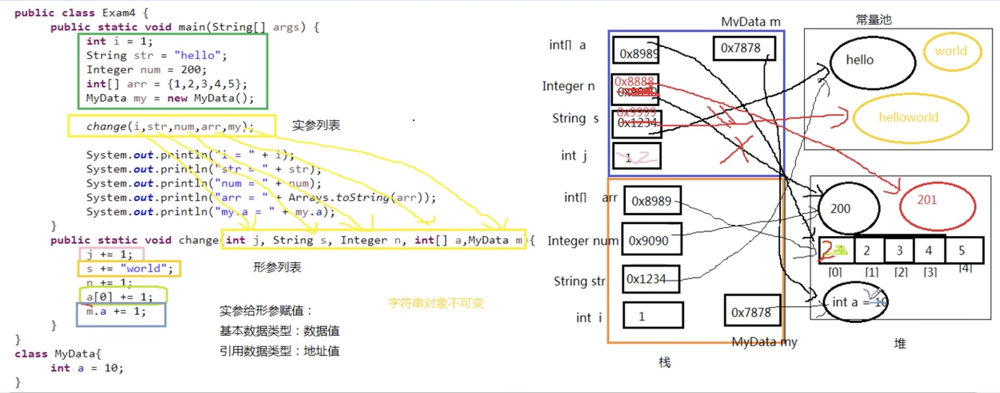

# 方法的参数伎递机制

1. 形参是基本数据类型
   - 传递数据值
2. 实参是引用数据类型

   - 传递地址值
   - 特殊的类型: String、包装类等对象不可变性

   > 包装类对象的定义：Java 设计中一个核心的原则，即万物皆对象，也就是说一切要求用对象的形式描述，但是基本数据类型不是对象，这就很矛盾了，为了解决这个矛盾，采用 把基本数据类型包装成一个对象，以面向对象的思想去使用这些类型。
