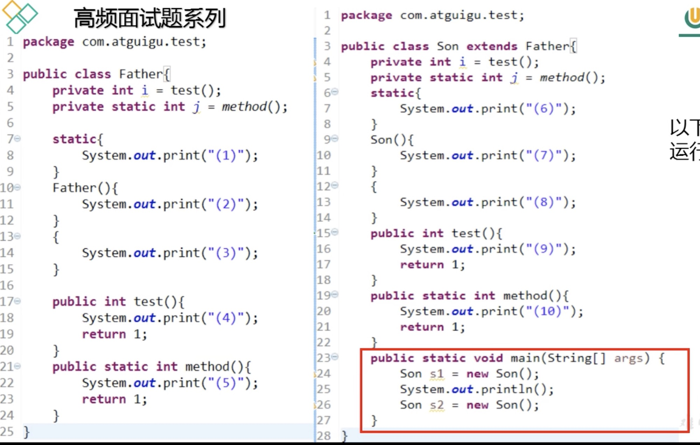

# 类初始化和实例初始化



**输出结果**

```
(5)(1)(10)(6)(9)(3)(2)(9)(8)(7)
(9)(3)(2)(9)(8)(7)
```

## 1. 类初始化过程

1. 一个类要创建实例需要先加载并初始化该类
   - main 方法所在的类需要先加载和初始化
2. 一个子类要初始化需要先初始化父类
3. 一个类的初始化就是执行<clinit>() 方法 (cl=class)
   - <clinit>()由静态变量显式赋值代码 + 静态代码块 组成
   - 类变量显式赋值代码 和 静态代码块的代码 执行顺序由上到下
   - <clinit>()只执行一次

**分析类初始化过程：**

1. 初始化子类 Son 会先初始化父类 Parent
2. 初始化父类 Parent, 执行<clinit>()：
   1. j = method();
   2. 父类的静态代码块：
      static{
      System.out.print("(1)");
      }
3. 初始化子类 Son, 执行<clinit>()：
   1. j = method();
   2. 子类的静态代码块：
      static{
      System.out.print("(6)");
      }

**类初始化结果**

```
(5)(1)(10)(6)
```

## 2. 实例初始化过程

1. 实例初始化就是执行<init>()方法

   - <init>()方法可能重载有多个,有几个构造器就有几个<init>()方法
   - <init>()方法由 非静态实例变量显示赋值代码 + 非静态代码块 + 对应构造器代码组成
   - 非静态实例变量显示赋值代码 和 非静态代码块代码从上到下顺序执行,而对应构造器的代码最后执行
   - 每次创建实例对象,调用对应构造器,执行的就是对应的<init>()方法
   - <init>()方法的首行是 super() 或 super(实参列表),即对应父类的<init>()方法

**分析实例初始化过程：**

1. 子类的实例化方法
   (1) super()(最前) -->> **子类的构造器第一行写或不写都在，一定会调用父类的构造器**
   **父类的实例化在这**
   (2) i = test();
   (3) 子类的非静态代码块
   (4) 子类的无参构造(最后)

2. 父类的实例化方法:
   (1) super()(最前) -->> java.lang.Object
   (2) i = test();
   (3) 父类的非静态代码块
   (4) 父类的无参构造(最后)

**实例初始化结果**

```
(4)(3)(2)(9)(8)(7)
```

但为什么结果是

```
(9)(3)(2)(9)(8)(7)
```

这里涉及到方法的重写

## 3. Override - 方法的重写

1. 哪些方法不可以被重写
   - final 方法
   - 静态方法
   - private 等子类中不可见方法
2. 对象的多态性
   - 子类如果重写了父类的方法,通过子类对象调用的一定是子类重写过的代码
   - 非静态方法默认的调用对象是 this
   - this 对象在枸造器或者说<init>()方法中就是正在创建的对象

## 4. Override vs Overload 重写 vs 重载

1. 重写

   - 重写发生在父类和子类之间
   - 重写方法的参数，方法名，返回值必须相同
   - 被定义为 final 的方法不能被重写
   - 静态方法不能被重写
   - private 等子类中不可见的方法不能被重写
   - 子类方法不能缩小父类方法的访问权限
   - 子类方法不能抛出比父类方法更多的异常，但可以不抛出异常

2. 重载
   - 重载发生在父类、子类和同类之间
   - 重载方法的参数的 类型/数量/顺序 至少要有一个不同
   - 不能重载只有返回值不同的方法名
