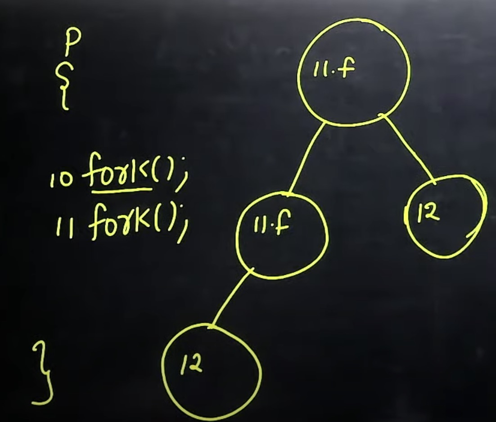

# linux 创建子进程--fork()

1. https://www.cnblogs.com/xingzc/p/5988069.html
2. https://www.cnblogs.com/jiangtongxue/p/11230915.html
3. https://www.youtube.com/watch?v=mnG-s8DlMFM

### 1. Why we need to create child process/subprocess?

1. Because for each program to run, we need a process
2. Create mutiple processes can achieve serveral program run concurrently.

### 2. what is fork() system call and how to use it?

1. fork() is used in linux to create child process / subprocess
2. fork() will return twice:
   - parent process: return the value of child process pid
   - child process: return 0
   - this two return value can be used to distinguish parent/child process by using `if` condition to check.
3. In the child process generated by fork(), it will contain all the variables, registers and program counter of its parent process. 实际上相当于创建了 parent process 的一个 copy；即在 fork()之前的 parent process 拥有的资源会被复制到新的进程中去。
4. parent process and child process will then run in parallel
5. child process will have its own PCB(process control block) and it is scheduling by kernal as parent process.
6. all code after fork() will be execute twice

### 3. how many process will be generated if we call fork() 2 times? n times?

```
p{
    fork();
    fork();
}
```



fork() n times will get 2^n process in total
