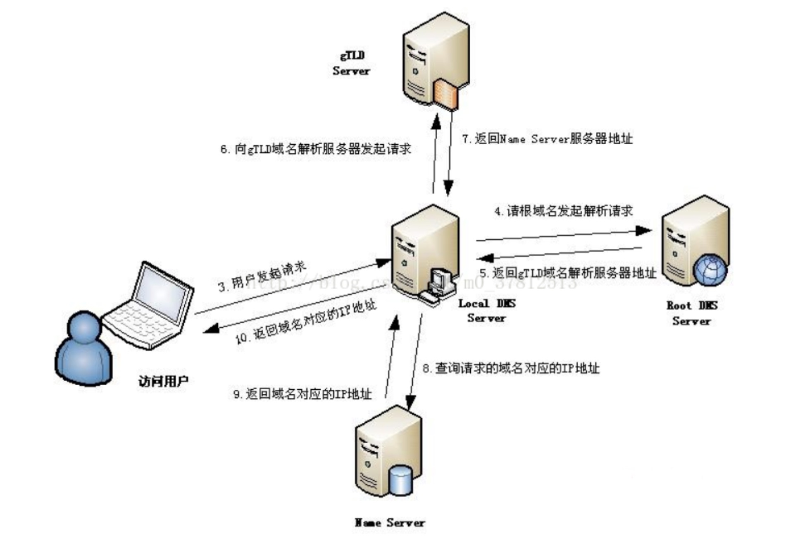

# DNS - Domain Name Service 域名服务

## 1. 什么是 DNS

DNS 是 Domain Name Service 域名服务。它作为将域名和 IP 地址相互映射的一个分布式数据库，能够使人更方便地访问互联网(ip 地址不好记，域名容易记)

## 2. DNS 域名解析过程

通过域名，最终得到该域名对应的 IP 地址的过程叫做域名解析

## 3. DNS server

1. Local DNS server 本地域名服务器

2. Root DNS servers 根域名服务器

全世界有多少根 DNS？ -->> 13 个，其中 10 个在美国，英国和瑞典各 1 个，日本 1 个。

3. Top-level domain (TLD) servers. 顶级域名服务器
   **如.com .cn .ca .org .edu**

4. Authoritative DNS servers 权威域名服务器
   权威服务器可能会给几个下一级的权威服务器的地址，然后去找到这个域名的 name server 才能找到对应的 ip 地址

## 常见面试题

### 1.浏览器中输入 URL 到返回页面的全过程?

当一个用户在地址栏输入www.taobao.com时，DNS解析有大致十个过程，如下：

1、浏览器先检查自身缓存中有没有被解析过的这个域名对应的 ip 地址，如果有，解析结束。同时域名被缓存的时间也可通过 TTL(Time-to-live) 属性来设置。

2、如果浏览器缓存中没有（专业点叫还没命中），浏览器会检查操作系统缓存中有没有对应的已解析过的结果。而操作系统也有一个域名解析的过程。在 windows 中可通过 c 盘里一个叫 hosts 的文件来设置，如果你在这里指定了一个域名对应的 ip 地址，那浏览器会首先使用这个 ip 地址。

但是这种操作系统级别的域名解析规程也被很多黑客利用，通过修改你的 hosts 文件里的内容把特定的域名解析到他指定的 ip 地址上，造成所谓的域名劫持。所以在 windows7 中将 hosts 文件设置成了 readonly，防止被恶意篡改。

3、如果至此还没有命中域名，才会真正的请求本地域名服务器（LDNS）来解析这个域名，这台服务器一般在你的城市的某个角落，距离你不会很远，并且这台服务器的性能都很好，一般都会缓存域名解析结果，大约 80%的域名解析到这里就完成了。

4、如果 LDNS 仍然没有命中，就直接跳到 Root DNS Server 域名服务器请求解析

5、Root DNS Server 根域名服务器返回给 LDNS 一个所查询域(**如.com .cn .org .edu**)的 Top-level domain (TLD) servers 顶级域名服务器地址

6、此时 LDNS 再发送请求给上一步返回的 gTLD

7、接受请求的 gTLD 查找并返回这个域名对应的 Name Server 的地址，这个 Name Server 就是网站注册的域名服务器

8、Name Server 根据映射关系表找到目标 ip，返回给 LDNS

9、LDNS 缓存这个域名和对应的 ip

10、LDNS 把解析的结果返回给用户，用户根据 TTL 值缓存到本地系统缓存中，域名解析过程至此结束

## 参考

- dns 面试题：https://baijiahao.baidu.com/s?id=1667934625842583593&wfr=spider&for=pc
