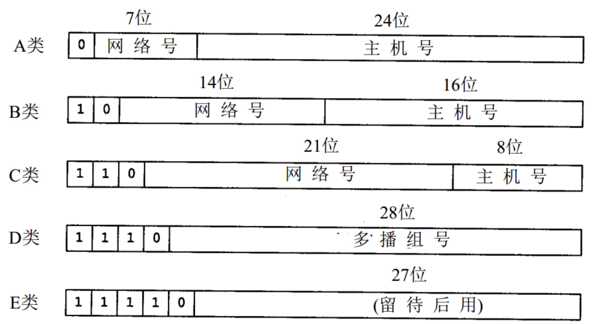
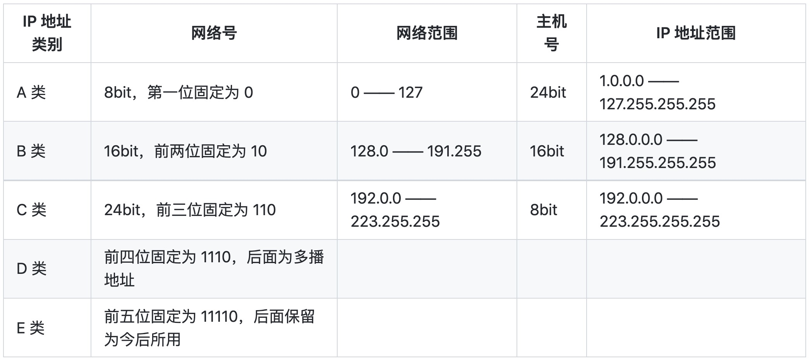

# Network Layer

The transport layer provides various forms of process-to-process communication by relying on the network layer’s **host-to-host** communication service.

1. The data plane is the part of the network that actually forwards the data/packets.
2. The control plane is the part of the network that decides how to route and forward packets to a different location.

# Data Plane

## 4.1 Overview of Network Layer

## 4.2 What’s Inside a Router?

## 4.3 The Internet Protocol (IP): IPv4, Addressing, IPv6

### 4.3.1 IPv4

1. what is IP address

An IP address is a unique address that identifies a device on the internet or a local network. IP stands for "Internet Protocol," which is the set of rules governing the format of data sent via the internet or local network.

2. what is IPv4 address

Each IP address is 32 bits long (equivalently, 4 bytes), and there are thus a total of 2^32 (or approximately 4 billion) possible IP addresses. These addresses are typically written in dotted-decimal notation, in which each byte of the address is written in its decimal form and is separated by a period (dot) from other bytes in the address. e.g: 127.255.255.255

3. What are the different classes of IPv4?

 4. IPv4 Datagram Format

### IPv4 Datagram Fragmentation

### IPv4 Addressing

### what is NAT

Network Address Translation (NAT)

### IPv6

## 4.4 Generalized Forwarding and SDN

### 4.4.1 Match

### 4.4.2 Action

### 4.4.3 OpenFlow Examples of Match-plus-action in Action

# Control Plane
