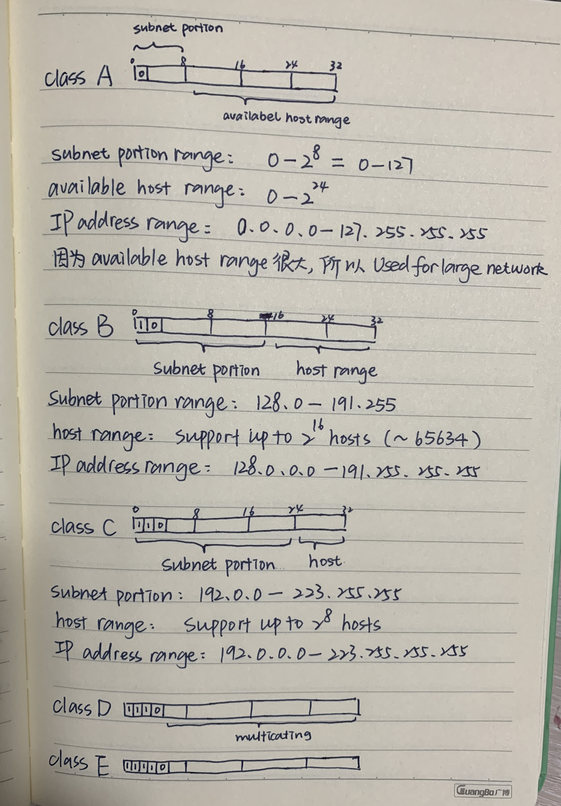
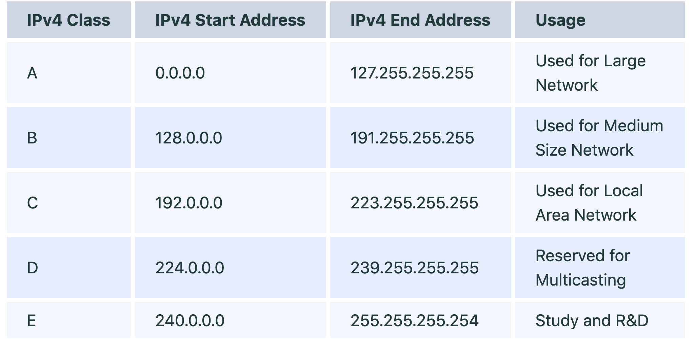
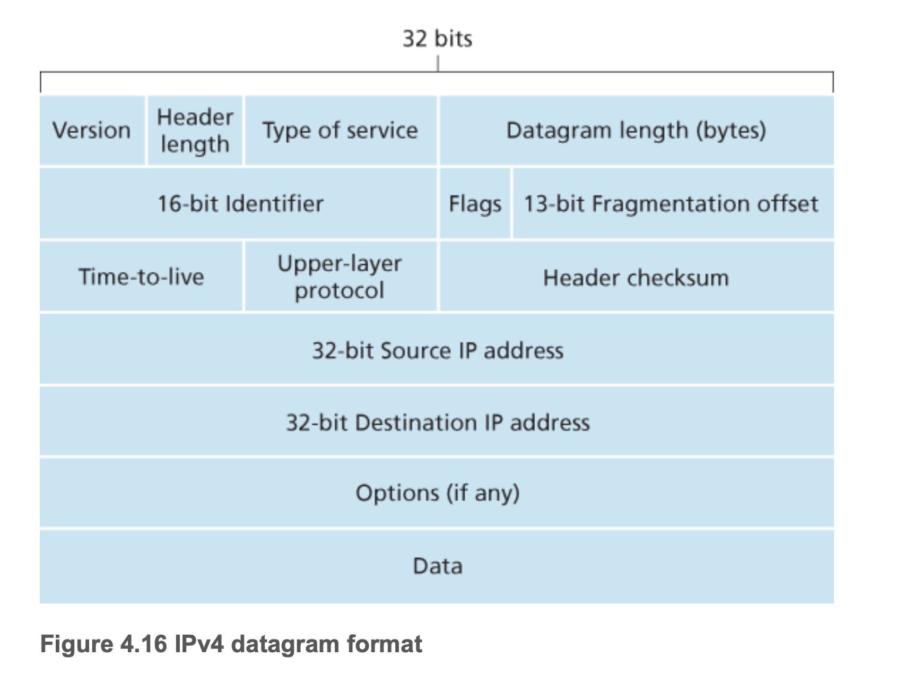

# Network Layer

The transport layer provides various forms of process-to-process communication by relying on the network layer’s **host-to-host** communication service.

1. The data plane is the part of the network that actually forwards the data/packets.
2. The control plane is the part of the network that decides how to route and forward packets to a different location.

# Data Plane

## 1. IPv4

1. what is IP address

An IP address is a unique address that identifies a device on the internet or a local network. IP stands for "Internet Protocol," which is the set of rules governing the format of data sent via the internet or local network.

2. what is private IP address

   Private IP address are ip address that are not valid for use on the internet. If you want to access internet on these private IPs, you must have to use proxy server or NAT server.

   - classA: 10.0.0.0 - 10.255.255.255
   - classB: 172.16.0.0 - 172.31.255.255
   - classC: 192.168.0.0 - 192.168.255.255

3. what is public IP address

   A public IP address is an address taken by the Internet Service Provider which facilitates(促进) you to communication on the internet.

4. special IP address

   Special Address is range from 127.0.0.1 to 127.255.255.255 are network testing addresses also known as **loopback addresses**. It is reserved for loopback or localhost connections.

   > These networks are usually reserved for the biggest customers or some of the original members of the Internet. To identify any connection issue, the initial step is to ping the server and check if it is responding.

   > If there is no response from the server then there are various causes like the network is down or the cable needs to be replaced or the network card is not in good condition. 127.0.0.1 is a loopback connection on the Network Interface Card (NIC) and if you are able to ping this server successfully, then it means that the hardware is in a good shape and condition.

   > 127.0.0.1 and localhost are the same things in most of the computer network functioning.

5. what is IPv4 address

Each IP address is 32 bits long (equivalently, 4 bytes), and there are thus a total of 2^32 (or approximately 4 billion) possible IP addresses. These addresses are typically written in dotted-decimal notation, in which each byte of the address is written in its decimal form and is separated by a period (dot) from other bytes in the address. e.g: 127.255.255.255

### 1.1 IPv4 Addressing

1. what is subnet
   A subnet is a logical subdivision of an IP network. e.g. consist of a few host inerface and a router interface interconnected in a Ethernet LAN forms a subnet.

2. what is subnet mask

   A Subnet mask is a 32-bit number that masks an IP address, and divides the IP address into network address and host address. Subnet Mask is made by setting network bits to all "1"s and setting host bits to all "0"s. Within a given network, two host addresses are reserved for special purpose, and cannot be assigned to hosts. The "0" address is assigned a network address and "255" is assigned to a broadcast address, and they cannot be assigned to hosts.

| Address Class | No of Network Bits | No of Host Bits | Subnet mask     | CIDR notation |
| ------------- | ------------------ | --------------- | --------------- | ------------- |
| A             | 8                  | 24              | 255.0.0.0       | /8            |
| A             | 9                  | 23              | 255.128.0.0     | /9            |
| A             | 12                 | 20              | 255.240.0.0     | /12           |
| A             | 14                 | 18              | 255.252.0.0     | /14           |
| B             | 16                 | 16              | 255.255.0.0     | /16           |
| B             | 17                 | 15              | 255.255.128.0   | /17           |
| B             | 20                 | 12              | 255.255.240.0   | /20           |
| B             | 22                 | 10              | 255.255.252.0   | /22           |
| C             | 24                 | 8               | 255.255.255.0   | /24           |
| C             | 25                 | 7               | 255.255.255.128 | /25           |
| C             | 28                 | 4               | 255.255.255.240 | /28           |
| C             | 30                 | 2               | 255.255.255.252 | /30           |

#### 1. classful addressing

1. What are the different classes of IPv4?

IPv4 classes are differentiated based on the number of hosts it supports on the network. The types of IPv4 classes and are based on the network/subnet portions of an IP address, which were constrained to be 8, 16, or 24 bits in length.

- class A support large size network
- class b support medium size network
- class c support small size network

#### 2. CIDR (pronounced cider) - Classless Interdomain Routing

The Internet’s address assignment strategy is known as **CIDR** (pronounced cider). CIDR generalizes the notion of subnet addressing.

With subnet addressing, the 32-bit IP address is divided into two parts and has the dotted-decimal form **a.b.c.d/x**, where x indicates the number of bits for the network portion of the address.

1. **x** referred to as the **prefix (or network prefix)** of the address, The IP addresses of devices within the organization will share the common prefix.
   在 datagram 被 forward within the organization 之前，only the leading x bits of the address need to be considered.

2. The remain **32 - x** part refer to different hosts/devices

3. 比 classful addressing 更多 possible of x（x 不用只能等于 8，16，24）

### 1.2 IPv4 Datagram Format

1. **TTL (time-to-live)**
   is included to ensure that datagrams do not circulate forever (due to, for example, a long-lived routing loop) in the network. This field is decremented by one each time the datagram is processed by a router. If the TTL field reaches 0, a router must drop that datagram.

### 1.3 IPv4 Datagram Fragmentation

### what is NAT

Network Address Translation (NAT)

### IPv6

# Control Plane
