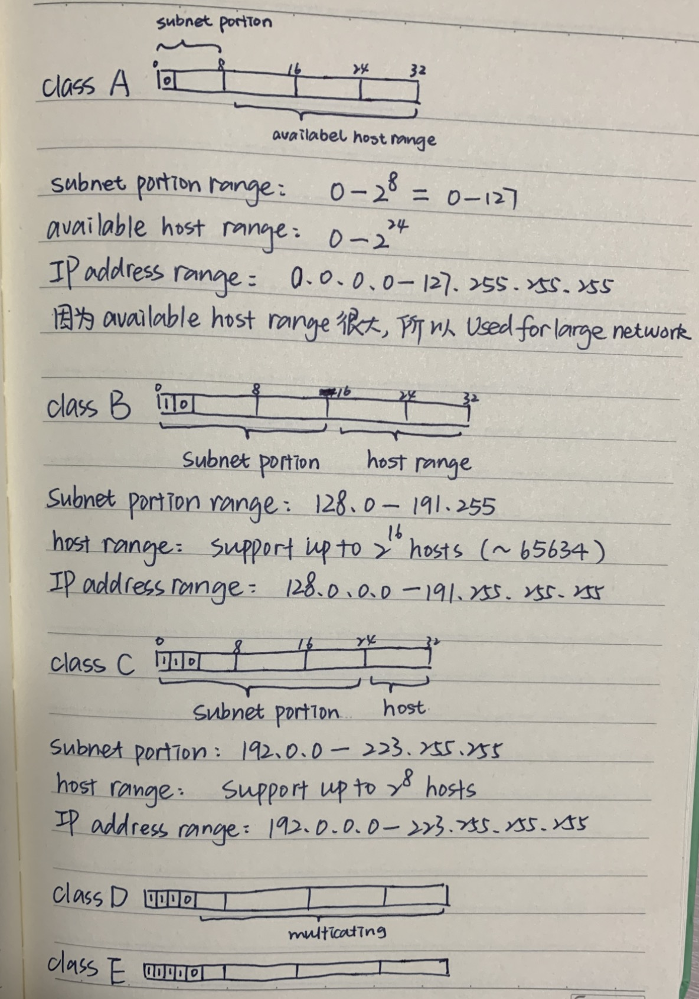

# Network Layer - Data Plane

The transport layer provides various forms of process-to-process communication by relying on the network layer’s **host-to-host** communication service.

1. The data plane is the part of the network that actually forwards the data/packets.
2. The control plane is the part of the network that decides how to route and forward packets to a different location.

## 1. IP

1. what is IP address

An IP address is a unique address that identifies a device on the internet or a local network. IP stands for "Internet Protocol," which is the set of rules governing the format of data sent via the internet or local network.

2. what is private IP address

Private IP address are ip address that are not valid for use on the internet (you can not access over internet). It is used between LAN and assigned by LAN administrator. This private ip address is not regonized over internet. It is unique only in LAN.

- classA: 10.0.0.0 - 10.255.255.255
- classB: 172.16.0.0 - 172.31.255.255
- classC: 192.168.0.0 - 192.168.255.255

3. what is public IP address

   A public IP address is regonized over the internet and is assigned by Internet Service Provider

- class A-E

4. special IP address

   Special Address is range from 127.0.0.1 to 127.255.255.255 are network testing addresses also known as **loopback addresses**. It is reserved for loopback or localhost connections.

   > These networks are usually reserved for the biggest customers or some of the original members of the Internet. To identify any connection issue, the initial step is to ping the server and check if it is responding.

   > If there is no response from the server then there are various causes like the network is down or the cable needs to be replaced or the network card is not in good condition. 127.0.0.1 is a loopback connection on the Network Interface Card (NIC) and if you are able to ping this server successfully, then it means that the hardware is in a good shape and condition.

   > 127.0.0.1 and localhost are the same things in most of the computer network functioning.

5. what is IPv4 address

For IPv4, each IP address is 32 bits long (equivalently, 4 bytes), and there are thus a total of 2^32 (or approximately 4 billion) possible IP addresses. These addresses are typically written in **dotted-decimal notation**, in which each byte of the address is written in its decimal form and is separated by a period (dot) from other bytes in the address. e.g: 127.255.255.255

### 1.1 IPv4 Addressing

1. what is subnet
   A subnet is a logical subdivision of an IP network. e.g. consist of a few host inerface and a router interface interconnected in a Ethernet LAN forms a subnet.

2. what is subnet mask (network mask/subnet block)

   A Subnet mask is a 32-bit number that masks an IP address divides the IP address into network address and host address. Subnet Mask is made by setting network bits to all "1"s and setting host bits to all "0"s. Within a given network, two host addresses are reserved for special purpose, and cannot be assigned to hosts. The "0" address is assigned a network address and "255" is assigned to a broadcast address, and they cannot be assigned to hosts.

| Address Class | No of Network Bits | No of Host Bits | Subnet mask     | CIDR notation |
| ------------- | ------------------ | --------------- | --------------- | ------------- |
| A             | 8                  | 24              | 255.0.0.0       | /8            |
| A             | 9                  | 23              | 255.128.0.0     | /9            |
| A             | 12                 | 20              | 255.240.0.0     | /12           |
| A             | 14                 | 18              | 255.252.0.0     | /14           |
| B             | 16                 | 16              | 255.255.0.0     | /16           |
| B             | 17                 | 15              | 255.255.128.0   | /17           |
| B             | 20                 | 12              | 255.255.240.0   | /20           |
| B             | 22                 | 10              | 255.255.252.0   | /22           |
| C             | 24                 | 8               | 255.255.255.0   | /24           |
| C             | 25                 | 7               | 255.255.255.128 | /25           |
| C             | 28                 | 4               | 255.255.255.240 | /28           |
| C             | 30                 | 2               | 255.255.255.252 | /30           |

#### 1. classful addressing

1. What are the different classes of IPv4?

IPv4 classes are differentiated based on the number of hosts it supports on the network. The types of IPv4 classes and are based on the network/subnet portions of an IP address, which were constrained to be 8, 16, or 24 bits in length.

- class A support **16,581,375** large size network
- class B support **65,536** medium size network
- class c support **256** small size network

#### 2. CIDR (pronounced cider) - Classless Interdomain Routing

The Internet’s address assignment strategy is known as **CIDR** (pronounced cider). CIDR generalizes the notion of subnet addressing.

With subnet addressing, the 32-bit IP address is divided into two parts and has the dotted-decimal form **a.b.c.d/x**, where x indicates the number of bits for the network portion of the address.

1. **x** referred to as the **prefix (or network prefix)** of the address, The IP addresses of devices within the organization will share the common prefix.
   在 datagram 被 forward within the organization 之前，only the leading x bits of the address need to be considered.

2. The remain **32 - x** part refer to different hosts/devices

3. 比 classful addressing 更多 possible of x（x 不用只能等于 8，16，24）

参考：https://www.google.com/search?q=what+is+cidr+in+networking&sxsrf=AOaemvIvUZ9H6wxzOqPdJ8i0KclP6O594A%3A1642569228764&ei=DJ7nYcmaLpapoASFzp3wAQ&oq=what+is+cidr&gs_lcp=Cgdnd3Mtd2l6EAMYATIFCAAQkQIyBQgAEIAEMgUIABCABDIFCAAQgAQyBQgAEIAEMgUIABCABDIFCAAQgAQyBQgAEIAEMgUIABCABDIFCAAQgAQ6BAgjECc6BAgAEENKBAhBGABKBAhGGABQAFipEGClIGgBcAJ4AYAB0AKIAe0QkgEIMC4xMC4yLjGYAQCgAQHAAQE&sclient=gws-wiz

#### 3. obtain a block of address

contact ISP to see if it is already allocated

#### 4. How to obtain a host address?/ How to obtain IP address with newly arrived device) - DHCP (Dynamic Host Configuration Protocol)

1. What is DHCP? How does it works?

   It stands for Dynamic Host Configuration Protocol, and **allocates IP addresses, subnet masks, address of default gateways(also known as first-hop router) and local DNS server**. For a newly arriving host, the DHCP protocol is a **four-step** process (DHCP 一共有四步但只有最后两步是必须的):

   1. **DHCP DISCOVER**: A host upon entering a network, broadcasts a message in search of a DHCP server(we assume DHCP server is inside router)
   2. **DHCP OFFER**: An offer message is sent back by the DHCP server as a packet containing lease time, subnet mask, IP addresses, etc.
   3. **DHCP REQUEST**: Depending on which offer accepted, the client sends back a reply broadcast letting all DHCP servers know
   4. **DHCP ACK**: Server sends an acknowledgment (DHCP ACK)

   Once the client receives the DHCP ACK, the interaction is complete and the client can use the DHCP-allocated IP address for the lease duration.

2. Can you have two DHCP servers in the same network? How it works?

   Yes, but each of them should have different scope of IP address.

### 1.2 IPv4 Datagram Format

1. **TTL (time-to-live)**
   is included to ensure that datagrams do not circulate forever (due to, for example, a long-lived routing loop) in the network. This field is decremented by one each time the datagram is processed by a router. If the TTL field reaches 0, a router must drop that datagram.

### 1.3 IPv4 Datagram Fragmentation

1. Not all link-layer protocols can carry network-layer datagram of the same size. The maximum amount of data that a link-layer frame can carry is called the **maximum transmission unit (MTU)**

2. IP datagram is encapsulated within the link-layer frame for transport from one router to the next router. MTU of link-layer protocol place a hard limit on the length of datagram.

3. A router may interconnect(互相连接) several links each have different link-layer protocol. In this case, we need to used fragmentation to fragment the payload in the IP datagram into two or more smaller IP datagrams. 然后 reassemble before fragments reach to the destination transport layer.

4. each fragment stamp with src ip address + dest ip address + identification

### 1.4 NAT - Network Address Translation

1. origin: IP address only have 32 bits which is not enough for all the host in the Internet to use. NAT enable router resolve this problem.

2. what is NAT?

Nat stand for Network Address Translation (NAT), is a process that enables one, unique public IP address to represent an entire group of Private IP address.

NAT-enable router translate public IP address, port number and seesionID into private IP address and port number, vice versa.

We know that to access the Internet, one public IP address is needed, but public IP address is limit and NAT allows to use a private IP address in our private network to access the Internet through a single public address. NAT’s main purpose is to conserve the number of public IP addresses in use.

3. how does NAT works?

The NAT router has one interface in the local (inside) network and one interface in the global (outside) network. When a packet traverse outside the local (inside) network, then NAT converts that local (private) IP address to a global (public) IP address. When a packet enters the local network, the global (public) IP address is converted to a local (private) IP address.

4. why mask port number?

To differenciate two different host in the private network to request the same destination int global network on the same port.

### 1.5 IPv6

#### 1. ipv6 datagram format

1. version number
2. traffic class: The 8-bit traffic class field, like the TOS field in IPv4, can be used to give priority to certain datagrams
3. flow label: this 20-bit field is used to identify a flow of datagrams
4. payload length: This 16-bit value is treated as an unsigned integer giving the number of bytes in the IPv6 datagram following the fixed-length, **40-byte datagram header**
5. Next header: This field identifies the protocol, same values as the upper-layer protocol field in the ipv4.
6. Hop limit: same as TTL in ipv4

#### 2. ipv6 vs ipv4

1. ipv6 does not allow fragmentation & reassembly
2. ipv6 address is 128bits length
3. ipv6 does not support header checksum
4. ipv6 using unicast/multicast/anycast addressing

#### 3. Transitioning from IPv4 to IPv6

encapsulate ipv6 datagram into ipv4 datagram

## 2. Overview of Network Layer

### 1. Forwarding

### 2. Routing
