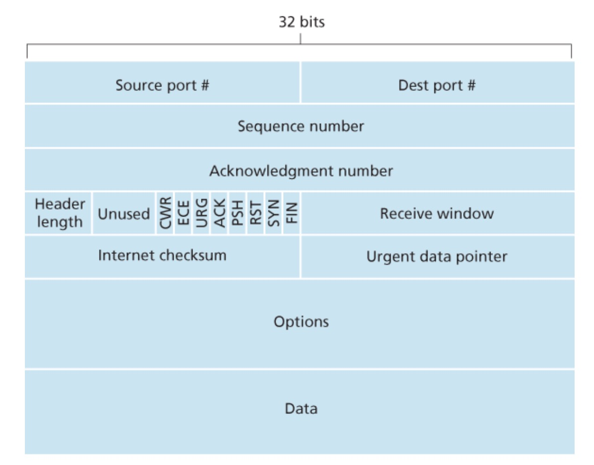
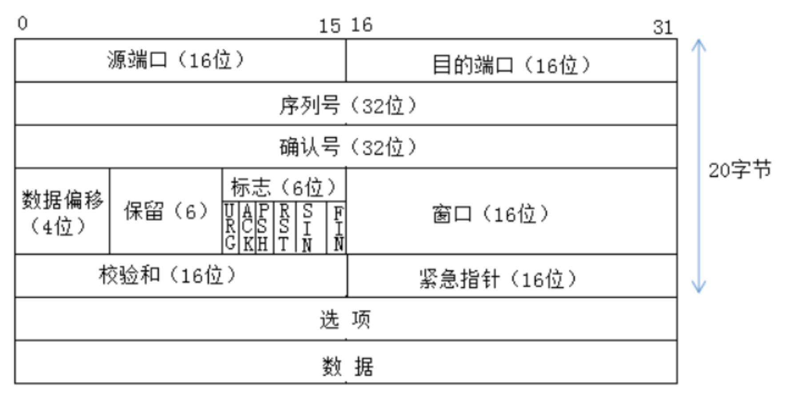
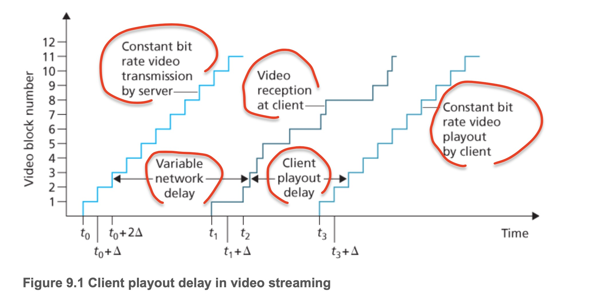

# Transport LayerTCP (Transmission Control Protocol) VS UDP (User Datagram Protocol)

## Transport Layer

### 1. multiplexing

The job of gathering data chunks at the source host from different sockets, encapsulating each data chunk with header information (that will later be used in demultiplexing) to create segments, and passing the segments to the network layer is called multiplexing.

multiplexing requires

- each sockets have unique identifiers - **port number**
- each segment have special fields that indicate the socket to which the segment is to be delivered.

1. port number is 16 bits, 0~1023 is for well-know application protocols.

### 2. demultiplexing

This job of delivering the data in a transport-layer segment to the correct socket is called demultiplexing

## TCP (Transmission Control Protocol)

### 1. TCP segment structure 报文结构




### 2. TCP Reliable Transfer

TCP is reliable and connetion-oriented protocol, which ensures that data is delivered from sending process to receiving process, correctly and in order.

1. **reliable Transfer** = seq + ack + timer + checksum

   - 接收方收到报文就会确认，发送方发送一段时间后没有收到确认就超时重传，这个是依赖序号和确认号实现的。
   - data integrity：**checksum** 校验和

2. **connection-oriented**：three-way handshake / four-way handshake

3. **flow control 流量控制**
   TCP will ensure that a sender is not overwhelming a receiver by sending packets faster than it can consume.

   TCP uses a **sliding window protocol** to control the number of bytes in flight it can have. In other words, the number of bytes that were sent but not yet ACKed.

   - sender buffer: 可以发送但还没发送的
   - receiver buffer: 已发送但还没 ACK 确认 的

   **When Receiver send back ACK segment, it will contain its available Receive window size in the header of the TCP segment**

   - when receiver finds out its buffer is almost full, it will set a smaller receive window size to notice sender to slow down the sending speed.
   - when receiver window is full, receiver will set the available win = 0

4. **congestion control 拥塞控制**
   TCP will ensure that not too many sources sending too much data too fast for **network** to handle
   通过 congestion window 机制，**slow start + AIMD**

   1. set cwnd = 1 (congestion window)
   2. slow start until hit the ssthreshold(slow start threshold)
   3. additive increas to avoid congestion
   4. multiplicative decrease

   - timeout: set cwnd to 1 (congestion possibility is high)
   - 3 times ACK: set cwnd to 1/2 (congestion possibility is less)

   **When sender timer timeout or received 3 duplicated ACK, it means there is packet lost**

### 3. 流量控制 vs 拥塞控制

看：

1. https://blog.csdn.net/dangzhangjing97/article/details/81008836)
2. https://www.brianstorti.com/tcp-flow-control/
3. https://www.geeksforgeeks.org/tcp-congestion-control/ -->> https://www.youtube.com/watch?v=cPLDaypKQkU
4. https://www.youtube.com/watch?v=4l2_BCr-bhw

### 4. 三次握手四次挥手

看：

1. https://blog.csdn.net/qq_38950316/article/details/81087809
2. https://www.youtube.com/watch?v=xMtP5ZB3wSk

### 5. TCP sticking/unpacking 粘包，拆包及解决方法

#### 5.1 TCP does not preserves message boundaries 无边界保护

看：
https://programmer.ink/think/tcp-packet-sticking-unpacking.html

我们都知道，TCP 协议是面向流的。**面向流是指无保护消息边界的**，如果发送端连续发送数据，接收端有可能在一次接收动作中会接收两个或者更多的数据包。

那什么是保护消息边界呢？就是指传输协议把数据当做一条独立的消息在网上传输，接收端只能接收独立的消息。也就是说存在保护消息边界，接收端一次只能接收发送端发出的一个数据包。

举个例子来说，连续发送三个数据包，大小分别是 1k，2k，4k，这三个数据包都已经到达了接收端的缓冲区中，如果使用 UDP 协议，不管我们使用多大的接收缓冲区去接收数据，则必须有三次接收动作，才能把所有数据包接受完。而使用 TCP 协议，只要把接收数据的缓冲区大小设置在 7kb 以上，就能够一次把所有的数据包接收下来，即只需要有一次接收动作。

这样问题就来了，由于 TCP 协议是流传输的，它把数据当作一串数据流，所以他不知道消息的边界(message boundaries)，即独立的消息之间是如何被分隔开的。这便会造成消息的混淆，也就是说不能够保证一个 Send 方法发出的数据被一个 Recive 方法读取。Recive 方法是从系统缓冲区上读取数据的，所以只要数据缓冲区的容量足够大，该方法不单单接收第一个包的数据，可能是所有的数据。

例如，有两台网络上的计算机，客户机发送的消息是：第一次发送 abcde，第二次发送 12345，服务器方接收到的可能是 abcde12345（粘包），即一次性收完；也可能是第一次接收到 abc，第二次接收到 de123，第三次接收到 45.（拆包）

**注意 tcp 是不会丢包和失序的。**

#### 5.2 粘包、拆包表现形式

现在假设客户端向服务端连续发送了两个数据包，用 msg1 和 msg2 来表示，那么服务端收到的数据可以分为三种，现列举如下

1、正常情况

服务器一共读取到两个数据包，第一个数据包包含客户端发出的第一条消息的完整信息，第二个包包含客户端发送的第二条完整的数据消息，这种情况属于正常情况，服务器只需要简单的从网络缓冲区去读就好了，第一次读到第一条消息的完整信息，消费完再从网络缓冲区将第二条完整的消息读出来进行消费。


2、粘包

接收端只收到一个数据包，由于 TCP 是不会出现丢包的，所以这一个数据包中包含了发送端发送的两个数据包的信息，这种现象即为粘包。这种情况由于接收端不知道这两个数据包的界限，所以对于接收端来说很难处理。


3、拆包

接收端收到了两个数据包，但是这两个数据包要么是不完整的，要么就是多出来一块，这种情况即发生了拆包和粘包。这两种情况如果不加特殊处理，对于接收端同样是不好处理的。


#### 5.3 发生粘包、拆包的原因

发生 TCP 粘包、拆包主要是由于下面一些原因：

1. 应用程序写入的数据大小大于 tcp socket 套接字缓冲区大小，这将会发生拆包。比如一次要发送 1500B 的数据，缓冲区大小为 1024B，就要拆包了
2. 进行 MSS（最大报文长度）大小的 TCP 分段，当 TCP 报文长度-TCP 头部长度>MSS 的时候将发生拆包。
3. 应用程序写入数据小于套接字缓冲区大小，网卡将应用多次写入的数据发送到网络上，这将会发生粘包。比如一次要发送 50B 的数据，要发 10 次，缓冲区大小为 1024B，就要粘包了
4. 接收方法不及时读取套接字缓冲区数据，这将发生粘包。

最多的是以上四种情况，2 种情况粘包、2 种情况拆包

#### 5.4 粘包、拆包解决办法

**TCP 本身是面向流(binary stream)的**，作为网络服务器，如何从这源源不断涌来的数据流中拆分出或者合并出有意义的信息呢？通常会有以下一些常用的方法：

1、发送端给每个数据包添加包首部，首部中应该至少包含数据包的长度，这样接收端在接收到数据后，通过读取包首部的长度字段，便知道每一个数据包的实际长度了。

2、发送端将每个数据包封装为固定长度（不够的可以通过补 0 填充），这样接收端每次从接收缓冲区中读取固定长度的数据就自然而然的把每个数据包拆分开来。

3、可以在数据包之间设置边界，如添加特殊符号，这样，接收端通过这个边界就可以将不同的数据包拆分开。

### 6. 延迟应答 & 捎带应答

1. 延迟应答
   接收方收到数据之后可以并不立即返回确认应答，而是延迟一段时间的机制。
2. 捎带应答
   TCP 包中既发送数据又发送确认应答的一种机制

## UDP (User Datagram Protocol)

### 1. udp 的特点 & segment structure 报文结构


1. udp is connectionless, unreliable transfer. It do its best effort to transfer packet. tcp 是 connection-oriented 的，reliable transfer。
2. udp header lenth is only 8 byte，tcp 有 20byte
3. UDP 连接没有 TCP 的三次握手、确认应答、超时重发、流量控制、拥塞控制等机制，而且 UDP 是一个无状态的传输协议，所以它在传递数据时非常快。
4. udp 面向报文，tcp 面向字节流，所以 udp 不会有拆包粘包的问题
5. udp 支持一对一、一对多、多对一和多对多的交互通信 half-duplex。tcp 是点对点的传输层协议

### 2.为什么 UDP 不可靠

UDP 是面向数据报、无连接的，数据报发出去，就不保留数据备份了。 仅仅在 IP 数据报头部加入校验和复用。 UDP 没有服务器和客户端的概念。 UDP 报文过长的话是交给 IP 切成小段，如果某段报废报文就废了。

## 常见面试题

### 1. 为什么连接的时候是三次握手，关闭的时候却是四次握手？

因为当 Server 端收到 Client 端的 SYN 连接请求报文后，可以直接发送 SYN+ACK 报文。其中 ACK 报文是用来应答的，SYN 报文是用来同步的。但是关闭连接时，当 Server 端收到 FIN 报文时，很可能并不会立即关闭 SOCKET，所以只能先回复一个 ACK 报文，告诉 Client 端，"你发的 FIN 报文我收到了"。只有等到我 Server 端所有的报文都发送完了，我才能发送 FIN 报文，因此不能一起发送。故需要四步握手。

### 2. 为什么 TIME_WAIT 状态需要经过 2MSL(maxium segment lifetime)才能返回到 CLOSE 状态？

防止最后一个 ACK 丢失

在 Client 发送出最后的 ACK 回复，但该 ACK 可能丢失。Server 如果没有收到 ACK，将不断重复发送 FIN 片段。所以 Client 不能立即关闭，它必须确认 Server 接收到了该 ACK。Client 会在发送出 ACK 之后进入到 TIME\*WAIT 状态。Client 会设置一个计时器，等待 2MSL 的时间。如果在该时间内再次收到 FIN，那么 Client 会重发 ACK 并再次等待 2MSL。所谓的 2MSL 是两倍的 MSL(Maximum Segment Lifetime)。MSL 指一个片段在网络中最大的存活时间，2MSL 就是一个发送和一个回复所需的最大时间。如果直到 2MSL，Client 都没有再次收到 FIN，那么 Client 推断 ACK 已经被成功接收，则结束 TCP 连接。

### 3. 为什么不能用 2 次握手进行连接？

3 次握手完成两个重要的功能:

1. 双方做好发送数据的准备工作(双方都知道彼此已准备好)
2. 双方就初始序列号进行协商，这个序列号在握手过程中被发送和确认

如果 3 次握手改成 2 次握手，可能发生死锁：考虑计算机 S 和 C 之间的通信假定

1. C 给 S 发送一个连接请求分组 SYN=1，S 收到了这个分组，并发送了确认应答分组 ACK=1。
2. 按照两次握手的协定，S 认为连接已经成功地建立了，可以开始发送数据分组。
3. 如果此时 S 的确认应答 ACK=1 丢失，C 将不知道 S 是否已准备好，不知道 S 建立什么样的序列号，C 甚至怀疑 S 是否收到自己的连接请求分组。
4. 在这种情况下，C 认为连接还未建立成功，将忽略 S 发来的任何数据分组，只等待连接确认应答分组。而 S 在发出的分组超时后，重复发送同样的分组。这样就形成了死锁。

### 4.如果已经建立了连接，但是客户端突然出现故障了怎么办?

TCP 还设有一个 **keepalive** 计时器，客户端如果出现故障，服务器不能一直等下去，白白浪费资源。服务器每收到一次客户端的请求后都会重新复位这个计时器，时间通常是设置为 2 小时，若两小时还没有收到客户端的任何数据，服务器就会发送一个探测报文段，以后每隔 75 秒钟发送一次。若一连发送 10 个探测报文仍然没反应，服务器就认为客户端出了故障，接着就关闭连接。

### 5. 什么是半连接队列(SYN queue)？

服务器第一次收到客户端的 SYN 之后，就会处于 SYN_RCVD 状态，此时双方还没有完全建立其连接，服务器会把此种状态下请求连接放在一个队列里，我们把这种队列称之为半连接队列。当然还有一个全连接队列(**Accept queue**)，就是已经完成三次握手，建立起连接的就会放在全连接队列中。如果队列满了就有可能会出现丢包现象。

#### 5.1 what is SYN flood attack

看：https://www.cloudflare.com/learning/ddos/syn-flood-ddos-attack/

SYN 攻击即利用 TCP 协议缺陷，通过发送大量的半连接请求，占用半连接队列，耗费 CPU 和内存资源。

优化方式：

1. 缩短 SYN Timeout 时间
2. 记录 IP，若连续受到某个 IP 的重复 SYN 报文，从这个 IP 地址来的包会被一概丢弃。

SYN flood attack is a type of DoS(denial of service) attack, which works sending a lots SYN segment to open TCP connection but without complete the 3-way handshake process. Leave a lots half-open connections exhausted sever resources as they are allocated (but never used!); Other clients are then denied service.

Solution: SYN cookies

When the server receives a SYN segment, it does not know if the segment is coming from a legitimate user or is part of a SYN flood attack. So, **instead of creating a half-open TCP connection for this SYN, the server creates an initial TCP sequence number that is a complicated function (hash function)** of source and destination IP addresses and port numbers of the SYN segment, as well as a secret number only known to the server. This carefully crafted initial sequence number is the so-called “cookie.” The server then sends the client a SYN_ACK packet with this special initial sequence number. Importantly, the server does not remember the cookie or any other state information corresponding to the SYN.

### 6. 网络中（服务器端）大量的 TIME_WAIT

首先 time_wait 出现在主动关闭连接的一方

1. 服务器大量的 TIME_WAIT

这种情况比较常见，一些爬虫服务器或者 WEB 服务器（如果网管在安装的时候没有做内核参数优化的话）上经常会遇到这个问题，这个问题是怎么产生的呢？

TIME_WAIT 是主动关闭连接的一方保持的状态:

- 对于爬虫服务器来说他本身就是“客户端”，在完成一个爬取任务之后，他就会发起主动关闭连接。
- 在高并发短连接的 TCP 服务器上，当服务器处理完请求后立刻主动正常关闭连接。这个场景下会出现大量 socket 处于 TIME_WAIT 状态。

解决思路很简单，就是让服务器能够快速回收和重用那些 TIME_WAIT 的资源。修改 TCP 内核参数配置文件,TIME_WAIT 的快速回收

第二个解决方案是改为长连接，显著减少连接量，但是并发量减少很多

2. 大量客户端 TIME_WAIT

大量客户端在 TIME_WAIT 的状态说明有很多请求（比如 HTTP / CC 攻击等网络攻击，有大量的请求进来)

3. 如何尽量处理 TIMEWAIT 过多?

编辑内核文件/etc/sysctl.conf，加入以下内容：

```
net.ipv4.tcp_syncookies = 1 表示开启SYN Cookies。当出现SYN等待队列溢出时，启用cookies来处理，可防范少量SYN攻击，默认为0，表示关闭；
net.ipv4.tcp_tw_reuse = 1 表示开启重用。允许将TIME-WAIT sockets重新用于新的TCP连接，默认为0，表示关闭；
net.ipv4.tcp_tw_recycle = 1 表示开启TCP连接中TIME-WAIT sockets的快速回收，默认为0，表示关闭。
net.ipv4.tcp_fin_timeout 修改系默认的 TIMEOUT 时间
```

然后执行 /sbin/sysctl -p 让参数生效.

```
/etc/sysctl.conf是一个允许改变正在运行中的Linux系统的接口，它包含一些TCP/IP堆栈和虚拟内存系统的高级选项，修改内核参数永久生效。
```

### 7. 心跳包

### 8.transport layer 有什么作用

传输层提供了进程间的逻辑通信，传输层向高层用户屏蔽了下面网络层的核心细节，使应用程序看起来像是在两个传输层实体之间有一条端到端的逻辑通信信道

1. 多路复用和分用。

   - multiplexing：当传输层从应用程序接收报文后要封装在传输层的段中再交给网络层发送。
   - demultiplexing：当传输层从网络层接收数据后，必须将数据正确递交给某个应用程序。也就是传输层曾能够区分不同进程的数据并且加以区分处理。可靠数据传输，比如传输层的 TCP 协议，提供了面向连接的，可靠的，具有拥塞控制的协议，这是为了弥补网络层不足所建立的。

2. 此外，传输层还有寻址的功能，定位应用程序在哪里。以及流量的控制，防止接收端速度太慢造成溢出和丢包的现象。流量控制和拥塞控制的区别是：流量控制只是端端之间，只需要管理两个端之间的流量传输即可，也就是局部的。但是拥塞控制是全局的，是整个网络所做的事情，需要所有的路由器主机一起努力完成的事情。在传输层，既有流量控制也有拥塞控制。

### 9. video streaming - youtube streaming using tcp or udp



1. UDP Streaming

because UDP does not employ a congestion-control mechanism, the server can push packets into the network at the consumption rate of the video without the rate-control restrictions of TCP. UDP streaming typically uses a small client-side buffer, big enough to hold less than a second of video.

Before passing the video chunks to UDP, the server will encapsulate the video chunks within transport packets specially designed for transporting audio and video, using the Real-Time Transport Protocol (RTP)

2. HTTP Streaming (over tcp)

In HTTP streaming, the video is simply stored in an HTTP server as an ordinary file with a specific URL. When a user wants to see the video, the client establishes a TCP connection with the server and issues an HTTP GET request for that URL. The server then sends the video file, within an HTTP response message, **as quickly as possible, that is, as quickly as TCP congestion control and flow control will allow.** On the client side, the bytes are collected in a client application buffer. Once the number of bytes in this buffer exceeds a predetermined threshold, the client application begins playback—specifically, it periodically grabs video frames from the client application buffer, decompresses the frames, and displays them on the user’s screen.

3. Dynamic Adaptive Streaming over HTTP (DASH)

In DASH, the video is encoded into several different versions, with each version having a different bit rate and, correspondingly, a different quality level. The client dynamically requests chunks of video segments of a few seconds in length. When the amount of available bandwidth is high, the client naturally selects chunks from a high-rate version; and when the available bandwidth is low, it naturally selects from a low-rate version. The client selects different chunks one at a time with HTTP GET request
messages
