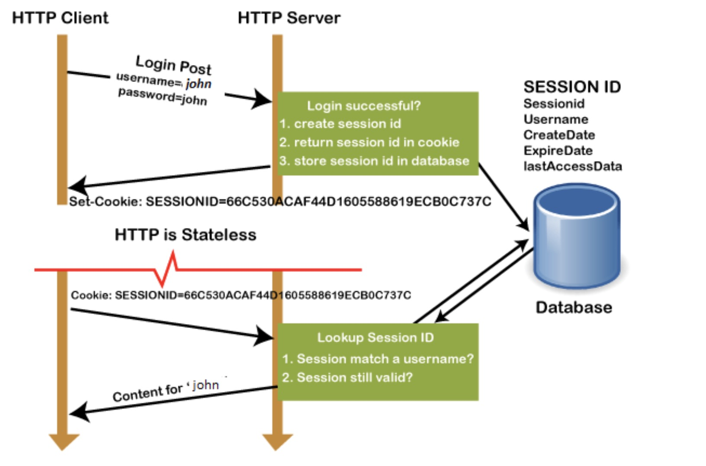
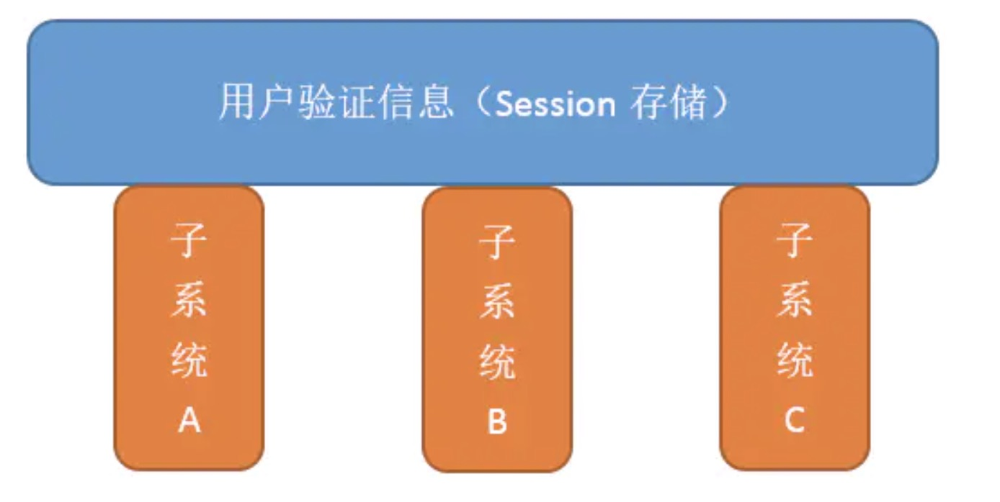
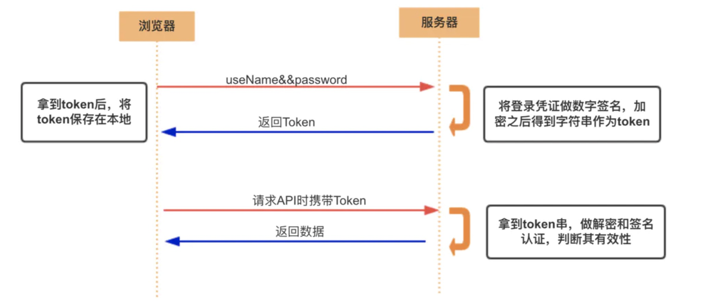

# cookie / seesion / token

## 1. 会话跟踪技术

HTTP 是无状态协议，是指 http 对于历史请求没有记忆能力，一旦数据交换完毕，客户端与服务器端的连接就会关闭，再次交换数据需要建立新的连接。这就意味着服务器无法从连接上跟踪会话。但是一些场景又需要保存信息（比如在线购物网站，需要登录的网站等等，需要会话管理。记住哪些人登录系统， 哪些人往自己的购物车中放商品），这里就衍生出来了 cookie、session、token

## 1.1 发展史

1、很久很久以前,Web 基本上就是文档的浏览而已,既然是浏览,作为服务器,不需要记录谁在某一段时间里都浏览了什么文
档,每次请求都是一个新的 HTP 协议,就是请求加响应,尤其是我不用记住是谁刚刚发了 HTTP 请求,每个请求对我来说都是全
新的。这段时间很嗨皮

2、**session**:
但是随着交互式 Web 应用的兴起,像在线购物网站,需要登录的网站等等,马上就面临一个问题,那就是要管理会话,必须记住
哪些人登录系统,哪些人往自己的购物车中放商品,也就是说我必须把每个人区分开,这就是一个不小的挑战,因为 HTTP 请求是
无状态的,所以想出的办法就是给大家发一个会话标识( session id),说白了就是一个随机的字串,每个人收到的都不ー样,每次大家
向我发起 HTTP 请求的时候,把这个字符串给一并捎过来,这样我就能区分开谁是谁了

3、**session sticky & session 复制**:

这样大家很嗨皮了,可是服务器就不嗨皮了,每个人只需要保存自己的 session id,而服务器要保存所有人的 session id!如果访 服务器多了,就得由成千上万,甚至几十万个

这对服务器说是一个巨大的开销,严重的限制了服务器扩展能力,比如说我用两个机器组成了一个集群,小 F 通过机器 A 登录了系
统,那 session id 会保存在机器 A 上,假设小 F 的下ー次请求被转发到机器 B 怎么办?机器 B 可没有小 F 的 session id 阿。
有时候会采用一点小伎俩: session sticky,就是让小 F 的请求一直粘连在机器 A 上,但是这也不管用,要是机器 A 挂掉了,还得转
到机器 B 去。

那只好做 session 的复制了,把 session id 在两个机器之间搬来搬去,快累死了。

4、 **共享 Session** - 将 Session Id 集中存储到一个地方:

后来有个叫 Memcached 的支了招:把 session id 集中存储到一个地方,所有的机器都来访问这个地方的数据,这样一来,就不用复制了,但是增加了单点失败的可能性,要是那个负责 session 的机器挂了,所有人都得重新登录一遍,估计得被人骂死

5、**token**:

于是有人就一直在思考,我为什么要保存这可恶的 session 呢,只让每个客户端去保存该多好?  
可是如果不保存这些 session id,怎么验证客户端发给我的 session id 的确是我生成的呢?

比如说,小 F 已经登录了系统,我给他发一个令片牌(token),里边包含了小 F 的 user id,下ー次小 F 再次通过 Http 请求访问我的时,把这个 token 通过 Http header 带过来不就可以了。

不过这和 session id 没有本质区别啊,任何人都可以可以伪造,所以我得想点儿办法,让别人伪造不了。
那就对数据做一个签名吧,比如说我用 HMAC-SHA256 算法,加上ー个只有我才知道的密钥,对数据做一个签名,把这个签名和
数据一起作为 token,由于密钥别人不知道,就无法伪造 token 了。

这个 token 我不保存,当小 F 把这个 token 给我发过来的时候,我再用同样的 HMAC-SHA256 算法和同样的密钥,对数据再计算一次 签名,和 token 中的签名做个比较,如果相同,我就知道小 F 已经登录过了,并且可以直接取到小 F 的 user id,如果不相同,数据部分肯定被人簒改过,我就告诉发送者:对不起,没有认证。

这样一来,我就不保存 session id 了,我只是生成 token,然后验证 token,我用我的 CPU 计算时间获取了我的 session 存储空间

## 2. Cookie

Http cookie（也叫 Web Cookie 或浏览器 Cookie）**是服务器发送到用户浏览器以 Key-Value 形式井保存在本地（可以在内存、也可以持久化在磁盘里）的文本数据，它会在浏览器下次向同一服务器再发起请求时被携带并发送到服务器上**。通常，它用于告知服务端两个请求是否来自同一浏览器，如保持用户的登录状态。Cookie 使基于无状态的 HTTP 协议记录稳定的状态信息成为了可能。

由于 cookie 是存在客户端上的，所以浏览器加入了一些限制确保 cookie 不会被恶意使用，同时不会占据太多磁盘空间。所以每个域的 cookie 数量是有限制的。

### 2.1 cookie 的作用

- **会话状态管理**（如用户登录状态、购物车、视频从上次离开位置播放、游戏分数或其它需要记录的信息）
- **个性化设置**（如用户自定义设置、主题等）
- **浏览器行为跟踪**（如跟踪分析用户行为等）

Cookie 曾一度用于客户端数据的，因当时并没有其它合适的存储办法而作为唯一的存储手段，但现在随着现代浏览器开始支持各种各样的存储方式，Cookie 渐渐被淘汰。由于服务器指定 Cookie 后，浏览器的每次请求都会携带 Cookie 会带来额外的性能开销（尤其是在移动环境下）。新的浏览器 API 已经允许开发者直接将数据存储到本地，如使用 Web storage API（本地存储和会话存储）或 IndexedDB。

**cookie 的作用过程**
首先 cookie 对于浏览器来说只是一个纯文本，浏览器的安装目录下是会有一个专门的文件夹用来保存各个网站的 cookie。当从前端发送请求到后端的时候，浏览器会自动的检测下是否有 cookie，如果有就会添加到请求的头信息中，以上是浏览器自动帮我们做的。

存储到 cookie 中的数据，浏览器会自动的放在 http 请求中，只有是每次请求都必须要发送给服务器的数据才会放到 cookie，比如身份验证信息。如果是不必要的，必然会增加网络开销。针对这个存储信息大小，cookie 还是做了一些限制的。每个域名下的 cookie 的大小最大为 4KB，每个域名下的 cookie 数量最多为 20 个（但很多浏览器厂商在具体实现时支持大于 20 个）。

cookie 的属性包括：过期时间；域名、路径等等，这些可以自己设置，如果不手动设置就会使用 cookie 的默认设置。

### 2.2 设置

1. 客户端设置

设置 cookie => cookie 被自动添加到 request header 中 => 服务端接收到 cookie

```js
document.cookie = 'name=xiaoming; age=12 '
```

客户端可以设置 cookie 的以下选项:  
expires, domain, path, secure(只有在 https 协议的网页中, 客户端设置 secure 类型 cookie 才能生效), 但无法设置 httpOnly 选项

2. 服务端设置

不管你是请求一个资源文件(如 html/js/css/图片), 还是发送一个 ajax 请求, 服务端都会返回 response.而 response header 中有一项叫`set-cookie`, 是服务端专门用来设置 cookie 的;

> ajax = Asynchronous Javascript And XML, 是一种在无需重新加载整个网页的情况下,能够更新部分网页的技术

- 一个 set-cookie 只能设置一个 cookie, 当你想设置多个, 需要添加同样多的`set-cookie`
- 服务端可以设置 cookie 的所有选项: expires, domain, path, secure, HttpOnly

当服务器收到 HTTP 请求时，服务器可以在响应首部里面添加一个 Set-Cookie 选项，浏览器收到响感后通常会保存下 Cookie，之后对该服务器毎一次请求中都通过 Cookie 请求首部将 Cookie 信息发送服务器。另外，Cookie 的过期时间、域、路径、有效期、适用站点都可以根据需要来指定。

服务器使用 set-Cookie 响应首部向用户代理（一般是浏览器）发送 Cookie 信息，告知客户端保存 Cookie 信息。一个简单的 Cookie 可能像这样：Set-Cookie：<cookie 名>=<cookie 值>


### 2.3 cookie  类型

1. 会话期 Cookie

会话期 Cookie 是最简单的 Cookie：浏览器关闭之后它会被自动删除，也就是说它仅在会话期内有效。会话期 Cookie 不需要指定过期时间（Expires）或者有效期（Max-Age）要注意的是，有些浏览器提供了会话恢复功能，这种情况下即使关闭了浏览器，会话期 Cookie 也会被保留下来，就好像浏览器从来没有关闭一样。

2. 持久性 Cookie

和关闭浏览器便失效的会话期 Cookie 不同，持久性 Cookie 可以指定一个特定的过期时间（Expires 或有效期（Max-Age）

提示：当 Cookie 的过期时间被设定时，设定的日期和时间只与客户端相关，而不是服务端

3. 第三方 Cookie

每个 Cookie 都会有与之关联的域（Domain），如果 Cookie 的域和页面的域相同，那么我们称这个 Cookie 为第一方 Cookie（first-party cookie），如果 Cookie 的域和页面的域不同，则称之为第三方 Cookie（third-party cookie.）。一个页面包含图片或存放在其他域上的资源（如图片广告）时，第一方的 Cookie 也只会发送绐设置它们的服务器。通过第三方组件发送的第三方 Cookie 主要用于广告和网络追踪。这方面可以看谷歌使用的 Cookie 类型（types of cookies used by Google）。大多数浏览器默认都允许第三方 Cookie，但是可以通过附加组件来阻止第三方 Cookie（如 EF 的 Privacy Badger）

## 3. session

session 从字面上讲，就是会话。这个就类似你和一个人交谈，你怎么知道当时和你交谈的是张三而不是李四呢？对方肯定有某种特征（长相等）表明他是张三；

session 也是类似的道理，**服务器要知道当前请求发给自己的是谁。为了做这种区分，服务器就是要给每个客户端分配不同的"身份标识"，然后客户端每次向服务器发请求的时候，都带上这个”身份标识“**，服务器就知道这个请求来自与谁了。

至于客户端怎么保存这个”身份标识“，可以有很多方式，对于浏览器客户端，大家都采用 cookie 的方式。

### 3.1 过程



1. 用户向服务器发送用户名和密码

2. 服务器验证通过后,在当前对话(session)里面保存相关数据,比如用户角色, 登陆时间等;

3. 服务器向用户返回一个`session_id`, 写入用户的`cookie`

4. **用户随后的每一次请求，自动判断此域名下是否存在 `cookie` 信息, 如果存在都会通过`cookie`, 将`session_id`传回服务器**

5. 服务端收到 `session_id`, 找到前期保存的数据, 由此得知用户的身份

### 3.2 扩展性

单机当然没问题， **如果是服务器集群， 或者是跨域的服务导向架构， 这就要求 session 数据共享，每台服务器都能够读取 session**，否则假设张三的 session id 只保存在一台服务器 a 上，下次张三的请求发到了服务器 b，b 却没有 a 的 session id 怎么办？

另一种情况， A 网站和 B 网站是同一家公司的关联服务。现在要求，用户只要在其中一个网站登录，再访问另一个网站就会自动登录，请问怎么实现？这个问题就是**如何实现单点登录的问题**

**解决方案：**

1. Session sticky：
   Nginx ip_hash 策略，服务端使用 Nginx 代理，**每个请求按访问 IP 的 hash 分配，这样来自同一 IP 固定访问一个后台服务器**，避免了在服务器 A 创建 Session，第二次分发到服务器 B 的现象。

2. Session 复制：
   **任何一个服务器上的 Session 发生改变（增删改），该节点会把这个 Session 的所有内容序列化，然后广播给所有其它节点。**
   

3. 共享 Session：
   **将 Session Id 集中存储到一个地方**，所有的机器都来访问这个地方的数据，将用户的 Session 等信息使用缓存中间件来统一管理，保障分发到每一个服务器的响应结果都一致。这种方案的优点是架构清晰，缺点是工程量比较大。另外，持久层万一挂了，就会单点失败；
   

4. 用 token 代替 session：
   另一种方案是服务器索性不保存 session 数据了，所有数据就保存在客户端，每次请求都发回服务器。这种方案就是接下来要介绍的基于 Token 的验证;

### 3.3 获取 session 对象

```js
HttpSession session = request.getSession();
```

## 4. Token



1. 客户端使用用户名和密码请求登录。
2. 服务端收到请求，验证用户名和密码。
3. 验证成功后，服务端会生成一个 token，然后把这个 token 发送给客户端。
4. 客户端收到 token 后把它存储起来，可以放在 cookie 或者 Local Storage（本地存储）里。
5. 客户端每次向服务端发送请求的时候都需要带上服务端发给的 token。
6. 服务端收到请求，然后去验证客户端请求里面带着 token，如果验证成功，就向客户端返回请求的数据。(如果这个 Token 在服务端持久化（比如存入数据库），那它就是一个永久的身份令牌。)

## 5. 常见面试题

### cookie 和 session 原理及区别

Cookie 和 Session 有什么不同？

- 存在的位置: Cookie 存在于客户端（浏览器）的临时文件夹中，Session 存在于服务器的内存中。
- 存取方式的不同，Cookie 只能保存 ASCII，Session 可以存任意数据类型，一般情况下我们可以在 Session 中保持一些常用变量信息，比如说 UserId 等。
- session 会在一定时间内保存在服务器上。当访问增多，就会比较占用你服务器的性能，考虑到减轻服务器性能方面，应当使用 cookie
- 安全性：Cookie 存储在客户端，比较容易遭到不法获取，早期有人将用户的登录名和密码存储在 Cookie 中导致信息被窃取；Session 存储在服务端，安全性相对 Cookie 要好一些。
- 存储大小不同， 单个 Cookie 保存的数据不能超过 4K，Session 可存储数据远高于 Cookie。

### token 和 session 区别

Session 是一种 HTTP 储存机制， 为无状态的 HTTP 提供持久机制;

Token 就是令牌， 比如你授权(登录)一个程序时，它就是个依据，判断你是否已经授权该软件；

Session 和 Token 并不矛盾，作为身份认证**Token 安全性比 Session 好**，因为每一个请求都有签名还能防止监听以及重放攻击，而 Session 就必须依赖链路层来保障通讯安全了。如上所说，如果你需要实现有状态的回话，仍然可以增加 Session 来在服务端保存一些状态。

下面的例子可以说明 token 和 session 的区别

session ：我发给你一张身份证，但只是一张写着身份证号码的纸片。你每次来办事，我去后台查一下你的 id 是不是有效。

token：我发给你一张加密的身份证，以后你只要出示这张卡片，我就知道你一定是自己人。

- session 机制存在服务器压力增大，**CSRF 跨站伪造请求攻击**，扩展性不强等问题；
- session 存储在服务器端，token 存储在客户端（和 cookie 一样，服务器返回给客户端）
- token 提供认证和授权功能，作为身份认证，token 安全性比 session 好；
- session 这种会话存储方式方式只适用于客户端代码和服务端代码运行在同一台服务器上，token 适用于项目级的前后端分离（前后端代码运行在不同的服务器下

### 什么是 CSRF(Cross—Site Request Forgery) 跨站伪造请求攻击，如何避免

大概就是某用户登录了 A 网站，认证信息保存在 cookie 中。这时候该用户访问了一个有病毒的 B 网站窃取了该用户的 cookie，attacker 在 B 网站使用 cookie 中的认证信息伪造请求提交到 A 网站服务器上，让 A 网站的服务器误以为请求来自于自己的网站，于是执行响应的操作。

使用 token 可以解决

### 什么时候 cookie 会被覆盖：

cookie 中的 name、domain、path 这 3 个字段数值都相同的时候。
如果显式设置了 domain，则设置成什么，浏览器就存成什么；但如果没有显式设置，则浏览器会自动取 url 的 host 作为 domain 值；

### 如何修改/删除 cookie

1. 修改一个 cookie
   要想修改一个 cookie，只需要重新赋值就行，旧的值会被新的值覆盖。但要注意一点，在设置新 cookie 时，path、domain 这两个字段一定要和之前保持一样。否则是不会确定为之前的 cookie，而是添加了一个新的 cookie。

2. 删除 cookie
   删除一个 cookie 也是一样的，也是重新赋值，只要将这个新 cookie 的 expires 选项设置为一个过去的时间点或者是直接赋值为 0 就行了。但同样要注意，path 和 domain 同样需要和之前的 cookie 保持一致。

### session 产生的 session_id 放在 cookie 里面，如果用户把 cookie 禁止掉，是不是 session 也不能用了呢？

禁止掉 cookie 后，session 当然可以用，不过通过其他的方式来获得这个 session_id，比如，把 session_id 放到 url 里面，或者以表单的形势提交到服务器端。从而使服务器端了解客户端的状态。

## 参考

- 彻底理解 cookie 和 cookie 安全：https://juejin.cn/post/6844904102544031757
- cookie 的属性设置：https://zhuanlan.zhihu.com/p/58781702
- cookie & session 创建/参数设置代码: https://blog.csdn.net/weixin_40521823/article/details/79837162
