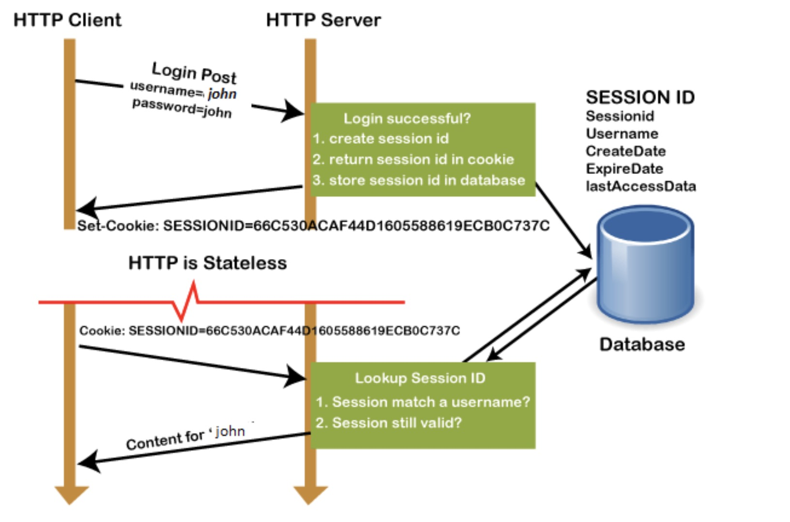

# cookie / seesion / token

## 1. Session Tracking 会话跟踪技术

HTTP is a stateless protocol. This means a HTTP server needs not keep track of any state information.

So, At any time, client can send any valid request. The server will not relate this request to any previous or future request. Each request is independent of any other request, past or future.

But there are some user case / scenario that we need to keey track of the client state, which make cookie come to exsit.

HTTP 是无状态协议，是指 http 对于历史请求没有记忆能力，一旦数据交换完毕，客户端与服务器端的连接就会关闭，再次交换数据需要建立新的连接。这就意味着服务器无法从连接上跟踪会话。但是一些场景又需要保存信息（比如在线购物网站，需要登录的网站等等，需要会话管理。记住哪些人登录系统， 哪些人往自己的购物车中放商品），这里就衍生出来了 cookie、session、token

## 1.1 development history

1、很久很久以前,Web 基本上就是文档的浏览而已,既然是浏览,作为服务器,不需要记录谁在某一段时间里都浏览了什么文
档,每次请求都是一个新的 HTP 协议,就是请求加响应,尤其是我不用记住是谁刚刚发了 HTTP 请求,每个请求对我来说都是全
新的。这段时间很嗨皮

2、**session**:

但是随着 interactive Web 应用的兴起,像在线购物网站,需要登录的网站等等,马上就面临一个问题,那就是要管理会话,必须记住哪些人登录系统,哪些人往自己的购物车中放商品,也就是说我必须把每个人区分开,这就是一个不小的挑战,因为 HTTP 请求是无状态的,

所以想出的办法就是给大家发一个会话标识( session id),说白了就是一个随机的字串,每个人收到的都不ー样,每次大家向 server 发起 HTTP 请求的时候,把这个字符串给一并捎过来,这样 server 就能区分开谁是谁了

3、**session sticky & session 复制**:

这样大家很嗨皮了,可是服务器就不嗨皮了,每个人只需要保存自己的 session id,而服务器要保存所有人的 session id!如果访 服务器多了,就得由成千上万,甚至几十万个

这对服务器说是一个巨大的开销,严重的限制了服务器扩展能力,比如说我用两个机器组成了一个集群,小 F 通过机器 A 登录了系
统,那 session id 会保存在机器 A 上,假设小 F 的下ー次请求被转发到机器 B 怎么办?机器 B 可没有小 F 的 session id 阿。
有时候会采用一点小伎俩: session sticky,就是让小 F 的请求一直粘连在机器 A 上,但是这也不管用,要是机器 A 挂掉了,还得转
到机器 B 去。

那只好做 session 的复制了,把 session id 在两个机器之间搬来搬去,快累死了。

4、 **共享 Session** - 将 Session Id 集中存储到一个地方:

后来有个叫 Memcached 的支了招:把 session id 集中存储到一个地方,所有的机器都来访问这个地方的数据,这样一来,就不用复制了,但是增加了单点失败的可能性,要是那个负责 session 的机器挂了,所有人都得重新登录一遍,估计得被人骂死

5、**token**:

于是有人就一直在思考,我为什么要保存这可恶的 session 呢,只让每个客户端去保存该多好?  
可是如果不保存这些 session id,怎么验证客户端发给我的 session id 的确是我生成的呢?

比如说,小 F 已经登录了系统,我给他发一个令片牌(token),里边包含了小 F 的 user id,下ー次小 F 再次通过 Http 请求访问我的时,把这个 token 通过 Http header 带过来不就可以了。

不过这和 session id 没有本质区别啊,任何人都可以可以伪造,所以我得想点儿办法,让别人伪造不了。
那就对数据做一个签名吧,比如说我用 HMAC-SHA256 算法,加上ー个只有我才知道的密钥,对数据做一个签名,把这个签名和
数据一起作为 token,由于密钥别人不知道,就无法伪造 token 了。

这个 token 我不保存,当小 F 把这个 token 给我发过来的时候,我再用同样的 HMAC-SHA256 算法和同样的密钥,对数据再计算一次 签名,和 token 中的签名做个比较,如果相同,我就知道小 F 已经登录过了,并且可以直接取到小 F 的 user id,如果不相同,数据部分肯定被人簒改过,我就告诉发送者:对不起,没有认证。

这样一来,我就不保存 session id 了,我只是生成 token,然后验证 token,我用我的 CPU 计算时间获取了我的 session 存储空间

## 2. Cookie

### 2.1 what is cookie?

A cookie is information that a Website puts on your hard disk so that it can remember something about you at a later time. (More technically, it is information for future use that is stored by the server on the client side of a client/server communication.)

In short, Cookie is client’s information for particular site stored on client’s PC.

Typically, a cookie records your preferences when using a particular site. Using the Web’s Hypertext Transfer Protocol (HTTP), each request for a Web page is independent of all other requests. For this reason, the Web page server has no memory of what pages it has sent to a user previously or anything about your previous visits. A cookie is a mechanism that allows the server to store its own information about a user on the user’s own computer.

Http cookie（也叫 Web Cookie 或浏览器 Cookie）**是服务器发送到用户浏览器以 Key-Value 形式井保存在本地（可以在内存、也可以持久化在磁盘里）的文本数据，它会在浏览器下次向同一服务器再发起请求时被携带并发送到服务器上**。通常，它用于告知服务端两个请求是否来自同一浏览器，如保持用户的登录状态/track user preference to show related content for particular site。Cookie 使基于无状态的 HTTP 协议记录稳定的状态信息成为了可能。

由于 cookie 是存在客户端上的，所以浏览器加入了一些限制确保 cookie 不会被恶意使用，同时不会占据太多磁盘空间。所以每个域的 cookie 数量是有限制的。

1. A cookie is a small text file that is stored on the user's computer. The maximum file size of a cookie is 4KB. It is also known as an HTTP cookie, web cookie, or internet Cookie.
2. Whenever a user visits a website for the first time, the site sends packets of data in the form of a cookie to the user's computer.
3. The cookies help the websites to keep track of the user's browsing history or cart information when they visit their sites.
4. It stores only the "String" data type.
5. The information stored within cookies is not secure because this information is stored in text-format on the client-side, which can be read by anyone.
6. We can enable or disable the cookies as per the requirement.
7. The cookies generated by a user are only be shown to them, and no other user can see those cookies.
8. Cookies are created and shared between the server and browser with the help of an HTTP header.
9. The path where the cookies are saved is decided by the browser, as Internet explorer usually stored them in Temporal Internet File Folder.
10. When we visit YouTube channel and search for some songs, next time whenever we visit YouTube, cookies read our browsing history and shows similar songs or last played songs.

### 2.2 Procedure of how cookie works

1. When you visit some site, server for that site stores information (user name or simply physical address of user’s pc) in 1 text file. For that, that site may ask you to fill details about yourself or it can simple fetch physical address of your computer.
2. Server sends this file to client with web page and that file is saved in client’s pc.
3. Now when user visits that website again, that cookie file is also sent to server with the web page request.
4. From that file, website’s sever can identify that particular user and do further procedures (Ex. Prepare customized webpage for that user) using that information.

**Example:** - Best example for working of cookies is “iGoogle” website. Follow these steps to see it:

1. Visit www.google.com.
2. Click on link written ‘iGoogle’ on top-right side of the page. You will see customized page of google. (When you click on this link, Physical address (Mind you…physical address which always remains unique. While IPaddress of your pc may change) of your pc is stored in google’s server)
3. You can customize that page according to your need and that page information is saved in one text file and sent back to client’s pc.
4. Close that window.
5. Again go to IE and visit www.google.com. You will see customized page you have created before. This is because when you visit same page again, your pc send that cookie also with webpage request. Google server resolve that file and come to know that that client is having customized page and send that customized page instead of normal page

(Clear cookies from your pc and visit the same page and see what happens!!!!!!)

### 2.3 Creat cookie

1. 客户端设置

设置 cookie => cookie 被自动添加到 request header 中 => 服务端接收到 cookie

```js
document.cookie = 'name=xiaoming; age=12 '
```

客户端可以设置 cookie 的以下选项:  
expires, domain, path, secure(只有在 https 协议的网页中, 客户端设置 secure 类型 cookie 才能生效), 但无法设置 httpOnly 选项

2. 服务端设置

不管你是请求一个资源文件(如 html/js/css/图片), 还是发送一个 ajax 请求, 服务端都会返回 response.而 response header 中有一项叫`set-cookie`, 是服务端专门用来设置 cookie 的;

> ajax = Asynchronous Javascript And XML, 是一种在无需重新加载整个网页的情况下,能够更新部分网页的技术

- 一个 set-cookie 只能设置一个 cookie, 当你想设置多个, 需要添加同样多的`set-cookie`
- 服务端可以设置 cookie 的所有选项: expires, domain, path, secure, HttpOnly

当服务器收到 HTTP 请求时，服务器可以在响应首部里面添加一个 Set-Cookie 选项，浏览器收到响感后通常会保存下 Cookie，之后对该服务器毎一次请求中都通过 Cookie 请求首部将 Cookie 信息发送服务器。另外，Cookie 的过期时间、域、路径、有效期、适用站点都可以根据需要来指定。

服务器使用 set-Cookie 响应首部向用户代理（一般是浏览器）发送 Cookie 信息，告知客户端保存 Cookie 信息。一个简单的 Cookie 可能像这样：Set-Cookie：<cookie 名>=<cookie 值>


### 2.3 Types of Cookies

1. Session Cookie

The session cookie is stored in temporary memory and is not retained/will be erased after the browser is closed. Session cookies do not collect information from yourcomputer. They typically will store information in the form of a session identification that does not personally identify the user.persistent cookie

2. Persistent Cookie

a cookie that is stored on your hard drive until it expires (persistent cookies are set with expiration dates) or until you delete the cookie. Persistent cookies are used to collect identifying information about the user, such as Web surfing behavior or user preferences for a specific Web site.

提示：当 Cookie 的过期时间被设定时，设定的日期和时间只与客户端相关，而不是服务端

3. 第三方 Cookie

每个 Cookie 都会有与之关联的域（Domain），如果 Cookie 的域和页面的域相同，那么我们称这个 Cookie 为第一方 Cookie（first-party cookie），如果 Cookie 的域和页面的域不同，则称之为第三方 Cookie（third-party cookie.）。一个页面包含图片或存放在其他域上的资源（如图片广告）时，第一方的 Cookie 也只会发送绐设置它们的服务器。通过第三方组件发送的第三方 Cookie 主要用于广告和网络追踪。这方面可以看谷歌使用的 Cookie 类型（types of cookies used by Google）。大多数浏览器默认都允许第三方 Cookie，但是可以通过附加组件来阻止第三方 Cookie（如 EF 的 Privacy Badger）

## 3. Session

### 3.1 what is session

1. A session is client information store at server side temperary memory for future use. It is commonly used to distinguise clients by session ID (random string). The user session starts when user log-in to a particular netowork application and ends when the user logs-out/shutdowns the system. It works

2. Session values are much secured as these are stored in binary form or encrypted form and can only be decrypted at the server. The session values are automatically removed when the user shutdowns the system or logout from the application. To store the values permanently, we need to store them in the database.

3. Each session is unique for each user, and any number of sessions can be used in an application; there is no limitation to it.

4. The user is identified with the help of sessionID, which is a unique number saved inside the server. It is saved as a cookie, form field, or URL.

session 从字面上讲，就是会话。这个就类似你和一个人交谈，你怎么知道当时和你交谈的是张三而不是李四呢？对方肯定有某种特征（长相等）表明他是张三；
session 也是类似的道理，**服务器要知道当前请求发给自己的是谁。为了做这种区分，服务器就是要给每个客户端分配不同的"身份标识"，然后客户端每次向服务器发请求的时候，都带上这个”身份标识“**，服务器就知道这个请求来自与谁了。

至于客户端怎么保存这个”身份标识“，可以有很多方式，对于浏览器客户端，大家都采用 cookie 的方式。

### 3.2 Working of session



1. In the first step, the client request to the server via GET or POST method.

2. The sessionID is created on the server, and it saves the sessionID into the database. It returns the sessionId with a cookie as a response to the client.

3. Cookie with sessionID stored on the browser is sent back to the server. The server matches this id with the saved sessionID and sends a response HTTP200

### 3.3 Session scalability problem

**server clutering / Web and application servers can scale out to handle huge loads with devices such as load balancers, which also provide redundancy. 这就要求 session 数据共享，每台服务器都能够读取 session**，否则假设张三的 session id 只保存在一台服务器 a 上，下次张三的请求发到了服务器 b，b 却没有 a 的 session id 怎么办？

另一种情况， A 网站和 B 网站是同一家公司的关联服务。现在要求，用户只要在其中一个网站登录，再访问另一个网站就会自动登录，请问怎么实现？这个问题就是**如何实现单点登录的问题**

**解决方案：**

1. Session Sticky：
   Nginx ip_hash 策略，服务端使用 Nginx 代理，**每个请求按访问 IP 的 hash 分配，这样来自同一 IP 固定访问一个后台服务器**，避免了在服务器 A 创建 Session，第二次分发到服务器 B 的现象。

2. Session Copy：
   **任何一个服务器上的 Session 发生改变（增删改），该节点会把这个 Session 的所有内容序列化，然后广播给所有其它节点。**
   

3. 共享 Session：
   **将 Session Id 集中存储到一个地方**，所有的机器都来访问这个地方的数据，将用户的 Session 等信息使用缓存中间件来统一管理，保障分发到每一个服务器的响应结果都一致。这种方案的优点是架构清晰，缺点是工程量比较大。另外，持久层万一挂了，就会单点失败；
   

4. **用 token 代替 session**：
   另一种方案是服务器索性不保存 session 数据了，所有数据就保存在客户端，每次请求都发回服务器。这种方案就是接下来要介绍的基于 Token 的验证;

### 3.4 获取 session 对象

```js
HttpSession session = request.getSession();
```

## 4. Token

see: https://sherryhsu.medium.com/session-vs-token-based-authentication-11a6c5ac45e4


1. client 使用用户名和密码请求登录。
2. 服务端收到请求，验证用户名和密码。
3. 验证成功后，服务端会生成一个 token，然后把这个 token 发送给 client。
4. client 收到 token 后把它存储起来，可以放在 cookie 或者 Local Storage（本地存储）里。
5. client 每次向服务端发送请求的时候都需要带上服务端发给的 token。
6. 服务端收到请求，然后去验证 client 请求里面带着 token，如果验证成功，就向 client 返回请求的数据。(如果这个 Token 在服务端持久化（比如存入数据库），那它就是一个永久的身份令牌。)

## 5. 常见面试题

### 5.1 Key Differences between Session and Cookies

- Storage location:
  Sessions are server-side files that store the user information, whereas Cookies are client-side files that contain user information on a local computer.。
- file type:
  Cookie 只能保存 ASCII，Session 可以存任意数据类型，一般情况下我们可以在 Session 中保持一些常用变量信息，比如说 UserId 等。
- Sessions are cookies dependent, whereas Cookies are not dependent on Session.
- end time:
  The session ends when the user closes the browser or logout from the application, whereas Cookies expire at the set time.
- Security:
  Sessions are more secured compared to cookies, as they save data in encrypted form. Cookies are not secure, as data is stored in a text file, and if any unauthorized user gets access to our system, he can temper the data.
- Size:
  The maximum size of the browser's cookies is 4 KB.

### token 和 session 区别

Session 是一种 HTTP 储存 mechanism，为无状态的 HTTP 提供持久机制;

Token 就是 identification， 比如你授权(登录)一个程序时，它就是个依据，判断你是否已经授权该软件；

Session 和 Token 并不矛盾，作为身份认证**Token 安全性比 Session 好**，因为每一个请求都有签名还能防止监听以及重放攻击，而 Session 就必须依赖链路层来保障通讯安全了。如上所说，如果你需要实现有状态的回话，仍然可以增加 Session 来在服务端保存一些状态。

下面的例子可以说明 token 和 session 的区别

session ：我发给你一张身份证，但只是一张写着身份证号码的纸片。你每次来办事，我去后台查一下你的 id 是不是有效。

token：我发给你一张加密的身份证，以后你只要出示这张卡片，我就知道你一定是自己人。

- session 机制存在服务器压力增大，**CSRF 跨站伪造请求攻击**，扩展性不强等问题；
- session 存储在服务器端，token 存储在客户端（和 cookie 一样，服务器返回给客户端）
- token 提供认证和授权功能，作为身份认证，token 安全性比 session 好；
- session 这种会话存储方式方式只适用于客户端代码和服务端代码运行在同一台服务器上，token 适用于项目级的前后端分离（前后端代码运行在不同的服务器下

### 什么是 CSRF(Cross—Site Request Forgery) 跨站伪造请求攻击，如何避免

大概就是某用户登录了 A 网站，认证信息保存在 cookie 中。这时候该用户访问了一个有病毒的 B 网站窃取了该用户的 cookie，attacker 在 B 网站使用 cookie 中的认证信息伪造请求提交到 A 网站服务器上，让 A 网站的服务器误以为请求来自于自己的网站，于是执行响应的操作。

使用 token 可以解决

### 什么时候 cookie 会被覆盖：

cookie 中的 name、domain、path 这 3 个字段数值都相同的时候。
如果显式设置了 domain，则设置成什么，浏览器就存成什么；但如果没有显式设置，则浏览器会自动取 url 的 host 作为 domain 值；

### 如何修改/删除 cookie

1. 修改一个 cookie
   要想修改一个 cookie，只需要重新赋值就行，旧的值会被新的值覆盖。但要注意一点，在设置新 cookie 时，path、domain 这两个字段一定要和之前保持一样。否则是不会确定为之前的 cookie，而是添加了一个新的 cookie。

2. 删除 cookie
   删除一个 cookie 也是一样的，也是重新赋值，只要将这个新 cookie 的 expires 选项设置为一个过去的时间点或者是直接赋值为 0 就行了。但同样要注意，path 和 domain 同样需要和之前的 cookie 保持一致。

### session 产生的 session_id 放在 cookie 里面，如果用户把 cookie 禁止掉，是不是 session 也不能用了呢？

禁止掉 cookie 后，session 当然可以用，不过通过其他的方式来获得这个 session_id，比如，把 session_id 放到 url 里面，或者以表单的形势提交到服务器端。从而使服务器端了解客户端的状态。

## 参考

- 彻底理解 cookie 和 cookie 安全：https://juejin.cn/post/6844904102544031757
- cookie 的属性设置：https://zhuanlan.zhihu.com/p/58781702
- cookie & session 创建/参数设置代码: https://blog.csdn.net/weixin_40521823/article/details/79837162
