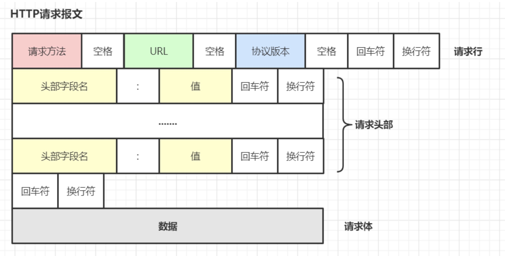
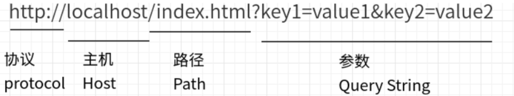
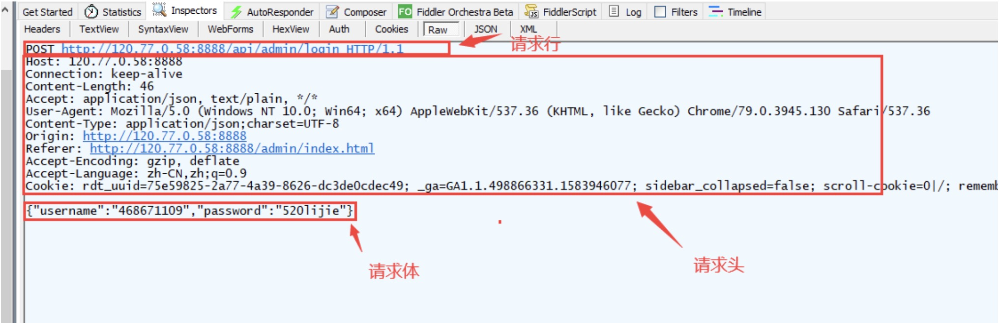
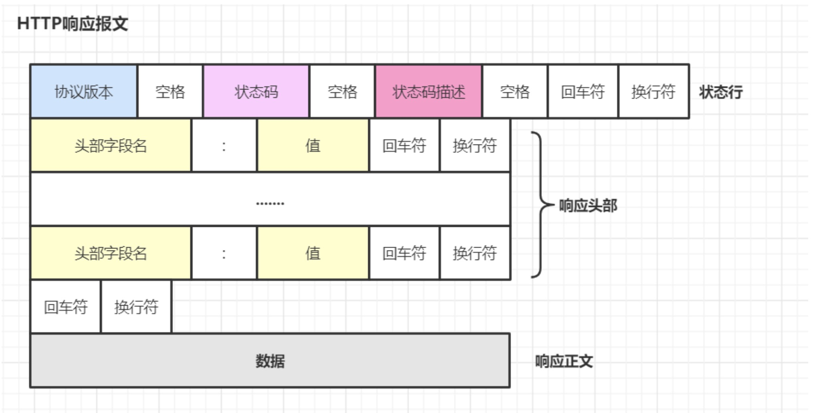
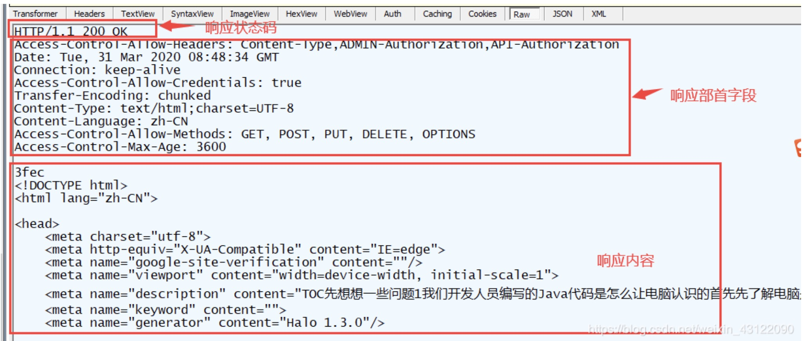

# HTTP - Hypertext Transfer Protocol

## 1. 什么是 http

- HTTP 是 application layer 应用层的传输协议
- 用于定义 WEB 浏览器与 WEB 服务器之间交换数据的过程:  
   客户端连上 WEB 服务器后，若想获得 WEB 服务器中的某个 WEB 资源，需遵守一定的通讯格式，HTTP 协议用于定义客户端与 WEB 服务器通迅的格式。
- HTTP 是一个无状态的协议

## 2. HTTP request message 请求报文

HTTP 请求分为三个部分：请求行、请求头、请求体。类似于下面这样：

- request line 请求行 : method + url + http version
  - method fields includes: _GET, POST, HEAD, PUT, and DELETE_
- header lines 多个消息头
- blank line 一个空行
- entity body

### 2.1 请求方法

HTTP 服务器至少应该实现 GET 和 HEAD 方法，其他方法都是可选的

|     | 方法       | 作用                                                                                                                                        |
| --- | ---------- | ------------------------------------------------------------------------------------------------------------------------------------------- |
| 1   | **GET**    | **请求指定页面信息，并返回实体主体**                                                                                                        |
| 2   | HEAD       | 类似于 GET 请求，只不过返回的响应中没有具体的内容，用于获取报头                                                                             |
| 3   | **POST**   | **向指定资源提交数据进行处理请求（例如提交表单或者上传文件）。数据被包含在请求体中。POST 请求可能会导致新的资源的建立和或已有资源的修改。** |
| 4   | **PUT**    | **从客户端向服务器传送的数据取代指定的文档的内容。**也是**导致新的资源的建立和或已有资源的修改。**                                          |
| 5   | PATCH      | 从客户端向服务器传送的数据取代指定的文档的内容。（部分取代）                                                                                |
| 6   | **DELETE** | **请求服务器删除指定的页面。**                                                                                                              |
| 7   | CONNECT    | HTTP11 协议中预留给能够将连接改为管道方式的代理服务器                                                                                       |
| 8   | OPTIONS    | 允许客户端查看服务器的性能。                                                                                                                |
| 9   | TRACE      | 回显服务器收到的请求，主要用于测试或诊断。                                                                                                  |

### 2.2 URL - Uniform Resource Locator

URL：统一资源定位符，是一种资源位置的抽象唯一识别方法。

组成：<协议>://<主机>:<端口>/<路径>

端口和路径有时可以省略（HTTP 默认端口号是 80，HTTPS 默认端口号是 443）

### 2.3 协议版本

协议版本的格式为：HTTP/主版本号.次版本号，常用的有 HTTP/1.0 和 HTTP/1.1

### 2.4 请求头部

请求头部为请求报文添加了一些附加信息，由“名/值”对组成，每行一对，名和值之间使用冒号分隔。

请求头部的最后会有一个空行，表示请求头部结束，接下来为请求数据。

| 请求头          | 说明                                                                  |
| --------------- | --------------------------------------------------------------------- |
| Host            | 接受请求的服务器地址，可以是 IP:端口号，也可以是域名                  |
| User-Agent      | 发送请求的应用程序名称                                                |
| Connection      | 指定与连接相关的属性，如 Connection:Keep-Alive                        |
| Accept-Charset  | 通知服务端可以发送的编码格式                                          |
| Accept-Encoding | 通知服务端可以发送的数据压缩格式                                      |
| Accept-Language | 通知服务端可以发送的语言                                              |
| Content-Length  | 请求体长度                                                            |
| Content-Type    | 表示请求体中的 MIME 类型（Internet Media Type，互联网媒体类型）信息。 |

**Content-Type 内容**:

常见的媒体格式类型如下：

- text/html ： HTML 格式
- text/plain ：纯文本格式
- text/xml ： XML 格式
- image/gif ：gif 图片格式
- image/jpeg ：jpg 图片格式
- image/png：png 图片格式

**以 application 开头的媒体格式类型：**

- application/xhtml+xml ：XHTML 格式
- application/xml ： XML 数据格式
- application/atom+xml ：Atom XML 聚合格式
- application/json ： JSON 数据格式
- application/pdf ：pdf 格式
- application/msword ： Word 文档格式
- application/octet-stream ： 二进制流数据（如常见的文件下载）
- application/x-www-form-urlencoded ： <form encType="">中默认的 encType，form 表单数据被编码为 key/value 格式发送到服务器（表单默认的提交数据的格式）

另外一种常见的媒体格式是上传文件之时使用的：

- multipart/form-data ： 需要在表单中进行文件上传时，就需要使用该格式

以上就是我们在日常的开发中，经常会用到的若干 content-type 的内容格式。

### 2.5 请求数据 entity body

请求数据不在 GET 方法中使用，而在 POST 方法中使用。POST 法适用于需要客户填写表单的场合。与请求数据相关的最常使用的请求头部是 Content-Type 和 Content-Length。下面是一个 POST 方法的请求报文

## 3. HTTP response message 响应报文

HTTP 响应分为三个部分：状态行、响应头、响应正文。类似于下面这样：

### 3.1 an initial status line 状态行

| **类别** | **原因短语**                                           |
| -------- | ------------------------------------------------------ |
| 1XX      | Informational（信息性状态码） 接受的请求正在处理       |
| 2XX      | Success（成功状态码） 请求正常处理完毕                 |
| 3XX      | Redirection（重定向状态码） 需要进行附加操作以完成请求 |
| 4XX      | Client Error（客户端错误状态码） 服务器无法处理请求    |
| 5XX      | Server Error（服务器错误状态码） 服务器处理请求出错    |

#### 常见状态码

**1XX**

| 状态码和状态信息 | 含义                                                                                                                                           |
| ---------------- | ---------------------------------------------------------------------------------------------------------------------------------------------- |
| 100 continue     | 服务器收到了客户端的请求行和头部信息，告诉客户端继续发送数据部分。客户端通常要先发送 Expect：100-continue 头部字段告诉服务器自己还有数据要发送 |

**2XX**

| 状态码和状态信息    | 含义                                       |
| ------------------- | ------------------------------------------ |
| 200 OK              | 表示从客户端发来的请求在服务器端被正确处理 |
| 204 No content      | 表示请求成功，但响应报文不含实体的主体部分 |
| 206 Partial Content | 进行范围请求成功                           |

**3XX**

| 状态码和状态信息       | 含义                                                                                                                                     |
| ---------------------- | ---------------------------------------------------------------------------------------------------------------------------------------- |
| 301 moved permanently  | 永久性重定向，表示资源已被分配了新的 URL                                                                                                 |
| 302 found              | 临时性重定向，表示资源临时被分配了新的 URL                                                                                               |
| 303 see other          | 表示资源存在着另一个 URL，应使用 GET 方法获取资源（对于 301/302/303 响应，几乎所有浏览器都会删除报文主体并自动用 GET 重新请求）          |
| 304 not modified       | 表示服务器允许访问资源，但请求未满足条件的情况（从服务器告诉客户端，本地缓存的资源和我现在最新的资源是一致的，本地缓存拿出对应资源即可） |
| 307 temporary redirect | 临时重定向，和 302 含义类似，但是期望客户端保持请求方法不变向新的地址发出请求                                                            |

**4XX**

| 状态码和状态信息 | 含义                                                                                                                                                     |
| ---------------- | -------------------------------------------------------------------------------------------------------------------------------------------------------- |
| 400 bad request  | 请求报文存在语法错误， [例如 http1.1 没有 hostname](https://github.com/Cecilia999/interview/blob/main/networking/http_vs_https.md#3-http-10-vs-11-vs-20) |
| 401 unauthorized | 表示发送的请求需要有通过 HTTP 认证的认证信息                                                                                                             |
| 403 forbidden    | 表示对请求资源的访问被服务器拒绝，可在实体主体部分返回原因描述(认证之后权限不足)                                                                         |
| 404 not found    | 表示在服务器上没有找到请求的资源                                                                                                                         |

**5XX**

| 状态码和状态信息         | 含义                                                 |
| ------------------------ | ---------------------------------------------------- |
| 500 internal sever error | 表示服务器端在执行请求时发生了错误                   |
| 501 Not Implemented      | 表示服务器不支持当前请求所需要的某个功能             |
| 503 service unavailable  | 表明服务器暂时处于超负载或正在停机维护，无法处理请求 |

### 3.2 six header lines 响应头部

header lines includes:

> Connection: close  
> Date: Tue, 18 Aug 2015 15:44:04 GMT  
> Server: Apache/2.2.3 (CentOS)  
> Last-Modified: Tue, 18 Aug 2015 15:11:03 GMT  
> Content-Length: 6821  
> Content-Type: text/html

### 3.3 entity body 响应数据

## 4. HTTP 中的幂等性
