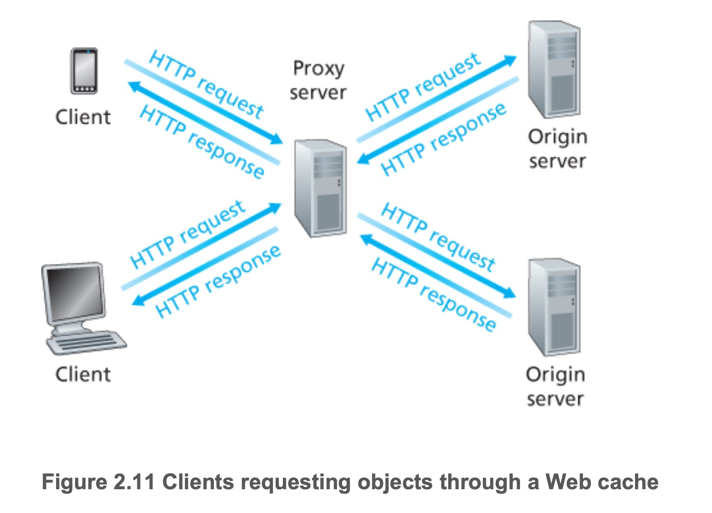

# HTTP - Hypertext Transfer Protocol

## 1. 什么是 http

1. The HyperText Transfer Protocol (HTTP), the Web’s application-layer protocol, running on the top of TCP

2. HTTP is implemented in two programs: a client program and a server program. The client program and server program, executing on different end systems, talk to each other by exchanging HTTP messages. HTTP defines the structure of these messages and how the client and server exchange the messages.

3. HTTP is stateless.

- HTTP 协议是超文本传输协议。它是基于 TCP 协议的应用层传输协议，即客户端和服务端进行数据传输的一种规则
- 用于定义 WEB 浏览器与 WEB 服务器之间交换数据的过程:  
   客户端连上 WEB 服务器后，若想获得 WEB 服务器中的某个 WEB 资源，需遵守一定的通讯格式，HTTP 协议用于定义客户端与 WEB 服务器通迅的格式。
- HTTP 是一个无状态的协议

### 1.1 brief intro to Web

1. A Web page (also called a document) consists of objects. An object is simply a file—such as an HTML file, a JPEG image, a Java applet, or a video clip—that is **addressable by a single URL**.

   - Most Web pages consist of a base HTML file and several referenced objects.

2. Each URL has two components: the hostname of the server that houses the object and the object’s path name.

   - Because Web browsers implement the client side of HTTP, in the context of the Web, we will use the words browser and client interchangeably. Web servers, which implement the server side of HTTP, house Web objects, each addressable by a URL.

## 2. HTTP request message format 请求报文

HTTP 请求分为三个部分：**request line + header line + entity body**

1. request line 请求行 : method + url + http version

- method fields includes: _GET, POST, HEAD, PUT, and DELETE_

2. header lines: specifies the host on which the object resides
3. blank line 一个空行
4. entity body

### 2.1 Request method

HTTP 服务器至少应该实现 GET 和 HEAD 方法，其他方法都是可选的

|     | 方法       | 作用                                                                                                                                                                                                                                                                                                                               |
| --- | ---------- | ---------------------------------------------------------------------------------------------------------------------------------------------------------------------------------------------------------------------------------------------------------------------------------------------------------------------------------- |
| 1   | **GET**    | **GET method is used when the browser requests an object, with the requested object identified in the URL field. 请求指定页面信息，并返回实体主体**                                                                                                                                                                                |
| 2   | **HEAD**   | The HEAD method is similar to the GET method. When a server receives a request with the HEAD method, it responds with an HTTP message without the requested object. Application developers often use the HEAD method for debugging. 类似于 GET 请求，只不过返回的响应中没有具体的内容，用于获取报头                                |
| 3   | **POST**   | **create a new object on a web server.** POST means "create new" as in "Here is the input for creating a user, create it for me". PUT means "insert, replace if already exists" as in "Here is the data for user 5". You POST to example.com/users since you don't know the URL of the user yet, you want the server to create it. |
| 4   | **PUT**    | **upload an object to a specific path (directory) on a specific Web server.**从客户端向服务器传送的数据取代指定的文档的内容。                                                                                                                                                                                                      |
| 5   | PATCH      | 从客户端向服务器传送的数据取代指定的文档的内容。（部分取代）                                                                                                                                                                                                                                                                       |
| 6   | **DELETE** | **delete an object on a web server 请求服务器删除指定的页面。**                                                                                                                                                                                                                                                                    |
| 7   | CONNECT    | HTTP1.1 协议中预留给能够将连接改为管道方式的代理服务器                                                                                                                                                                                                                                                                             |
| 8   | OPTIONS    | 允许客户端查看服务器的性能。                                                                                                                                                                                                                                                                                                       |
| 9   | TRACE      | 回显服务器收到的请求，主要用于测试或诊断。                                                                                                                                                                                                                                                                                         |

### 2.2 URL - Uniform Resource Locator

URL is a unique identifier used to locate a resource on the Internet. It is also referred to as a web address.

consist of: <protocol>://<host>:<port>/<path>
组成：<协议>://<主机>:<端口>/<路径>

端口和路径有时可以省略（HTTP 默认端口号是 80，HTTPS 默认端口号是 443）

### 2.3 协议版本

协议版本的格式为：HTTP/主版本号.次版本号，常用的有 HTTP/1.0 和 HTTP/1.1

### 2.4 请求头部

请求头部为请求报文添加了一些附加信息，由“名/值”对组成，每行一对，名和值之间使用冒号分隔。

请求头部的最后会有一个空行，表示请求头部结束，接下来为请求数据。

| 请求头          | 说明                                                                  |
| --------------- | --------------------------------------------------------------------- |
| Host            | 接受请求的服务器地址，可以是 IP:端口号，也可以是域名                  |
| User-Agent      | 发送请求的应用程序名称                                                |
| Connection      | 指定与连接相关的属性，如 Connection:Keep-Alive                        |
| Accept-Charset  | 通知服务端可以发送的编码格式                                          |
| Accept-Encoding | 通知服务端可以发送的数据压缩格式                                      |
| Accept-Language | 通知服务端可以发送的语言                                              |
| Content-Length  | 请求体长度                                                            |
| Content-Type    | 表示请求体中的 MIME 类型（Internet Media Type，互联网媒体类型）信息。 |

**Content-Type 内容**:

常见的媒体格式类型如下：

- text/html ： HTML 格式
- text/plain ：纯文本格式
- text/xml ： XML 格式
- image/gif ：gif 图片格式
- image/jpeg ：jpg 图片格式
- image/png：png 图片格式

**以 application 开头的媒体格式类型：**

- application/xhtml+xml ：XHTML 格式
- application/xml ： XML 数据格式
- application/atom+xml ：Atom XML 聚合格式
- application/json ： JSON 数据格式
- application/pdf ：pdf 格式
- application/msword ： Word 文档格式
- application/octet-stream ： 二进制流数据（如常见的文件下载）
- application/x-www-form-urlencoded ： <form encType="">中默认的 encType，form 表单数据被编码为 key/value 格式发送到服务器（表单默认的提交数据的格式）

另外一种常见的媒体格式是上传文件之时使用的：

- multipart/form-data ： 需要在表单中进行文件上传时，就需要使用该格式

以上就是我们在日常的开发中，经常会用到的若干 content-type 的内容格式。

### 2.5 请求数据 entity body

请求数据不在 GET 方法中使用，而在 POST 方法中使用。POST 法适用于需要客户填写表单的场合。与请求数据相关的最常使用的请求头部是 Content-Type 和 Content-Length。下面是一个 POST 方法的请求报文

## 3. HTTP response message 响应报文

HTTP 响应分为三个部分：status line, response header, reponse entity。类似于下面这样：

### 3.1 an initial status line 状态行 = protocol version field + status code + status message

| **类别** | **原因短语**                                           |
| -------- | ------------------------------------------------------ |
| 1XX      | Informational（信息性状态码） 接受的请求正在处理       |
| 2XX      | Success（成功状态码） 请求正常处理完毕                 |
| 3XX      | Redirection（重定向状态码） 需要进行附加操作以完成请求 |
| 4XX      | Client Error（客户端错误状态码） 服务器无法处理请求    |
| 5XX      | Server Error（服务器错误状态码） 服务器处理请求出错    |

#### 常见 status code

**1XX**

| 状态码和状态信息 | 含义                                                                                                                                           |
| ---------------- | ---------------------------------------------------------------------------------------------------------------------------------------------- |
| 100 continue     | 服务器收到了客户端的请求行和头部信息，告诉客户端继续发送数据部分。客户端通常要先发送 Expect：100-continue 头部字段告诉服务器自己还有数据要发送 |

**2XX**

| 状态码和状态信息    | 含义                                       |
| ------------------- | ------------------------------------------ |
| 200 OK              | 表示从客户端发来的请求在服务器端被正确处理 |
| 204 No content      | 表示请求成功，但响应报文不含实体的主体部分 |
| 206 Partial Content | 进行范围请求成功                           |

**3XX**

| 状态码和状态信息       | 含义                                                                                                                                     |
| ---------------------- | ---------------------------------------------------------------------------------------------------------------------------------------- |
| 301 moved permanently  | 永久性重定向，表示资源已被分配了新的 URL                                                                                                 |
| 302 found              | 临时性重定向，表示资源临时被分配了新的 URL                                                                                               |
| 303 see other          | 表示资源存在着另一个 URL，应使用 GET 方法获取资源（对于 301/302/303 响应，几乎所有浏览器都会删除报文主体并自动用 GET 重新请求）          |
| 304 not modified       | 表示服务器允许访问资源，但请求未满足条件的情况（从服务器告诉客户端，本地缓存的资源和我现在最新的资源是一致的，本地缓存拿出对应资源即可） |
| 307 temporary redirect | 临时重定向，和 302 含义类似，但是期望客户端保持请求方法不变向新的地址发出请求                                                            |

**4XX**

| 状态码和状态信息 | 含义                                                                                                                                                     |
| ---------------- | -------------------------------------------------------------------------------------------------------------------------------------------------------- |
| 400 bad request  | 请求报文存在语法错误， [例如 http1.1 没有 hostname](https://github.com/Cecilia999/interview/blob/main/networking/http_vs_https.md#3-http-10-vs-11-vs-20) |
| 401 unauthorized | 表示发送的请求需要有通过 HTTP 认证的认证信息                                                                                                             |
| 403 forbidden    | 表示对请求资源的访问被服务器拒绝，可在实体主体部分返回原因描述(认证之后权限不足)                                                                         |
| 404 not found    | 表示在服务器上没有找到请求的资源                                                                                                                         |

**5XX**

| 状态码和状态信息         | 含义                                                 |
| ------------------------ | ---------------------------------------------------- |
| 500 internal sever error | 表示服务器端在执行请求时发生了错误                   |
| 501 Not Implemented      | 表示服务器不支持当前请求所需要的某个功能             |
| 503 service unavailable  | 表明服务器暂时处于超负载或正在停机维护，无法处理请求 |

### 3.2 six header lines 响应头部

header lines includes:

> Connection: close  
> Date: Tue, 18 Aug 2015 15:44:04 GMT  
> Server: Apache/2.2.3 (CentOS)  
> Last-Modified: Tue, 18 Aug 2015 15:11:03 GMT  
> Content-Length: 6821  
> Content-Type: text/html

### 3.3 entity body 响应数据

## 4. Web Cache

A Web cache also called a proxy server:  
is a network entity that satisfies HTTP requests on the behalf of an origin Web server. The Web cache has its own disk storage and keeps copies of recently requested objects in this storage.

1. The browser establishes a TCP connection to the Web cache and sends an HTTP request for the object to the Web cache.

2. The Web cache checks to see if it has a copy of the object stored locally. If it does, the Web cache returns the object within an HTTP response message to the client browser.

3. If the Web cache does not have the object, the Web cache opens a TCP connection to the origin server, that is, to www.someschool.edu. The Web cache then sends an HTTP request for the object into the cache-to-server TCP connection. After receiving this request, the origin server sends the object within an HTTP response to the Web cache.

4. When the Web cache receives the object, it stores a copy in its local storage and sends a copy, within an HTTP response message, to the client browser (over the existing TCP connection
   between the client browser and the Web cache).

## 4. HTTP 中的 idempotence - 幂等性

**Idempotence** - is any function that can be executed several times without changing the final result beyond its first iteration.

You can divide HTTP methods into two main categories **safe and idempotent**.

- Safe methods are HTTP methods that do not modify the resource  
   like a GET request is safe because it doesn't modify the resource you are requesting. but all other HTTP methods like POST, PUT, or DELETE are non-safe.
- Coming to idempotent methods, they are HTTP methods that can be called multiple times and they will produce the same result. They are considered the safe option to update a resource on the Server.

Some examples of idempotent HTTP methods are GET, PUT, and PATCH. No matter how many times you call them, they will produce the same result with the same URL.

从定义上看，**HTTP 方法的幂等性是指一次和多次请求某一个资源应该具有同样的副作用**。说白了就是，**同一个请求，发送一次和发送 N 次效果是一样的。**

### 4.1 请求方法的 idempotence 幂等性

1. HTTP GET 方法用于获取资源，不应有副作用，所以是幂等的。比如：_GET http://www.bank.com/account/123456_， 不会改变资源的状态，不论调用一次还是 N 次都没有副作用。请注意，这里强调的是一次和 N 次具有相同的副作用，而不是每次 GET 的结果相同。_GET http://www.news.com/latest-news_， 这个 HTTP 请求可能会每次得到不同的结果，但它本身并没有产生任何副作用，因而是满足幂等性的。

2. HTTP DELETE 方法用于删除资源，有副作用，但它应该满足幂等性。比如：DELETE http://www.forum.com/article/4231， 调用一次和 N 次对系统产生的副作用是相同的，即删掉 id 为 4231 的帖子；因此，调用者可以多次调用或刷新页面而不必担心引起错误。

3. 比较容易混淆的是 HTTP POST 和 PUT。POST 和 PUT 的区别容易被简单地误认为“POST 表示创建资源，PUT 表示更新资源”；而实际上，二者均可用于创建资源，更为本质的差别是在幂等性方面。在 HTTP 规范中对 POST 和 PUT 是这样定义的：

- The POST method is used to request that the origin server accept the entity enclosed in the request as a new subordinate of the resource identified by the Request-URI in the Request-Line ...... If a resource has been created on the origin server, the response SHOULD be 201 (Created) and contain an entity which describes the status of the request and refers to the new resource, and a Location header.

- The PUT method requests that the enclosed entity be stored under the supplied Request-URI. If the Request-URI refers to an already existing resource, the enclosed entity SHOULD be considered as a modified version of the one residing on the origin server. If the Request-URI does not point to an existing resource, and that URI is capable of being defined as a new resource by the requesting user agent, the origin server can create the resource with that URI.

- POST 所对应的 URL 并非创建的资源本身，而是资源的接收者。比如：_POST http://www.forum.com/articles_ 的语义是在 http://www.forum.com/articles 下创建一篇帖子，HTTP 响应中应包含帖子的创建状态以及帖子的 URL。两次相同的 POST 请求会在服务器端创建两份资源，它们具有不同的 URL；所以，POST 方法不具备幂等性。而 PUT 所对应的 URL 是要创建或更新的资源本身。比如：_PUT http://www.forum/articles/4231_ 的语义是创建或更新 ID 为 4231 的帖子。对同一 URL 进行多次 PUT 的副作用和一次 PUT 是相同的；因此，PUT 方法具有幂等性。

在介绍了几种操作的语义和幂等性之后，我们来看看如何通过 Web API 的形式实现前面所提到的取款功能。

1. 用 POST /tickets 来实现 create_ticket；
2. 用 PUT /accounts/account_id/ticket_id?amount=xxx 来实现 idempotent_withdraw。

值得注意的是严格来讲 amount 参数不应该作为 URL 的一部分，真正的 URL 应该是/accounts/account_id/ticket_id，而 amount 应该放在请求的 body 中。这种模式可以应用于很多场合，比如：论坛网站中防止意外的重复发帖。

## 5. Difference between request method

### 5.1 Difference between POST & GET

First we'll introduce the concept of idempotence and side-effects.

**Side-effects:** mean that operations can cause a change in state on the server.

> Searching for some resource has no side-effects but registering does.

**Idempotence:** means that the side-effects of N > 0 identical requests is the same as for M > 0 identical requests.

> Registering 10 accounts are the same as 11 accounts, while changing an article 10 times is different from 11 times.

Generally, **Get is usually used in idempotent scenarios which have no side-effects while Post is used in none-idempotent scenes which have side-effects**.

Technically speaking:

1. Get could cache the response but Post could not

2. Post is safer than Get, because the params of Get is included in URL and the browser will cache the resource, while post keeps params in the request body. But Post data also can be captured with tools. Get 是不安全的，因为在传输过程，数据被放在请求的 URL 中（也可以藏在 request body 里，取决于服务器处不处理）；Post 的所有操作对用户来说都是不可见的。 但是这种做法也不时绝对的，大部分人的做法也是按照上面的说法来的，但是也可以在 get 请求加上 request body，给 post 请求带上 URL 参数。

3. Post can transport more data in request body, while GET can't.

4. Since the URL length is restricted, data transported by Get is restricted, and the limit varies by browser. But with Post, data is in the request body, so there is no limit on length. Get 请求提交的 url 中的数据通常最多只能是 2KB，这个限制是浏览器或者服务器给添加的（大多数浏览器最多处理 64KB 的 url），http 协议并没有对 url 长度进行限制，目的是为了保证服务器和浏览器能够正常运行，防止有人恶意发送请求。Post 请求则没有大小限制。

5. Post supports more encoding types and does not impose limitation on the data type. 对参数的数据类型，GET 只接受 ASCII 字符，而 POST 没有限制。

### 5.2 Difference between POST & PUT

POST 方法和 PUT 方法都可以对一个资源进行创建或者修改，根本区别在于 POST 方法不是幂等的，而 PUT 方法满足幂等性。

## 6. HTTP 各版本区别

### 6.1 HTTP 1.0

1. The connection could not be reused and is closed after a single request or response pair. For each object, client need to estabilished a new connection to send the request

   > HTTP1.0 是无状态无连接的应用层协议，每次请求都要创建新的 TCP 连接，三次握手，请求完成后断开连接（无连接），服务器不跟踪每个客户端也不记录过去的请求（无状态）. 网页使用了许多资源：HTML、样式表、脚本、图片等等，每个资源都要创建 tcp 连接去请求然后断开链接

2. head of line blocking: 健康的请求会被不健康的请求阻塞

### 6.2 HTTP 1.1

1. Use keep-alive mechanism to support Persistent Connection:

   > HTTP1.1 支持长连接，在一个 TCP 连接上可以传送多个 HTTP 请求和响应，减少了建立和关闭连接的消耗和延迟
   > 在 HTTP1.1 中默认开启长连接 Connection 请求头的值为 Keep-Alive，客户端通知服务器返回本次请求结果后保持连接；当 Connection 请求头的值设置为 close 时，客户端通知服务器返回本次请求结果后关闭连接

2. Support pipelined connection: 客户端可以同时发出多个 HTTP 请求，而不用一个个等待响应

   - **HTTP 1.1 允许客户端不用等待上一次请求结果返回，就可以发出下一次请求，但服务器端必须按照接收到客户端请求的先后顺序依次回送响应结果，**以保证客户端能够区分出每次请求的响应内容，这样也显著地减少了整个下载过程所需要的时间。

3. Supports chunked transfers, compression/decompression (断点续传)

   - HTTP1.0 waste some of the bandwidth，e.g. 客户端只是需要某个对象的一部分，而服务器却将整个对象送过来了
   - HTTP1.0 does not support chunked transfers, HTTP/1.0 每次传送文件都是从文件头开始，即 0 字节处开始。HTTP/1.1 新增了 **RANGE:bytes=XXXX** 表示要求服务器从文件 XXXX 字节处开始传送
   - HTTP1.1 支持只发送 header 信息（不带任何 body 信息）
     如果服务器认为客户端有权限请求服务器(POST)，则返回 100，客户端接收到 100 才开始把请求 body 发送到服务器；  
     如果返回 401，客户端就可以不用发送请求 body 了节约了带宽。

4. Support Host header field

   - The Host header field is supported by HTTP1.1 request and response messages, although HTTP1.0 thinks that each server should bind a distinct IP address.
   - As the development of **virtual host**，在一台物理服务器上可以存在多个虚拟主机（Multi-homed Web Servers），并且它们共享一个 IP 地址。HTTP1.1 的请求消息和响应消息都支持 host 域，且**请求消息中如果没有 host 域会报告一个错误（400 Bad Request）**。

#### 6.2.1 移动 app 上的困难

一段时间内的连接复用对 PC 端浏览器的体验帮助很大，因为大部分的请求在集中在一小段时间以内。但对移动 app 来说，成效不大，app 端的请求比较分散且时间跨度相对较大。所以移动端 app 一般会从应用层寻求其它解决方案，长连接方案或者伪长连接方案：

1. 方案一：基于 tcp 的长链接

现在越来越多的移动端 app 都会建立一条自己的长链接通道，通道的实现是基于 tcp 协议。基于 tcp 的 socket 编程技术难度相对复杂很多，而且需要自己制定协议，但带来的回报也很大。信息的上报和推送变得更及时，在请求量爆发的时间点还能减轻服务器压力（http 短连接模式会频繁的创建和销毁连接）。不止是 IM app 有这样的通道，像淘宝这类电商类 app 都有自己的专属长连接通道了。现在业界也有不少成熟的方案可供选择了，google 的 protobuf 就是其中之一。

2. 方案二：http long-polling（推送）

客户端在初始状态就会发送一个 polling（轮寻）请求到服务器，服务器并不会马上返回业务数据，而是等待有新的业务数据产生的时候再返回。所以连接会一直被保持，一旦结束马上又会发起一个新的 polling 请求，如此反复，所以一直会有一个连接被保持。服务器有新的内容产生的时候，并不需要等待客户端建立一个新的连接。做法虽然简单，但有些难题需要攻克才能实现稳定可靠的业务框架： 和传统的 http 短链接相比，长连接会在用户增长的时候极大的增加服务器压力， 移动端网络环境复杂，像 wifi 和 4g 的网络切换，进电梯导致网络临时断掉等，这些场景都需要考虑怎么重建健康的连接通道。这种 polling 的方式稳定性并不好，需要做好数据可靠性的保证，比如重发和 ack 机制（ACK 是一个对数据包的确认，当正确收到数据包后，接收端会发送一个 ACk 给发送端，里面会说明对那个数据包进行确认，每个数据包里都会有一个序列号，如果收到的数据包有误，或错序，还会申请重发，NAK 是一个否定的回答，ACK 是确定回答，这样保证数据的正确传输）。

polling 的 response 有可能会被中间代理 cache 住，要处理好业务数据的过期机制。long-polling 方式还有一些缺点是无法克服的，比如每次新的请求都会带上重复的 header 信息，还有数据通道是单向的，主动权掌握在 server 这边，客户端有新的业务请求的时候无法及时传送。

3. 方案三：http streaming

同 long-polling 不同的是，server 并不会结束初始的 streaming 请求，而是持续的通过这个通道返回最新的业务数据。显然这个数据通道也是单向的。streaming 是通过在 server response 的头部里增加”Transfer Encoding: chunked”来告诉客户端后续还会有新的数据到来。除了和 long－polling 相同的难点之外，streaming 还有几个缺陷：有些代理服务器会等待服务器的 response 结束之后才会将结果推送到请求客户端。对于 streaming 这种永远不会结束的方式来说，客户端就会一直处于等待 response 的过程中。业务数据无法按照请求来做分割，所以客户端每收到一块数据都需要自己做协议解析，也就是说要做自己的协议定制。streaming 不会产生重复的 header 数据。

4. 方案四：web socket

WebSocket 和传统的 tcp socket 连接相似，也是基于 tcp 协议，提供双向的数据通道。WebSocket 优势在于提供了 message 的概念，比基于字节流的 tcp socket 使用更简单，同时又提供了传统的 http 所缺少的长连接功能。不过 WebSocket 相对较新，2010 年才起草，并不是所有的浏览器都提供了支持。各大浏览器厂商最新的版本都提供了支持。

### 6.3 HTTP 2.0

1. multiplexing 多路复用

   it can initiate multiple requests in parallel over a single TCP connection. As a result, web pages containing several elements are delivered over one TCP connection. These capabilities solve the **head-of-line blocking problem** in HTTP/1.1, in which a packet at the front of the line blocks others from being transmitted.

2. Binary Framing（采用二进制格式的编码将其封装）

   Binary protocols consume less bandwidth, are more efficiently parsed and are less error-prone than the textual protocols used by HTTP/1.1. Additionally, they can better handle elements such as whitespace, capitalization and line endings.

3. Header Compression 头部数据压缩

   1.1 只压缩 entity body，does not surpport header compression. HTTP/2 uses header compression to reduce the overhead caused by TCP’s slow-start mechanism.

4. server push 服务器推送

   HTTP/2 servers push likely-to-be-used resources into a browser’s cache, even before they’re requested. This allows browsers to display content without additional request cycles.

## 7. http 面试问题

### 7.1 现代浏览器在与服务器建立了一个 TCP 连接后是否会在一个 HTTP 请求完成后断开？什么情况下会断开？

不会，默认开启长链接，只有在请求报头中声明 Connection: close 才会在请求完成后关闭连接。

### 7.2 一个 TCP 连接可以对应几个 HTTP 请求？

多个

### 7.3 一个 TCP 连接中 HTTP 请求发送可以一起发送么（比如一起发三个请求，再三个响应一起接收）？

http2.0 multiplexing 可以

### 7.4 TCP 协议与 HTTP 协议异同点

1、TCP 协议对应于传输层，而 HTTP 协议对应于应用层.

2、Http 协议是建立在 TCP 协议基础之上的。当浏览器需要从服务器获取网页数据的时候，会发出一次 Http 请求。Http 会通过 TCP 建立起一个到服务器的连接通道，当本次请求需要的数据完毕后，Http 会立即将 TCP 连接断开，这个过程是很短的。

3、所以 Http 连接是一种无状态的短连接。所谓的无状态，是指浏览器每次向服务器发起请求的时候，不是通过一个连接，而是每次都建立一个新的连接。如果是一个连接的话，服务器进程中就能保持住这个连接并且在内存中记住一些信息状态。而每次请求结束后，连接就关闭，相关的内容就释放了，所以记不住任何状态，成为无状态连接。随着时间的推移，html 页面变得复杂了，里面可能嵌入了很多图片，这时候每次访问图片都需要建立一次 tcp 连接就显得低效了。因此 Keep-Alive 被提出用来解决效率低的问题。从 HTTP/1.1 起，默认都开启了 Keep-Alive，保持连接特性，简单地说，当一个网页打开完成后，客户端和服务器之间用于传输 HTTP 数据的 TCP 连接不会关闭，如果客户端再次访问这个服务器上的网页，会继续使用这一条已经建立的连接 Keep-Alive 不会永久保持连接，它有一个保持时间，可以在不同的服务器软件（如 Apache）中设定这个时间。虽然这里使用 TCP 连接保持了一段时间，但是这个时间是有限范围的，到了时间点依然是会关闭的，所以我们还把其看做是每次连接完成后就会关闭。后来，通过 Session, Cookie 等相关技术，也能保持一些用户的状态。但是还是每次都使用一个连接，依然是无状态连接。

### 7.5 为什么 Http 是无状态的短连接，而 TCP 是有状态的长连接？Http 不是建立在 TCP 的基础上吗，为什么还能是短连接？

Http 就是在每次请求完成后就把 TCP 连接关了，所以是短连接。而我们直接通过 Socket 编程使用 TCP 协议的时候，因为我们自己可以通过代码区控制什么时候打开连接什么时候关闭连接，只要我们不通过代码把连接关闭，这个连接就会在客户端和服务端的进程中一直存在，相关状态数据会一直保存着。

### 7.6 简述 HTTP 短连接与长连接区别

HTTP 中的长连接短连接指 HTTP 底层 TCP 的连接。

短连接： 客户端与服务器进行一次 HTTP 连接操作，就进行一次 TCP 连接，连接结束 TCP 关闭连接。

长连接：如果 HTTP 头部带有参数 connection： keep-alive，即开启长连接网页完成打开后，底层用于传输数据的 TCP 连接不会直接关闭，会根据服务器设置的保持时间保持连接，保持时间过后连接关闭。

### 7.7 forward vs redirect 转发和重定向的区别

转发是服务器行为。服务器直接向目标地址访问 URL,将相应内容读取之后发给浏览器，用户浏览器地址栏 URL 不变，转发页面和转发到的页面可以共享 request 里面的数据。

重定向是利用服务器返回的状态码来实现的，如果服务器返回 301 或者 302，浏览器收到新的消息后自动跳转到新的网址重新请求资源。用户的地址栏 url 会发生改变，而且不能共享数据。

### 7.8 简述 OSI 五层/七层协议

OSI 五层协议包括：物理层，数据链路层，网络层，运输层， 应用层
OSI 七层协议包括：application layer, presentation layer, session layer, transport layer, network layer, link layer, physical layer
