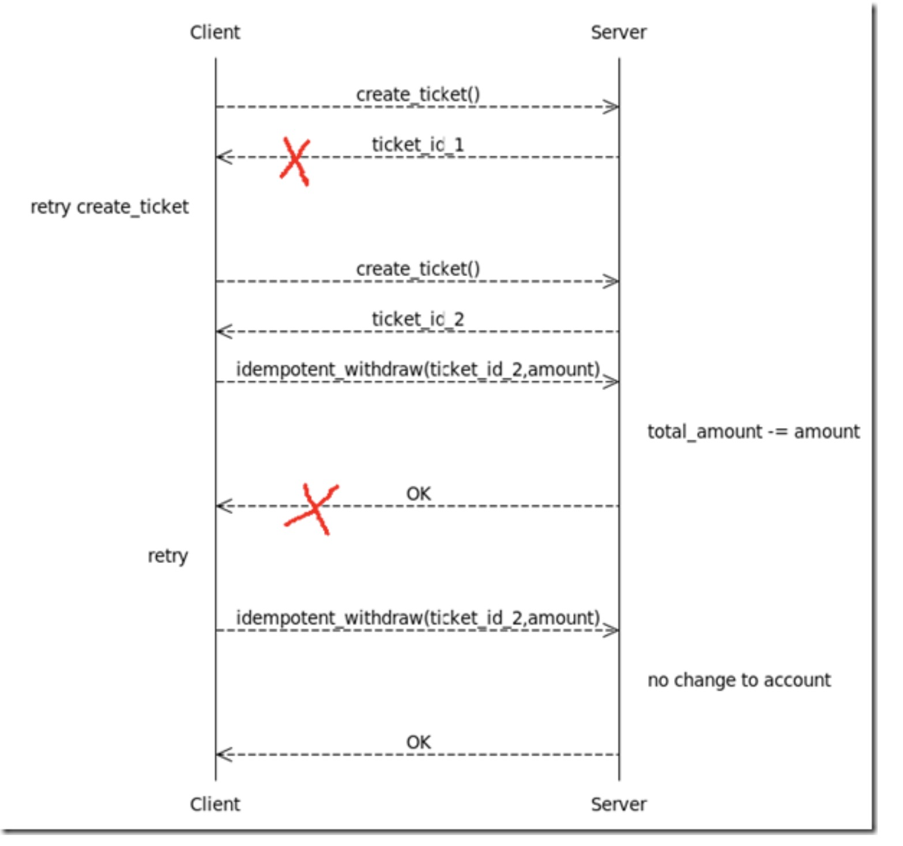

# HTTP - Hypertext Transfer Protocol

## 1. 什么是 http

- HTTP 是 application layer 应用层的传输协议
- 用于定义 WEB 浏览器与 WEB 服务器之间交换数据的过程:  
   客户端连上 WEB 服务器后，若想获得 WEB 服务器中的某个 WEB 资源，需遵守一定的通讯格式，HTTP 协议用于定义客户端与 WEB 服务器通迅的格式。
- HTTP 是一个无状态的协议

## 2. HTTP request message 请求报文

HTTP 请求分为三个部分：请求行、请求头、请求体。类似于下面这样：


- request line 请求行 : method + url + http version
  - method fields includes: _GET, POST, HEAD, PUT, and DELETE_
- header lines 多个消息头
- blank line 一个空行
- entity body

### 2.1 请求方法

HTTP 服务器至少应该实现 GET 和 HEAD 方法，其他方法都是可选的

|     | 方法       | 作用                                                                                                                                        |
| --- | ---------- | ------------------------------------------------------------------------------------------------------------------------------------------- |
| 1   | **GET**    | **请求指定页面信息，并返回实体主体**                                                                                                        |
| 2   | HEAD       | 类似于 GET 请求，只不过返回的响应中没有具体的内容，用于获取报头                                                                             |
| 3   | **POST**   | **向指定资源提交数据进行处理请求（例如提交表单或者上传文件）。数据被包含在请求体中。POST 请求可能会导致新的资源的建立和或已有资源的修改。** |
| 4   | **PUT**    | **从客户端向服务器传送的数据取代指定的文档的内容。**也是**导致新的资源的建立和或已有资源的修改。**                                          |
| 5   | PATCH      | 从客户端向服务器传送的数据取代指定的文档的内容。（部分取代）                                                                                |
| 6   | **DELETE** | **请求服务器删除指定的页面。**                                                                                                              |
| 7   | CONNECT    | HTTP11 协议中预留给能够将连接改为管道方式的代理服务器                                                                                       |
| 8   | OPTIONS    | 允许客户端查看服务器的性能。                                                                                                                |
| 9   | TRACE      | 回显服务器收到的请求，主要用于测试或诊断。                                                                                                  |

### 2.2 URL - Uniform Resource Locator

URL：统一资源定位符，是一种资源位置的抽象唯一识别方法。

组成：<协议>://<主机>:<端口>/<路径>

端口和路径有时可以省略（HTTP 默认端口号是 80，HTTPS 默认端口号是 443）


### 2.3 协议版本

协议版本的格式为：HTTP/主版本号.次版本号，常用的有 HTTP/1.0 和 HTTP/1.1

### 2.4 请求头部

请求头部为请求报文添加了一些附加信息，由“名/值”对组成，每行一对，名和值之间使用冒号分隔。

请求头部的最后会有一个空行，表示请求头部结束，接下来为请求数据。

| 请求头          | 说明                                                                  |
| --------------- | --------------------------------------------------------------------- |
| Host            | 接受请求的服务器地址，可以是 IP:端口号，也可以是域名                  |
| User-Agent      | 发送请求的应用程序名称                                                |
| Connection      | 指定与连接相关的属性，如 Connection:Keep-Alive                        |
| Accept-Charset  | 通知服务端可以发送的编码格式                                          |
| Accept-Encoding | 通知服务端可以发送的数据压缩格式                                      |
| Accept-Language | 通知服务端可以发送的语言                                              |
| Content-Length  | 请求体长度                                                            |
| Content-Type    | 表示请求体中的 MIME 类型（Internet Media Type，互联网媒体类型）信息。 |

**Content-Type 内容**:

常见的媒体格式类型如下：

- text/html ： HTML 格式
- text/plain ：纯文本格式
- text/xml ： XML 格式
- image/gif ：gif 图片格式
- image/jpeg ：jpg 图片格式
- image/png：png 图片格式

**以 application 开头的媒体格式类型：**

- application/xhtml+xml ：XHTML 格式
- application/xml ： XML 数据格式
- application/atom+xml ：Atom XML 聚合格式
- application/json ： JSON 数据格式
- application/pdf ：pdf 格式
- application/msword ： Word 文档格式
- application/octet-stream ： 二进制流数据（如常见的文件下载）
- application/x-www-form-urlencoded ： <form encType="">中默认的 encType，form 表单数据被编码为 key/value 格式发送到服务器（表单默认的提交数据的格式）

另外一种常见的媒体格式是上传文件之时使用的：

- multipart/form-data ： 需要在表单中进行文件上传时，就需要使用该格式

以上就是我们在日常的开发中，经常会用到的若干 content-type 的内容格式。

### 2.5 请求数据 entity body

请求数据不在 GET 方法中使用，而在 POST 方法中使用。POST 法适用于需要客户填写表单的场合。与请求数据相关的最常使用的请求头部是 Content-Type 和 Content-Length。下面是一个 POST 方法的请求报文


## 3. HTTP response message 响应报文

HTTP 响应分为三个部分：状态行、响应头、响应正文。类似于下面这样：


### 3.1 an initial status line 状态行

| **类别** | **原因短语**                                           |
| -------- | ------------------------------------------------------ |
| 1XX      | Informational（信息性状态码） 接受的请求正在处理       |
| 2XX      | Success（成功状态码） 请求正常处理完毕                 |
| 3XX      | Redirection（重定向状态码） 需要进行附加操作以完成请求 |
| 4XX      | Client Error（客户端错误状态码） 服务器无法处理请求    |
| 5XX      | Server Error（服务器错误状态码） 服务器处理请求出错    |

#### 常见状态码

**1XX**

| 状态码和状态信息 | 含义                                                                                                                                           |
| ---------------- | ---------------------------------------------------------------------------------------------------------------------------------------------- |
| 100 continue     | 服务器收到了客户端的请求行和头部信息，告诉客户端继续发送数据部分。客户端通常要先发送 Expect：100-continue 头部字段告诉服务器自己还有数据要发送 |

**2XX**

| 状态码和状态信息    | 含义                                       |
| ------------------- | ------------------------------------------ |
| 200 OK              | 表示从客户端发来的请求在服务器端被正确处理 |
| 204 No content      | 表示请求成功，但响应报文不含实体的主体部分 |
| 206 Partial Content | 进行范围请求成功                           |

**3XX**

| 状态码和状态信息       | 含义                                                                                                                                     |
| ---------------------- | ---------------------------------------------------------------------------------------------------------------------------------------- |
| 301 moved permanently  | 永久性重定向，表示资源已被分配了新的 URL                                                                                                 |
| 302 found              | 临时性重定向，表示资源临时被分配了新的 URL                                                                                               |
| 303 see other          | 表示资源存在着另一个 URL，应使用 GET 方法获取资源（对于 301/302/303 响应，几乎所有浏览器都会删除报文主体并自动用 GET 重新请求）          |
| 304 not modified       | 表示服务器允许访问资源，但请求未满足条件的情况（从服务器告诉客户端，本地缓存的资源和我现在最新的资源是一致的，本地缓存拿出对应资源即可） |
| 307 temporary redirect | 临时重定向，和 302 含义类似，但是期望客户端保持请求方法不变向新的地址发出请求                                                            |

**4XX**

| 状态码和状态信息 | 含义                                                                                                                                                     |
| ---------------- | -------------------------------------------------------------------------------------------------------------------------------------------------------- |
| 400 bad request  | 请求报文存在语法错误， [例如 http1.1 没有 hostname](https://github.com/Cecilia999/interview/blob/main/networking/http_vs_https.md#3-http-10-vs-11-vs-20) |
| 401 unauthorized | 表示发送的请求需要有通过 HTTP 认证的认证信息                                                                                                             |
| 403 forbidden    | 表示对请求资源的访问被服务器拒绝，可在实体主体部分返回原因描述(认证之后权限不足)                                                                         |
| 404 not found    | 表示在服务器上没有找到请求的资源                                                                                                                         |

**5XX**

| 状态码和状态信息         | 含义                                                 |
| ------------------------ | ---------------------------------------------------- |
| 500 internal sever error | 表示服务器端在执行请求时发生了错误                   |
| 501 Not Implemented      | 表示服务器不支持当前请求所需要的某个功能             |
| 503 service unavailable  | 表明服务器暂时处于超负载或正在停机维护，无法处理请求 |

### 3.2 six header lines 响应头部

header lines includes:

> Connection: close  
> Date: Tue, 18 Aug 2015 15:44:04 GMT  
> Server: Apache/2.2.3 (CentOS)  
> Last-Modified: Tue, 18 Aug 2015 15:11:03 GMT  
> Content-Length: 6821  
> Content-Type: text/html

### 3.3 entity body 响应数据


## 4. HTTP 中的 idempotence - 幂等性

**Idempotence** - is any function that can be executed several times without changing the final result beyond its first iteration.

**幂等（idempotence）**是个数学与计算机学概念，常见于抽象代数中。
在编程中，一个幂等操作的特点是其**任意多次执行**所产生的影响均**与一次执行的影响相同**。幂等函数，或幂等方法，是指可以使用相同参数重复执行，并能获得相同结果的函数。这些函数不会影响系统状态，也不用担心重复执行会对系统造成改变。

例如，“getUsername()和 setTrue()”函数就是一个幂等函数，只要我们不改变资源内容，得到的都是同样的结果

更复杂的操作幂等保证是利用**唯一交易号（流水号）**实现

从定义上看，**HTTP 方法的幂等性是指一次和多次请求某一个资源应该具有同样的副作用**。说白了就是，**同一个请求，发送一次和发送 N 次效果是一样的。**

### 4.1 取钱案例

常见的一个幂等性的案例就是从银行账户中取钱：

```
withdraw(account id，amount)
```

如果扣除成功返回 true，账户余额减少 amount；如果扣除失败则返回 false，账户余额不变。

值得注意的是：和本地环境相比，我们不能轻易假设分布式环境的可靠性。

一种典型的情况是 withdraw 请求已经被服务器端正确处理，但服务器端的返回结果由于网络等原因被掉丢了(丢包)，导致客户端无法得知处理结果。如果是在网页上，一些不恰当的设计可能会使用户认为上一次操作失败了，然后刷新页面，这就导致了 withdraw 被调用两次，账户也被多扣了一次钱。


### 4.1.1 分布式事务 vs 幂等设计

解决方案：

1. 采用**分布式事务**，通过引入支持分布式事务的**中间件**来保证 withdraw 功能的事务性。

   - 分布式事务的优点是对于调用者很简单，复杂性都交给了中间件来管理。
   - 缺点则是一方面架构太重量级，容易被绑在特定的中间件上，不利于异构系统的集成；另一方面分布式事务虽然能保证事务的 ACID 性质，而但却无法提供性能和可用性的保证。

2. 另一种更轻量级的解决方案是**幂等设计**。我们可以通过一些技巧把 withdraw 变成幂等的。

```
int create_ticket() 	//获取一个服务器端生成的唯一的处理号 ticket id
bool idempotent_withdraw(ticket_id, account id, amount)
```

create_ticket 的语义是获取一个服务器端生成的唯一的处理号 ticket_id，它将用于标识后续的操作。idempotent withdraw 和 withdraw 的区别在于关联了个 ticket_id，**一个 ticketid 表示的操作至多只会被处理一次，每次调用都将返回第一次调用时的处理结果**。这样，idempotent_withdraw 就符合幂等性了，客户端就可以放心地多次调用

基于幂等性的解决方案中一个完整的取钱流程被分解成了两个步骤：1.调用 create\*ticket()获取 ticket_id；2.调用 idempotent_withdraw(ticket_id, account_id, amount)。虽然 create_ticket 不是幂等的，但在这种设计下，它对系统状态的影响可以忽略，加上 idempotent_withdraw 是幂等的，所以任何一步由于网络等原因失败或超时，客户端都可以重试，直到获得结果。如图：



### 4.2 请求方法的 idempotence 幂等性

1. HTTP GET 方法用于获取资源，不应有副作用，所以是幂等的。比如：_GET http://www.bank.com/account/123456_， 不会改变资源的状态，不论调用一次还是 N 次都没有副作用。请注意，这里强调的是一次和 N 次具有相同的副作用，而不是每次 GET 的结果相同。_GET http://www.news.com/latest-news_， 这个 HTTP 请求可能会每次得到不同的结果，但它本身并没有产生任何副作用，因而是满足幂等性的。

2. HTTP DELETE 方法用于删除资源，有副作用，但它应该满足幂等性。比如：DELETE http://www.forum.com/article/4231， 调用一次和 N 次对系统产生的副作用是相同的，即删掉 id 为 4231 的帖子；因此，调用者可以多次调用或刷新页面而不必担心引起错误。

3. 比较容易混淆的是 HTTP POST 和 PUT。POST 和 PUT 的区别容易被简单地误认为“POST 表示创建资源，PUT 表示更新资源”；而实际上，二者均可用于创建资源，更为本质的差别是在幂等性方面。在 HTTP 规范中对 POST 和 PUT 是这样定义的：

- The POST method is used to request that the origin server accept the entity enclosed in the request as a new subordinate of the resource identified by the Request-URI in the Request-Line ...... If a resource has been created on the origin server, the response SHOULD be 201 (Created) and contain an entity which describes the status of the request and refers to the new resource, and a Location header.

- The PUT method requests that the enclosed entity be stored under the supplied Request-URI. If the Request-URI refers to an already existing resource, the enclosed entity SHOULD be considered as a modified version of the one residing on the origin server. If the Request-URI does not point to an existing resource, and that URI is capable of being defined as a new resource by the requesting user agent, the origin server can create the resource with that URI.

- POST 所对应的 URL 并非创建的资源本身，而是资源的接收者。比如：_POST http://www.forum.com/articles_ 的语义是在 http://www.forum.com/articles 下创建一篇帖子，HTTP 响应中应包含帖子的创建状态以及帖子的 URL。两次相同的 POST 请求会在服务器端创建两份资源，它们具有不同的 URL；所以，POST 方法不具备幂等性。而 PUT 所对应的 URL 是要创建或更新的资源本身。比如：_PUT http://www.forum/articles/4231_ 的语义是创建或更新 ID 为 4231 的帖子。对同一 URL 进行多次 PUT 的副作用和一次 PUT 是相同的；因此，PUT 方法具有幂等性。

在介绍了几种操作的语义和幂等性之后，我们来看看如何通过 Web API 的形式实现前面所提到的取款功能。

1. 用 POST /tickets 来实现 create_ticket；
2. 用 PUT /accounts/account_id/ticket_id?amount=xxx 来实现 idempotent_withdraw。

值得注意的是严格来讲 amount 参数不应该作为 URL 的一部分，真正的 URL 应该是/accounts/account_id/ticket_id，而 amount 应该放在请求的 body 中。这种模式可以应用于很多场合，比如：论坛网站中防止意外的重复发帖。

## 5. 请求方法的区别

### 5.1 GET 与 POST 区别

1. Get 是不安全的，因为在传输过程，数据被放在请求的 URL 中（也可以藏在 request body 里，取决于服务器处不处理）；Post 的所有操作对用户来说都是不可见的。 但是这种做法也不时绝对的，大部分人的做法也是按照上面的说法来的，但是也可以在 get 请求加上 request body，给 post 请求带上 URL 参数。

2. Get 请求提交的 url 中的数据通常最多只能是 2KB，这个限制是浏览器或者服务器给添加的（大多数浏览器最多处理 64KB 的 url），http 协议并没有对 url 长度进行限制，目的是为了保证服务器和浏览器能够正常运行，防止有人恶意发送请求。Post 请求则没有大小限制。

3. 对参数的数据类型，GET 只接受 ASCII 字符，而 POST 没有限制。

4. GET 请求会被浏览器主动 cache 缓存，而 POST 不会，除非手动设置。

5. GET 产生一个 TCP 数据包；POST 产生两个 TCP 数据包。因此 GET 会比 POST 更高效一些。（一次请求，分两个包数据包发送）

   - 对于 GET 方式的请求，浏览器会把 http header 和 data 一并发送出去，服务器响应 200（返回数据）；
   - 而对于 POST，浏览器先发送 header，服务器响应 100 continue，浏览器再发送 data，服务器响应 200 ok（返回数据）。

6. GET 是幂等的，POST 不是幂等的

### 5.2 POST 与 PUT 区别

POST 方法和 PUT 方法都可以对一个资源进行创建或者修改，根本区别在于 POST 方法不是幂等的，而 PUT 方法满足幂等性。

## 6. HTTP 各版本区别

看： https://zzero049.github.io/Blog/#/backend/%E5%90%8E%E7%AB%AF%E7%96%91%E9%9A%BE%E7%9F%A5%E8%AF%86/Web%E4%B8%8E%E8%AE%A1%E7%BD%91/HTTP%E5%8D%8F%E8%AE%AE?id=http%e5%90%84%e7%89%88%e6%9c%ac%e5%8c%ba%e5%88%ab

### 6.1 HTTP 1.0 - 短连接

1. 连接无法复用: HTTP1.0 是无状态无连接的应用层协议，每次请求都要创建新的 TCP 连接，三次握手，请求完成后断开连接（无连接），服务器不跟踪每个客户端也不记录过去的请求（无状态）
   网页使用了许多资源：HTML、样式表、脚本、图片等等，每个资源都要创建 tcp 连接去请求然后断开链接

2. head of line blocking: 健康的请求会被不健康的请求阻塞

### 6.2 HTTP 1.1

1. Persistent Connection 长连接:

   - HTTP1.1 支持长连接，在一个 TCP 连接上可以传送多个 HTTP 请求和响应，减少了建立和关闭连接的消耗和延迟
   - 在 HTTP1.1 中默认开启长连接 Connection 请求头的值为 Keep-Alive，客户端通知服务器返回本次请求结果后保持连接；当 Connection 请求头的值设置为 close 时，客户端通知服务器返回本次请求结果后关闭连接

2. 管线化，客户端可以同时发出多个 HTTP 请求，而不用一个个等待响应

   - **HTTP 1.1 允许客户端不用等待上一次请求结果返回，就可以发出下一次请求，但服务器端必须按照接收到客户端请求的先后顺序依次回送响应结果，**以保证客户端能够区分出每次请求的响应内容，这样也显著地减少了整个下载过程所需要的时间。

3. 节约带宽 -->> **断点续传**

   - HTTP1.0 中存在一些浪费带宽的现象，例如客户端只是需要某个对象的一部分，而服务器却将整个对象送过来了
   - HTTP1.0 不支持断点续传功能, HTTP/1.0 每次传送文件都是从文件头开始，即 0 字节处开始。HTTP/1.1 新增了 **RANGE:bytes=XXXX** 表示要求服务器从文件 XXXX 字节处开始传送
   - HTTP1.1 支持只发送 header 信息（不带任何 body 信息）
     如果服务器认为客户端有权限请求服务器(POST)，则返回 100，客户端接收到 100 才开始把请求 body 发送到服务器；  
     如果返回 401，客户端就可以不用发送请求 body 了节约了带宽。

4. hostname

   - 在 HTTP1.0 中认为每台服务器都绑定一个唯一的 IP 地址，因此，请求消息中的 URL 并没有传递主机名（hostname），HTTP1.0 没有 host 域。
   - 随着虚拟主机技术的发展，在一台物理服务器上可以存在多个虚拟主机（Multi-homed Web Servers），并且它们共享一个 IP 地址。HTTP1.1 的请求消息和响应消息都支持 host 域，且**请求消息中如果没有 host 域会报告一个错误（400 Bad Request）**。

#### 6.2.1 移动 app 上的困难

一段时间内的连接复用对 PC 端浏览器的体验帮助很大，因为大部分的请求在集中在一小段时间以内。但对移动 app 来说，成效不大，app 端的请求比较分散且时间跨度相对较大。所以移动端 app 一般会从应用层寻求其它解决方案，长连接方案或者伪长连接方案：

1. 方案一：基于 tcp 的长链接

现在越来越多的移动端 app 都会建立一条自己的长链接通道，通道的实现是基于 tcp 协议。基于 tcp 的 socket 编程技术难度相对复杂很多，而且需要自己制定协议，但带来的回报也很大。信息的上报和推送变得更及时，在请求量爆发的时间点还能减轻服务器压力（http 短连接模式会频繁的创建和销毁连接）。不止是 IM app 有这样的通道，像淘宝这类电商类 app 都有自己的专属长连接通道了。现在业界也有不少成熟的方案可供选择了，google 的 protobuf 就是其中之一。

2. 方案二：http long-polling（推送）

客户端在初始状态就会发送一个 polling（轮寻）请求到服务器，服务器并不会马上返回业务数据，而是等待有新的业务数据产生的时候再返回。所以连接会一直被保持，一旦结束马上又会发起一个新的 polling 请求，如此反复，所以一直会有一个连接被保持。服务器有新的内容产生的时候，并不需要等待客户端建立一个新的连接。做法虽然简单，但有些难题需要攻克才能实现稳定可靠的业务框架： 和传统的 http 短链接相比，长连接会在用户增长的时候极大的增加服务器压力， 移动端网络环境复杂，像 wifi 和 4g 的网络切换，进电梯导致网络临时断掉等，这些场景都需要考虑怎么重建健康的连接通道。这种 polling 的方式稳定性并不好，需要做好数据可靠性的保证，比如重发和 ack 机制（ACK 是一个对数据包的确认，当正确收到数据包后，接收端会发送一个 ACk 给发送端，里面会说明对那个数据包进行确认，每个数据包里都会有一个序列号，如果收到的数据包有误，或错序，还会申请重发，NAK 是一个否定的回答，ACK 是确定回答，这样保证数据的正确传输）。

polling 的 response 有可能会被中间代理 cache 住，要处理好业务数据的过期机制。long-polling 方式还有一些缺点是无法克服的，比如每次新的请求都会带上重复的 header 信息，还有数据通道是单向的，主动权掌握在 server 这边，客户端有新的业务请求的时候无法及时传送。

3. 方案三：http streaming

同 long-polling 不同的是，server 并不会结束初始的 streaming 请求，而是持续的通过这个通道返回最新的业务数据。显然这个数据通道也是单向的。streaming 是通过在 server response 的头部里增加”Transfer Encoding: chunked”来告诉客户端后续还会有新的数据到来。除了和 long－polling 相同的难点之外，streaming 还有几个缺陷：有些代理服务器会等待服务器的 response 结束之后才会将结果推送到请求客户端。对于 streaming 这种永远不会结束的方式来说，客户端就会一直处于等待 response 的过程中。业务数据无法按照请求来做分割，所以客户端每收到一块数据都需要自己做协议解析，也就是说要做自己的协议定制。streaming 不会产生重复的 header 数据。

4. 方案四：web socket

WebSocket 和传统的 tcp socket 连接相似，也是基于 tcp 协议，提供双向的数据通道。WebSocket 优势在于提供了 message 的概念，比基于字节流的 tcp socket 使用更简单，同时又提供了传统的 http 所缺少的长连接功能。不过 WebSocket 相对较新，2010 年才起草，并不是所有的浏览器都提供了支持。各大浏览器厂商最新的版本都提供了支持。

### 6.3 HTTP 2.0

1. multiplexing 多路复用  
   支持同一个连接并发处理多个请求.  
   **原来是同一个 TCP 连接里面，上一个回应（response）发送完了，服务器才能发送下一个, 现在可以多个回应一起发送。**

2. 二进制分帧（采用二进制格式的编码将其封装）

3. Header Compression 头部数据压缩  
   1.1 只压缩 entity body，不支持 header 的数据压缩。2.0 压缩 header 数据体积小了，在网络上传输就会更快。
4. server push 服务器推送  
   

服务端推送是一种在客户端请求之前发送数据的机制。  
 网页使用了许多资源：HTML、样式表、脚本、图片等等。在 HTTP1.1 中这些资源每一个都必须明确地请求。这是一个很慢的过程。浏览器从获取 HTML 开始，然后在它解析和评估页面的时候，增量地获取更多的资源。因为服务器必须等待浏览器做每一个请求，网络经常是空闲的和未充分使用的。

为了改善延迟，HTTP2.0 引入了 server push，它允许服务端推送资源给浏览器，在浏览器明确地请求之前，免得客户端再次创建连接发送请求到服务器端获取。这样客户端可以直接从本地加载这些资源，不用再通过网络。

## 7. http 面试问题

### 7.1 现代浏览器在与服务器建立了一个 TCP 连接后是否会在一个 HTTP 请求完成后断开？什么情况下会断开？

不会，默认开启长链接，只有在请求报头中声明 Connection: close 才会在请求完成后关闭连接。

### 7.2 一个 TCP 连接可以对应几个 HTTP 请求？

多个

### 7.3 一个 TCP 连接中 HTTP 请求发送可以一起发送么（比如一起发三个请求，再三个响应一起接收）？
