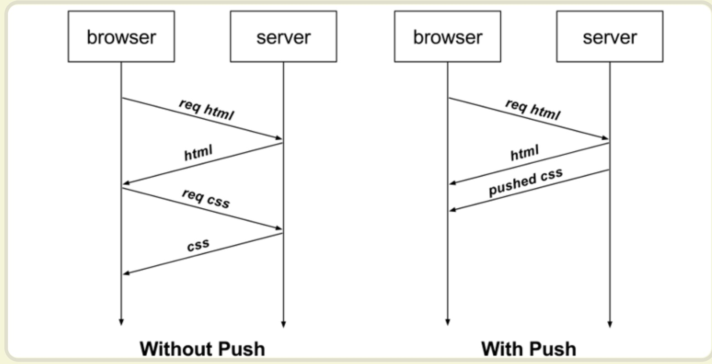
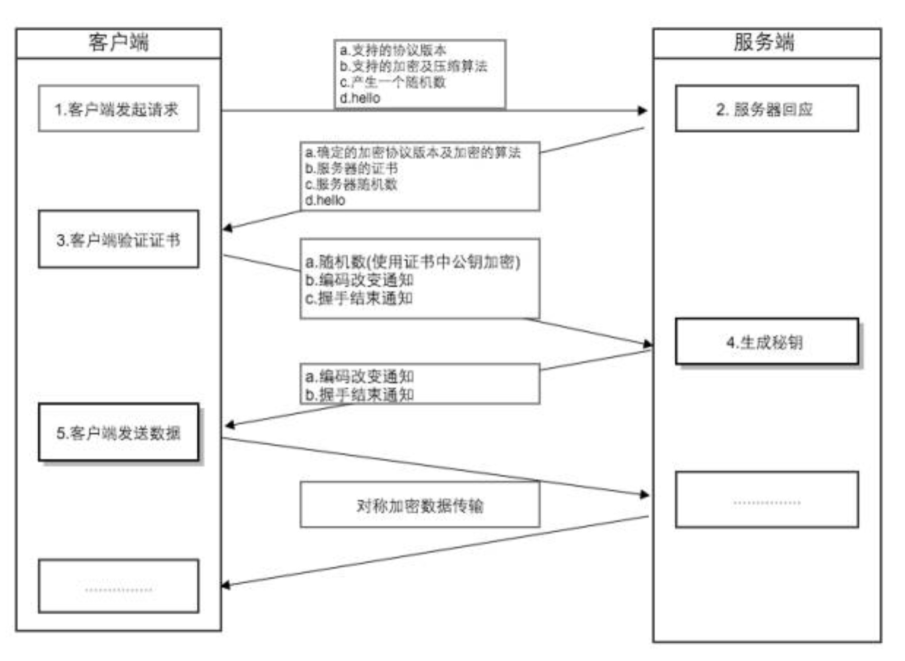

# HTTP VS HTTPS

## HTTP - Hypertext Transfer Protocol

### 1. 什么是 http

- HTTP 是 application layer 应用层的传输协议
- 用于定义 WEB 浏览器与 WEB 服务器之间交换数据的过程:  
   客户端连上 WEB 服务器后，若想获得 WEB 服务器中的某个 WEB 资源，需遵守一定的通讯格式，HTTP 协议用于定义客户端与 WEB 服务器通迅的格式。
- HTTP 是一个无状态的协议

### 2. HTTP 请求 & 响应

**HTTP request message includes：**

- request line 请求行 : method + url + http version
  - method fields includes: _GET, POST, HEAD, PUT, and DELETE_
- header lines 多个消息头
- blank line 一个空行
- entity body

**HTTP response message includes：**

- an initial status line 状态行
  - status code includes:
    - 200 OK
    - 301 Moved Permanently 为了完成请求，客户端需要进一步细化请求。例如，请求的资源已经移动到一个新的地址
    - 400 Bad Request 客户端请求有误
    - 404 Not Found 请求的 document 不存在
    - 500 Server Internal Error 服务端出现错误
- six header lines

  - header lines includes:
    > Connection: close
    > Date: Tue, 18 Aug 2015 15:44:04 GMT
    > Server: Apache/2.2.3 (CentOS)
    > Last-Modified: Tue, 18 Aug 2015 15:11:03 GMT
    > Content-Length: 6821
    > Content-Type: text/html

- entity body

### 3. HTTP 1.0 vs 1.1 vs 2.0

1. http 1.0

   每次请求都要创建新的连接，三次握手，请求完成后断开连接

2. http 1.1

   - Persistent Connection 长连接:  
      HTTP1.1 支持长连接，在一个 TCP 连接上可以传送多个 HTTP 请求和响应，减少了建立和关闭连接的消耗和延迟  
      在 HTTP1.1 中默认开启长连接 keep-alive，一定程度上弥补了 HTTP1.0 每次请求都要创建连接的缺点。
   - 节约带宽
     - HTTP1.0 中存在一些浪费带宽的现象，例如客户端只是需要某个对象的一部分，而服务器却将整个对象送过来了
     - HTTP1.0 不支持断点续传功能。HTTP1.1 支持只发送 header 信息（不带任何 body 信息）
       如果服务器认为客户端有权限请求服务器，则返回 100，客户端接收到 100 才开始把请求 body 发送到服务器；  
       如果返回 401，客户端就可以不用发送请求 body 了节约了带宽。
   - hostname  
     在 HTTP1.0 中认为每台服务器都绑定一个唯一的 IP 地址，因此，请求消息中的 URL 并没有传递主机名（hostname），HTTP1.0 没有 host 域。随着虚拟主机技术的发展，在一台物理服务器上可以存在多个虚拟主机（Multi-homed Web Servers），并且它们共享一个 IP 地址。HTTP1.1 的请求消息和响应消息都支持 host 域，且请求消息中如果没有 host 域会报告一个错误（400 Bad Request）。

   - 缓存处理
     在 HTTP1.0 中主要使用 header 里的 If-Modified-Since,Expires 来做为缓存判断的标准，HTTP1.1 则引入了更多的缓存控制策略例如 Entity tag，If-Unmodified-Since, If-Match, If-None-Match 等更多可供选择的缓存头来控制缓存策略。
   - 错误通知的管理
     增加了更多错误状态响应码

3. http 2.0

   - multiplexing 多路复用
     支持同一个连接并发处理多个请求.  
     _原来是同一个 TCP 连接里面，上一个回应（response）发送完了，服务器才能发送下一个, 现在可以多个回应一起发送。_
   - 头部数据压缩
     1.1 只压缩 entity body，不支持 header 的数据压缩。2.0 压缩 header 数据体积小了，在网络上传输就会更快。
   - server push 服务器推送
     

     服务端推送是一种在客户端请求之前发送数据的机制。  
     网页使用了许多资源：HTML、样式表、脚本、图片等等。在 HTTP1.1 中这些资源每一个都必须明确地请求。这是一个很慢的过程。浏览器从获取 HTML 开始，然后在它解析和评估页面的时候，增量地获取更多的资源。因为服务器必须等待浏览器做每一个请求，网络经常是空闲的和未充分使用的。

     为了改善延迟，HTTP2.0 引入了 server push，它允许服务端推送资源给浏览器，在浏览器明确地请求之前，免得客户端再次 创建连接发送请求到服务器端获取。这样客户端可以直接从本地加载这些资源，不用再通过网络。

## HTTPs - Hypertext Transfer Protocol Security Socket Laryer

### 1. 什么是 https

简单来说就是在 HTTP 下加入 SSL 层，HTTPS 的安全基础是 SSL，因此加密的详细内容就需要 SSL

### 2. https 的作用

- 内容加密 Confidentiality: 建立一个信息安全通道，来保证数据传输的安全；
- 身份认证 End-point authentication: 确认网站的真实性
- 数据完整性 Message integrity: 防止内容被第三方冒充或者篡改

### 3. https 相比 http 的劣势

**对数据进行加解密决定了它比 http 慢**: 需要进行非对称的加解密，且需要三次握手。首次连接比较慢点，当然现在也有很多的优化。

出于安全考虑，浏览器不会在本地保存 HTTPS 缓存。实际上，只要在 HTTP 头中使用特定命令，HTTPS 是可以缓存的。Firefox 默认只在内存中缓存 HTTPS。但是，只要头命令中有 Cache-Control: Public，缓存就会被写到硬盘上。 IE 只要 http 头允许就可以缓存 https 内容，缓存策略与是否使用 HTTPS 协议无关。

### 4. https vs http

1. https 协议需要到 CA 申请证书。
2. http 是超文本传输协议，信息是明文传输；https 则是具有安全性的 ssl 加密传输协议。
3. http 和 https 使用的是完全不同的连接方式，用的端口也不一样，前者是 80，后者是 443。
4. http 的连接很简单，是无状态的；HTTPS 协议是由 SSL/TSL+HTTP 协议构建的可进行加密传输、身份认证的网络协议，比 http 协议安全。
5. http 默认使用 80 端口，https 默认使用 443 端口

### 5. 加密相关的知识

1. 对称加密  
   对称加密(也叫私钥加密)指加密和解密使用相同密钥的加密算法。
2. 非对称加密  
   与对称加密算法不同，非对称加密算法需要两个密钥：公开密钥（publickey）和私有密钥（privatekey）

3. hash function 摘要算法  
   就是一个 function H() take an input m become a fixed size H(m) and it is impossible to find what m is with given H(m). Even a single letter change in message m will caused H(m) totally different.  
   hash function 是 https 能确保数据完整性和防篡改的根本原因

4. message authentication code 消息认证码  
   用 hash fucntion 只能保证 message integrity, 但不能验证对方的身份。如果 a 和 b 进行通信，a 和 b 需要一个 shared secret s. 应该用 m+s instead of m.  
   H(m+s) is called the message authentication code (MAC).

5. digital signature 数字签名

   - 数字签名技术就是对“非对称密钥加解密”和“数字摘要“两项技术的应用，**它将 hash(m)用发送者的私钥加密**，与原文 m 一起传送给接收者。这个部分就是数字签名！
   - 接收者只有用发送者的公钥才能解密被加密的摘要信息，然后用 HASH 函数对收到的原文产生一个摘要信息，与解密的摘要信息对比。如果相同，则说明收到的信息是完整的，在传输过程中没有被修改，否则说明信息被修改过，因此数字签名能够验证信息的完整性。

   **数字签名的过程如下：**  
   明文 --> hash 运算 --> 摘要 --> 私钥加密 --> 数字签名  
   **数字签名有两种功效：**  
   一、能确定消息确实是由发送方签名并发出来的，因为别人假冒不了发送方的签名。  
   二、数字签名能确定消息的完整性，_数据本身是否加密不属于数字签名的控制范围_

6. digital certificate 数字证书

为了防止 attacker 把他自己的 public key 替换用户电脑里别人的 public key.
所以 server 端要去 Certification Authority (CA)证书授权中心为自己的公钥做公证，CA 会用自己的私钥，对 server 端的公钥和一些相关信息一起加密，生成"数字证书"（Digital Certificate）  
之后 server 给 client 发送消息附上它的数字证书就可以了，client 用 CA 的公钥就可以解开数字证书，得到 server 端的公钥了。

### 6. SSL/TLS： Secure Socket Layer 安全套接字层 / Transfer Layer Security 传输层安全协议

1. 什么是 SSL？ - Secure Socket Layer

SSL 协议位于 TCP/IP 协议与各种应用层协议之间，为数据通讯提供安全支持。  
SSL 协议可分为两层：

- **SSL 记录协议（SSL Record Protocol）**：它建立在可靠的传输协议（如 TCP）之上，为高层协议提供数据封装、压缩、加密等基本功能的支持。
- **SSL 握手协议（SSL Handshake Protocol）**：它建立在 SSL 记录协议之上，用于在实际的数据传输开始前，通讯双方进行身份认证、协商加密算法、交换加密密钥等。

2. 什么是 TLS? - Transfer Layer Security

   它建立在 SSL 3.0 协议规范之上，是 SSL 3.0 的后续版本，可以理解为 SSL 3.1。  
   该协议由两层组成： TLS 记录协议（TLS Record）和 TLS 握手协议（TLS Handshake）

3. SSL/TLS 协议作用：

- end-point authentication: 认证用户和服务器，确保数据发送到正确的客户机和服务器
- Confidentiality: 加密数据以防止数据中途被窃取
- message integrity: 维护数据的完整性，确保数据在传输过程中不被改变

### 参考

- https://www.cnblogs.com/andy-zhou/p/5345003.html
- SSL/TLS 原理 详细整理版： https://blog.csdn.net/alinyua/article/details/79476365
- ssl 原理详解：https://blog.csdn.net/qq_38265137/article/details/90112705
- 数字签名过程：https://blog.csdn.net/zmx729618/article/details/78485665
