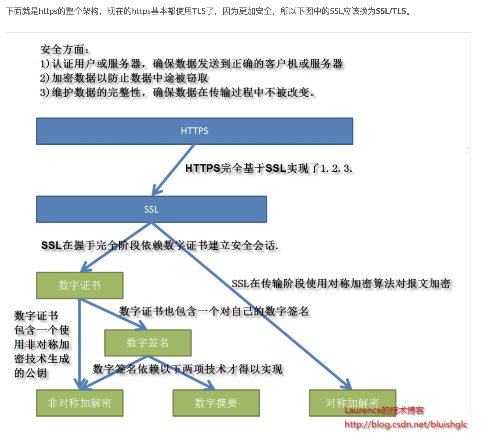
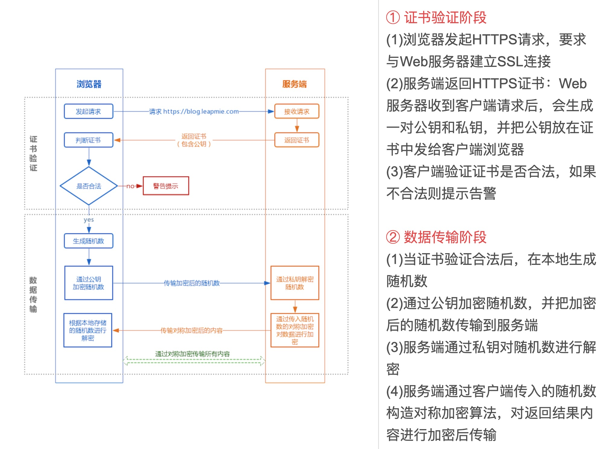
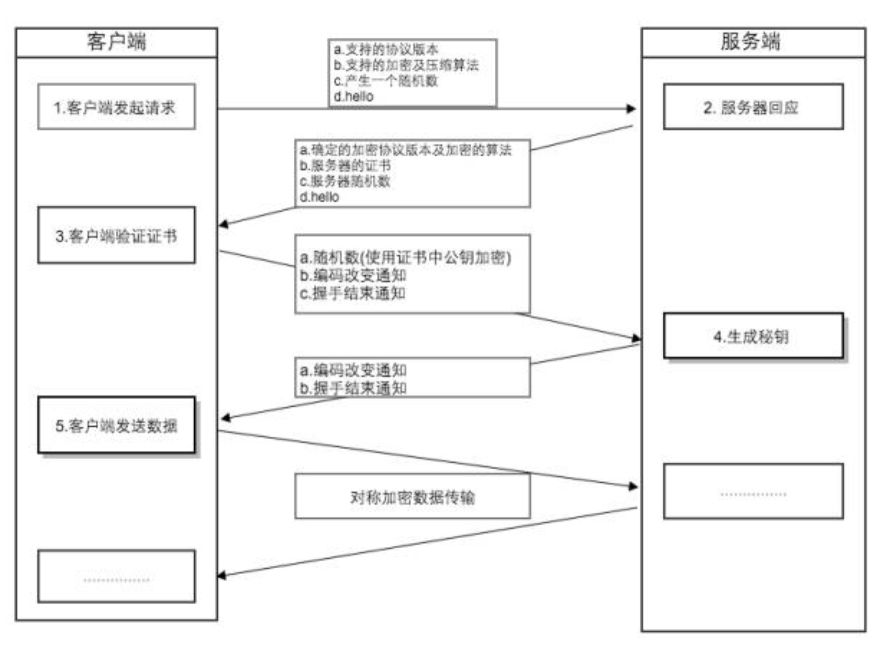
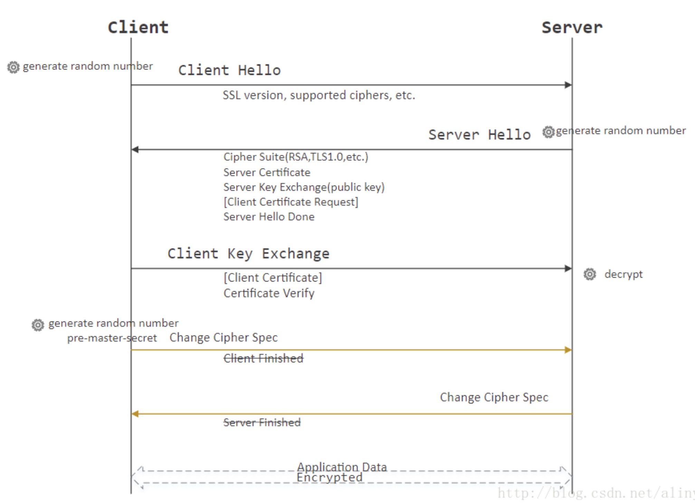

# HTTPS - Hypertext Transfer Protocol Secure Socket Laryer

## 1. 什么是 https

**HTTPS = HTTP + 加密 + 认证 + 完整性保护**

通过在在 HTTP 下加入 SSL(Secure Socket Laryer)/TLS(Transfer Layer Security) 层实现，SSL/TLS 是独立于 HTTP 的协议。

## 2. https 的作用

- 内容加密 Confidentiality: 建立一个信息安全通道，来保证数据传输的安全；
- 身份认证 End-point authentication: 确认网站的真实性
- 数据完整性 Message integrity: 防止内容被第三方冒充或者篡改

## 3. https vs http 区别/优缺点

1. 加密

   - **http 通信都是明文**，数据在客户端与服务器通信过程中，任何一点都可能被劫持。比如，发送了银行卡号和密码，hacker 劫取到数据，就能看到卡号和密码，这是很危险的。
   - https 采用了非对称加密+对称加密的方式，即使数据被监听也不容易解密

2. 身份认证

   - http 不验证通信方身份，可能遭到伪装
   - https 会在数据传输前进行 CA 证书验证。通信双方携带 CA 证书，CA 证书相当于身份证，有 CA 证书就认为合法，没有 CA 证书就认为非法，CA 证书由第三方颁布，很难伪造

3. 数据完整性验证

   - http 无法验证数据的完整性，如果数据的一部分被篡改，接受方无法得知
   - https 使用 digital signature 数字签名来验证数据的完整性 (数字签名 = 非对称密钥加解密”+“数字摘要)

4. **https 比 http 慢**

   - 加密解密耗时
   - 首次连接 http = tcp 握手，https = tcp 握手 + ssl 握手

5. 缓存问题

   出于安全考虑，浏览器不会在本地保存 HTTPS 缓存。实际上，只要在 HTTP 头中使用特定命令，HTTPS 是可以缓存的。Firefox 默认只在内存中缓存 HTTPS。但是，只要头命令中有 Cache-Control: Public，缓存就会被写到硬盘上。 IE 只要 http 头允许就可以缓存 https 内容，缓存策略与是否使用 HTTPS 协议无关。

## 5. 加密相关的知识

### 5.1 基本的单向加密算法

（不可逆地进行加密，每个原值加密后都一样，破解的原理是用字符集去逐个进行比对）：

- **BASE64** 严格地说，属于==编码格式==，而非加密算法
- **MD5**(Message Digest algorithm 5，信息摘要算法)
- **SHA**(Secure Hash Algorithm，安全散列算法)
- HMAC(Hash Message Authentication Code，散列消息鉴别码)

### 5.2 对称加密（AES、DES、PBE） vs 非对称加密（RSA）

1. 对称加密(也叫**私钥**加密、共享密钥加密)

   指加密和解密使用相同密钥的加密算法。即信息的发送方和接收方使用同一个密钥去加密和解密数据。对称加密的特点是算法公开、加密和解密速度快，适合于对大数据量进行加密。缺点是如果 hacker 拿到 private key 就可以解密盗取/篡改。

   **对称加密过程**

   - 加密过程：明文 + 加密算法 + 私钥 => 密文
   - 解密过程：密文 + 解密算法 + 私钥 => 明文

2. 非对称加密(也叫公钥加密)

   与对称加密算法不同，非对称加密算法需要两个密钥：公开密钥（publickey）和私有密钥（privatekey）。发送放用接受方的公钥加密，接受方用自己的私钥解密。非对称加密的缺点是加密和解密花费时间长、速度慢，只适合对少量数据进行加密。还有一个问题是如果不进行身份验证，hacker 伪装成接收方把自己的公钥发给发送方，也可以盗取信息。

   **非对称加密过程：**

   - 被公钥加密过的密文只能被私钥解密，过程如下：
     明文 + 加密算法 + 公钥 => 密文， 密文 + 解密算法 + 私钥 => 明文
   - 被私钥加密过的密文只能被公钥解密，过程如下：
     明文 + 加密算法 + 私钥 => 密文， 密文 + 解密算法 + 公钥 => 明文

3. 常见的对称加密和非对称加密

- DES(Data Encryption Standard，数据加密算法)
- PBE(Password-based encryption，基于密码验证)
- **AES（Advanced Encryption Standard）**：使用同一个共享秘钥，加密解密，稍微快点
- **RSA(Ron Rivest, AdiShamir 和 Leonard Adleman)**：非对称加密，生成秘钥对，公钥加密只有私钥可见，私钥加密公钥皆可见，稍微慢点
- DH(Diffie-Hellman 算法，密钥一致协议)
- DSA(Digital Signature Algorithm，数字签名)

4. **https 采用的是用非对称加密进行身份验证，用对称加密进行数据传输**

SSL 协议在握手阶段使用的是非对称加密，在传输阶段使用的是对称加密。因为非对称加密算法非常耗时，速度很慢，这种混合加密方式平衡了对称和非对称加密的优缺点

### 5.3 hash function 摘要算法

就是一个 function H() take an input m become a fixed size H(m) and it is impossible to find what m is with given H(m). Even a single letter change in message m will caused H(m) totally different.  
 hash function 是 https 能确保数据完整性和防篡改的根本原因

### 5.4 message authentication code 消息认证码

用 hash fucntion 只能保证 message integrity, 但不能验证对方的身份。如果 a 和 b 进行通信，a 和 b 需要一个 shared secret s. 应该用 m+s instead of m.  
 H(m+s) is called the message authentication code (MAC).

### 5.5 digital signature 数字签名

- 数字签名技术就是对“非对称密钥加解密”和“数字摘要“两项技术的应用，**它将 hash(m)用发送者的私钥加密**，与原文 m 一起传送给接收者。这个部分就是数字签名！
- 接收者只有用发送者的公钥才能解密被加密的摘要信息，然后用 HASH 函数对收到的原文产生一个摘要信息，与解密的摘要信息对比。如果相同，则说明收到的信息是完整的，在传输过程中没有被修改，否则说明信息被修改过，因此数字签名能够验证信息的完整性。

**数字签名的过程如下：**  
 明文 --> hash 运算 --> 摘要 --> 私钥加密 --> 数字签名  
 **数字签名有两种功效：**  
 一、能确定消息确实是由发送方签名并发出来的，因为别人假冒不了发送方的签名。  
 二、数字签名能确定消息的完整性，_数据本身是否加密不属于数字签名的控制范围_

### 5.6 digital certificate 数字证书

为了防止 attacker 把他自己的 public key 替换用户电脑里别人的 public key.
所以 server 端要去 Certification Authority (CA)证书授权中心为自己的公钥做公证，CA 会用自己的私钥，对 server 端的公钥和一些相关信息一起加密，生成"数字证书"（Digital Certificate）  
之后 server 给 client 发送消息附上它的数字证书就可以了，client 用 CA 的公钥就可以解开数字证书，得到 server 端的公钥了。

## 6. SSL/TLS： Secure Socket Layer 安全套接字层 / Transfer Layer Security 传输层安全协议

### 6.1 什么是 SSL？ - Secure Socket Layer

SSL 协议位于 TCP/IP 协议与各种应用层协议之间，为数据通讯提供安全支持。  
 SSL 协议可分为两层：

- **SSL 记录协议（SSL Record Protocol）**：它建立在可靠的传输协议（如 TCP）之上，为高层协议提供数据封装、压缩、加密等基本功能的支持。
- **SSL 握手协议（SSL Handshake Protocol）**：它建立在 SSL 记录协议之上，用于在实际的数据传输开始前，通讯双方进行**身份认证、协商加密算法、交换加密密钥等**。

### 6.1 SSL Handshake 完整的过程：

​ **1. 客户端发起 HTTPS 请求**

这个没什么好说的，就是用户在浏览器里输入一个 https 网址，然后连接到 server 的 443 端口。

**2. 服务端的配置**

采用 HTTPS 协议的服务器必须要有一套数字证书，可以自己制作，也可以向组织申请。区别就是自己颁发的证书需要客户端验证通过，才可以继续访问，而使用受信任的公司申请的证书则不会弹出提示页面(startssl 就是个不错的选择，有 1 年的免费服务)。这套证书其实就是一对公钥和私钥。如果对公钥和私钥不太理解，可以想象成一把钥匙和一个锁头，只是全世界只有你一个人有这把钥匙，你可以把锁头给别人，别人可以用这个锁把重要的东西锁起来，然后发给你，因为只有你一个人有这把钥匙，所以只有你才能看到被这把锁锁起来的东西。

**3. 传送证书**

这个证书其实就是公钥，只是包含了很多信息，如证书的颁发机构，过期时间等等。

**4. 客户端解析证书**

这部分工作是有客户端的 TLS 来完成的，首先会验证公钥是否有效，比如颁发机构，过期时间等等，如果发现异常，则会弹出一个警告框，提示证书存在问题。如果证书没有问题，那么就生成一个随机值。然后用证书的公钥对该随机值进行加密。就好像上面说的，把随机值用锁头锁起来，这样除非有钥匙，不然看不到被锁住的内容。

**5. 传送加密信息**

这部分传送的是用证书加密后的随机值，目的就是让服务端得到这个随机值，以后客户端和服务端的通信就可以通过这个随机值来进行加密解密了(对称加密)。

**6. 服务段解密信息**

服务端用私钥解密后，得到了客户端传过来的随机值(私钥)，然后把内容通过该随机值进行对称加密。所谓对称加密就是，将信息和私钥通过某种算法混合在一起，这样除非知道私钥，不然无法获取内容，而正好客户端和服务端都知道这个私钥，所以只要加密算法够彪悍，私钥够复杂，数据就够安全。

**7. 传输加密后的信息**

这部分信息是服务段用私钥加密后的信息，可以在客户端被还原。

**8. 客户端解密信息**

客户端用之前生成的私钥解密服务段传过来的信息，于是获取了解密后的内容。整个过程第三方即使监听到了数据，也束手无策。

**客户端认证的通信的过程**

- 客户端需要认证的过程跟服务器端需要认证的过程基本相同，并且少了最开始的两步。这种情况都是证书存储在客户端，并且应用场景比较少，一般金融才使用，比如支付宝、银行客户端都需要安装证书

### 6.2 什么是 TLS? - Transfer Layer Security

它建立在 SSL 3.0 协议规范之上，是 SSL 3.0 的后续版本，可以理解为 SSL 3.1。  
 该协议由两层组成： TLS 记录协议（TLS Record）和 TLS 握手协议（TLS Handshake）

### 6.3 SSL/TLS 协议作用：

TLS 与 SSL 在**传输层与应用层**之间对网络连接进行加密。

- end-point authentication: 认证用户和服务器，确保数据发送到正确的客户机和服务器
- Confidentiality: 加密数据以防止数据中途被窃取
- message integrity: 维护数据的完整性，确保数据在传输过程中不被改变

## 7. SSL 劫持攻击 / 中间人攻击

### 7.1 过程

1. 某网站拥有用于非对称加密的公钥 A、私钥 A’。
2. 浏览器向网站服务器请求，服务器把公钥 A 明文给传输浏览器。
3. **中间人劫持到公钥 A，保存下来，把数据包中的公钥 A 替换成自己伪造的公钥 B（它当然也拥有公钥 B 对应的私钥 B’）**。
4. 浏览器随机生成一个用于对称加密的密钥 X，用**公钥 B**（浏览器不知道公钥被替换了）加密后传给服务器。
5. **中间人劫持后用私钥 B’解密得到密钥 X，再用公钥 A 加密后传给服务器**。
6. 服务器拿到后用私钥 A’解密得到密钥 X。

这就是**SSL 劫持攻击**，对于客户端来说，**如果中间人伪造了证书，在校验证书过程中会提示证书错误，由用户选择继续操作还是返回**，由于大多数用户的安全意识不强，会选择继续操作，此时，中间人就可以获取浏览器和服务器之间的通信数据

这样在双方都不会发现异常的情况下，中间人得到了密钥 B。**根本原因是浏览器无法确认自己收到的公钥是不是网站自己的**。所以需要**数字证书**

### 7.2 如何证明浏览器收到的公钥一定是该网站的公钥？

**数字证书**

网站在使用 HTTPS 前，需要向“**CA 机构**”申请颁发一份**数字证书**，数字证书里有证书持有者、证书持有者的公钥等信息，服务器把证书传输给浏览器，浏览器从证书里取公钥就行了，证书就如身份证一样，可以证明“该公钥对应该网站”。然而这里又有一个显而易见的问题了，证书本身的传输过程中，如何防止被篡改？即如何证明证书本身的真实性？身份证有一些防伪技术，数字证书怎么防伪呢？

**1、如何放防止数字证书被篡改？**

我们把证书内容生成一份“签名”，**比对证书内容和签名是否一致**就能察觉是否被篡改。这种技术就叫`数字签名`：

**2、数字签名**

数字签名的制作过程：

1. CA 拥有非对称加密的私钥和公钥。
2. CA 对证书明文信息 T 进行 hash, 得到 H(T)。
3. 对 hash 后的值 H(T)用私钥加密，得到数字签名 S。

明文 T 和数字签名共同组成了数字证书，这样一份数字证书就可以颁发给网站了。

那浏览器拿到服务器传来的数字证书后，如何验证它是不是真的？（有没有被篡改、掉包）

浏览器验证过程：

1. 拿到证书，得到明文 T，数字签名 S。
2. 用 CA 机构的公钥对 S 解密（由于是浏览器信任的机构，所以浏览器保有它的公钥。），得到 S’。
3. 用**证书里说明的 hash 算法对明文 T 进行 hash 得到 H(T)。**
4. 比较 S’是否等于 H(T)，等于则表明证书可信。

**3、中间人有可能篡改该证书吗？**

假设中间人篡改了证书的原文，**由于他没有 CA 机构的私钥，所以无法得到此时加密后签名，无法相应地篡改签名**。浏览器收到该证书后会发现原文和签名解密后的值不一致，则说明证书已被篡改，证书不可信，从而终止向服务器传输信息，防止信息泄露给中间人。

**4、中间人有可能把证书掉包吗？**

假设有另一个网站 B 也拿到了 CA 机构认证的证书，它想搞垮网站 A，想劫持网站 A 的信息。于是它成为中间人拦截到了 A 传给浏览器的证书，然后替换成自己的证书，传给浏览器，之后浏览器就会错误地拿到 B 的证书里的公钥了，会导致上文提到的漏洞。

其实这并**不会发生**，因为证书里包含了网站 A 的信息，包括域名，浏览器把证书里的域名与自己请求的域名比对一下就知道有没有被掉包了。

## 8. 常见面试题

### 8.1 http 和 https 的区别

| 协议           | HTTP                                                                | HTTPS                                                                                                                |
| -------------- | ------------------------------------------------------------------- | -------------------------------------------------------------------------------------------------------------------- |
| 描述           | 运行在 TCP 之上，明文传输，**客户端与服务器端都无法验证对方的身份** | 身披 SSL( Secure Socket Layer )外壳的 HTTP，运行于 SSL 上，SSL 运行于 TCP 之上， **是添加了加密和认证机制的 HTTP**。 |
| 端口           | 80                                                                  | 443                                                                                                                  |
| 资源消耗       | 较少                                                                | 由于加解密处理，会消耗更多的 CPU 和内存资源                                                                          |
| 证书(身份认证) | 无需证书                                                            | 需要证书，而证书一般需要向认证机构购买                                                                               |
| 加密机制       | 无                                                                  | 共享密钥加密和公开密钥加密并用的混合加密机制                                                                         |
| 安全性         | 弱                                                                  | 由于加密机制，安全性强                                                                                               |

### 8.2 各大互联网公司，百度、淘宝、支付宝、知乎都使用 https 协议，为什么？

支付宝涉及到金融，所以出于安全考虑采用 https 这个，可以理解，为什么百度、知乎等也采用这种方式？为了防止运营商劫持！http 通信时，运营商在数据中插入各种广告，用户看到后，怒火发到互联网公司，其实这些坏事都是运营商(移动、联通、电信)干的,用了 https，运营商就没法插播广告篡改数据了。

### 8.3 HTTPS 必须在每次请求中都要先在 SSL/TLS 层进行握手传输密钥吗？

**服务器会为每个浏览器（或客户端软件）维护一个 session ID**，在 SSL/TLS 握手阶段传给浏览器，**浏览器生成好密钥传给服务器后，服务器会把该密钥存到相应的 session ID 下**，之后浏览器每次请求都会携带 session ID，服务器会根据 session ID 找到相应的密钥并进行解密加密操作，这样就不必要每次重新制作、传输密钥了！

### 8.4 会话层的作用

建立会话：身份验证，权限鉴定等； 保持会话：对该会话进行维护，在会话维持期间两者可以随时使用这条会话传输； 断开会话：当应用程序或应用层规定的超时时间到期后，OSI 会话层才会释放这条会话。

## 参考

- https 详解：https://www.cnblogs.com/andy-zhou/p/5345003.html
- SSL/TLS 原理 详细整理版： https://blog.csdn.net/alinyua/article/details/79476365
- ssl 原理详解：https://blog.csdn.net/qq_38265137/article/details/90112705
- 数字签名过程：https://blog.csdn.net/zmx729618/article/details/78485665
