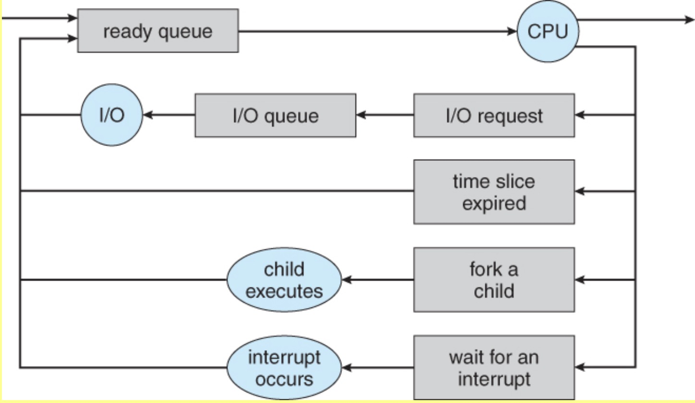
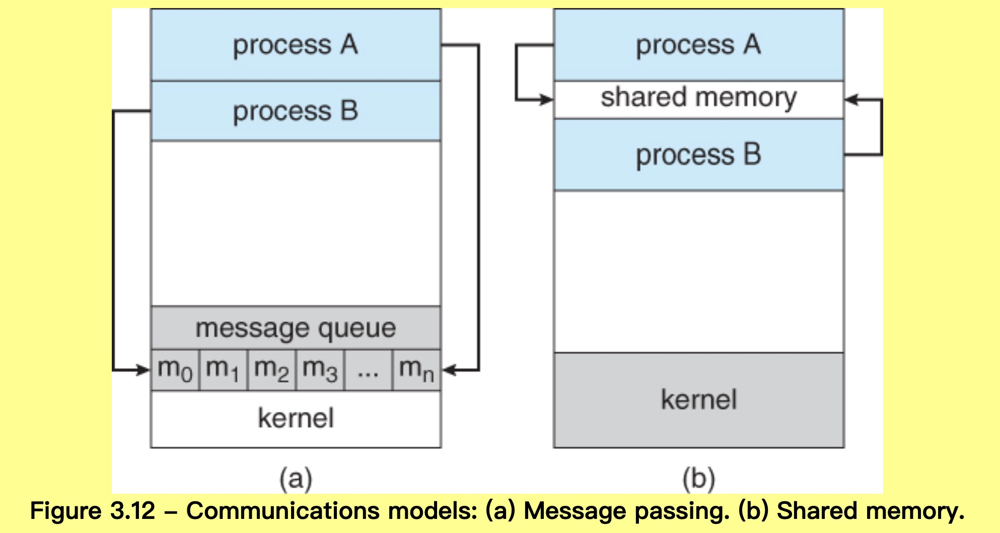

# Processes

1. https://www.cs.uic.edu/~jbell/CourseNotes/OperatingSystems/3_Processes.html
2. 进程管理 Process_Scheduling: https://blog.csdn.net/weixin_37289816/article/details/55518203

## 3.1 Process Concept

### 3.1.1 The Process

#### 1. what is the process?

- A process is an instance of a program in execution.

#### 2. Process memory is divided into 4 sections

1. text --->>> comprises the compiled program code, read in from **non-volatile storage** when the program is launched.
2. data --->>> store global/static variable, allocated and initialized prior to executing main.
3. heap --->>> is used for dynamic memory allocation, and is managed via calls to new, delete, malloc, free, etc.
4. stack --->>> is used for local variables. Space on the stack is reserved for local variables when they are declared and the space is freed up when the variables go out of scope. Stack is also used for function return values. The exact machanisms of stack management may be language specific.

**NOTE:**

1.  stack and the heap start at opposite ends of the process's free space and grow towards each other. If they should ever meet, then either a stack overflow error will occur, or else a call to new or malloc will fail due to insufficient memory available.

2.  **Non-volatile memory (NVM) or non-volatile storage** is a type of computer memory that can retain stored information even after power is removed. In contrast, volatile memory needs constant power in order to retain data. 非易失性存储器（英语：non-volatile memory，缩写为 NVM）是指当电流关掉后，所存储的数据不会消失的电脑存储器。非易失性存储器中，依存储器内的数据是否能在使用电脑时随时改写为标准，可分为二大类产品，即 ROM 和 Flash memory。

3.  ROM (Read-Only Memory) 只读储存器，一旦储存资料就无法修改和删除，且内容不会因为电源关闭而消失。一般用于 pc 的 BIOS(Basic Input/Output System). It is restricted to reading words that are permanently stored within the unit. The manufacturer of ROM fills the programs into the ROM at the time of manufacturing the ROM.

4.  flash memory 闪存 is an electronic non-volatile computer memory storage medium that can be electrically erased and reprogrammed.

### 3.1.2 Process State

1. New - The process is in the stage of being created.
2. Ready - The process has all the resources available that it needs to run, but the CPU is not currently working on this process's instructions.
3. Running - The CPU is working on this process's instructions.
4. Waiting - The process cannot run at the moment, because it is waiting for some resource to become available or for some event to occur. For example the process may be waiting for keyboard input, disk access request, inter-process messages, a timer to go off, or a child process to finish.
5. Terminated - The process has completed.

### 3.1.3. Process Control Block

1. Process State - Running, waiting, etc., as discussed above.
2. Process ID, and parent process ID.
3. CPU registers and Program Counter - These need to be saved and restored when swapping processes in and out of the CPU.
4. CPU-Scheduling information - Such as priority information and pointers to scheduling queues.
5. Memory-Management information - E.g. page tables or segment tables.
6. Accounting information - user and kernel CPU time consumed, account numbers, limits, etc.
7. I/O Status information - Devices allocated, open file tables, etc.

**NOTE:**

1. what is CPU registers?
   A processor register is a quickly accessible location available to a computer's processor. 寄存器是 CPU 内部用来存放数据的一些小型存储区域，用来暂时存放参与运算的数据和运算结果。

2. what is Program Counter?
   Program Counter is one of the CPU register that manages the memory address of the instruction to be executed next.

## 3.2 Process Scheduling

1. two main objectives(目的) of process scheduling system are:
   - keep cpu busy at all times
   - deliver in "acceptable" response times for all programs
2. So process scheduler must meet these objective by implementing suitable polices for swapping processes in and out of the CPU

### 3.2.1 Scheduling Queues

1. **job queue**: All process are stored in **job queue**.
2. **Ready queue**: Processes in the Ready state are placed in the **ready queue**.
3. **I/O queue**: Processes waiting for a device to become available or to deliver data are placed in **device queues**. There is generally a separate device queue for each device.



A new process is initially put in ready queue. It is wait there until it is selected for execution or is **dispatched**. Once the process is allocated in CPU and is executing, one of the serveral events could occur:

1. The process could issue an I/O request and then be placed in an I/O queue
2. The process could create a new subprocess(child process) and wait for the subprocess's termination
3. The process could be removed forcibly from the CPU, as a result of an interrupt, and be put back in the ready queue

### 3.2.2 Schedulers

A process migrates amoung vairous scheduling queue throughout its lifetime and this is done by appropriate scheduler base on some fashion(rules).

1. **long-term scheduler/job scheduler**:

   - in a batch system, more processes are submitted than can be executed immediately. These processes are spooled to a mass-storage device (typically a disk), where they are kept for later execution.
   - **The long-term scheduler select processes from disk and load them into memory for execution**
   - run infrequently, in minutes

2. **short-term scheduler/CPU scheduler**:

   - selects process from ready queue and allocates the CPU to one of them
   - runs very frequently, on the order of 100 milliseconds, and must very quickly swap one process out of the CPU and swap in another one.

3. **Medium-term Scheduling**

   - When system loads get high, this scheduler will swap processes out of the ready queue for a few seconds, in order to allow smaller faster jobs to finish up quickly and clear the system.

### 3.2.3 Context Switch

1. Whenever an interrupt arrives, the CPU must do a state-save of the currently running process, then switch into kernel mode to handle the interrupt, and then do a state-restore for the interrupted process.

2. Similarly, a context switch occurs when the time slice for one process has expired and a new process is to be loaded from the ready queue. There is a timer interrupt, which will then cause the current process's state to be saved and the new process's state to be restored.

3. Saving and restoring states involves saving and restoring all of the registers and program counter(s), as well as the process control blocks.

4. Context switching happens VERY VERY frequently, and the overhead of doing the switching is just lost CPU time, so context switches ( state saves & restores ) need to be as fast as possible. Some hardware has special provisions for speeding this up, such as a single machine instruction for saving or restoring all registers at once.

#### 1. what is context switch?

save state for current running process and restore for next ready to run process.

happens when:

1. Whenever an interrupt arrives, context switch occurs. the CPU must do a state-save of the currently running process, then switch into kernel mode to handle the interrupt, and then do a state-restore of the interrupted process.
2. When the time slice for one process has expired and a new process is to be loaded from the ready queue.

save and restore content:

1. all register and program counter
2. PCB (process control block)

## 3.3 Operations on Processes

### 3.3.1 Process Creation

1. Process can create child process through appropriate system call such as fork(), spawn(), forkserver().

   > difference between fork(), spawn(), forkserver(): https://stackoverflow.com/questions/64095876/multiprocessing-fork-vs-spawn

2. [fork():](../linux/fork.md)

   - fork() will generate a child process, which effectively identical to the parent process.
   - All resources of the parent are inherited by the child process, including all variables/register/program counter.
   - **BUT** fork does not copy the parent process's threads. **---->>>>** Thus locks (in memory) that in the parent process were held by other threads are stuck in the child without owning threads to unlock them, ready to cause a deadlock when code tries to acquire any of them. Also any native library with forked threads will be in a broken state.

3. Each process is given an integer identifier, termed its process identifier, or PID. The parent PID ( PPID ) is also stored for each process.

4. On UNIX system, the process scheduler is termed **sched** (this is kernal process), and is given **PID 0**. The first thing it does at system startup time is to launch **init**, which gives that process **PID 1**. Init then launches all system daemons and user logins, and becomes the ultimate parent of all other processes.

5. Depending on system implementation, a child process may receive some amount of shared resources with its parent. Child processes may or may not be limited to a subset of the resources originally allocated to the parent, preventing creation of too many child process overload system resource.

6. There are two options for the parent process after creating the child:

- Wait for the child process to terminate before proceeding. The parent makes a **wait()** system call, for either a specific child or for any child, which causes the parent process to block until the **wait()** returns. UNIX shells normally wait for their children to complete before issuing a new prompt.

- Run concurrently with the child, continuing to process without waiting. This is the operation seen when a UNIX shell **runs a process as a background task**. It is also possible for the parent to run for a while, and then wait for the child later, which might occur in a sort of a parallel processing operation. ( E.g. the parent may fork off a number of children without waiting for any of them, then do a little work of its own, and then wait for the children. )

7. Two possibilities for the address space of the child relative to the parent:

- The child may be an exact duplicate of the parent, sharing the same program and data segments in memory. Each will have their own PCB, including program counter, registers, and PID. This is the behavior of the **fork()** system call in **UNIX**.

- The child process may have a new program loaded into its own address space, with all new code and data segments. This is the behavior of the **spawn()** system calls in **Windows**. **UNIX** systems implement this as a second step, using the **exec()** system call.

8. Process IDs can be looked up any time for the current process or its direct parent using the **getpid()** and **getppid()** system calls respectively.

### 3.3.2 Process Termination

1. Processes may request their own termination by making the **exit()** system call. **exit()** will return a int and this int will pass to its parent if the parent process is doing a **wait()** system call.

2. Processes may also be terminated by the system for a variety of reasons, including:

- The necessary system resources is inable to deliver.
- In response to a **KILL** command, or other unhandled process interrupt.
- A parent may kill its children if the task assigned to them is no longer needed.
- Its parent process is terminated (On UNIX systems, orphaned processes are generally inherited by init, which then proceeds to kill them. The UNIX **nohup** command allows a child to continue executing after its parent has exited.)

3. When a process terminates, all of its system resources are freed up, open files flushed and closed, etc. The process termination status and execution times are returned to the parent if the parent is waiting for the child to terminate, or eventually returned to init if the process becomes an orphan. ( Processes which are trying to terminate but which cannot because their parent is not waiting for them are termed **zombies**. These are eventually inherited by init as orphans and killed off. )

## 3.4 IPC - Interprocess Communication

看：https://blog.oureducation.in/important-questions-on-inter-process-communication/

1. Independent Process: operating concurrently on a systems and can neither affect other processes or be affected by other processes.

2. Cooperating Processes: can affect or be affected by other processes. There are several reasons why cooperating processes are allowed:

- **Information Sharing**: There may be several processes which need access to the same file for information. ( e.g. pipelines. )
- **Computation speedup**: Often a solution to a problem can be solved faster if the problem can be broken down into sub-tasks to be solved simultaneously ( particularly when multiple processors are involved. )
- **Modularity** 模块化: The most efficient architecture may be to break a system down into cooperating modules. ( E.g. databases with a client-server architecture. )
- **Convenience**: Even a single user may be multi-tasking, such as open many tabs in chrome, each of them is a separate process.

3. Cooperating processes require some type of inter-process communication, which is most commonly one of two types: **Shared Memory systems** or **Message Passing systems**.



4. Shared Memory is faster once it is set up, because no system calls are required and access occurs at normal memory speeds. However it is more complicated to set up, and doesn't work as well across multiple computers. Shared memory is generally preferable when large amounts of information must be shared quickly on the same computer.

5. Message Passing requires system calls for every message transfer, and is therefore slower, but it is simpler to set up and works well across multiple computers. Message passing is generally preferable when the amount and/or frequency of data transfers is small, or when multiple computers are involved.

### 3.4.1 Shared-Memory Systems

看 Producer-Consumer Example Using Shared Memory：https://www.cs.uic.edu/~jbell/CourseNotes/OperatingSystems/3_Processes.html

### 3.4.2 Message-Passing Systems

1. Message passing systems must support at a minimum system calls for "send message" and "receive message".
2. A communication link must be established between the cooperating processes before messages can be sent.
3. There are three key issues to be resolved in message passing systems as further explored in the next three subsections:
   - Direct or indirect communication ( naming )
   - Synchronous or asynchronous communication
   - buffering.

#### 3.4.2.1 Naming

1. **direct communication**: sender must know the name(path) of the receiver to to which it wishes to send a message.

   - There is a one-to-one link between every sender-receiver pair.
   - **symmetric communication**: the receiver must also know the specific name of the sender from which it wishes to receive messages.
   - **asymmetric communications**: this is not necessary.

2. **Indirect communication**: uses **shared mailboxes**, or **ports**.

   - Multiple processes can share the same mailbox or boxes.
   - Only one process can read any given message in a mailbox. Initially the process that creates the mailbox is the owner, and is the only one allowed to read mail in the mailbox, although this privilege may be transferred.
     ( Of course the process that reads the message can immediately turn around and place an identical message back in the box for someone else to read, but that may put it at the back end of a queue of messages. )
   - The OS must provide system calls to create and delete mailboxes, and to send and receive messages to/from mailboxes.

#### 3.4.2.2 Synchronization

1. **Blocking send**: The sending process is blocked until the message is received by the receiving process or by the mailbox.
2. **Nonblocking send**: The sending process sends the message and resumes operation.
3. **Blocking receive**: The receiver blocks until a message is available.
4. **Nonblocking receive**: The receiver retrieves either a valid message or a null.

#### 3.4.2.3 Buffering

Messages are passed via queues, which may have one of three capacity configurations:

1. **Zero capacity** - Messages cannot be stored in the queue, so senders must block until receivers accept the messages.
2. **Bounded capacity**- There is a certain pre-determined finite capacity in the queue. Senders must block if the queue is full, until space becomes available in the queue, but may be either blocking or non-blocking otherwise.
3. **Unbounded capacity** - The queue has a theoretical infinite capacity, so senders are never forced to block.

### 3.4.3 shared memory vs message passing

- **shared memory**

  - shared memory only copy data twice 共享内存则只拷贝两次数据：一次从输入文件到共享内存区，另一次从共享内存区到输出文件
  - Process which wish to use the shared memory need to attach the shared memory area to its own address space, and no need to copy the data from shared memory when read/write 内核专门留出了一块内存区，可以由需要访问的进程将其映射到自己的私有地址空间。进程就可以直接读写这一块内存而不需要进行数据的拷贝，从而提高效率
  - 进程之间在共享内存时，并不总是读写少量数据后就解除映射，有新的通信时，再重新建立共享内存区域。而是保持共享区域，直到通信完毕为止

- **Message Passing: pipe/fifo/message queue**

  - Server reads from the input file.
  - The server writes this data in a message using pipe/fifo/message queue.
  - The client reads the data from the IPC channel, again requiring the data to be copied from kernel’s IPC buffer to the client’s buffer.
  - Finally the data is copied from the client’s buffer.
  - 一共需要 copy4 次，2read + 2write

## 3.5 Examples of IPC Systems

[interprocess communication](./interprocess_communication.md)

## 3.6 Communication in Client-Server Systems

### 3.6.1 Sockets

1. A socket is an endpoint for communication.

2. **Two processes communicating over a network often use a pair of connected sockets as a communication channel**. Software that is designed for client-server operation may also use sockets for communication between two processes running on the same computer - For example the UI for a database program may communicate with the back-end database manager using sockets. ( If the program were developed this way from the beginning, it makes it very easy to port it from a single-computer system to a networked application. )

3. **A socket is identified by an IP address concatenated with a port number**, e.g. 200.100.50.5:80.

4. Port numbers below 1024 are considered to be well-known, and are generally reserved for common Internet services. For example, telnet servers listen to port 23, ftp servers to port 21, and **web servers to port 80**.

5. General purpose user sockets are assigned unused ports over 1024 by the operating system in response to system calls such as socket( ) or soctkepair( ).

6. Communication channels via sockets may be one of two major forms:

- **Connection-oriented ( TCP, Transmission Control Protocol )** connections emulate 效仿 a telephone connection. All packets sent down the connection are guaranteed to arrive in good condition at the other end, and to be delivered to the receiving process in the order in which they were sent. The TCP layer of the network protocol takes steps to verify all packets sent, re-send packets if necessary, and arrange the received packets in the proper order before delivering them to the receiving process. There is a certain amount of overhead involved in this procedure, and if one packet is missing or delayed, then any packets which follow will have to wait until the errant packet is delivered before they can continue their journey.

- **Connectionless ( UDP, User Datagram Protocol )** emulate individual telegrams. There is no guarantee that any particular packet will get through undamaged ( or at all ), and no guarantee that the packets will get delivered in any particular order. There may even be duplicate packets delivered, depending on how the intermediary connections are configured. UDP transmissions are much faster than TCP, but **applications must implement their own error checking and recovery procedures**.

7. server socket code:

```java
import java.net.*;
import java.io.*;

public class DateServer{
    public static void main(String[] args){
        try{
            ServerSocket socket = new ServerSocket(6013);

            while(true){
                //Listens for a connection to be made to this socket and accepts it.
                Socket client = socket.accept();

                //return the output stream for the given socket.
                PrintWriter pout = new PrintWriter(client.getOutputStream(), true);
                //write the Date() to the socket
                pout.println(new java.util.Date().toString());

                //close socket and resume listening for connections
                client.close();
            }
        }
        catch(IOException ioe){
            System.err.println(ioe);
        }
    }
}
```

8. client socket code

```java
import java.net.*;
import java.io.*;

public class DateClient{
    public static void main(String[] args){
        try{
            //establish connection with server socket
            Socket client = new Socket("127.0.0.1", "6013");

            InputStream in = client.getInputStream();
            BufferedReader bin = new BufferedReader(new InputStreamReader(in));

            //Read the date from the socket
            String line;
            while( (line = bin.readLine()) != null){
                System.out.println(line);
            }

            //close socket connection
            client.close();
        }
        catch(IOException ioe){
            System.err.println(ioe);
        }
    }
}
```

### 3.6.2 Remote Procedure Calls(RPC)

### 3.6.3 Pipes

1. issues:
   - Unidirectional or Bidirectional?
   - half-duplex or full-duplex?
   - must a relationship such as parent-child between processes?
   - communicate in network or only on the same machine?

#### 1. ordinary pipes(unamed pipe)

1. uni-directional, with a reading end and a writing end.
2. In UNIX ordinary pipes are created with the system call `int pipe( int fd [] )`

   - return 0, success
   - return 1, error
   - fd[] must be allocated before the call, and the values are filled in by the pipe system call:
     - fd[0] is filled in with a file descriptor for the reading end of the pipe
     - fd[1] is filled in with a file descriptor for the writing end of the pipe

3. UNIX pipes are accessible as files, using standard **read(**) and **write()** system calls.

4. Ordinary pipes are only accessible within the process that created them.
   - Typically a parent creates the pipe before forking off a child.
   - **When the child inherits open files from its parent, including the pipe file(s)**, a channel of communication is established.
   - Each process ( parent and child ) should first close the ends of the pipe that they are not using. For example, if the parent is writing to the pipe and the child is reading, then the parent should close the reading end of its pipe after the fork and the child should close the writing end.

#### 2. Named pipe

1. Named pipe support bidirectional communication, communiction between non parent-child process, pipes persistence after the process create them exit and multiple process can share a same named pipe, typically one reader and multiple writers.

2. In UNIX, named pipes are termed **FIFO**, and appear as ordinary files in the file system.
   - Created with **mkfifo( )** and manipulated with **read( ), write( ), open( ), close( )**, etc.
   - UNIX named pipes are bidirectional, but half-duplex, so you still need two pipes for bidirectional communications.
   - UNIX named pipes still require that all processes be running on the same machine. Otherwise sockets are used.
