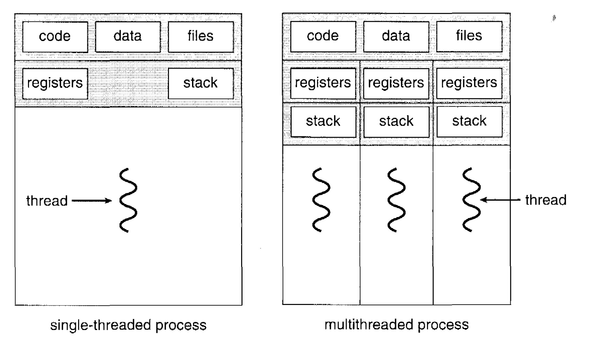
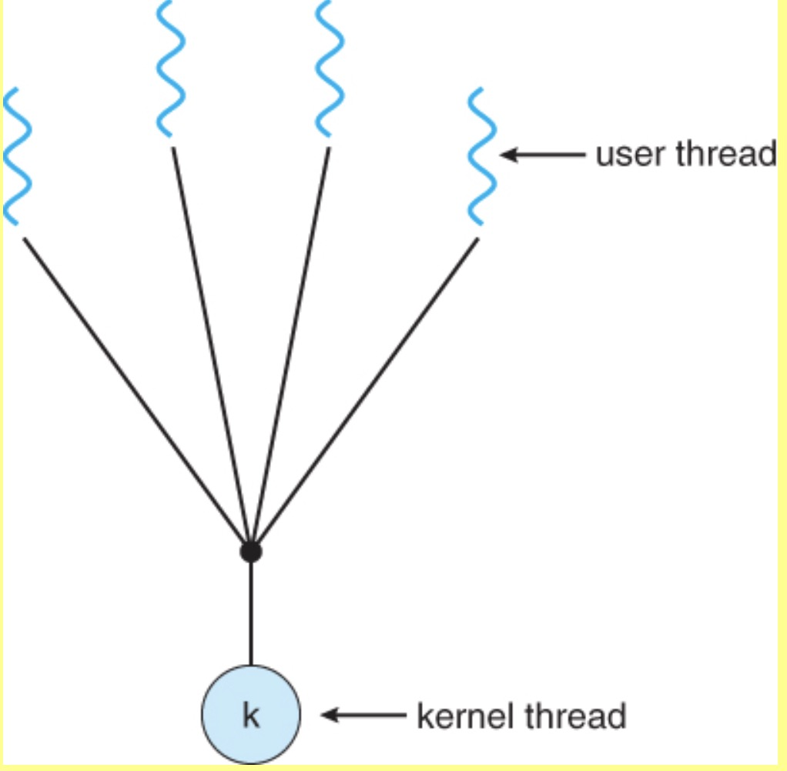
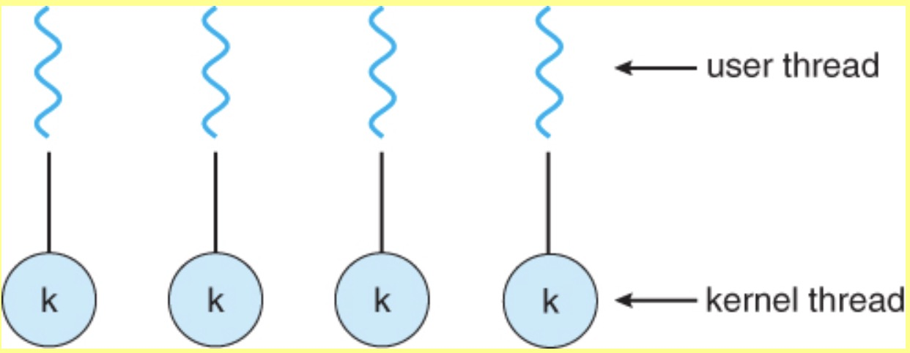
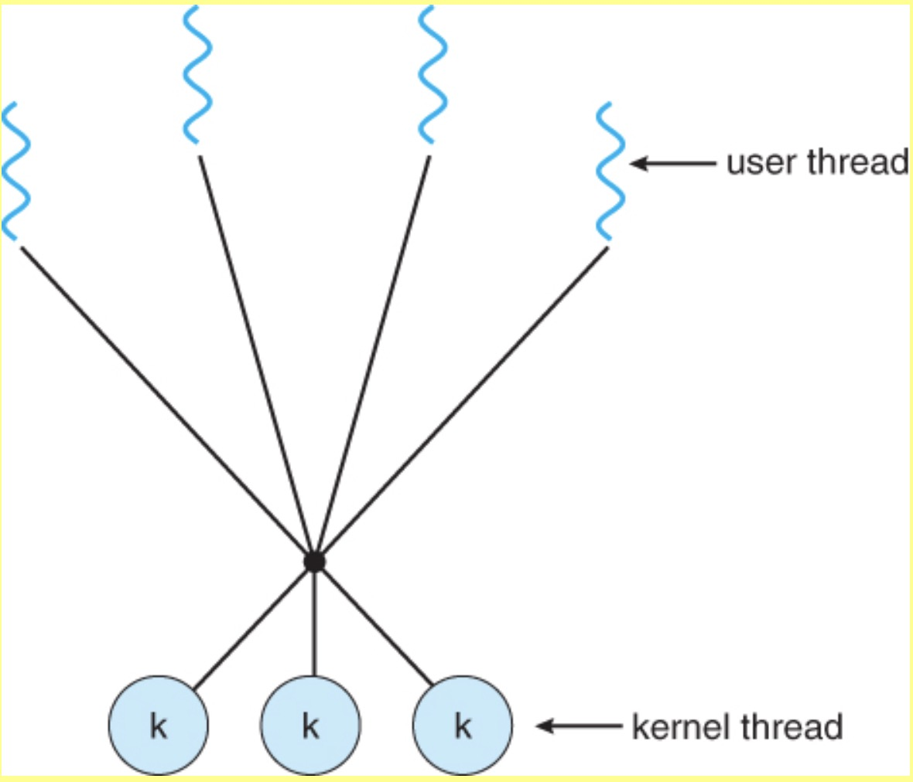

# Thread

https://www.cs.uic.edu/~jbell/CourseNotes/OperatingSystems/4_Threads.html

## 4.1 Overview

1. A thread is a basic unit of CPU utilization;

2. it comprises a thread ID, a program counter, a register set, and a stack.

3. It shares with other threads belonging to the same process its code section, data section, and other operating-system resources, such as open files and signals.

4. A traditional (or heavyweight) process has a single thread of control. If a process has multiple threads of control, it can perform more than one task at a time.

### 4.1.1 Motivation

1. Many software packages that run on modern desktop PCs are multithreaded.

2. For example in a word processor, a background thread may check spelling and grammar while a foreground thread processes user input ( keystrokes ), while yet a third thread loads images from the hard drive, and a fourth does periodic automatic backups of the file being edited.

3. Compared to create a separate process to handle multiple task at the same time, use multithread would be more efficient since Process creation is time consuming and resource intensive

4. Another example is a web server - Multiple threads allow for multiple requests to be satisfied simultaneously, without having to service requests sequentially or to fork off separate processes for every incoming request. ( This is how this sort of thing was done before the concept of threads was developed. A daemon would listen at a port, fork off a child for every incoming request to be processed, and then go back to listening to the port. )

### 4.1.2 Benefits

1. **Responsiveness** - Multithreading an interactive application may allow a program to continue running when part of it is blocked, which will increase the resonsiveness to the user.

2. **Resource sharing** - By default threads share common code, data, and other resources, which allows multiple tasks to be performed simultaneously in a single address space.

3. **Economy** - Allocating memory and resources for process creation is costly. Because threads share resources of the process to which they belong to, it is more economical to create and context-switch threads.

4. **Scalability** - Utilization of multiprocessor architectures:
   The benefits of multithreading can be greatly increased in a multiprocessor architecture, where threads may be runing in parallel on different processors. A single-threaded process can only run on one CPU, no matter how many are available. Multithreading on a multi-CPU machine increases concurrency.

## 4.2 Multicore Programming

## 4.3 Multithreading Models

1. There are two types of threads to be managed in a modern system: **User threads** and **kernel threads**.

   > The User mode is normal mode where the process has limited access. While the Kernel mode is the privileged mode where the process has unrestricted access to system resources like hardware, memory, etc.

2. User threads are supported above the kernel and are managed without kernel support, whereas kernel threads are supported and managed directly by the operating system.

### 4.3.1 Many-to-One Model

1. The many-to-one model maps many user-level threads to one kernel thread.
2. Thread management is done by the thread library in user space, so it is efficient
3. If a thread make a blocking system call, the entrie process blocks.
4. Because only one thread can access the kernel at a time, multiple threads are unable to run in parallel on multiprocessors. 只能 run in single CPU
5. Green threads -- a thread library available for Solari and GNU Portable Threads implement the many-to-one model in the past, but few systems continue to do so today.

### 4.3.2 One-To-One Model

1. The one-to-one model maps each user thread to a kernel thread.
2. One-To-One Model allows another thread to run when a thread makes a blocking system call and allows multiple threads to run in parallel on multiprocessors.
3. However the overhead of managing the one-to-one model is more significant, since you need to create a corresponding kernal thread everytime you create a user thread. Most implementations of this model place a limit on how many threads can be created.
4. Linux and Windows from 95 to XP implement the one-to-one model for threads.

### 4.3.3 Many-To-Many Model

1. The many-to-many model multiplexes any number of user threads onto an equal or smaller number of kernel threads, combining the best features of the one-to-one and many-to-one models.
2. Users have no restrictions on the number of threads created.
3. Blocking kernel system calls do not block the entire process.
4. Processes can be split across multiple processors.
5. Individual processes may be allocated variable numbers of kernel threads, depending on the number of CPUs present and other factors.
6. One popular variation of the many-to-many model is the **two-tier model**, which allows either many-to-many or one-to-one operation.

## 4.4 Thread Libraries

1. A thread library is API for programmer to create and manage threads.

2. Thread libraries may be implemented either in user space or in kernel space.

   - The former: All code and data structures for the library exist in user space, which means invoking a function in the library results in a local function call in user space
   - The latter: implement a kernel-level library supported directly by the operating system, which code and data structures for the library exist in kernel space. Invoking a function in the API for the library results in a system call to the kernel.

3. There are three main thread libraries in use today:
   - **POSIX Pthreads** - may be provided as either a user or kernel library, as an extension to the POSIX standard.
   - **Win32 threads** - provided as a kernel-level library on Windows systems.
   - **Java threads** - Since Java generally runs on a Java Virtual Machine, the implementation of threads is based upon whatever OS and hardware the JVM is running on, i.e. either Pthreads or Win32 threads depending on the system.

### 4.4.1 Pthreads

1.  Global variables are shared amongst all threads.
2.  One thread can wait for the others to rejoin before continuing.
3.  pThreads begin execution in a specified function, in this example the **runner( )** function:
4.  pThreads are available on Solaris, Linux, Mac OSX, Tru64, and via public domain shareware for Windows.

### 4.4.3 Java Threads

见：[java 多线程专题](../java/多线程.md)

## 4.5 Threading Issues

### 4.5.1 Thread Creation - The fork( ) and exec( ) System Calls

Q: If one thread forks, is the entire process copied, or is the new process single-threaded?

A: System dependant. There are two version of fork() in UNIX
A: If the new process call exec() right away, there is no need to copy all the other threads, because if a thread invokes the exec () system call, the program specified in the parameter to exec () will replace the entire process including all threads. If it doesn't, then the separate process should be copy all threads.
A: Many versions of UNIX provide multiple versions of the fork() call for this purpose.

### 4.5.2 Signal Handling

1. what is singal?

   - A signal is used in UNIX systems to notify a process that a particular event has occurred.
   - A signal may be received either **synchronously** or **asynchronously**, depending on the source of and the reason for the event being signaled.
   - All signals has the 3 patterns:
     1. is generated by the occurrence of a particular event.
     2. is delivered to a process.
     3. Once delivered, the signal must be handled.

2. synchronous signal: are **delivered to the same process** that performed the operation that caused the signal

   - illegal memory access
   - divide by 0

3. asynchronous signal: is generated by an event external to the running process

   - terminating a process with specific keystrokes (such as <control> <C>)
   - having a timer expire.

4. how to handle a signal?

   - every signal may be handled by either a **default signal handler** or a **user defined signal handler**

   - handle signal in single-thread process is easy, the problem is how to handle signals for multithread process? which particular thread to send the signal? or should we send the signal to all threads?
     There are four major options:

     1. Deliver the signal to the thread to which the signal applies.
     2. Deliver the signal to every thread in the process.
     3. Deliver the signal to certain threads in the process.
     4. Assign a specific thread to receive all signals in a process.

     The best choice may depend on which specific signal is involved.

5. UNIX allows individual threads to indicate which signals they are accepting and which they are ignoring. However the signal can only be delivered to one thread, which is generally the first thread that is accepting that particular signal.

6. UNIX provides two separate system calls, kill( pid, signal ) and pthread_kill( tid, signal ), for delivering signals to processes or specific threads respectively.

7. Windows does not support signals, but they can be emulated using Asynchronous Procedure Calls ( APCs ). APCs are delivered to specific threads, not processes.

### 4.5.3 Thread Cancellation

1. What is thread cancellation?
   Thread cancellation is to cancel an uncompleted thread

   e.g.

   - mutiple thread concurrently search through database, and one of them found the result. The remaining threads should be canceled in this case.
   - loading web page usually are completed by multiple thread(load each image is running on a separate thread). If the user pressed the stop button when rendering a web page, then the running threads should be canceled

2. Threads that are no longer needed may be cancelled by another thread in one of two ways:

   - Asynchronous Cancellation cancels the thread immediately.
   - Deferred Cancellation sets a flag indicating the thread should cancel itself when it is convenient. It is then up to the cancelled thread to check this flag periodically and exit nicely when it sees the flag set.

3. ( Shared ) resource allocation and inter-thread data transfers can be problematic with asynchronous cancellation.

## 4.5.4 Thread-Local Storage (TLS)

Also known as thread specific data. It is used when sometime a thread need to store its own thread-specific data
