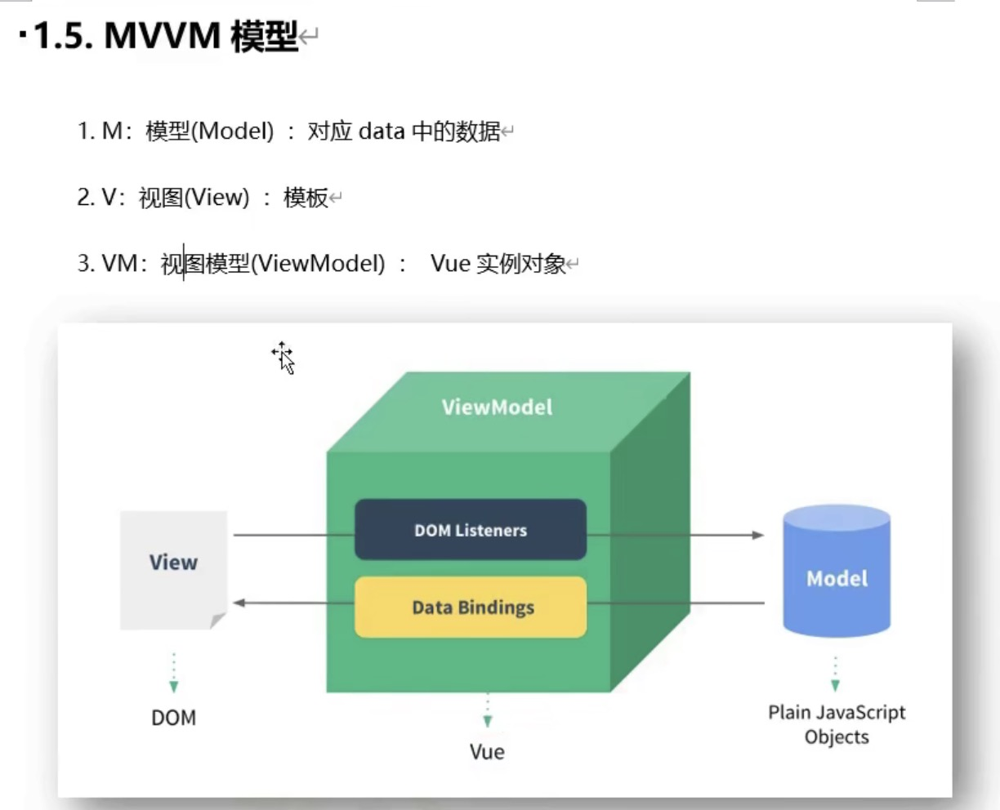
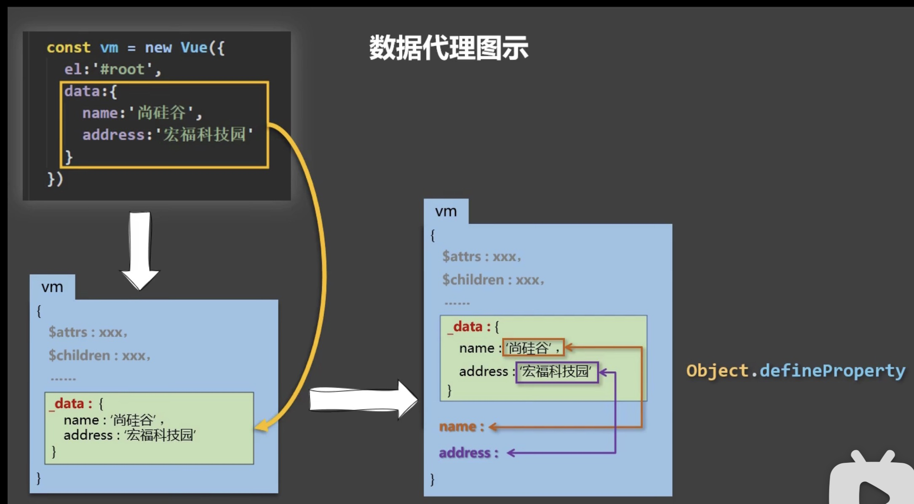
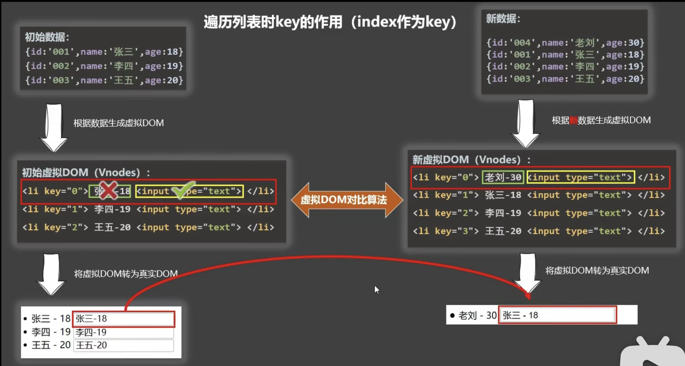
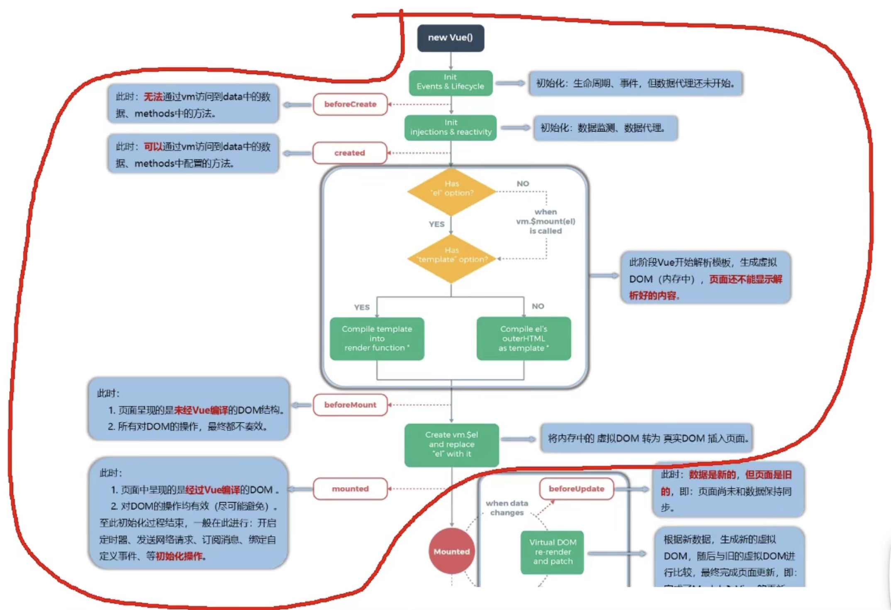
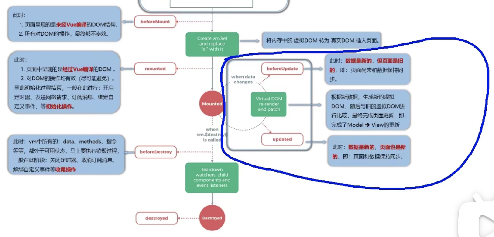
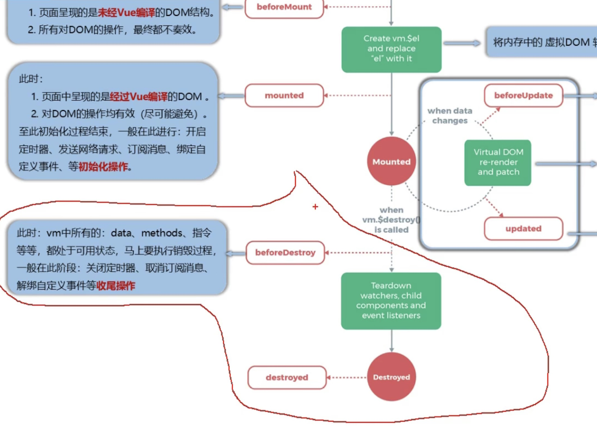

# Vue

## this.$router.push 的使用

https://www.huaweicloud.com/articles/d7a66d653e8bf1de0539b33f4d84d457.html

## 一、初识 Vue:

1. 想让 Vue 工作,就必须创建一个 Vue 实例,且要传入一个配置对象
2. root 容器里的代码依然符合 htm1 规范,只不过混入了一些特殊的 Vue 语法;
3. root 容器里的代码被称为 【vue 模板】;
4. vue 实例和容器是一一对应的
5. 真实开发中只有一个 Vue 实例,并且会配合着组件一起使用;
6. {{xxx}}中的 xxx 要写 js 表达式,且 xxx 可以自动读取到 data 中的所有属性
7. 一旦 data 中的数据发生改变,那么页面中用到该数据的地方也会自动更新
   注意区分:s 表达式和 js 代码(语句)
   1.js 表达式:一个表达式会产生一个值,可以放在任何一个需要值的地方:
   (1). a
   (2). a+b
   (3). demo(1)
   (4). x === y ? 'a' : 'b'
   2.js 代码(语句)
   (1).1f()(}
   (2).for(){}

## 二、模版语法

1. interpolation 插值
2. **v-bind:id / :id** -->> 引号里的东西会被当作 js 表达式

Vue 模板语法有 2 大类

1. 插值语法:
2. 指令语法: v-??

## 三、数据绑定

vue 中有 2 种数据绑定的方式:

1. 单向绑定(**v-bind**):数据只能从 data 流向页面
2. 双向绑定(**v-model**):数据不仅能从 data 流向页面,还可以从页面流向 data。
   备注:
   1. 双向绑定一般都应用在表单类元素(form element)上(如: input、 select 等)
   2. **v-model:value** 可以简写为 **v-model**,因为 v-model 默认收集的就是 value 值

## 四、el 与 data 的两种写法

1. el 的两种写法
   (1) new Vue()时候配置 el 属性。

   ```js
   const vm = new Vue({
   	el: '#root',
   	data: {
   		name: 'ming',
   	},
   })
   ```

   (2) 先创建 vue 实例,随后再通过 vm.$mount('#root')指定 el 的值。

   ```js
   vm.$mount('#root') //mount挂载
   ```

2. data 的两种写法
   (1).对象式

   ```
   data: {
   	name: 'ming'
   }
   ```

   (2).函数式

   ```js
   data(){
       return{
           name: 'ming'
       }
   }
   ```

   如何选择:目前哪种写法都可以,以后学习到组件时,data 必须使用函数式,否则会报错

3. 一个重要的原则:
   由 vue 管理的函数, 一定不要写箭头函数, 一旦写了箭头函数, this 就不再是 vue 实例了。

## 五、MVVM(Model-View-viewmodel) model: 模型-视图-视图模型



## 六、数据代理 data proxy

### 1. 理解 [Object.defineProperty()](https://stackoverflow.com/questions/18524652/how-to-use-javascript-object-defineproperty)

1. enumerable:true 可枚举的，可遍历的，默认值是 false
2. writable:true 控制属性可以被修改，默认值是 false
3. configurable:true 控制属性可以被删除，默认值是 false
4. get(){}
5. set(){}

```js
let number = 18
let person = {
	name: '张三',
	sex: '男',
}

Object.defineproperty(person, 'age', {
	// value: 18,
	// enumerable:true,   //控制属性是否可以枚举,默认值是 false
	// writable:true,     //控制属性是否可以被修改,默认值是 false
	// configurable:true  //控制属性是否可以被別除,默认值是 false

	//当有人读取 person的age属性时,get函数(getter)就会被调用,且返回值就是age的值
	get() {
		console.log('有人读取age属性了')
		return number
	},

	//当有人修改 person的age属性时,set函数(setter)就会被调用,且会收到修改的具体值
	set(value) {
		console.log('有人修改了age属性,且值是', value)
		number = value
	},
})
```

### 2. 理解数据代理

```js
let obj = { x: '100' }
let obj2 = { y: '200' }

Object.defineProperty(obj2, 'x', {
	get() {
		return obj.x
	},
	set(value) {
		obj.x = value
	},
})
```

### 3. Vue 中的数据代理 Proxy -->> vm.\_data



```js
function proxy(target, sourceKey, key) {
	Object.defineProperty(target, key, {
		get() {
			return this[sourceKey][key]
		},

		set(val) {
			this[sourceKey][key] = val
		},
	})
}
```

## 七、Event Handling 事件处理

### 1. 事件的基本使用 v-on:click

```js
<div class='root'>
    <button @click="showInfo1">点我(不传参数)</button>
    <button v-on:click="showInfo2(66, $event)">点我(传参数)</button>
</div>

<script type="text/javascript">
    const vm = new Vue({
        el: '#id',
        data(){
            name: 'ming'
        },
        //!!!!!!!!!!!
        methods(){
            showInfo1(event){
                alert("hello world")
                console.log(this) //此处this 就是vm
                console.log(event.target.innerText) //event就是这个点击button这个动作
            },
            showInfo2(number, event){
                alert("hello world")
                console.log(number) //66
                console.log(event) //event就是这个点击button这个动作
            }
        }
    })
</script>
```

**事件的基本使用:**

1. 使用 v-on:xxx 或@xxx 绑定事件,其中 xxx 是事件名
2. 事件的回调需要配置在 methods 对象中,最终会在 vm 上;
3. methods 中配置的函数,不要用箭头函数!否则 this 就不是 vm 而是 window 了
4. methods 中配置的函数,都是被 vue 所管理的函数, this 的指向是 vm 或组件实例对象
5. @click="demo"和 @click="demo($event)”效果一,但后者可以传参

### 2. [Event Modifiers 事件修饰符](https://vuejs.org/v2/guide/events.html#Event-Modifiers)

**event capture: 捕获事件**  
**event propagation: 冒泡事件**

vue 中的事件修饰符:

1. prevent: 阻止默认事件(常用) prevent default event, 比如 @scroll 不滚动
2. stop: 阻止事件冒泡(常用) the click event's propagation will be stopped
3. once: 事件只触发一次(常用)
4. capture: 使用事件的捕获模式
5. se1f: 只有 event.target 是当前操作的元素时才触发事件, 也可以阻止 propagation
6. passive: 事件的默认行为立即执行,无需等待事件回调执行完毕; 比如滚动：@wheel

### 3. [Key Modifiers 按键修饰符](https://vuejs.org/v2/guide/events.html#Key-Modifiers)

**key event 按键事件(常用)：**

1. @keyup: 按下去松手触发
2. @keydown: 按下去就触发

**key modifier**

键盘上的每个键都有自己的名字和编码

- event.key 名字
- event.keycode 编码

1. if(event.keycode!==13) return **===** @keyup.enter
2. **@keydown.tab(特殊，必须配合 keydown)**: tab 键本身的作用就是把焦点从当前元素移走，所以不适合用 keyup，因为按键还没抬起来焦点已经从当前元素移走了
3. .delete (captures both “Delete” and “Backspace” keys)
4. .esc
5. .space
6. .up
7. .down
8. .left
9. .right
10. 其他的使用姓名或者编号判断，但是多个单词组成的如 CapsLock -->> @keyup.caps-lock

**总结**

1. key modifiers
2. Vue 未提供別名的按键,可以使用按键原始的 key 值去绑定,但注意要转为 kebab-case(短横线命名)
3. **系统修饰键(用法特殊)**: **ctrl、alt、shift、command**
   (1),配合 keyup 使用: 按下修饰键的同时,再按下其他键,随后释放其他键,事件才被触发
   (2),配合 keydown 使用: 正常触发事件
4. 也可以使用 keyCode 去指定具体的按键(不推荐), 用键名
5. **Vue.config.keyCodes.自定义键名 = 键码**, 可以去定制按健别名 (不推荐)

### 4. 事件总结

修饰符可以连续写，顺序 matters

1. @click.stop.prevent: 先阻止冒泡再阻止默认行为，order matters
2. @keyup.ctrl.y

## 八、姓名案例：interpolation vs methods

只要 data 中的数据发生改变，vue 一定会重新解析模版<template></template> -->> **re-render**

## 九、[Computed Properties and Watchers 计算属性和监视属性](https://vuejs.org/v2/guide/computed.html)

### 1. computed - 计算属性

1. 定义:要用的属性不存在,要通过已有属性(**data:{}中的数据就是属性，property**)计算得来
2. 原理:底层借助了 Objet.defineproperty 方法提供的 getter 和 setter
3. get 函数什么时候执行?
   (1). 初次读取时会执行一次
   (2). 当依赖的数据发生改变时会被再次调用
4. 优势: computed properties are cached based on their reactive dependencies. A computed property will only re-evaluate when some of its reactive dependencies have changed. In comparison, a method invocation will always run the function whenever a re-render happens. 与 methods 实现相比, 内部有缓存机制(复用), 效率更高, 调试方便。
5. 备注
   - 计算属性(**computed:{}**)最终会出现在 vm 上,直接读取使用即可
   - 如果计算属性要被修改,那必须写 set 函数去响应修改,且 set 中要引起计算时依赖的数据发生
   - 如果只监听不修改可以简写

```js
new Vue({
    data:{
        firstName: 'Ming',
        lastName: 'Chen'
    },
    computed:{
        fullName1:{
            get(){
                return this.firstName + "-" + this.lastName;
            }
            set(value){

            }
        },

        fullName2(){
            return this.firstName + "-" + this.lastName;
        }
    }
})
```

### 2. watch - 监视属性

1. 当被监视的属性变化时,回调函数自动调用,进行相关操作
2. 监视的属性必须存在,才能进行监视!
3. 监视的两种写法
   (1)new Vue({})时传入 watch 配置
   (2)通过 vm.$watch 监视

```js
<script>
const vm = new Vue({
    data:{
        isHot: true;
    },
    computed:{
        info(){
            return this.isHot = !this.isHot;
        }
    },
    watch:{
        isHot:{
            immediate:true, //初始化是让handler调用一下
            handler(newVal, oldVal){
                console.log("isHot被修改了", newVal, oldVal)
            }
        },
        info:{
            handler(){
                console.log("info is changed")
            }
        }
    }
})

vm.$watch.('isHot', {
    immediate:true, //初始化是让handler调用一下
    handler(newVal, oldVal){
        console.log("isHot被修改了", newVal, oldVal)
    }
})
</script>
```

**深度监视:**
(1) Vue 中的 watch 默认不监测对象内部值的改变(一层)
(2) 配置 **deep:true** 可以监测对象内部值改变(多层)
**备注**
(1) Vue 自身可以监测对象内部值的改变,但 Vue 提供的 watch 默认不可以
(2) 使用 watch 时根据数据的具体结构,决定是否采用深度监视

```js
<script>
const vm = new Vue({
    data:{
        isHot: true;
        numbers:{
            a: 1;
            b: 1;
        }
    },
    watch:{
        //监测多级结构中某个属性的变化
        'numbers.a':{
            handler(){
                console.log("a is changed")
            }
        },
        //监测多级结构中所有属性的变化
        numbers:{
            deep: true,  //深度监视
            handler(){
                console.log("numbers is changed")
            }
        },
        //当配置项只需要handler的时候可以简写
        isHot(newVal, oldVal){
            console.log("isHot is changed", newVal, oldVal)
        }
    }

    //当配置项只需要handler的时候可以简写
    //不能写成箭头函数
    vm.$watch('isHot', function(newVal, oldVal){
        console.log("isHot is changed", newVal, oldVal)
    })
})
</script>
```

### 3. computed vs watch

computed 和 watch 之间的区别

1. computedi 能完成的功能, watch 都可以完成。
2. watch 能完成的功能, computed 不一定能完成,例如: **watch 可以进行异步操作** 两个重要的小原则:
   (1) 所被 vue 管理的函数,最好写成普通函数, 这样 this 的指向才是 vm 或组件实例对象
   (2) **所有不被 vue 所管理的函数(定时器的回调函数、ajax 的回调函数等),最好写成箭头函数, 这样 this 的指向才是 vm 或组件实例对象**

## 十、[Class and Style Bindings - Class 与 Style 绑定](https://vuejs.org/v2/guide/class-and-style.html)

### 1. Binding HTML class

1. Object Syntax
2. Array Syntax
3. With Components

```html
<!-- 假设有七种样式 -->
<style>
.basic{}
.happy{}
.sad{}
.normal{}
.test1{}
.test2{}
.test3{}
</style>

<body>
    <div id='root'>
        <!--1. 绑定c1ass样式--字符串写法,适用于:样式的类名不确定,需要动态指定-->
        <div class="basic" :class="mood" @click="changeMood">{{name}}</div>

        <!--2. 绑定c1ass样式--数组写法,适用于:要绑定的个数不确定,名字也不确定-->
        <div class="basic" :class="classArr" @click="changeMood">{{name}}</div>

        <!--3. 绑定c1ass样式--对象写法,适用于:要绑定的个数确定,名字也确定，但要动态决定用不用-->
        <div class="basic" :class="classObj" @click="changeMood">{{name}}</div>
    </div>
</body>

<script>
    const vm = new Vue({
        el: '#root',
        data:{
            name: 'ming',
            mood: 'normal',
            classArr: ['test1', 'test2', 'test3'],
            classObj:{
                //默认都不用
                test1: false,
                test2: flase
            }
        },
        methods:{
            //随机切换三种心情
            changeMood(){
                const moods = ['happy', 'sad', 'normal']
                int index = Math.floor(Math.random()*3)
                return this.mood = moods[index];
            }
        }
    })
</scirpt>
```

### 2. [Binding inline styles](https://vuejs.org/v2/guide/class-and-style.html#Binding-Inline-Styles)

## 十一、[Conditional rendering 条件渲染](https://vuejs.org/v2/guide/conditional.html)

1. **v-show=**: The difference is that an element with v-show will always be rendered and remain in the DOM; v-show only toggles the **display CSS property** of the element.
2. **v-if**: v-if is used to toggle the existence of the element
3. **v-else**: A v-else element must immediately follow a **v-if or a v-else-if** element - otherwise it will not be recognized.
4. template 只能配合 v-if，不能配合 v-show: template serves as a invisable wrapper
5. [Controlling Reusable Elements with key](https://vuejs.org/v2/guide/conditional.html#Controlling-Reusable-Elements-with-key)
6. [v-if vs v-show](https://vuejs.org/v2/guide/conditional.html#v-if-vs-v-show)

```html
<!DOCTYPE html>
<html>
	<head>
		<meta charset="utf-8/" />
		<title>条件渲染</title>
		<script type="text/javascript" src="./is/vue.js"></script>
	</head>
	<body>
		<div id="root">
			<!--使用v-show做条件渲染-->
			<h2 v-show="false">欢迎来到{{name}}</h2>
			<h2 v-show="1===1">欢迎来到{{name}}</h2>

			<!--使用v-if做条件渲染-->
			<h2 v-1f=" false">欢迎来到{{name}}</h2>
			<h2 v-if="1===1">欢迎来到{{name}}</h2>

			<!--v-else 和 v-else-if-->
			<div v-if="n === 1">Angular</div>
			<div v-else-if="n===2">React</div>
			<!-- <div>@</div>   不允许中间被打断 -->
			<div v-else-if="n===3">Vue</div>
			<div v-else>哈哈</div>
		</div>
	</body>
</html>
```

## 十二、[List rendering](https://vuejs.org/v2/guide/list.html)

### 1. 列表渲染

```html
<!DOCTYPE html>
<html>
	<head>
		<meta charset="utf-8/" />
		<title>list rendering</title>
		<script type="text/javascript" src="./is/vue.js"></script>
	</head>
	<body>
		<div id="root">
			<ul>
				<!-- 遍历数组 -->
				<!-- key是每个li的唯一标识 -->
				<li v-for="person in persons" :key="person.id">
					{{person.name}}-{{person.age}}
				</li>

				<li v-for="(person, index) in persons" :key="index">
					{{person.name}}-{{person.age}}
				</li>

				<!-- 遍历对象 -->
				<li v-for="(carVal, carKey) in persons" :key="index">
					{{carKey}}-{{carVal}}
				</li>

				<!-- 遍历字符串 -->
				<li v-for="(character, index) in persons" :key="index">
					{{character}}-{{index}}
				</li>
			</ul>
		</div>
	</body>
	<script>
		new Vue({
			el: '#root',
			data: {
				persons: [
					{ id: '001', name: '张三', age: 18 },
					{ id: '002', name: '李四', age: 20 },
					{ id: '003', name: '王五', age: 23 },
				],
				cars: {
					name: 'Posche',
					price: '100w',
					createdTime: '2021-01-01',
				},
				str: 'hello',
			},
		})
	</script>
</html>
```

### 2. [special attributes - KEY](https://vuejs.org/v2/api/#key)



**面试题: react、vue 中的 key 有什么作用?(key 的内部原理)**

1. 虚拟 DOM 中 key 的作用:
   key 是虚拟 DOM 对象的标识 **hint**,当状态中的数据发生变化时,Vue 会根据【新数据】生成【新的虚拟 DOM】， 随后 Vue 进行【新虚拟 DOM】与【旧的虚拟 DOM】的差异比较,比较規则如下:
2. 对比规则:
   (1). 旧的虚拟 DOM 中找到了与新虚拟 DOM 相同的 key
   - 若虚拟 DOM 中内容没变,直接使用之前的真实 DOM
   - 若虚拟 DOM 中内容变了,则生成新的真实 DOM,随后替换掉页面中之前的真实 DOM
     (2). 旧虚拟 DOM 中未找到与新虚拟 DOM 相同的 key
   - 创建新的真实 DOM,随后渲染到到页面
3. 用 index 作为 key 可能会引发的问题:
   1. 若对数据进行:逆序添加、逆序除等破坏顺序操作: 会产生没有必要的真实 D0M 更新 ==>> 界面效果没问题,但效率低
   2. 如果结构中还包含输入类的 DOM: 会产生错误 DOM 更新 ==>> 界面有问题
4. 开发中如何选择 key?:
   1. **最好使用每条数据的唯一标识作为 key**。比如 id、手机号、身份证号、学号等唯一值
   2. 如果不存在对数据的逆序添加、逆序除等破坏顺序操作,仅用于渲染列表用于展示, 使用 index 作为 key 是没有问题的

### 3. 列表过滤（即 模糊搜索）

```html
<body>
	<div id="root">
		<input type="text" placeholder="请输入名字" v:model="keyWords" />
		<ul>
			<li v-for="person in filterPerson" :key="person.id">
				{{person.name}}-{{person.age}}-{{person.gender}}
			</li>
		</ul>
	</div>
</body>
<script>
	new Vue({
		el: '#root',
		data: {
			keyWords: '',
			persons: [
				{ id: '001', name: '马冬梅', age: 18, gener: 'female' },
				{ id: '002', name: '周冬雨', age: 20, gener: 'female' },
				{ id: '003', name: '周杰伦', age: 23, gener: 'male' },
				{ id: '004', name: '炎亚伦', age: 23, gener: 'male' },
			],
			//filterPerson: [],
		},
		//watch写法
		// watch: {
		// 	filterPerson: {
		// 		immediate: true,
		// 		handler(newVal) {
		// 			this.filterPerson = this.persons.filter((p) => {
		// 				return p.name.indexOf(newVal) !== -1
		// 			})
		// 		},
		// 	},
		// },

		//compute写法
		computed: {
			filterPerson() {
				return this.persons.filter((p) => {
					return p.name.indexOf(this.keyWords) !== -1
				})
			},
		},
	})
</script>
```

### 4. 列表排序

```html
<body>
	<div id="root">
		<input type="text" placeholder="请输入名字" v:model="keyWords" />
		<button @click="sortType=2">年龄升序</button>
		<button @click="sortType=1">年龄降序</button>
		<button @click="sortType=0">原序</button>
		<ul>
			<li v-for="person in filterPerson" :key="person.id">
				{{person.name}}-{{person.age}}-{{person.gender}}
			</li>
		</ul>
	</div>
</body>
<script>
	new Vue({
		el: '#root',
		data: {
			sortType: 0, //0原顺序，1升序，2降序
			keyWords: '',
			persons: [
				{ id: '001', name: '马冬梅', age: 18, gener: 'female' },
				{ id: '002', name: '周冬雨', age: 20, gener: 'female' },
				{ id: '003', name: '周杰伦', age: 23, gener: 'male' },
				{ id: '004', name: '炎亚伦', age: 23, gener: 'male' },
			],
		},
		computed: {
			filterPerson() {
				const arr = this.persons.filter((p) => {
					return p.name.indexOf(this.keyWords) !== -1
				})

				//sort
				if (this.sortType > 0) {
					arr.sort((p1, p2) => {
						return this.sortType === 1 ? p1.age - p2.age : p2.age - p1.age
					})
				}

				return arr
			},
		},
	})
</script>
```

## 十三、 [Reactivity in Depth](https://vuejs.org/v2/guide/reactivity.html) - Vue 深入响应式，监测数据的原理

**vue 监视数据的原理:**

1. vue 会监视 data 中所有层次的数据
2. 如何监测对象中的数据?
   通过 setter 实现监视,且要在 new Vue 时就传入要监测的数据
   (1). 对象中后追加的属性,Vue 默认不做响应式处理
   (2). 如需给后添加的属性做响应式,请使用如下 API:

   - Vue.set(target, propertyname/index, value)
   - vm.$set(target, propertyname/index, value)

3. 如何监测 array 中的数据?
   通过**包裹**数组更新元素的方法实现,本质就是做了两件事:
   (1). 调用原生对应的方法对数组进行更新
   (2). 重新解析模板,进而更新页面

4. 在 Vue 修改数组中的某个元素一定要用如下方法
   1. 使用这些 API:
      - push()
      - pop()
      - shift()
      - unshift()
      - splice(start, deleteCount, 插入的值)
      - sort()
   2. Vue.set() or vm.$set()

**特别注意:Vue.set() & vm.$set()不能给 vm 或 vm 的根数据对象添加属性!!!** 即 vm & vm.\_data

```html
<body>
	<div id="root">
		<h1>学生信息</h1>
        <button @click="student.age++">年龄+1岁</button><br/>
        <button @click="addGender">添加性别属性,默认值:男</button><br/>
        <button @click="student.gender='unknown' ">修改性别</button><br/>
        <button @click="addFriend">在列表首位添加一个朋友</button><br/>
        <button @click="updateFirstFriendName">修改第一个朋友的名字为:张三</button><br/>
        <button @click="addHobby">添加一个爱好</ utton><br/>
        <button @click="editFirstHobby">修改第一个爱好为:开车</button><br/>

		<h3>姓名：{{student.name}}</h3>
		<h3>年龄：{{student.age}}</h3>
        <h3 v-if="student.gender">性别：{{student.gender}}</h3>
		<ul>
			<li v-for="(h,index) in students.hobby" :key="index">{{h}}</li>
		</ul>
		<h3>朋友们：</h3>
		<ul>
			<li v-for="(f,index) in students.friends" :key="index">
				{{f.name}}-{{f.age}}
			</li>
		</ul>
	</div>
</body>
<script>
	const vm = new Vue({
		el: '#root',
		data: {
			students:{
	               name:'Tom',
	               age: 18,
	               hobby: ['sing', 'dance', 'play game'],
	               fridens:[
	                   {name: 'jerry', age:35},
	                   {name: 'kate', age:19}
                   ]
	           }
		},
		methods:{
            addGender(){
                Vue.set(this.student, 'gender', '男')
                //this.$set(this.student, 'gender', '男')
            },
            addFriend(){
                this.student.fridens.unshift({name: 'amy', age:30})
            },
            updateFirstFriendName(){
                this.student.fridens[0].name = '张三'
            },
            addHobby(){
                this.hobby.push('study')
            },
            editFirstHobby(){
                this.hobby.splice(0, 1, 'driving')
                // Vue.set(this.hobby, 0, 'driving')
                // this.$set(this.hobby, 0, 'driving')
            }
        }
	})
</script>
```

[数组改变]https://vuejs.org/v2/guide/list.html#Array-Change-Detection
https://developer.mozilla.org/zh-CN/docs/Web/JavaScript/Reference/Global_Objects/Array/splice

[Async Update Queue 异步更新队列](https://vuejs.org/v2/guide/reactivity.html)

## 十四、[Form input binding 收集表单数据](https://vuejs.org/v2/guide/forms.html)

收集表单数据:

1. 若: <input type="text"/>, 则 v-model 收集的是 value 值, 用户输入的就是 value 值
2. 若: <input type="radio"/>, 则 v-mode 收集的是 value 值, 且要手动给标签配置 value 值

```
性别：
男<input type="radio" v-model="gender" value="male" />
女<input type="radio" v-model="gender" value="female" />
```

3. 若: <input type="checkbox"/>
   1. 没有配置 input 的 value 属性,那么收集的就是 checked(勾选 or 未勾选,是 boolean type)
   2. 配置 input 的 value 属性
      (1)v-model 的初始值是非数组,那么收集的就是 checked(勾选 or 未勾选,是布尔值)
      (2)**v-model 的初始值是数组 arr[],那么收集的的就是 value 组成的数组**
4. v-model will ignore the initial value, checked, or selected attributes found on any form elements. It will always treat the Vue instance data as the source of truth. You should declare the initial value on the JavaScript side, inside the data option of your component.

**备注:**
v-model 的 3 个 modifiers:

- v-model.lazy:失去焦点再收集数据
- v-model.number:输入字符串转为有效的数字
- v-model.trim:输入首尾空格过滤

## 十五、过滤器

过滤器:
定义: 对要显示的数据进行特定格式化后再显示(适用于一些简单逻辑的处理)
语法:

1. 注册过滤器:Vue.filter('function_name', function(){}) 或 new Vue(filters:{}) -->> 本质就是个 function
2. 使用过滤器:**{{ xxx | 过滤器名1  | 过滤器名2 }}** 或 **v-bind:属性="xxx | 过滤器名 "**

备注

1. 过滤器也可以接收额外参数、多个过滤器也可以串联
2. 并没有改变原本的数据,是产生新的对应的数据

## 十六、v-text

v-text 指令:

1. 作用: 向其所在的节点中渲染文本内容
2. 与插值语法的区别: v-text 会替換掉节点中的内容,{{xx}}则不会

```html
<div>你好,{[name}</div>
<div v-text="name"></div>
```

## 十七、[v-html](https://vuejs.org/v2/api/#v-html)

v-html 指令

1. 作用: 向指定节点中渲染包含 html 结构的内容。
2. 与插值语法的区别:
   (1) v-html 会替换掉节点中所有的内容,{{xx}}则不会
   (2) v-html 可以识别 html 结构。
3. 严重注意: v-html 有[安全性问题!!!!](https://www.bilibili.com/video/BV1Zy4y1K7SH?p=41)
   (1) **在网站上动态渲染任意 HTML 是非常危险的,容易导致 XSS 攻击。**
   (2) 一定要在可信的内容上使用 v-html, 永远不要用在用户提交的内容上! **用户的输入不可信**！

document.cookie()

## 十八、v-cloak

v-cloak 指令(没有值)

1. 本质是一个特殊属性, Vue 实例创建完毕并接管容器后,会删掉 v-cloak 属性
2. 使用 css 配合 v-cloak 可以解决网速慢时页面展示出 未经解析的 html 模版{{xx}}的问题。

## 十九、v-once

v-once 指令:

1. v-once 在节点在初次动态渲染后, 就视为静态内容了
2. 以后数据的改变不会引起 v-once 所在结构的更新, 可以用于优化性能

## 二十、v-pre

v-pre 指令

1. 跳过其所在节点的编译过程 -->> 不会去解析
2. 可利用它跳过: 没有使用指令语法、没有使用插值语法的节点, 会加快编译

## 二十一、自定义指令

自定义指令总结:

1. 定义语法:
   1. 局部指令:
      - new Vue({
        directives:{指令名: 配置对象}
        })
      - new Vue({
        directives(){}
        })
   2. 全局指令:
      - Vue.directive(指令名, 配置对象)
      - Vue.directive(指令名, 回调函数)
2. 配置对象中常用的 3 个回调
   (1) bind():指令与元素成功绑定时调用
   (2) inserted():指令所在元素被插入页面时调用
   (3) update():指令所在模板结构被重新解析时调用
3. 备注
   1. 指令定义时不加 v-,但使用时要加 v-
   2. 指令名如果是多个单词,要使用 kebab-case 命名方式,不要用 camelCase 命名

### 1. 函数式

```html
<body>
	<div id="root">
		<h2>当前的n值是：<span v-text="n"></span></h2>
		<h2>放大十倍的信息：<span v-big="n"></span></h2>
		<button @click="n++">点我n++</button>
	</div>
</body>
<script>
	new Vue({
		el: '#root',
		data: {
			n: '1',
		},
		directives: {
			//big函数何时会被调用? 1.指令与元素成功绑定时(一上来)。2.指令所在的模板被重新解析时
			big(element, binding) {
				//element: 真是dom
				//binding: 绑定的对象
				element.innerText = binding.value
			},
		},
	})
</script>
```

### 2. 对象式

```html
<body>
	<div id="root">
		<h2>当前的n值是：<span v-text="n"></span></h2>
		<h2>放大十倍的信息：<span v-big="n"></span></h2>
		<h2>放大十倍的信息：<span v-big-number="n"></span></h2>
		<button @click="n++">点我n++</button>
		<input type="text" v-fbind:value="n" />
	</div>
</body>
<script>
	new Vue({
		el: '#root',
		data: {
			n: '1',
		},
		directives: {
			//directives里的this都是window

			//函数式自定义指令何时会被调用? 1.指令与元素成功绑定时(一上来)。2.指令所在的模板被重新解析时
			big(element, binding) {
				//element: 真是dom
				//binding: 绑定的对象
				element.innerText = binding.value
			},
			'big-number'(element, binding) {
				//element: 真是dom
				//binding: 绑定的对象
				element.innerText = binding.value
			},
			//对象式自定义指令可以在指定的时刻帮你调用特定的函数
			fbind: {
				//指令与元素成功绑定时(一上来)被调用
				bind(element, binding) {
					element.value = binding.value
				},
				//指令所在元素被插入页面时被调用
				inserted(element, binding) {
					element.focus() //焦点集中
				},
				//指令所在的模板被重新解析时被调用
				update(element, binding) {
					element.value = binding.value
				},
			},
		},
	})
</script>
```

## 二十二、生命周期

### 1. mounted 挂载

**mounted 在 Vue 完成模版的解析，并把初始的真实的 dom 放入页面后（完成挂载）调用 mounted**
用于那种不需要点击或者有个事先操作才能发生的事件，实质就是一个函数，在一个指定的时间 vue 帮你调用。

这种在特殊的时间 vue 帮你调用的函数叫做**生命周期函数**

```html
<body>
	<div id="root">
		<h2 :style="{opacity}">每秒这行字的透明度由深变浅</h2>
	</div>
</body>
<script>
	new Vue({
		el: '#root',
		data: {
			opacity : 1
		},
		mounted:{
	           console.log('mounted is called', this)
	           //定时器
	           setInterval(()=>{
	               this.opcacity -= 0.01
	               if(opcacity<=0) this.opcacity = 1
	           }, 16)
	       }
	})
</script>
```



- **beforeCreated(){}**里 console.log(this)不会有\_data & methods
- **created(){}**里 console.log(this)有 injection 的 data 的 getter/setter-->>数据监测，有 reactivity 的 data 在 vm 可以直接获得-->>数据代理
- **beforemount(){}** 生成了 virtual dom 但还没有生成 real dom，页面还没有解析，但 console.log(this)已经有 injections and reactivity。在这个 function 里对 dom 的操作在最终生成的真实 dom 里都不会奏效
- mounted

### 2. updated 更新



### 3. destroy


